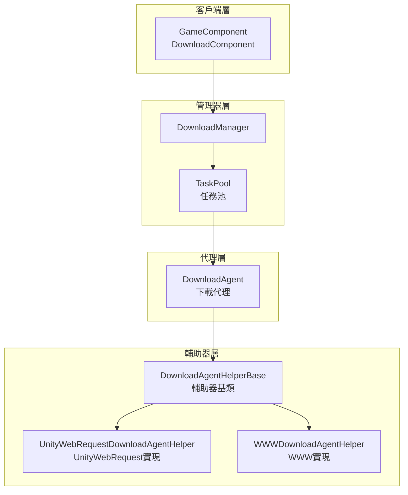
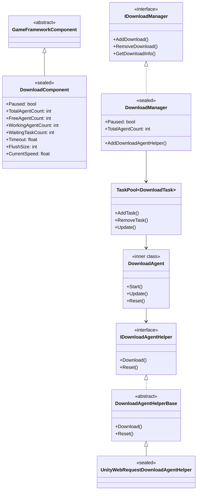
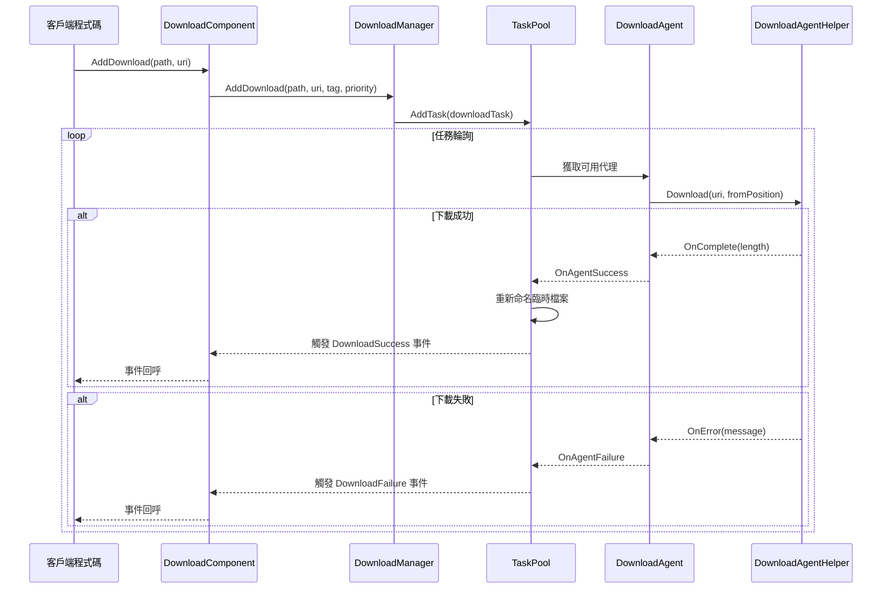
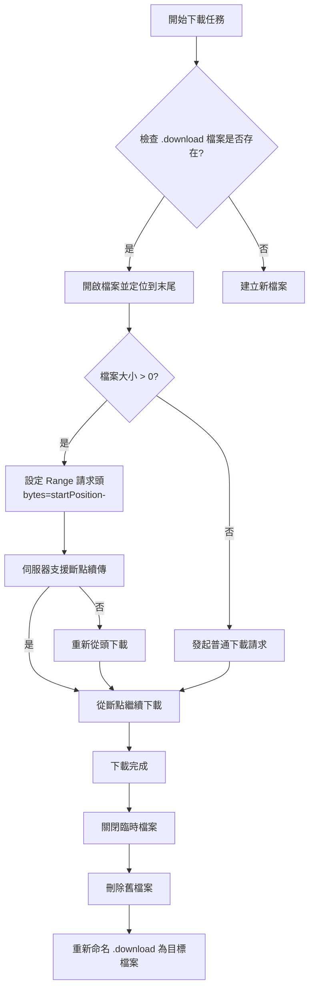
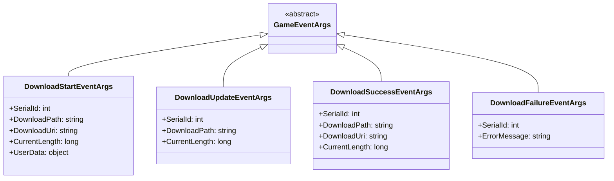

# 架構概述

GameFrameX Download 外掛是一個功能完善的 Unity 下載管理框架，提供了統一的任務排程、下載代理管理、斷點續傳和多執行緒下載能力。

## 概述

GameFrameX Download 外掛是 GameFrameX 框架的核心組件之一，專門為 Unity 遊戲提供高效、可靠的資源下載解決方案。該外掛採用模組化設計，將下載任務管理、代理排程和底層網路通訊分離，便於擴充套件和維護。

**設計目標：**
- 提供統一的下載任務管理介面
- 支援多執行緒併發下載
- 實現斷點續傳功能
- 支援可插拔的下載代理實現
- 提供完整的事件系統用於進度監控

## 架構設計

該外掛採用分層架構設計，從上到下分為四個主要層次：



### 架構層次說明

| 層次 | 組件 | 職責 |
|------|------|------|
| 客戶端層 | DownloadComponent | 對外暴露下載功能，整合到 Unity 組件系統 |
| 管理器層 | DownloadManager | 統一管理下載任務、事件、代理池 |
| 代理層 | DownloadAgent | 處理單個下載任務的生命週期 |
| 輔助器層 | DownloadAgentHelper | 底層網路通訊實現 |

## 核心組件

### 組件關係圖



### 核心組件職責

#### 1. DownloadComponent（下載組件）

`DownloadComponent` 是外掛的入口點，繼承自 `GameFrameworkComponent`，直接掛載在 Unity 場景中使用。它負責：

- 初始化 `DownloadManager` 模組
- 建立和管理 `DownloadAgentHelper` 例項
- 對外暴露下載 API
- 訂閱並轉發下載事件

> Source: [DownloadComponent.cs](https://github.com/GameFrameX/com.gameframex.unity.download/blob/main/Runtime/Download/DownloadComponent.cs#L1-L443)

關鍵屬性：

```csharp
// 獲取可用下載代理數量
public int FreeAgentCount { get; }

// 獲取工作中下載代理數量
public int WorkingAgentCount { get; }

// 獲取等待下載任務數量
public int WaitingTaskCount { get; }

// 獲取當前下載速度（位元組/秒）
public float CurrentSpeed { get; }
```

#### 2. DownloadManager（下載管理器）

`DownloadManager` 是核心模組，繼承自 `GameFrameworkModule`，實現 `IDownloadManager` 介面。主要功能：

- 管理任務池（TaskPool）
- 註冊和排程下載代理
- 維護下載計數器（DownloadCounter）
- 觸發下載事件

> Source: [DownloadManager.cs](https://github.com/GameFrameX/com.gameframex.unity.download/blob/main/Runtime/Download/Download/DownloadManager.cs#L1-L430)

```csharp
public sealed partial class DownloadManager : GameFrameworkModule, IDownloadManager
{
    private readonly TaskPool<DownloadTask> m_TaskPool;
    private readonly DownloadCounter m_DownloadCounter;
}
```

#### 3. DownloadAgent（下載代理）

`DownloadAgent` 是內部類，實現了 `ITaskAgent<DownloadTask>` 介面，負責單個下載任務的完整生命週期：

- 建立下載臨時檔案（.download 字尾）
- 處理斷點續傳邏輯
- 將下載資料寫入磁碟
- 處理超時檢測

> Source: [DownloadManager.DownloadAgent.cs](https://github.com/GameFrameX/com.gameframex.unity.download/blob/main/Runtime/Download/Download/DownloadManager.DownloadAgent.cs#L1-L358)

#### 4. DownloadAgentHelper（下載代理輔助器）

輔助器採用策略模式設計，支援多種底層實現：

- `IDownloadAgentHelper`：輔助器介面
- `DownloadAgentHelperBase`：抽象基類
- `UnityWebRequestDownloadAgentHelper`：基於 UnityWebRequest 的實現（推薦）
- `WWWDownloadAgentHelper`：基於 WWW 的實現（已廢棄）

> Source: [IDownloadAgentHelper.cs](https://github.com/GameFrameX/com.gameframex.unity.download/blob/main/Runtime/Download/Download/IDownloadAgentHelper.cs#L1-L66)
> Source: [UnityWebRequestDownloadAgentHelper.cs](https://github.com/GameFrameX/com.gameframex.unity.download/blob/main/Runtime/Download/UnityWebRequestDownloadAgentHelper.cs#L1-L230)

## 核心流程

### 下載任務流程



### 斷點續傳流程

當已有下載檔案時，下載代理會自動檢測並恢復下載：



## 事件系統

外掛提供了完整的事件系統，用於監控下載進度和狀態：



### 事件觸發時機

| 事件 | 觸發時機 |
|------|----------|
| DownloadStart | 下載代理開始處理任務 |
| DownloadUpdate | 下載資料更新（每幀多次） |
| DownloadSuccess | 下載完成並寫入磁碟 |
| DownloadFailure | 下載失敗或出錯 |

> 詳細事件引數說明請參見 [下載事件](./6-events.download-events) 文件。

## 配置選項

DownloadComponent 提供以下可配置項：

| 屬性 | 型別 | 預設值 | 說明 |
|------|------|--------|------|
| DownloadAgentHelperTypeName | string | UnityWebRequestDownloadAgentHelper | 下載代理輔助器型別 |
| DownloadAgentHelperCount | int | 3 | 下載代理例項數量 |
| Timeout | float | 30f | 下載超時時間（秒） |
| FlushSize | int | 1MB | 緩衝區重新整理大小 |

> 詳細配置說明請參見 [編輯器配置](./7-configuration.editor-configuration) 和 [下載代理配置](./7-configuration.agent-configuration) 文件。

## 擴充套件機制

### 自定義下載代理

可以透過繼承 `DownloadAgentHelperBase` 建立自定義下載實現：

```csharp
public class CustomDownloadAgentHelper : DownloadAgentHelperBase
{
    public override void Download(string downloadUri, object userData)
    {
        // 實現自定義下載邏輯
    }
    
    public override void Download(string downloadUri, long fromPosition, object userData)
    {
        // 實現斷點續傳
    }
    
    public override void Download(string downloadUri, long fromPosition, long toPosition, object userData)
    {
        // 實現範圍下載
    }
    
    public override void Reset()
    {
        // 清理資源
    }
}
```

> 詳細擴充套件說明請參見 [下載代理](./4-core-concepts.download-agent) 文件。

## 效能特性

### 併發下載

外掛支援多代理併發下載，透過 `DownloadAgentHelperCount` 配置代理數量。任務池會自動將任務分配給空閒的代理。

### 速度計算

使用移動平均演算法計算下載速度：

```csharp
m_DownloadCounter = new DownloadCounter(1f, 10f);  // 1秒更新間隔，10秒平均
```

> 詳細實現請參見 [DownloadCounter](./4-core-concepts.download-component) 文件。

### 斷點續傳

- 下載過程中使用 `.download` 臨時檔案
- 支援檢測已有臨時檔案並恢復下載
- 下載完成後自動重新命名為目標檔案

## 相關連結

- [DownloadComponent](./4-core-concepts.download-component) - 下載組件詳解
- [下載代理](./4-core-concepts.download-agent) - 代理實現詳解
- [下載事件](./6-events.download-events) - 事件系統詳解
- [編輯器配置](./7-configuration.editor-configuration) - 編輯器配置
- [下載代理配置](./7-configuration.agent-configuration) - 代理配置
- [API 參考](./5-api-reference.properties) - 屬性 API
- [API 參考](./5-api-reference.methods) - 方法 API
