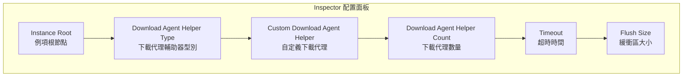
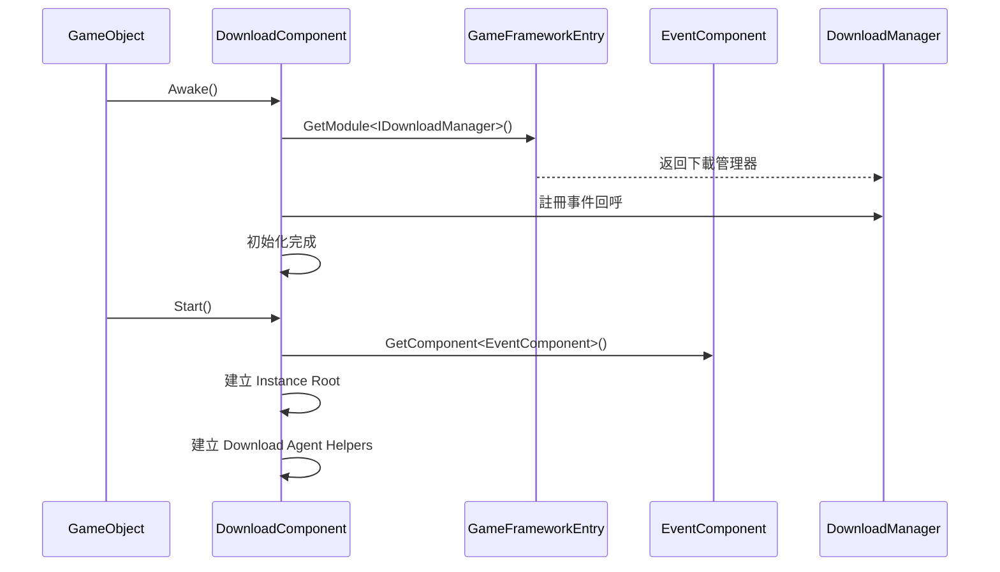

# 基礎配置

本文件介紹 GameFrameX Download 外掛的基礎配置方法，包括組件新增、引數設定和初始化流程。

## 概述

Download 組件是 GameFrameX 框架中的下載管理模組，負責處理所有下載相關任務。在使用下載功能之前，需要正確配置 `DownloadComponent`。該組件採用多代理併發下載機制，支援斷點續傳、優先順序排程和實時進度更新。

## 新增 DownloadComponent

### 透過 Unity 編輯器新增

在 Unity 場景中建立一個空遊戲物件，然後新增 `Download` 組件：

1. 在 Unity 編輯器中，右鍵點選 Hierarchy 面板
2. 選擇 **GameObject** → **Create Empty** 建立一個空遊戲物件
3. 在 Inspector 面板中點選 **Add Component** 按鈕
4. 搜尋並選擇 **Game Framework** → **Download**
5. 組件將自動新增到遊戲物件上

```csharp
// 組件定義原始碼
[DisallowMultipleComponent]
[AddComponentMenu("Game Framework/Download")]
public sealed class DownloadComponent : GameFrameworkComponent
```

> Source: [DownloadComponent.cs](https://github.com/GameFrameX/com.gameframex.unity.download/blob/main/Runtime/Download/DownloadComponent.cs#L21-L23)

### 透過程式碼動態新增

也可以在程式碼執行時動態建立組件：

```csharp
// 動態新增 DownloadComponent
var downloadGameObject = new GameObject("Download");
var downloadComponent = downloadGameObject.AddComponent<DownloadComponent>();
```

> Source: [DownloadComponent.cs](https://github.com/GameFrameX/com.gameframex.unity.download/blob/main/Runtime/Download/DownloadComponent.cs#L142-L160)

## 配置選項詳解

### 編輯器配置屬性

在 Unity 編輯器的 Inspector 面板中，DownloadComponent 包含以下可配置屬性：



| 屬性 | 型別 | 預設值 | 說明 |
|------|------|--------|------|
| Instance Root | Transform | null | 下載代理例項的父級 Transform，為空時自動建立 |
| Download Agent Helper Type | string | UnityWebRequestDownloadAgentHelper | 下載代理輔助器的型別名稱 |
| Custom Download Agent Helper | DownloadAgentHelperBase | null | 自定義下載代理輔助器例項 |
| Download Agent Helper Count | int | 3 | 併發下載代理數量，範圍 1-16 |
| Timeout | float | 30 | 下載超時時間（秒），範圍 0-120 |
| Flush Size | int | 1048576 | 緩衝區寫入磁碟的臨界大小（位元組），預設 1MB |

> Source: [DownloadComponentInspector.cs](https://github.com/GameFrameX/com.gameframex.unity.download/blob/main/Editor/Inspector/DownloadComponentInspector.cs#L29-L69)

### 各配置項詳細說明

#### 1. Instance Root（例項根節點）

指定下載代理 GameObject 的父級 Transform。如果不設定，系統會自動建立一個名為 "Download Agent Instances" 的空物件作為父節點。

```csharp
if (m_InstanceRoot == null)
{
    m_InstanceRoot = new GameObject("Download Agent Instances").transform;
    m_InstanceRoot.SetParent(gameObject.transform);
    m_InstanceRoot.localScale = Vector3.one;
}
```

> Source: [DownloadComponent.cs](https://github.com/GameFrameX/com.gameframex.unity.download/blob/main/Runtime/Download/DownloadComponent.cs#L171-L176)

#### 2. Download Agent Helper Type（下載代理輔助器型別）

指定用於執行實際下載操作輔助器的型別。外掛內建了以下實現：

| 型別名稱 | 說明 |
|----------|------|
| UnityWebRequestDownloadAgentHelper | 使用 Unity 的 UnityWebRequest 進行下載（推薦） |
| WWWDownloadAgentHelper | 使用過時的 WWW 類進行下載（相容舊版本） |

#### 3. Download Agent Helper Count（下載代理數量）

設定併發下載代理的數量。每個代理一次只能處理一個下載任務，但可以同時執行多個代理以實現並行下載。

```csharp
// 預設建立 3 個下載代理
for (int i = 0; i < m_DownloadAgentHelperCount; i++)
{
    AddDownloadAgentHelper(i);
}
```

> Source: [DownloadComponent.cs](https://github.com/GameFrameX/com.gameframex.unity.download/blob/main/Runtime/Download/DownloadComponent.cs#L178-L181)

**建議配置：**
- 小型資源（< 10MB）：2-3 個代理
- 中型資源（10-100MB）：3-5 個代理
- 大型資源（> 100MB）：5-8 個代理
- 最大支援：16 個代理

#### 4. Timeout（超時時間）

設定單個下載任務的最大等待時間（秒）。超過此時間後，下載將被視為失敗並觸發錯誤事件。

```csharp
[SerializeField]
private float m_Timeout = 30f;
```

> Source: [DownloadComponent.cs](https://github.com/GameFrameX/com.gameframex.unity.download/blob/main/Runtime/Download/DownloadComponent.cs#L39)

**配置建議：**
- 區域網下載：10-15 秒
- 網際網路下載：30-60 秒
- 大檔案下載：60-120 秒

#### 5. Flush Size（緩衝區大小）

設定將下載緩衝區寫入磁碟的臨界大小。該引數僅在啟用斷點續傳功能時有效，用於控制資料重新整理頻率。

```csharp
private const int OneMegaBytes = 1024 * 1024;
[SerializeField]
private int m_FlushSize = OneMegaBytes;
```

> Source: [DownloadComponent.cs](https://github.com/GameFrameX/com.gameframex.unity.download/blob/main/Runtime/Download/DownloadComponent.cs#L25-L26#L41)

**配置建議：**
- 小檔案：512KB - 1MB
- 中等檔案：1MB - 2MB
- 大檔案：2MB - 5MB

## 組件初始化流程

DownloadComponent 的初始化分為兩個階段：



### 第一階段：Awake

```csharp
protected override void Awake()
{
    ImplementationComponentType = Utility.Assembly.GetType(componentType);
    InterfaceComponentType = typeof(IDownloadManager);
    base.Awake();
    m_DownloadManager = GameFrameworkEntry.GetModule<IDownloadManager>();
    
    // 註冊下載事件
    m_DownloadManager.DownloadStart += OnDownloadStart;
    m_DownloadManager.DownloadUpdate += OnDownloadUpdate;
    m_DownloadManager.DownloadSuccess += OnDownloadSuccess;
    m_DownloadManager.DownloadFailure += OnDownloadFailure;
    
    m_DownloadManager.FlushSize = m_FlushSize;
    m_DownloadManager.Timeout = m_Timeout;
}
```

> Source: [DownloadComponent.cs](https://github.com/GameFrameX/com.gameframex.unity.download/blob/main/Runtime/Download/DownloadComponent.cs#L142-L160)

### 第二階段：Start

```csharp
private void Start()
{
    // 獲取事件組件（必須）
    m_EventComponent = GameEntry.GetComponent<EventComponent>();
    if (m_EventComponent == null)
    {
        Log.Fatal("Event component is invalid.");
        return;
    }

    // 建立例項根節點
    if (m_InstanceRoot == null)
    {
        m_InstanceRoot = new GameObject("Download Agent Instances").transform;
        m_InstanceRoot.SetParent(gameObject.transform);
        m_InstanceRoot.localScale = Vector3.one;
    }

    // 建立下載代理輔助器
    for (int i = 0; i < m_DownloadAgentHelperCount; i++)
    {
        AddDownloadAgentHelper(i);
    }
}
```

> Source: [DownloadComponent.cs](https://github.com/GameFrameX/com.gameframex.unity.download/blob/main/Runtime/Download/DownloadComponent.cs#L162-L182)

## 下載代理輔助器

### 預設實現：UnityWebRequestDownloadAgentHelper

外掛預設使用 `UnityWebRequestDownloadAgentHelper` 作為下載代理輔助器，它基於 Unity 的 `UnityWebRequest` API 實現，支援：

- HTTP/HTTPS 協議
- 斷點續傳（透過 Range 頭）
- SSL 證書驗證（預設跳過）
- 進度跟蹤

```csharp
public partial class UnityWebRequestDownloadAgentHelper : DownloadAgentHelperBase, IDisposable
{
    // 使用 UnityWebRequest 進行下載
    m_UnityWebRequest = new UnityWebRequest(downloadUri);
    m_UnityWebRequest.certificateHandler = new DownloadCertificateHandler();
    m_UnityWebRequest.downloadHandler = new DownloadHandler(this);
    m_UnityWebRequest.SendWebRequest();
}
```

> Source: [UnityWebRequestDownloadAgentHelper.cs](https://github.com/GameFrameX/com.gameframex.unity.download/blob/main/Runtime/Download/UnityWebRequestDownloadAgentHelper.cs#L80-L96)

### 建立自定義下載代理

要建立自定義下載代理，需要繼承 `DownloadAgentHelperBase` 並實現相關介面：

```csharp
public abstract class DownloadAgentHelperBase : MonoBehaviour, IDownloadAgentHelper
{
    // 事件定義
    public abstract event EventHandler<DownloadAgentHelperUpdateBytesEventArgs> DownloadAgentHelperUpdateBytes;
    public abstract event EventHandler<DownloadAgentHelperUpdateLengthEventArgs> DownloadAgentHelperUpdateLength;
    public abstract event EventHandler<DownloadAgentHelperCompleteEventArgs> DownloadAgentHelperComplete;
    public abstract event EventHandler<DownloadAgentHelperErrorEventArgs> DownloadAgentHelperError;

    // 下載方法
    public abstract void Download(string downloadUri, object userData);
    public abstract void Download(string downloadUri, long fromPosition, object userData);
    public abstract void Download(string downloadUri, long fromPosition, long toPosition, object userData);
    
    // 重置方法
    public abstract void Reset();
}
```

> Source: [DownloadAgentHelperBase.cs](https://github.com/GameFrameX/com.gameframex.unity.download/blob/main/Runtime/Download/DownloadAgentHelperBase.cs#L17-L72)

## 配置屬性 API

DownloadComponent 提供了以下公開屬性供程式碼訪問：

### 執行時屬性

| 屬性 | 型別 | 說明 |
|------|------|------|
| Paused | bool | 獲取或設定下載是否被暫停 |
| TotalAgentCount | int | 獲取下載代理總數量 |
| FreeAgentCount | int | 獲取可用下載代理數量 |
| WorkingAgentCount | int | 獲取工作中下載代理數量 |
| WaitingTaskCount | int | 獲取等待下載任務數量 |
| Timeout | float | 獲取或設定下載超時時長（秒） |
| FlushSize | int | 獲取或設定緩衝區寫入磁碟的臨界大小 |
| CurrentSpeed | float | 獲取當前下載速度（位元組/秒） |

```csharp
// 示例：獲取當前下載狀態
var downloadComponent = GameEntry.GetComponent<DownloadComponent>();
Debug.Log($"可用代理: {downloadComponent.FreeAgentCount}");
Debug.Log($"等待任務: {downloadComponent.WaitingTaskCount}");
Debug.Log($"下載速度: {downloadComponent.CurrentSpeed} bytes/s");
```

> Source: [DownloadComponent.cs](https://github.com/GameFrameX/com.gameframex.unity.download/blob/main/Runtime/Download/DownloadComponent.cs#L46-L108)

## 依賴要求

DownloadComponent 依賴於以下組件和服務：

1. **EventComponent** - 必須組件，用於觸發下載事件通知
2. **GameFrameworkEntry** - 框架入口，提供模組初始化
3. **GameFrameworkModule** - 基礎模組基類

```csharp
// 檢查依賴
private void Start()
{
    m_EventComponent = GameEntry.GetComponent<EventComponent>();
    if (m_EventComponent == null)
    {
        Log.Fatal("Event component is invalid.");
        return;
    }
}
```

> Source: [DownloadComponent.cs](https://github.com/GameFrameX/com.gameframex.unity.download/blob/main/Runtime/Download/DownloadComponent.cs#L164-L169)

## 最佳實踐配置

### 開發環境

```csharp
// 開發環境推薦配置
Timeout = 60f;           // 較長超時容錯
FlushSize = 512 * 1024;   // 512KB 頻繁重新整理便於除錯
AgentCount = 3;           // 適中併發數
```

### 生產環境

```csharp
// 生產環境推薦配置
Timeout = 30f;            // 較短超時快速失敗重試
FlushSize = 2 * 1024 * 1024;  // 2MB 減少IO頻率
AgentCount = 5;           // 較多併發提升下載速度
```

### 大檔案下載

```csharp
// 大檔案下載配置
Timeout = 120f;               // 較長超時
FlushSize = 5 * 1024 * 1024;  // 5MB 大緩衝區
AgentCount = 8;               // 高併發
```

## 相關連結

- [安裝指南](./2-installation)
- [首個示例](./3-getting-started.first-example)
- [架構概述](./4-core-concepts.architecture)
- [DownloadComponent 核心概念](./4-core-concepts.download-component)
- [下載代理](./4-core-concepts.download-agent)
- [編輯器配置](./7-configuration.editor-configuration)
- [下載代理配置](./7-configuration.agent-configuration)
- [下載事件](./6-events.download-events)
