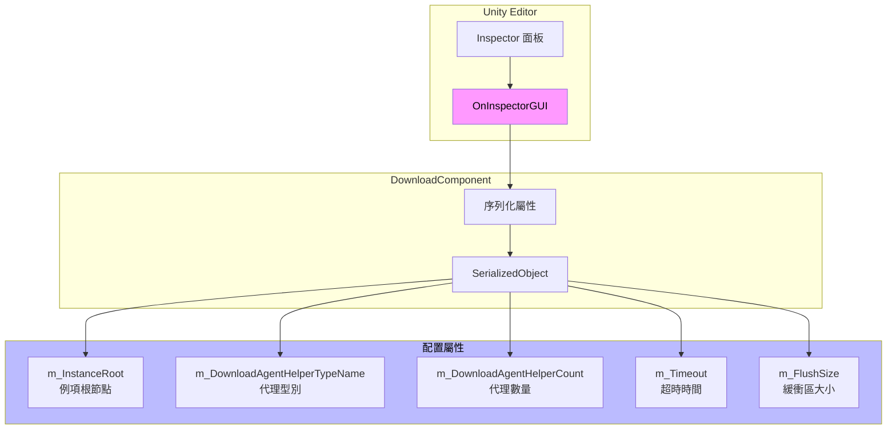
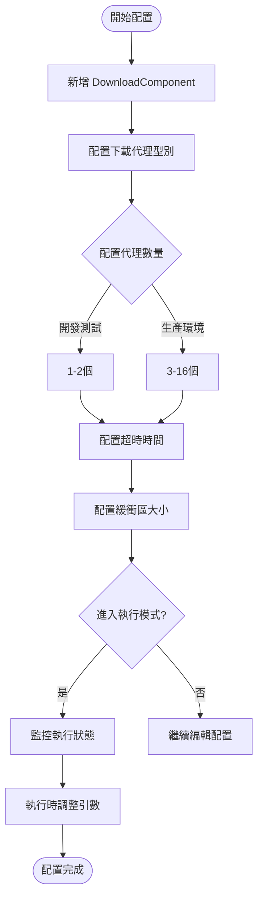

# 編輯器配置

本文件詳細介紹 GameFrameX Download 組件在 Unity 編輯器中的配置選項，包括組件的 Inspector 面板配置和設計意圖。

## 概述

GameFrameX Download 組件透過 Unity 的自定義 Inspector 介面提供直觀的編輯器配置功能。開發者可以在編輯器中配置下載代理數量、超時時長、緩衝區大小等關鍵引數，無需編寫程式碼即可完成基礎配置。

> Source: [DownloadComponentInspector.cs](https://github.com/GameFrameX/com.gameframex.unity.download/blob/main/Editor/Inspector/DownloadComponentInspector.cs#L19-L156)

## 配置介面詳解

### 新增 DownloadComponent

在 Unity 場景中，透過以下方式新增 Download 組件：

1. 在 Hierarchy 面板中右鍵選擇 **GameObject** → **Create Empty**
2. 在 Inspector 面板中點選 **Add Component**
3. 搜尋並選擇 **Download**（或 `Game Framework/Download`）
4. 組件將自動新增到遊戲物件上

```csharp
// 組件透過 AddComponentMenu 特性註冊到 Unity 選單
[AddComponentMenu("Game Framework/Download")]
public sealed class DownloadComponent : GameFrameworkComponent
```

> Source: [DownloadComponent.cs](https://github.com/GameFrameX/com.gameframex.unity.download/blob/main/Runtime/Download/DownloadComponent.cs#L22-L23)

### Inspector 配置面板

當在場景中選擇帶有 DownloadComponent 的遊戲物件時，Inspector 面板會顯示以下配置選項：

```csharp
private SerializedProperty m_InstanceRoot = null;
private SerializedProperty m_DownloadAgentHelperCount = null;
private SerializedProperty m_Timeout = null;
private SerializedProperty m_FlushSize = null;

private HelperInfo<DownloadAgentHelperBase> m_DownloadAgentHelperInfo = new HelperInfo<DownloadAgentHelperBase>("DownloadAgent");
```

> Source: [DownloadComponentInspector.cs](https://github.com/GameFrameX/com.gameframex.unity.download/blob/main/Editor/Inspector/DownloadComponentInspector.cs#L22-L27)

## 配置選項詳解

### 1. Instance Root（例項根節點）

| 屬性 | 說明 |
|------|------|
| **型別** | Transform |
| **預設值** | null（自動建立） |
| **執行時** | 可讀取 |

**功能說明**：指定下載代理例項的父級 Transform。如果為空，組件會自動建立一個名為 "Download Agent Instances" 的遊戲物件作為父節點。

```csharp
if (m_InstanceRoot == null)
{
    m_InstanceRoot = new GameObject("Download Agent Instances").transform;
    m_InstanceRoot.SetParent(gameObject.transform);
    m_InstanceRoot.localScale = Vector3.one;
}
```

> Source: [DownloadComponent.cs](https://github.com/GameFrameX/com.gameframex.unity.download/blob/main/Runtime/Download/DownloadComponent.cs#L171-L176)

---

### 2. Download Agent Helper Type（下載代理型別）

| 屬性 | 說明 |
|------|------|
| **型別** | string（型別名稱） |
| **預設值** | UnityGameFramework.Runtime.UnityWebRequestDownloadAgentHelper |
| **執行時** | 僅讀取 |

**功能說明**：指定用於執行實際下載工作的代理輔助器型別。外掛提供了兩種內建實現：

- **UnityWebRequestDownloadAgentHelper**：基於 Unity 的 `UnityWebRequest` API，支援斷點續傳
- **WWWDownloadAgentHelper**：基於傳統的 `WWW` 類（已廢棄）

```csharp
[SerializeField] private string m_DownloadAgentHelperTypeName = "UnityGameFramework.Runtime.UnityWebRequestDownloadAgentHelper";
```

> Source: [DownloadComponent.cs](https://github.com/GameFrameX/com.gameframex.unity.download/blob/main/Runtime/Download/DownloadComponent.cs#L33)

**自定義代理**：開發者也可以實現自己的下載代理輔助器，只需繼承 `DownloadAgentHelperBase` 類並實現相應介面。

---

### 3. Download Agent Helper Count（下載代理數量）

| 屬性 | 說明 |
|------|------|
| **型別** | int |
| **範圍** | 1 - 16 |
| **預設值** | 3 |
| **執行時** | 不可修改 |

**功能說明**：配置併發下載代理的數量。增加代理數量可以提高並行下載能力，但也會佔用更多系統資源。

```csharp
m_DownloadAgentHelperCount.intValue = EditorGUILayout.IntSlider("Download Agent Helper Count", m_DownloadAgentHelperCount.intValue, 1, 16);
```

> Source: [DownloadComponentInspector.cs](https://github.com/GameFrameX/com.gameframex.unity.download/blob/main/Editor/Inspector/DownloadComponentInspector.cs#L41)

**配置建議**：
| 場景 | 推薦值 |
|------|--------|
| 開發測試 | 1-2 |
| 移動端遊戲 | 3-5 |
| PC/主機遊戲 | 5-10 |
| 大檔案多執行緒下載 | 10-16 |

---

### 4. Timeout（超時時間）

| 屬性 | 說明 |
|------|------|
| **型別** | float |
| **範圍** | 0 - 120 秒 |
| **預設值** | 30 秒 |
| **執行時** | 可修改 |

**功能說明**：設定下載請求的超時時間。當下載時間超過此值時，下載任務將失敗並觸發錯誤事件。

```csharp
float timeout = EditorGUILayout.Slider("Timeout", m_Timeout.floatValue, 0f, 120f);
if (timeout != m_Timeout.floatValue)
{
    if (EditorApplication.isPlaying)
    {
        t.Timeout = timeout;  // 執行時修改
    }
    else
    {
        m_Timeout.floatValue = timeout;  // 編輯器修改
    }
}
```

> Source: [DownloadComponentInspector.cs](https://github.com/GameFrameX/com.gameframex.unity.download/blob/main/Editor/Inspector/DownloadComponentInspector.cs#L45-L56)

**設計意圖**：超時設定可以防止因網路問題導致的無限等待。在編輯器模式下修改會儲存到組件配置，在執行時修改則直接生效。

---

### 5. Flush Size（緩衝區重新整理大小）

| 屬性 | 說明 |
|------|------|
| **型別** | int |
| **預設值** | 1048576（1 MB） |
| **執行時** | 可修改 |

**功能說明**：設定將記憶體緩衝區資料寫入磁碟的臨界大小。僅當開啟斷點續傳功能時有效。該值決定了多久將資料寫入磁碟一次，較大的值可以提高效能但會降低斷點續傳的精度。

```csharp
private const int OneMegaBytes = 1024 * 1024;

[SerializeField] private int m_FlushSize = OneMegaBytes;
```

> Source: [DownloadComponent.cs](https://github.com/GameFrameX/com.gameframex.unity.download/blob/main/Runtime/Download/DownloadComponent.cs#L26#L41)

```csharp
int flushSize = EditorGUILayout.DelayedIntField("Flush Size", m_FlushSize.intValue);
```

> Source: [DownloadComponentInspector.cs](https://github.com/GameFrameX/com.gameframex.unity.download/blob/main/Editor/Inspector/DownloadComponentInspector.cs#L58)

**配置建議**：
| 場景 | 推薦值 | 說明 |
|------|--------|------|
| 小檔案下載 | 64KB - 256KB | 更頻繁寫入，資料更安全 |
| 大檔案下載 | 512KB - 2MB | 提高效能，減少磁碟IO |
| 網路不穩定 | 較小值 | 減少斷點續傳失敗機率 |

---

## 執行時狀態監控

在執行模式下，Inspector 面板會顯示當前下載組件的實時狀態資訊：

```csharp
if (EditorApplication.isPlaying && IsPrefabInHierarchy(t.gameObject))
{
    EditorGUILayout.LabelField("Paused", t.Paused.ToString());
    EditorGUILayout.LabelField("Total Agent Count", t.TotalAgentCount.ToString());
    EditorGUILayout.LabelField("Free Agent Count", t.FreeAgentCount.ToString());
    EditorGUILayout.LabelField("Working Agent Count", t.WorkingAgentCount.ToString());
    EditorGUILayout.LabelField("Waiting Agent Count", t.WaitingTaskCount.ToString());
    EditorGUILayout.LabelField("Current Speed", t.CurrentSpeed.ToString());
}
```

> Source: [DownloadComponentInspector.cs](https://github.com/GameFrameX/com.gameframex.unity.download/blob/main/Editor/Inspector/DownloadComponentInspector.cs#L71-L78)

### 執行時屬性說明

| 屬性 | 型別 | 說明 |
|------|------|------|
| Paused | bool | 下載是否被暫停 |
| TotalAgentCount | int | 下載代理總數量 |
| FreeAgentCount | int | 可用下載代理數量 |
| WorkingAgentCount | int | 工作中下載代理數量 |
| WaitingTaskCount | int | 等待中的任務數量 |
| CurrentSpeed | float | 當前下載速度（位元組/秒） |

---

## CSV 匯出功能

執行時狀態下，Inspector 面板提供下載任務資訊匯出功能：

```csharp
if (GUILayout.Button("Export CSV Data"))
{
    string exportFileName = EditorUtility.SaveFilePanel("Export CSV Data", string.Empty, "Download Task Data.csv", string.Empty);
    if (!string.IsNullOrEmpty(exportFileName))
    {
        // 匯出邏輯...
    }
}
```

> Source: [DownloadComponentInspector.cs](https://github.com/GameFrameX/com.gameframex.unity.download/blob/main/Editor/Inspector/DownloadComponentInspector.cs#L89-L112)

點選按鈕後，可以將當前所有下載任務的資訊匯出為 CSV 檔案，包含以下欄位：
- Download Path（下載路徑）
- Serial Id（序列編號）
- Tag（標籤）
- Priority（優先順序）
- Status（狀態）

---

## 編輯器配置架構



---

## 配置流程圖



---

## 相關連結

- [下載代理配置](./7-configuration.agent-configuration) - 瞭解下載代理的詳細配置
- [DownloadComponent](./4-core-concepts.download-component) - 核心組件詳解
- [下載代理](./4-core-concepts.download-agent) - 下載代理工作原理
- [API 參考](./5-api-reference.properties) - 屬性詳細說明
- [API 參考](./5-api-reference.methods) - 方法詳細說明
