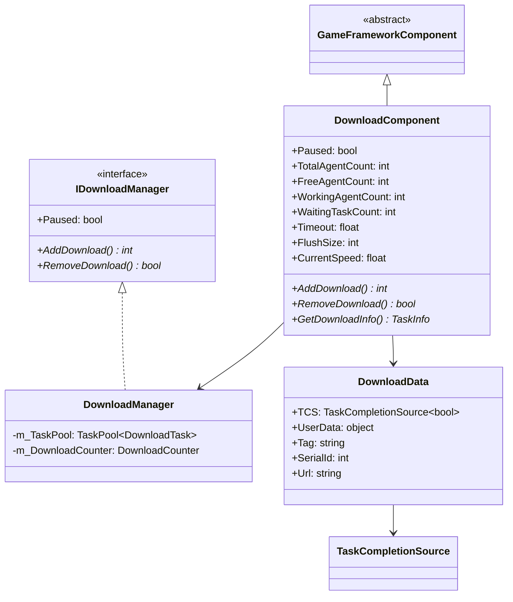
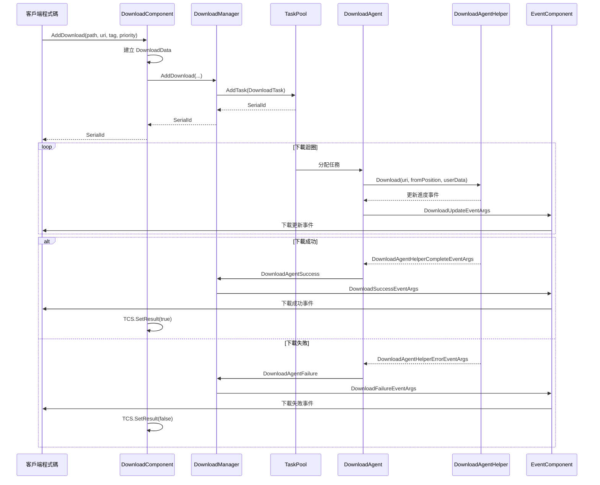
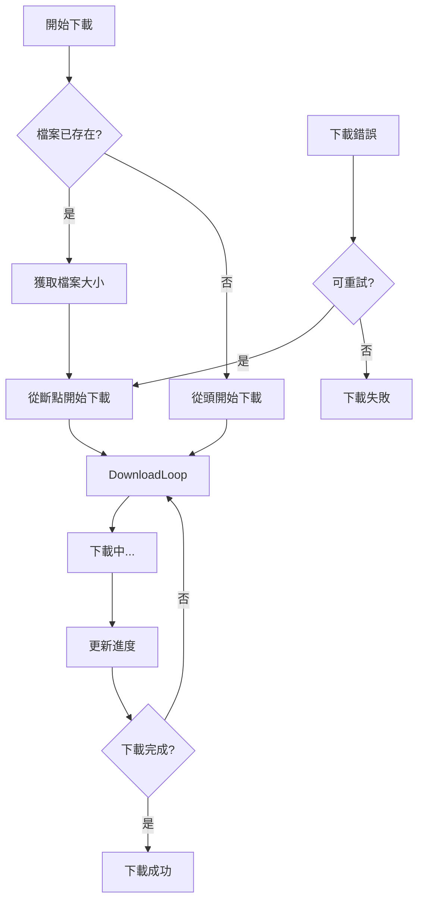

# DownloadComponent

DownloadComponent 是 Game Framework 下載系統的 Unity 組件層，作為 IDownloadManager 介面的外觀（Facade），為 Unity 專案提供便捷的下載功能整合。

## 概述

DownloadComponent 是遊戲框架下載模組的核心 Unity 組件，繼承自 GameFrameworkComponent。它封裝了 DownloadManager 的功能，並將其與 Unity 生命週期整合。作為一個 MonoBehaviour，開發者可以直接將其新增到遊戲場景中，透過 Inspector 面板或程式碼進行配置和使用。

該組件的核心設計目標是：
- 提供簡潔的 Unity API 介面
- 管理多個下載代理（Download Agent）例項
- 透過事件系統通知下載進度和狀態變化
- 支援任務優先順序、標籤分類、斷點續傳等高階功能

## 架構

DownloadComponent 在整個下載系統中扮演著入口層的角色，下圖展示了其與各組件的關係：

```mermaid
flowchart TD
    subgraph UnityLayer["Unity 層"]
        DC[DownloadComponent]
        Inspector[DownloadComponentInspector]
    end

    subgraph Core["核心模組"]
        DM[DownloadManager]
        IDM[IDownloadManager 介面]
    end

    subgraph TaskPool["任務池"]
        TP[TaskPool&lt;DownloadTask&gt;]
        DA[DownloadAgent x N]
    end

    subgraph AgentHelper["下載代理輔助器"]
        DAHB[DownloadAgentHelperBase]
        UWR[UnityWebRequestDownloadAgentHelper]
        WWW[WWWDownloadAgentHelper]
    end

    subgraph Events["事件系統"]
        EC[EventComponent]
        DE[DownloadEventArgs]
    end

    DC --> DM
    DC --> Inspector
    DM --> IDM
    IDM <|.. DM
    DM --> TP
    TP --> DA
    DA --> DAHB
    DAHB --> UWR
    DAHB --> WWW
    DM --> EC
    EC --> DE
```

### 組件層次說明

**Unity 層**
- DownloadComponent：主組件，提供 Unity 友好的 API
- DownloadComponentInspector：Editor  Inspector，用於視覺化配置

**核心模組**
- DownloadManager：下載管理器實現，處理核心邏輯
- IDownloadManager：下載管理器介面，定義規範

**任務池層**
- TaskPool：通用任務池，管理下載任務和代理
- DownloadAgent：下載代理，執行具體下載任務

**代理輔助器層**
- DownloadAgentHelperBase：下載代理輔助器基類
- UnityWebRequestDownloadAgentHelper：基於 UnityWebRequest 的實現
- WWWDownloadAgentHelper：基於 WWW 的實現（相容舊版）

### 核心類圖



## 核心功能

### 1. 下載任務管理

DownloadComponent 提供了豐富的下載任務管理功能：

```csharp
// 新增基礎下載任務
int serialId = downloadComponent.AddDownload(downloadPath, downloadUri);

// 新增帶標籤的下載任務
int serialId = downloadComponent.AddDownload(downloadPath, downloadUri, "resources");

// 新增帶優先順序的下載任務
int serialId = downloadComponent.AddDownload(downloadPath, downloadUri, 100);

// 新增帶使用者資料的下載任務
int serialId = downloadComponent.AddDownload(downloadPath, downloadUri, userData);

// 完整引數：路徑、URI、標籤、優先順序、使用者資料
int serialId = downloadComponent.AddDownload(downloadPath, downloadUri, "update", 100, userData);
```
> Source: [DownloadComponent.cs](https://github.com/GameFrameX/com.gameframex.unity.download/blob/main/Runtime/Download/DownloadComponent.cs#L238-L350)

### 2. 非同步下載支援

DownloadComponent 支援非同步下載模式，透過 Task 返回下載結果：

```csharp
// 非同步下載並等待結果
public async void StartDownload()
{
    var downloadComponent = GameEntry.GetComponent<DownloadComponent>();
    Task<bool> task = downloadComponent.Download(downloadPath, downloadUri);
    bool success = await task;
    Debug.Log($"Download {(success ? "succeeded" : "failed")}");
}
```
> Source: [DownloadComponent.cs](https://github.com/GameFrameX/com.gameframex.unity.download/blob/main/Runtime/Download/DownloadComponent.cs#L273-L282)

### 3. 任務查詢與移除

```csharp
// 根據序列編號獲取下載任務資訊
TaskInfo info = downloadComponent.GetDownloadInfo(serialId);

// 根據標籤獲取所有匹配的下載任務
TaskInfo[] infos = downloadComponent.GetDownloadInfos("resources");

// 獲取所有下載任務
TaskInfo[] allInfos = downloadComponent.GetAllDownloadInfos();

// 移除指定任務
bool removed = downloadComponent.RemoveDownload(serialId);

// 移除指定標籤的所有任務
int count = downloadComponent.RemoveDownloads("resources");

// 移除所有任務
downloadComponent.RemoveAllDownloads();
```
> Source: [DownloadComponent.cs](https://github.com/GameFrameX/com.gameframex.unity.download/blob/main/Runtime/Download/DownloadComponent.cs#L189-L392)

### 4. 下載狀態監控

組件提供了多個只讀屬性用於監控下載狀態：

```csharp
// 獲取下載代理狀態
int totalCount = downloadComponent.TotalAgentCount;    // 總代理數
int freeCount = downloadComponent.FreeAgentCount;       // 空閒代理數
int workingCount = downloadComponent.WorkingAgentCount; // 工作代理數
int waitingCount = downloadComponent.WaitaitingTaskCount; // 等待任務數

// 獲取當前下載速度（位元組/秒）
float speed = downloadComponent.CurrentSpeed;

// 獲取/設定暫停狀態
downloadComponent.Paused = true;
```

### 5. 配置屬性

| 屬性 | 型別 | 預設值 | 說明 |
|------|------|--------|------|
| InstanceRoot | Transform | null | 下載代理例項的根節點 |
| DownloadAgentHelperTypeName | string | UnityWebRequestDownloadAgentHelper | 下載代理輔助器型別 |
| DownloadAgentHelperCount | int | 3 | 下載代理例項數量（1-16） |
| Timeout | float | 30f | 下載超時時間（秒，0-120） |
| FlushSize | int | 1MB | 緩衝區寫入磁碟的臨界大小 |

> Source: [DownloadComponentInspector.cs](https://github.com/GameFrameX/com.gameframex.unity.download/blob/main/Editor/Inspector/DownloadComponentInspector.cs#L39-L69)

## 下載流程

### 時序圖



### 斷點續傳流程

DownloadComponent 支援斷點續傳功能，當下載中斷後可以繼續從上次位置下載：



斷點續傳透過在 DownloadAgentHelper 中設定 HTTP Range 頭實現：

```csharp
// UnityWebRequestDownloadAgentHelper.cs 中的斷點續傳實現
m_UnityWebRequest.SetRequestHeader("Range", GameFrameX.Runtime.Utility.Text.Format("bytes={0}-", fromPosition));
```
> Source: [UnityWebRequestDownloadAgentHelper.cs](https://github.com/GameFrameX/com.gameframex.unity.download/blob/main/Runtime/Download/UnityWebRequestDownloadAgentHelper.cs#L114)

## 使用示例

### 基本用法

```csharp
using GameFrameX.Runtime;
using GameFrameX.Download.Runtime;

// 獲取組件
var downloadComponent = GameEntry.GetComponent<DownloadComponent>();

// 新增下載任務
string localPath = Application.persistentDataPath + "/Resources/texture.png";
string remoteUrl = "https://example.com/texture.png";

int serialId = downloadComponent.AddDownload(localPath, remoteUrl);
```
> Source: [DownloadComponent.cs](https://github.com/GameFrameX/com.gameframex.unity.download/blob/main/Runtime/Download/DownloadComponent.cs#L238-L241)

### 監聽下載事件

```csharp
using GameFrameX.Runtime;
using GameFrameX.Download.Runtime;

// 訂閱下載事件
var downloadComponent = GameEntry.GetComponent<DownloadComponent>();
downloadComponent.DownloadStart += OnDownloadStart;
downloadComponent.DownloadUpdate += OnDownloadUpdate;
downloadComponent.DownloadSuccess += OnDownloadSuccess;
downloadComponent.DownloadFailure += OnDownloadFailure;

private void OnDownloadStart(object sender, DownloadStartEventArgs e)
{
    Debug.Log($"下載開始: {e.DownloadUri}");
}

private void OnDownloadUpdate(object sender, DownloadUpdateEventArgs e)
{
    Debug.Log($"下載進度: {e.CurrentLength} bytes");
}

private void OnDownloadSuccess(object sender, DownloadSuccessEventArgs e)
{
    Debug.Log($"下載成功: {e.DownloadPath}");
}

private void OnDownloadFailure(object sender, DownloadFailureEventArgs e)
{
    Debug.Log($"下載失敗: {e.ErrorMessage}");
}
```
> Source: [DownloadComponent.cs](https://github.com/GameFrameX/com.gameframex.unity.download/blob/main/Runtime/Download/DownloadComponent.cs#L415-L442)

### 批次下載資源包

```csharp
public class ResourceUpdater
{
    private DownloadComponent _downloadComponent;
    private List<string> _pendingDownloads = new List<string>();
    
    public void StartUpdate(List<ResourceInfo> resources)
    {
        _downloadComponent = GameEntry.GetComponent<DownloadComponent>();
        
        foreach (var resource in resources)
        {
            // 為每個資源新增下載任務，設定標籤便於管理
            _downloadComponent.AddDownload(
                resource.LocalPath, 
                resource.RemoteUrl, 
                "resources",  // 標籤
                resource.Priority  // 優先順序
            );
        }
    }
    
    // 監聽特定標籤的下載完成
    private void OnDownloadSuccess(object sender, DownloadSuccessEventArgs e)
    {
        if (e.UserData is ResourceInfo info)
        {
            Debug.Log($"資源下載完成: {info.Name}");
            CheckAllComplete();
        }
    }
}
```

### 使用非同步/await

```csharp
public async Task<bool> DownloadFileAsync(string url, string path)
{
    var downloadComponent = GameEntry.GetComponent<DownloadComponent>();
    
    // 使用 Task-based API
    Task<bool> downloadTask = downloadComponent.Download(path, url);
    
    // 等待下載完成
    bool success = await downloadTask;
    
    return success;
}

// 呼叫示例
bool result = await DownloadFileAsync(
    "https://example.com/bundle.zip",
    Application.persistentDataPath + "/bundle.zip"
);
```
> Source: [DownloadComponent.cs](https://github.com/GameFrameX/com.gameframex.unity.download/blob/main/Runtime/Download/DownloadComponent.cs#L273-L282)

## 事件系統

DownloadComponent 透過 EventComponent 轉發下載事件，主要事件包括：

| 事件 | 說明 | EventArgs |
|------|------|-----------|
| DownloadStart | 下載開始時觸發 | DownloadStartEventArgs |
| DownloadUpdate | 下載進度更新時觸發 | DownloadUpdateEventArgs |
| DownloadSuccess | 下載成功時觸發 | DownloadSuccessEventArgs |
| DownloadFailure | 下載失敗時觸發 | DownloadFailureEventArgs |

### DownloadSuccessEventArgs 屬性

```csharp
public sealed class DownloadSuccessEventArgs : GameEventArgs
{
    public int SerialId { get; }           // 任務序列編號
    public string DownloadPath { get; }    // 本地儲存路徑
    public string DownloadUri { get; }    // 原始下載地址
    public long CurrentLength { get; }     // 已下載大小
    public object UserData { get; }         // 使用者自定義資料
}
```
> Source: [DownloadSuccessEventArgs.cs](https://github.com/GameFrameX/com.gameframex.unity.download/blob/main/Runtime/EventArgs/DownloadSuccessEventArgs.cs#L36-L56)

## 配置說明

### Inspector 配置

在 Unity 編輯器中，選中帶有 DownloadComponent 的 GameObject，可以在 Inspector 面板中配置以下屬性：

```csharp
// DownloadComponentInspector.cs 中的配置介面
EditorGUILayout.PropertyField(m_InstanceRoot);
m_DownloadAgentHelperInfo.Draw();
m_DownloadAgentHelperCount.intValue = EditorGUILayout.IntSlider("Download Agent Helper Count", ...);
float timeout = EditorGUILayout.Slider("Timeout", ...);
int flushSize = EditorGUILayout.DelayedIntField("Flush Size", ...);
```
> Source: [DownloadComponentInspector.cs](https://github.com/GameFrameX/com.gameframex.unity.download/blob/main/Editor/Inspector/DownloadComponentInspector.cs#L39-L69)

### 下載代理輔助器

DownloadComponent 支援自定義下載代理輔助器，預設使用 UnityWebRequestDownloadAgentHelper。開發者可以透過繼承 DownloadAgentHelperBase 建立自定義實現：

```csharp
public abstract class DownloadAgentHelperBase : MonoBehaviour, IDownloadAgentHelper
{
    public abstract event EventHandler<DownloadAgentHelperUpdateBytesEventArgs> DownloadAgentHelperUpdateBytes;
    public abstract event EventHandler<DownloadAgentHelperUpdateLengthEventArgs> DownloadAgentHelperUpdateLength;
    public abstract event EventHandler<DownloadAgentHelperCompleteEventArgs> DownloadAgentHelperComplete;
    public abstract event EventHandler<DownloadAgentHelperErrorEventArgs> DownloadAgentHelperError;
    
    public abstract void Download(string downloadUri, object userData);
    public abstract void Download(string downloadUri, long fromPosition, object userData);
    public abstract void Download(string downloadUri, long fromPosition, long toPosition, object userData);
    public abstract void Reset();
}
```
> Source: [DownloadAgentHelperBase.cs](https://github.com/GameFrameX/com.gameframex.unity.download/blob/main/Runtime/Download/DownloadAgentHelperBase.cs#L17-L72)

## 內部實現細節

### DownloadData 內部類

DownloadComponent 使用內部類 DownloadData 儲存每個下載任務的後設資料：

```csharp
sealed class DownloadData
{
    public TaskCompletionSource<bool> TCS { get; }  // 用於非同步等待
    public object UserData { get; }                  // 使用者資料
    public string Tag { get; }                        // 標籤
    public int SerialId { get; }                      // 序列編號
    public string Url { get; }                        // 下載地址
    
    public DownloadData(string url, string tag, int serialId, object userData)
    {
        Url = url;
        Tag = tag;
        SerialId = serialId;
        UserData = userData;
        TCS = new TaskCompletionSource<bool>();
    }
}
```
> Source: [DownloadComponent.cs](https://github.com/GameFrameX/com.gameframex.unity.download/blob/main/Runtime/Download/DownloadComponent.cs#L118-L137)

### 生命週期

1. **Awake()**: 初始化 DownloadManager 模組，註冊下載事件
2. **Start()**: 獲取 EventComponent，建立下載代理輔助器例項
3. **Update()**: 由 GameFramework 自動呼叫，處理任務池更新
4. **OnDestroy()**: 清理資源（透過基類實現）

```csharp
protected override void Awake()
{
    ImplementationComponentType = Utility.Assembly.GetType(componentType);
    InterfaceComponentType = typeof(IDownloadManager);
    base.Awake();
    m_DownloadManager = GameFrameworkEntry.GetModule<IDownloadManager>();
    // 註冊事件...
}

private void Start()
{
    m_EventComponent = GameEntry.GetComponent<EventComponent>();
    // 建立下載代理輔助器...
}
```
> Source: [DownloadComponent.cs](https://github.com/GameFrameX/com.gameframex.unity.download/blob/main/Runtime/Download/DownloadComponent.cs#L142-L182)

## 相關連結

- [架構概述](./4-core-concepts.architecture) - 下載系統整體架構
- [下載代理](./4-core-concepts.download-agent) - DownloadAgent 詳解
- [API 參考 - 屬性](./5-api-reference.properties) - 完整屬性列表
- [API 參考 - 方法](./5-api-reference.methods) - 完整方法列表
- [下載事件](./6-events.download-events) - 下載事件詳解
- [編輯器配置](./7-configuration.editor-configuration) - Editor Inspector 配置
- [下載代理配置](./7-configuration.agent-configuration) - 代理輔助器配置
