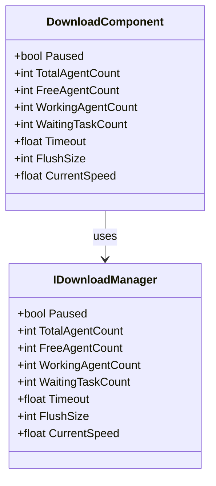
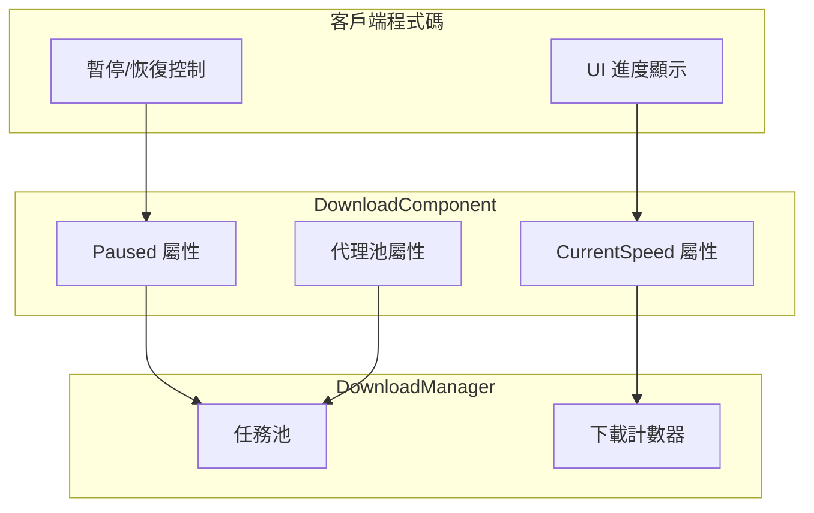

# 屬性

本文件詳細介紹 DownloadComponent 組件及其關聯介面、事件引數中暴露的所有公共屬性。

## 概述

下載模組提供了豐富的屬性用於監控和控制下載任務的狀態。主要屬性分為以下幾類：

1. **狀態控制屬性** - 用於控制下載暫停/恢復
2. **代理池屬性** - 用於監控下載代理的使用情況
3. **效能配置屬性** - 用於配置超時和緩衝區大小
4. **監控屬性** - 用於獲取實時下載狀態



## DownloadComponent 屬性

DownloadComponent 是下載系統的核心組件，繼承自 GameFrameworkComponent。以下是所有公共屬性的詳細說明：

> Source: [DownloadComponent.cs](https://github.com/GameFrameX/com.gameframex.unity.download/blob/main/Runtime/Download/DownloadComponent.cs#L46-L108)

### `Paused`

```csharp
public bool Paused
{
    get { return m_DownloadManager.Paused; }
    set { m_DownloadManager.Paused = value; }
}
```

**型別：** `bool`  
**讀寫：** 可讀可寫  
**描述：** 獲取或設定下載是否被暫停。當設定為 `true` 時，所有正在進行的下載任務和等待中的任務都將暫停；當設定為 `false` 時，暫停的任務將恢復執行。

**使用示例：**

```csharp
// 暫停所有下載
var downloadComponent = GameEntry.GetComponent<DownloadComponent>();
downloadComponent.Paused = true;

// 恢復下載
downloadComponent.Paused = false;
```

### `TotalAgentCount`

```csharp
public int TotalAgentCount
{
    get { return m_DownloadManager.TotalAgentCount; }
}
```

**型別：** `int`  
**讀寫：** 只讀  
**描述：** 獲取下載代理總數量。這是系統在啟動時建立的下載代理例項總數，反映了系統能夠並行處理的最大下載任務數。

### `FreeAgentCount`

```csharp
public int FreeAgentCount
{
    get { return m_DownloadManager.FreeAgentCount; }
}
```

**型別：** `int`  
**讀寫：** 只讀  
**描述：** 獲取可用（空閒）下載代理數量。當此值大於 0 時，可以立即新增新的下載任務而無需等待。

### `WorkingAgentCount`

```csharp
public int WorkingAgentCount
{
    get { return m_DownloadManager.WorkingAgentCount; }
}
```

**型別：** `int`  
**讀寫：** 只讀  
**描述：** 獲取工作中（忙碌）下載代理數量。表示當前正在執行下載任務的代理數量。

### `WaitingTaskCount`

```csharp
public int WaitingTaskCount
{
    get { return m_DownloadManager.WaitingTaskCount; }
}
```

**型別：** `int`  
**讀寫：** 只讀  
**描述：** 獲取等待下載任務數量。由於系統只有有限的下載代理，當所有代理都在忙碌時，新新增的任務會進入等待佇列。

### `Timeout`

```csharp
public float Timeout
{
    get { return m_DownloadManager.Timeout; }
    set { m_DownloadManager.Timeout = m_Timeout = value; }
}
```

**型別：** `float`  
**讀寫：** 可讀可寫  
**預設值：** `30.0f`（30秒）  
**描述：** 獲取或設定下載超時時長，以秒為單位。當單個下載任務超過此時間未完成時，將觸發下載失敗事件。

### `FlushSize`

```csharp
public int FlushSize
{
    get { return m_DownloadManager.FlushSize; }
    set { m_DownloadManager.FlushSize = m_FlushSize = value; }
}
```

**型別：** `int`  
**讀寫：** 可讀可寫  
**預設值：** `1048576`（1MB，即 1024 * 1024）  
**描述：** 獲取或設定將緩衝區寫入磁碟的臨界大小，僅當開啟斷點續傳時有效。該值決定了資料在寫入最終檔案前需要在記憶體緩衝區中積累的大小，較大的值可以提高寫入效能但會增加記憶體佔用。

### `CurrentSpeed`

```csharp
public float CurrentSpeed
{
    get { return m_DownloadManager.CurrentSpeed; }
}
```

**型別：** `float`  
**讀寫：** 只讀  
**單位：** 位元組/秒（B/s）  
**描述：** 獲取當前下載速度。這是系統實時計算的下行速率，可用於顯示下載進度 UI。

## 事件引數屬性

下載模組透過事件系統通知外部下載狀態變化。以下是各事件引數類中暴露的屬性：

### DownloadStartEventArgs

下載開始時觸發的事件引數。

> Source: [DownloadStartEventArgs.cs](https://github.com/GameFrameX/com.gameframex.unity.download/blob/main/Runtime/EventArgs/DownloadStartEventArgs.cs#L35-L55)

| 屬性 | 型別 | 描述 |
|------|------|------|
| `SerialId` | `int` | 下載任務的序列編號，用於唯一標識下載任務 |
| `DownloadPath` | `string` | 下載後存放的本地路徑 |
| `DownloadUri` | `string` | 原始下載地址（URL） |
| `CurrentLength` | `long` | 當前已下載的大小（位元組） |
| `UserData` | `object` | 使用者自定義資料 |

### DownloadUpdateEventArgs

下載進度更新時觸發的事件引數。

> Source: [DownloadUpdateEventArgs.cs](https://github.com/GameFrameX/com.gameframex.unity.download/blob/main/Runtime/EventArgs/DownloadUpdateEventArgs.cs#L35-L55)

| 屬性 | 型別 | 描述 |
|------|------|------|
| `SerialId` | `int` | 下載任務的序列編號 |
| `DownloadPath` | `string` | 下載後存放的本地路徑 |
| `DownloadUri` | `string` | 原始下載地址 |
| `CurrentLength` | `long` | 當前已下載的大小 |
| `UserData` | `object` | 使用者自定義資料 |

### DownloadSuccessEventArgs

下載成功完成時觸發的事件引數。

> Source: [DownloadSuccessEventArgs.cs](https://github.com/GameFrameX/com.gameframex.unity.download/blob/main/Runtime/EventArgs/DownloadSuccessEventArgs.cs#L35-L56)

| 屬性 | 型別 | 描述 |
|------|------|------|
| `SerialId` | `int` | 下載任務的序列編號 |
| `DownloadPath` | `string` | 下載後存放的本地路徑 |
| `DownloadUri` | `string` | 原始下載地址 |
| `CurrentLength` | `long` | 最終下載檔案的大小 |
| `UserData` | `object` | 使用者自定義資料 |

### DownloadFailureEventArgs

下載失敗時觸發的事件引數。

> Source: [DownloadFailureEventArgs.cs](https://github.com/GameFrameX/com.gameframex.unity.download/blob/main/Runtime/EventArgs/DownloadFailureEventArgs.cs#L35-L55)

| 屬性 | 型別 | 描述 |
|------|------|------|
| `SerialId` | `int` | 下載任務的序列編號 |
| `DownloadPath` | `string` | 下載後存放的本地路徑 |
| `DownloadUri` | `string` | 原始下載地址 |
| `ErrorMessage` | `string` | 錯誤資訊描述 |
| `UserData` | `object` | 使用者自定義資料 |

## 屬性關係與資料流

以下圖表展示了各屬性之間的關係以及資料流向：



## 使用示例

### 監控下載狀態

以下示例展示如何利用屬性監控下載系統狀態：

```csharp
public class DownloadStatusMonitor : MonoBehaviour
{
    private DownloadComponent _downloadComponent;

    private void Start()
    {
        _downloadComponent = GameEntry.GetComponent<DownloadComponent>();
    }

    private void Update()
    {
        // 獲取實時下載速度
        float speed = _downloadComponent.CurrentSpeed;
        
        // 獲取代理池狀態
        int total = _downloadComponent.TotalAgentCount;
        int free = _downloadComponent.FreeAgentCount;
        int working = _downloadComponent.WorkingAgentCount;
        int waiting = _downloadComponent.WaitingTaskCount;
        
        // 更新 UI 顯示
        UpdateDownloadUI(speed, total, free, working, waiting);
    }
    
    private void UpdateDownloadUI(float speed, int total, int free, int working, int waiting)
    {
        // 將位元組轉換為 MB/s
        float speedMB = speed / (1024 * 1024);
        Debug.Log($"下載速度: {speedMB:F2} MB/s | 代理狀態: {free}/{total} 空閒 | 工作中: {working} | 等待: {waiting}");
    }
}
```
> Source: [DownloadComponent.cs](https://github.com/GameFrameX/com.gameframex.unity.download/blob/main/Runtime/Download/DownloadComponent.cs#L100-L108)

### 暫停與恢復下載

```csharp
public class DownloadController
{
    private DownloadComponent _downloadComponent;

    public void PauseAllDownloads()
    {
        _downloadComponent = GameEntry.GetComponent<DownloadComponent>();
        _downloadComponent.Paused = true;
        Debug.Log("所有下載已暫停");
    }

    public void ResumeAllDownloads()
    {
        if (_downloadComponent == null)
        {
            _downloadComponent = GameEntry.GetComponent<DownloadComponent>();
        }
        _downloadComponent.Paused = false;
        Debug.Log("下載已恢復");
    }
}
```
> Source: [DownloadComponent.cs](https://github.com/GameFrameX/com.gameframex.unity.download/blob/main/Runtime/Download/DownloadComponent.cs#L46-L50)

### 配置下載引數

```csharp
public void ConfigureDownload()
{
    var downloadComponent = GameEntry.GetComponent<DownloadComponent>();
    
    // 設定超時時間為 60 秒
    downloadComponent.Timeout = 60f;
    
    // 設定緩衝區重新整理大小為 2MB
    downloadComponent.FlushSize = 2 * 1024 * 1024;
    
    Debug.Log($"超時: {downloadComponent.Timeout}s, 緩衝區: {downloadComponent.FlushSize} bytes");
}
```
> Source: [DownloadComponent.cs](https://github.com/GameFrameX/com.gameframex.unity.download/blob/main/Runtime/Download/DownloadComponent.cs#L87-L100)

## 配置選項彙總表

| 屬性 | 型別 | 預設值 | 描述 |
|------|------|--------|------|
| `Paused` | `bool` | `false` | 下載是否被暫停 |
| `TotalAgentCount` | `int` | 由配置決定 | 下載代理總數量 |
| `FreeAgentCount` | `int` | - | 可用下載代理數量 |
| `WorkingAgentCount` | `int` | - | 工作中下載代理數量 |
| `WaitingTaskCount` | `int` | - | 等待下載任務數量 |
| `Timeout` | `float` | `30.0f` | 下載超時時長（秒） |
| `FlushSize` | `int` | `1048576` | 緩衝區寫入磁碟臨界大小（位元組） |
| `CurrentSpeed` | `float` | - | 當前下載速度（位元組/秒） |

## 相關連結

- [方法](./5-api-reference.methods) - 瞭解 DownloadComponent 的所有方法
- [下載事件](./6-events.download-events) - 詳細瞭解下載事件系統
- [架構概述](./4-core-concepts.architecture) - 檢視下載模組的整體架構
- [DownloadComponent](./4-core-concepts.download-component) - 瞭解 DownloadComponent 核心概念
