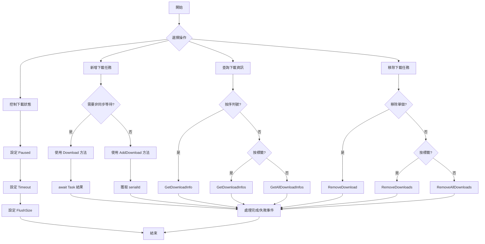

# 方法

本文件詳細介紹 DownloadComponent 組件提供的所有公共方法。這些方法用於管理下載任務、查詢下載狀態和控制下載行為。

## 概述

DownloadComponent 是遊戲下載功能的核心組件，提供了一套完整的非同步下載任務管理 API。透過這些方法，開發者可以：

- 新增下載任務（支援優先順序、標籤、使用者自定義資料）
- 查詢下載任務狀態和進度
- 暫停/恢復下載
- 移除單個或批次下載任務
- 獲取實時下載速度

## 下載任務管理

### 新增下載任務

DownloadComponent 提供了 8 個 `AddDownload` 方法過載，以滿足不同的使用場景。所有過載都返回新增下載任務的序列編號（serialId）。

#### 基礎新增方法

```csharp
public int AddDownload(string downloadPath, string downloadUri)
```

新增一個基本的下載任務。

**引數：**
- `downloadPath` (string): 下載檔案在本地儲存的路徑
- `downloadUri` (string): 遠端檔案的下載地址

**返回值：** 新增下載任務的序列編號

**示例：**
```csharp
var downloadComponent = GameEntry.GetComponent<DownloadComponent>();
int serialId = downloadComponent.AddDownload(Application.persistentDataPath + "/file.dat", "https://example.com/file.dat");
```

> Source: [DownloadComponent.cs](https://github.com/GameFrameX/com.gameframex.unity.download/blob/main/Runtime/Download/DownloadComponent.cs#L238-L241)

---

#### 帶標籤的新增方法

```csharp
public int AddDownload(string downloadPath, string downloadUri, string tag)
```

新增一個帶標籤的下載任務，便於按組管理。

**引數：**
- `downloadPath` (string): 下載檔案在本地儲存的路徑
- `downloadUri` (string): 遠端檔案的下載地址
- `tag` (string): 下載任務的標籤，用於分組管理

**返回值：** 新增下載任務的序列編號

**示例：**
```csharp
int serialId = downloadComponent.AddDownload(path, uri, "resources");
```

> Source: [DownloadComponent.cs](https://github.com/GameFrameX/com.gameframex.unity.download/blob/main/Runtime/Download/DownloadComponent.cs#L250-L253)

---

#### 帶優先順序的新增方法

```csharp
public int AddDownload(string downloadPath, string downloadUri, int priority)
```

新增一個帶優先順序的下載任務。

**引數：**
- `downloadPath` (string): 下載檔案在本地儲存的路徑
- `downloadUri` (string): 遠端檔案的下載地址
- `priority` (int): 下載任務的優先順序，數值越高越優先

**返回值：** 新增下載任務的序列編號

> Source: [DownloadComponent.cs](https://github.com/GameFrameX/com.gameframex.unity.download/blob/main/Runtime/Download/DownloadComponent.cs#L262-L265)

---

#### 帶使用者資料的新增方法

```csharp
public int AddDownload(string downloadPath, string downloadUri, object userData)
```

新增一個帶使用者自定義資料的下載任務。

**引數：**
- `downloadPath` (string): 下載檔案在本地儲存的路徑
- `downloadUri` (string): 遠端檔案的下載地址
- `userData` (object): 使用者自定義資料，會在事件中傳遞

**返回值：** 新增下載任務的序列編號

**示例：**
```csharp
var userData = new { fileType = "texture", version = "1.0" };
int serialId = downloadComponent.AddDownload(path, uri, userData);
```

> Source: [DownloadComponent.cs](https://github.com/GameFrameX/com.gameframex.unity.download/blob/main/Runtime/Download/DownloadComponent.cs#L291-L294)

---

#### 完整引數新增方法

```csharp
public int AddDownload(string downloadPath, string downloadUri, string tag, int priority, object userData)
```

新增一個包含所有引數的下載任務。

**引數：**
- `downloadPath` (string): 下載檔案在本地儲存的路徑
- `downloadUri` (string): 遠端檔案的下載地址
- `tag` (string): 下載任務的標籤
- `priority` (int): 下載任務的優先順序
- `userData` (object): 使用者自定義資料

**返回值：** 新增下載任務的序列編號

> Source: [DownloadComponent.cs](https://github.com/GameFrameX/com.gameframex.unity.download/blob/main/Runtime/Download/DownloadComponent.cs#L344-L350)

---

### 非同步下載方法

```csharp
public Task<bool> Download(string downloadPath, string downloadUri)
```

新增下載任務並返回 Task 物件，方便使用 async/await 模式。

**引數：**
- `downloadPath` (string): 下載檔案在本地儲存的路徑
- `downloadUri` (string): 遠端檔案的下載地址

**返回值：** Task&lt;bool&gt;，下載完成後返回 true，失敗返回 false

**示例：**
```csharp
var downloadComponent = GameEntry.GetComponent<DownloadComponent>();
bool success = await downloadComponent.Download(Application.persistentDataPath + "/file.dat", "https://example.com/file.dat");
```

> Source: [DownloadComponent.cs](https://github.com/GameFrameX/com.gameframex.unity.download/blob/main/Runtime/Download/DownloadComponent.cs#L273-L282)

---

### 移除下載任務

#### 按序列編號移除

```csharp
public bool RemoveDownload(int serialId)
```

根據下載任務的序列編號移除指定的下載任務。

**引數：**
- `serialId` (int): 要移除的下載任務的序列編號

**返回值：** bool，是否移除成功

**示例：**
```csharp
bool removed = downloadComponent.RemoveDownload(serialId);
```

> Source: [DownloadComponent.cs](https://github.com/GameFrameX/com.gameframex.unity.download/blob/main/Runtime/Download/DownloadComponent.cs#L357-L361)

---

#### 按標籤移除

```csharp
public int RemoveDownloads(string tag)
```

根據下載任務的標籤移除所有匹配的下載任務。

**引數：**
- `tag` (string): 要移除下載任務的標籤

**返回值：** int，移除的任務數量

**示例：**
```csharp
// 移除所有標記為 "resources" 的下載任務
int removedCount = downloadComponent.RemoveDownloads("resources");
```

> Source: [DownloadComponent.cs](https://github.com/GameFrameX/com.gameframex.unity.download/blob/main/Runtime/Download/DownloadComponent.cs#L368-L382)

---

#### 移除所有任務

```csharp
public int RemoveAllDownloads()
```

移除所有下載任務。

**返回值：** int，移除的任務數量

**示例：**
```csharp
int removedCount = downloadComponent.RemoveAllDownloads();
```

> Source: [DownloadComponent.cs](https://github.com/GameFrameX/com.gameframex.unity.download/blob/main/Runtime/Download/DownloadComponent.cs#L388-L392)

---

## 下載資訊查詢

### 按序列編號查詢

```csharp
public TaskInfo GetDownloadInfo(int serialId)
```

根據下載任務的序列編號獲取下載任務的資訊。

**引數：**
- `serialId` (int): 要獲取資訊的下載任務的序列編號

**返回值：** TaskInfo，包含下載任務的詳細資訊

> Source: [DownloadComponent.cs](https://github.com/GameFrameX/com.gameframex.unity.download/blob/main/Runtime/Download/DownloadComponent.cs#L189-L192)

---

### 按標籤查詢

```csharp
public TaskInfo[] GetDownloadInfos(string tag)
```

根據下載任務的標籤獲取所有匹配的下載任務資訊。

**引數：**
- `tag` (string): 要獲取資訊的下載任務的標籤

**返回值：** TaskInfo[]，匹配的下載任務資訊陣列

```csharp
public void GetDownloadInfos(string tag, List<TaskInfo> results)
```

將匹配的下載任務資訊新增到指定的列表中（避免記憶體分配）。

**引數：**
- `tag` (string): 要獲取資訊的下載任務的標籤
- `results` (List&lt;TaskInfo&gt;): 用於儲存結果的任務資訊列表

> Source: [DownloadComponent.cs](https://github.com/GameFrameX/com.gameframex.unity.download/blob/main/Runtime/Download/DownloadComponent.cs#L199-L212)

---

### 查詢所有任務

```csharp
public TaskInfo[] GetAllDownloadInfos()
```

獲取所有下載任務的資訊。

**返回值：** TaskInfo[]，所有下載任務的資訊陣列

```csharp
public void GetAllDownloadInfos(List<TaskInfo> results)
```

將所有下載任務資訊新增到指定的列表中（避免記憶體分配）。

**引數：**
- `results` (List&lt;TaskInfo&gt;): 用於儲存結果的任務資訊列表

> Source: [DownloadComponent.cs](https://github.com/GameFrameX/com.gameframex.unity.download/blob/main/Runtime/Download/DownloadComponent.cs#L218-L230)

---

## 下載控制屬性

### 暫停/恢復控制

```csharp
public bool Paused { get; set; }
```

獲取或設定下載是否被暫停。當設定為 true 時，所有等待中的下載任務將暫停執行。

**屬性值：** bool，true 表示暫停，false 表示繼續

**示例：**
```csharp
// 暫停所有下載
downloadComponent.Paused = true;

// 恢復下載
downloadComponent.Paused = false;
```

> Source: [DownloadComponent.cs](https://github.com/GameFrameX/com.gameframex.unity.download/blob/main/Runtime/Download/DownloadComponent.cs#L46-L50)

---

### 超時設定

```csharp
public float Timeout { get; set; }
```

獲取或設定下載超時時長，以秒為單位。預設值為 30 秒。

**屬性值：** float，超時時長（秒）

**示例：**
```csharp
// 設定下載超時為 60 秒
downloadComponent.Timeout = 60f;
```

> Source: [DownloadComponent.cs](https://github.com/GameFrameX/com.gameframex.unity.download/blob/main/Runtime/Download/DownloadComponent.cs#L87-L91)

---

### 緩衝區大小設定

```csharp
public int FlushSize { get; set; }
```

獲取或設定將緩衝區寫入磁碟的臨界大小。僅當開啟斷點續傳時有效。預設值為 1MB。

**屬性值：** int，緩衝區大小（位元組）

> Source: [DownloadComponent.cs](https://github.com/GameFrameX/com.gameframex.unity.download/blob/main/Runtime/Download/DownloadComponent.cs#L96-L100)

---

## 狀態查詢屬性

### 代理狀態

```csharp
public int TotalAgentCount { get; }
```

獲取下載代理總數量。

---

```csharp
public int FreeAgentCount { get; }
```

獲取可用（空閒）下載代理數量。

---

```csharp
public int WorkingAgentCount { get; }
```

獲取工作中下載代理數量。

---

```csharp
public int WaitingTaskCount { get; }
```

獲取等待下載任務數量。

---

### 下載速度

```csharp
public float CurrentSpeed { get; }
```

獲取當前下載速度（位元組/秒）。

**示例：**
```csharp
float speed = downloadComponent.CurrentSpeed;
Debug.Log($"當前下載速度: {speed / 1024 / 1024:F2} MB/s");
```

> Source: [DownloadComponent.cs](https://github.com/GameFrameX/com.gameframex.unity.download/blob/main/Runtime/Download/DownloadComponent.cs#L105-L108)

---

## 方法使用流程



---

## 完整使用示例

```csharp
using UnityEngine;
using GameFrameX.Runtime;
using GameFrameX.Download.Runtime;

public class DownloadExample : MonoBehaviour
{
    private DownloadComponent downloadComponent;
    
    private void Start()
    {
        downloadComponent = GameEntry.GetComponent<DownloadComponent>();
        
        // 示例1: 基礎下載
        int serialId = downloadComponent.AddDownload(
            Application.persistentDataPath + "/data.bin",
            "https://example.com/data.bin"
        );
        
        // 示例2: 帶優先順序和標籤的下載
        int serialId2 = downloadComponent.AddDownload(
            Application.persistentDataPath + "/texture.png",
            "https://example.com/texture.png",
            "resources",  // 標籤
            100,         // 優先順序
            null         // 使用者資料
        );
        
        // 示例3: 非同步下載
        _ = AsyncDownload();
    }
    
    private async Task AsyncDownload()
    {
        bool success = await downloadComponent.Download(
            Application.persistentDataPath + "/config.json",
            "https://example.com/config.json"
        );
        
        Debug.Log($"下載結果: {(success ? "成功" : "失敗")}");
    }
    
    private void Update()
    {
        // 查詢下載狀態
        if (downloadComponent != null)
        {
            TaskInfo[] allTasks = downloadComponent.GetAllDownloadInfos();
            foreach (var task in allTasks)
            {
                Debug.Log($"任務 {task.SerialId}: {task.Status} - {task.Description}");
            }
            
            // 顯示下載速度
            Debug.Log($"速度: {downloadComponent.CurrentSpeed / 1024:F2} KB/s");
        }
    }
}
```

---

## 常見問題

### 如何實現斷點續傳？

斷點續傳預設已啟用。當下載中斷後重新新增相同路徑的下載任務時，系統會自動檢測已下載的部分並從斷點處繼續下載。

### 如何限制同時下載的數量？

在 DownloadComponent 的 Inspector 面板中設定 `Download Agent Helper Count` 屬性。該值決定了同時執行的最大下載任務數。

### 下載失敗後如何重試？

可以透過監聽 `DownloadFailure` 事件獲取失敗資訊，然後在回呼中重新呼叫 `AddDownload` 方法新增重試任務。

---

## 相關連結

- [屬性](./5-api-reference.properties) - DownloadComponent 屬性文件
- [下載事件](./6-events.download-events) - 下載相關事件
- [代理事件](./6-events.agent-events) - 下載代理相關事件
- [下載代理配置](./7-configuration.agent-configuration) - 下載代理配置
- [DownloadComponent 核心概念](./4-core-concepts.download-component) - 組件詳細介紹
