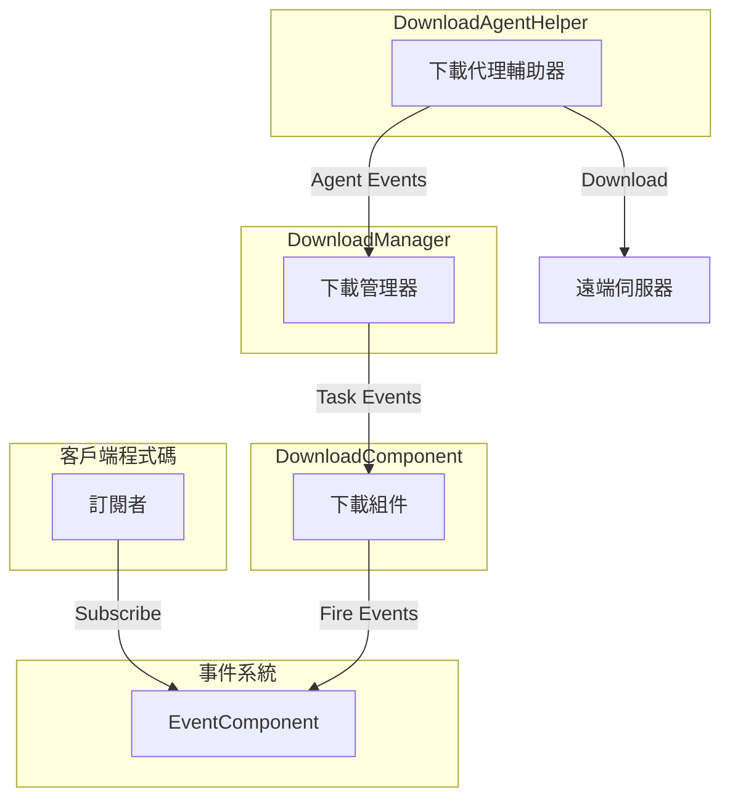
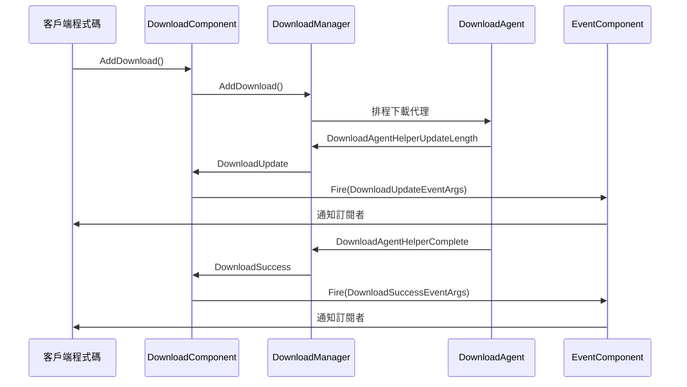

# 下載事件

本文件詳細介紹 GameFrameX 下載模組中的事件系統，包括下載任務事件和下載代理事件兩大類。

## 概述

GameFrameX 下載模組採用事件驅動架構，透過統一的事件系統實現下載狀態的實時通知。事件系統分為兩個層次：

1. **下載任務事件** - 針對整個下載任務的狀態變更通知
2. **下載代理事件** - 針對下載代理輔助器的底層狀態通知

這種分層設計使得開發者可以根據需求選擇不同粒度的事件監聽，既可以監聽高層下載任務狀態，也可以監聽底層代理資料傳輸狀態。

## 事件架構

下載事件系統採用釋出-訂閱模式，透過 `EventComponent` 統一管理和分發事件。



### 事件流程說明

1. 客戶端透過 `EventComponent` 訂閱感興趣的下載事件
2. 當呼叫 `DownloadComponent.AddDownload()` 新增下載任務時，任務進入下載佇列
3. `DownloadManager` 排程下載代理執行實際下載操作
4. 下載過程中產生的各類事件透過 `DownloadComponent` 轉發到 `EventComponent`
5. 訂閱者收到事件通知並執行相應邏輯

## 下載任務事件

下載任務事件在 `IDownloadManager` 介面中定義，由 `DownloadComponent` 統一暴露給外部使用。這些事件提供了下載任務完整生命週期中的關鍵狀態變更通知。

> Source: [IDownloadManager.cs](https://github.com/GameFrameX/com.gameframex.unity.download/blob/main/Runtime/Download/Download/IDownloadManager.cs#L86-L104)

### 事件列表

| 事件名稱 | 事件引數類 | 觸發時機 |
|---------|-----------|---------|
| 下載開始 | `DownloadStartEventArgs` | 下載任務開始執行時 |
| 下載更新 | `DownloadUpdateEventArgs` | 下載進度更新時 |
| 下載成功 | `DownloadSuccessEventArgs` | 下載成功完成時 |
| 下載失敗 | `DownloadFailureEventArgs` | 下載失敗時 |

### DownloadStartEventArgs

下載開始事件，在下載任務被下載代理接收並開始處理時觸發。

```csharp
//------------------------------------------------------------
// Game Framework
// Copyright © 2013-2021 Jiang Yin. All rights reserved.
//------------------------------------------------------------

using GameFrameX.Event.Runtime;
using GameFrameX.Runtime;

namespace GameFrameX.Download.Runtime
{
    /// <summary>
    /// 下載開始事件。
    /// </summary>
    public sealed class DownloadStartEventArgs : GameEventArgs
    {
        public static readonly string EventId = typeof(DownloadStartEventArgs).FullName;

        /// <summary>
        /// 初始化下載開始事件的新例項。
        /// </summary>
        public DownloadStartEventArgs()
        {
            SerialId = 0;
            DownloadPath = null;
            DownloadUri = null;
            CurrentLength = 0L;
            UserData = null;
        }

        /// <summary>
        /// 獲取下載任務的序列編號。
        /// </summary>
        public int SerialId { get; private set; }

        /// <summary>
        /// 獲取下載後存放路徑。
        /// </summary>
        public string DownloadPath { get; private set; }

        /// <summary>
        /// 獲取下載地址。
        /// </summary>
        public string DownloadUri { get; private set; }

        /// <summary>
        /// 獲取當前大小。
        /// </summary>
        public long CurrentLength { get; private set; }

        /// <summary>
        /// 獲取使用者自定義資料。
        /// </summary>
        public object UserData { get; private set; }

        /// <summary>
        /// 建立下載開始事件。
        /// </summary>
        public static DownloadStartEventArgs Create(int serialId, string downloadPath, string downloadUri, long currentLength, object userData)
        {
            DownloadStartEventArgs downloadStartEventArgs = ReferencePool.Acquire<DownloadStartEventArgs>();
            downloadStartEventArgs.SerialId = serialId;
            downloadStartEventArgs.DownloadPath = downloadPath;
            downloadStartEventArgs.DownloadUri = downloadUri;
            downloadStartEventArgs.CurrentLength = currentLength;
            downloadStartEventArgs.UserData = userData;
            return downloadStartEventArgs;
        }

        /// <summary>
        /// 清理下載開始事件。
        /// </summary>
        public override void Clear()
        {
            SerialId = 0;
            DownloadPath = null;
            DownloadUri = null;
            CurrentLength = 0L;
            UserData = null;
        }

        public override string Id
        {
            get { return EventId; }
        }
    }
}
```
> Source: [DownloadStartEventArgs.cs](https://github.com/GameFrameX/com.gameframex.unity.download/blob/main/Runtime/EventArgs/DownloadStartEventArgs.cs#L1-L94)

### DownloadUpdateEventArgs

下載更新事件，在下載過程中持續觸發，用於報告當前下載進度。

```csharp
/// <summary>
/// 下載更新事件。
/// </summary>
public sealed class DownloadUpdateEventArgs : GameEventArgs
{
    public static readonly string EventId = typeof(DownloadUpdateEventArgs).FullName;

    /// <summary>
    /// 初始化下載更新事件的新例項。
    /// </summary>
    public DownloadUpdateEventArgs()
    {
        SerialId = 0;
        DownloadPath = null;
        DownloadUri = null;
        CurrentLength = 0L;
        UserData = null;
    }

    /// <summary>
    /// 獲取下載任務的序列編號。
    /// </summary>
    public int SerialId { get; private set; }

    /// <summary>
    /// 獲取下載後存放路徑。
    /// </summary>
    public string DownloadPath { get; private set; }

    /// <summary>
    /// 獲取下載地址。
    /// </summary>
    public string DownloadUri { get; private set; }

    /// <summary>
    /// 獲取當前大小。
    /// </summary>
    public long CurrentLength { get; private set; }

    /// <summary>
    /// 獲取使用者自定義資料。
    /// </summary>
    public object UserData { get; private set; }

    /// <summary>
    /// 建立下載更新事件。
    /// </summary>
    public static DownloadUpdateEventArgs Create(int serialId, string downloadPath, string downloadUri, long currentLength, object userData)
    {
        DownloadUpdateEventArgs downloadUpdateEventArgs = ReferencePool.Acquire<DownloadUpdateEventArgs>();
        downloadUpdateEventArgs.SerialId = serialId;
        downloadUpdateEventArgs.DownloadPath = downloadPath;
        downloadUpdateEventArgs.DownloadUri = downloadUri;
        downloadUpdateEventArgs.CurrentLength = currentLength;
        downloadUpdateEventArgs.UserData = userData;
        return downloadUpdateEventArgs;
    }

    /// <summary>
    /// 清理下載更新事件。
    /// </summary>
    public override void Clear()
    {
        SerialId = 0;
        DownloadPath = null;
        DownloadUri = null;
        CurrentLength = 0L;
        UserData = null;
    }

    public override string Id
    {
        get { return EventId; }
    }
}
```
> Source: [DownloadUpdateEventArgs.cs](https://github.com/GameFrameX/com.gameframex.unity.download/blob/main/Runtime/EventArgs/DownloadUpdateEventArgs.cs#L1-L94)

### DownloadSuccessEventArgs

下載成功事件，在下載任務成功完成時觸發。

```csharp
/// <summary>
/// 下載成功事件。
/// </summary>
public sealed class DownloadSuccessEventArgs : GameEventArgs
{
    public static readonly string EventId = typeof(DownloadSuccessEventArgs).FullName;

    /// <summary>
    /// 初始化下載成功事件的新例項。
    /// </summary>
    public DownloadSuccessEventArgs()
    {
        SerialId = 0;
        DownloadPath = null;
        DownloadUri = null;
        CurrentLength = 0L;
        UserData = null;
    }

    /// <summary>
    /// 獲取下載任務的序列編號。
    /// </summary>
    public int SerialId { get; private set; }

    /// <summary>
    /// 獲取下載後存放路徑。
    /// </summary>
    public string DownloadPath { get; private set; }

    /// <summary>
    /// 獲取下載地址。
    /// </summary>
    public string DownloadUri { get; private set; }

    /// <summary>
    /// 獲取當前大小。
    /// </summary>
    public long CurrentLength { get; private set; }

    /// <summary>
    /// 獲取使用者自定義資料。
    /// </summary>
    public object UserData { get; private set; }

    /// <summary>
    /// 建立下載成功事件。
    /// </summary>
    public static DownloadSuccessEventArgs Create(int serialId, string downloadPath, string downloadUri, long currentLength, object userData)
    {
        DownloadSuccessEventArgs downloadSuccessEventArgs = ReferencePool.Acquire<DownloadSuccessEventArgs>();
        downloadSuccessEventArgs.SerialId = serialId;
        downloadSuccessEventArgs.DownloadPath = downloadPath;
        downloadSuccessEventArgs.DownloadUri = downloadUri;
        downloadSuccessEventArgs.CurrentLength = currentLength;
        downloadSuccessEventArgs.UserData = userData;
        return downloadSuccessEventArgs;
    }

    /// <summary>
    /// 清理下載成功事件。
    /// </summary>
    public override void Clear()
    {
        SerialId = 0;
        DownloadPath = null;
        DownloadUri = null;
        CurrentLength = 0L;
        UserData = null;
    }

    public override string Id
    {
        get { return EventId; }
    }
}
```
> Source: [DownloadSuccessEventArgs.cs](https://github.com/GameFrameX/com.gameframex.unity.download/blob/main/Runtime/EventArgs/DownloadSuccessEventArgs.cs#L1-L95)

### DownloadFailureEventArgs

下載失敗事件，在下載過程中發生錯誤時觸發。

```csharp
/// <summary>
/// 下載失敗事件。
/// </summary>
public sealed class DownloadFailureEventArgs : GameEventArgs
{
    public static readonly string EventId = typeof(DownloadFailureEventArgs).FullName;

    /// <summary>
    /// 初始化下載失敗事件的新例項。
    /// </summary>
    public DownloadFailureEventArgs()
    {
        SerialId = 0;
        DownloadPath = null;
        DownloadUri = null;
        ErrorMessage = null;
        UserData = null;
    }

    /// <summary>
    /// 獲取下載任務的序列編號。
    /// </summary>
    public int SerialId { get; private set; }

    /// <summary>
    /// 獲取下載後存放路徑。
    /// </summary>
    public string DownloadPath { get; private set; }

    /// <summary>
    /// 獲取下載地址。
    /// </summary>
    public string DownloadUri { get; private set; }

    /// <summary>
    /// 獲取錯誤資訊。
    /// </summary>
    public string ErrorMessage { get; private set; }

    /// <summary>
    /// 獲取使用者自定義資料。
    /// </summary>
    public object UserData { get; private set; }

    /// <summary>
    /// 建立下載失敗事件。
    /// </summary>
    public static DownloadFailureEventArgs Create(int serialId, string downloadPath, string downloadUri, string errorMessage, object userData)
    {
        DownloadFailureEventArgs downloadFailureEventArgs = ReferencePool.Acquire<DownloadFailureEventArgs>();
        downloadFailureEventArgs.SerialId = serialId;
        downloadFailureEventArgs.DownloadPath = downloadPath;
        downloadFailureEventArgs.DownloadUri = downloadUri;
        downloadFailureEventArgs.ErrorMessage = errorMessage;
        downloadFailureEventArgs.UserData = userData;
        return downloadFailureEventArgs;
    }

    /// <summary>
    /// 清理下載失敗事件。
    /// </summary>
    public override void Clear()
    {
        SerialId = 0;
        DownloadPath = null;
        DownloadUri = null;
        ErrorMessage = null;
        UserData = null;
    }

    public override string Id
    {
        get { return EventId; }
    }
}
```
> Source: [DownloadFailureEventArgs.cs](https://github.com/GameFrameX/com.gameframex.unity.download/blob/main/Runtime/EventArgs/DownloadFailureEventArgs.cs#L1-L94)

## 下載代理事件

下載代理事件定義在 `DownloadAgentHelperBase` 抽象類中，提供更底層的下載狀態通知。這些事件主要被 `DownloadManager` 內部使用，用於追蹤下載代理的工作狀態。

> Source: [DownloadAgentHelperBase.cs](https://github.com/GameFrameX/com.gameframex.unity.download/blob/main/Runtime/Download/DownloadAgentHelperBase.cs#L19-L42)

### 事件列表

| 事件名稱 | 事件引數類 | 觸發時機 |
|---------|-----------|---------|
| 代理更新資料流 | `DownloadAgentHelperUpdateBytesEventArgs` | 下載代理接收到新的資料塊時 |
| 代理更新資料大小 | `DownloadAgentHelperUpdateLengthEventArgs` | 下載代理下載資料大小變化時 |
| 代理完成 | `DownloadAgentHelperCompleteEventArgs` | 下載代理完成下載時 |
| 代理錯誤 | `DownloadAgentHelperErrorEventArgs` | 下載代理發生錯誤時 |

### DownloadAgentHelperUpdateBytesEventArgs

代理更新資料流事件，提供下載資料的原始位元組內容。

```csharp
/// <summary>
/// 下載代理輔助器更新資料流事件。
/// </summary>
public sealed class DownloadAgentHelperUpdateBytesEventArgs : GameEventArgs
{
    public static readonly string EventId = typeof(DownloadAgentHelperUpdateBytesEventArgs).FullName;
    
    private byte[] m_Bytes;

    /// <summary>
    /// 初始化下載代理輔助器更新資料流事件的新例項。
    /// </summary>
    public DownloadAgentHelperUpdateBytesEventArgs()
    {
        m_Bytes = null;
        Offset = 0;
        Length = 0;
    }

    /// <summary>
    /// 獲取資料流的偏移。
    /// </summary>
    public int Offset { get; private set; }

    /// <summary>
    /// 獲取資料流的長度。
    /// </summary>
    public int Length { get; private set; }

    /// <summary>
    /// 建立下載代理輔助器更新資料流事件。
    /// </summary>
    public static DownloadAgentHelperUpdateBytesEventArgs Create(byte[] bytes, int offset, int length)
    {
        if (bytes == null)
        {
            throw new GameFrameworkException("Bytes is invalid.");
        }

        if (offset < 0 || offset >= bytes.Length)
        {
            throw new GameFrameworkException("Offset is invalid.");
        }

        if (length <= 0 || offset + length > bytes.Length)
        {
            throw new GameFrameworkException("Length is invalid.");
        }

        DownloadAgentHelperUpdateBytesEventArgs downloadAgentHelperUpdateBytesEventArgs = ReferencePool.Acquire<DownloadAgentHelperUpdateBytesEventArgs>();
        downloadAgentHelperUpdateBytesEventArgs.m_Bytes = bytes;
        downloadAgentHelperUpdateBytesEventArgs.Offset = offset;
        downloadAgentHelperUpdateBytesEventArgs.Length = length;
        return downloadAgentHelperUpdateBytesEventArgs;
    }

    /// <summary>
    /// 獲取下載的資料流。
    /// </summary>
    public byte[] GetBytes()
    {
        return m_Bytes;
    }
    
    public override string Id
    {
        get { return EventId; }
    }
}
```
> Source: [DownloadAgentHelperUpdateBytesEventArgs.cs](https://github.com/GameFrameX/com.gameframex.unity.download/blob/main/Runtime/EventArgs/DownloadAgentHelperUpdateBytesEventArgs.cs#L1-L104)

### DownloadAgentHelperUpdateLengthEventArgs

代理更新資料大小事件，提供下載資料的增量大小。

```csharp
/// <summary>
/// 下載代理輔助器更新資料大小事件。
/// </summary>
public sealed class DownloadAgentHelperUpdateLengthEventArgs : GameEventArgs
{
    public static readonly string EventId = typeof(DownloadAgentHelperUpdateLengthEventArgs).FullName;

    /// <summary>
    /// 初始化下載代理輔助器更新資料大小事件的新例項。
    /// </summary>
    public DownloadAgentHelperUpdateLengthEventArgs()
    {
        DeltaLength = 0;
    }

    /// <summary>
    /// 獲取下載的增量資料大小。
    /// </summary>
    public int DeltaLength { get; private set; }

    /// <summary>
    /// 建立下載代理輔助器更新資料大小事件。
    /// </summary>
    public static DownloadAgentHelperUpdateLengthEventArgs Create(int deltaLength)
    {
        if (deltaLength <= 0)
        {
            throw new GameFrameworkException("Delta length is invalid.");
        }

        DownloadAgentHelperUpdateLengthEventArgs downloadAgentHelperUpdateLengthEventArgs = ReferencePool.Acquire<DownloadAgentHelperUpdateLengthEventArgs>();
        downloadAgentHelperUpdateLengthEventArgs.DeltaLength = deltaLength;
        return downloadAgentHelperUpdateLengthEventArgs;
    }

    /// <summary>
    /// 清理下載代理輔助器更新資料大小事件。
    /// </summary>
    public override void Clear()
    {
        DeltaLength = 0;
    }

    public override string Id
    {
        get { return EventId; }
    }
}
```
> Source: [DownloadAgentHelperUpdateLengthEventArgs.cs](https://github.com/GameFrameX/com.gameframex.unity.download/blob/main/Runtime/EventArgs/DownloadAgentHelperUpdateLengthEventArgs.cs#L1-L63)

### DownloadAgentHelperCompleteEventArgs

代理完成事件，在下載代理完成下載時觸發。

```csharp
/// <summary>
/// 下載代理輔助器完成事件。
/// </summary>
public sealed class DownloadAgentHelperCompleteEventArgs : GameEventArgs
{
    public static readonly string EventId = typeof(DownloadAgentHelperCompleteEventArgs).FullName;

    /// <summary>
    /// 初始化下載代理輔助器完成事件的新例項。
    /// </summary>
    public DownloadAgentHelperCompleteEventArgs()
    {
        Length = 0L;
    }

    /// <summary>
    /// 獲取下載的資料大小。
    /// </summary>
    public long Length { get; private set; }

    /// <summary>
    /// 建立下載代理輔助器完成事件。
    /// </summary>
    public static DownloadAgentHelperCompleteEventArgs Create(long length)
    {
        if (length < 0L)
        {
            throw new GameFrameworkException("Length is invalid.");
        }

        DownloadAgentHelperCompleteEventArgs downloadAgentHelperCompleteEventArgs = ReferencePool.Acquire<DownloadAgentHelperCompleteEventArgs>();
        downloadAgentHelperCompleteEventArgs.Length = length;
        return downloadAgentHelperCompleteEventArgs;
    }

    /// <summary>
    /// 清理下載代理輔助器完成事件。
    /// </summary>
    public override void Clear()
    {
        Length = 0L;
    }

    public override string Id
    {
        get { return EventId; }
    }
}
```
> Source: [DownloadAgentHelperCompleteEventArgs.cs](https://github.com/GameFrameX/com.gameframex.unity.download/blob/main/Runtime/EventArgs/DownloadAgentHelperCompleteEventArgs.cs#L1-L63)

### DownloadAgentHelperErrorEventArgs

代理錯誤事件，在下載代理發生錯誤時觸發。

```csharp
/// <summary>
/// 下載代理輔助器錯誤事件。
/// </summary>
public sealed class DownloadAgentHelperErrorEventArgs : GameEventArgs
{
    public static readonly string EventId = typeof(DownloadAgentHelperErrorEventArgs).FullName;

    /// <summary>
    /// 初始化下載代理輔助器錯誤事件的新例項。
    /// </summary>
    public DownloadAgentHelperErrorEventArgs()
    {
        DeleteDownloading = false;
        ErrorMessage = null;
    }

    /// <summary>
    /// 獲取是否需要刪除正在下載的檔案。
    /// </summary>
    public bool DeleteDownloading { get; private set; }

    /// <summary>
    /// 獲取錯誤資訊。
    /// </summary>
    public string ErrorMessage { get; private set; }

    /// <summary>
    /// 建立下載代理輔助器錯誤事件。
    /// </summary>
    public static DownloadAgentHelperErrorEventArgs Create(bool deleteDownloading, string errorMessage)
    {
        DownloadAgentHelperErrorEventArgs downloadAgentHelperErrorEventArgs = ReferencePool.Acquire<DownloadAgentHelperErrorEventArgs>();
        downloadAgentHelperErrorEventArgs.DeleteDownloading = deleteDownloading;
        downloadAgentHelperErrorEventArgs.ErrorMessage = errorMessage;
        return downloadAgentHelperErrorEventArgs;
    }

    /// <summary>
    /// 清理下載代理輔助器錯誤事件。
    /// </summary>
    public override void Clear()
    {
        DeleteDownloading = false;
        ErrorMessage = null;
    }

    public override string Id
    {
        get { return EventId; }
    }
}
```
> Source: [DownloadAgentHelperErrorEventArgs.cs](https://github.com/GameFrameX/com.gameframex.unity.download/blob/main/Runtime/EventArgs/DownloadAgentHelperErrorEventArgs.cs#L1-L67)

## 事件訂閱與使用

開發者可以透過 `EventComponent` 訂閱下載事件，監聽下載狀態的變化。

### 事件訂閱示例

```csharp
using GameFrameX.Download.Runtime;
using GameFrameX.Event.Runtime;
using UnityEngine;

public class DownloadExample : MonoBehaviour
{
    private EventComponent m_EventComponent;
    
    private void Start()
    {
        m_EventComponent = GameEntry.GetComponent<EventComponent>();
        
        // 訂閱下載開始事件
        m_EventComponent.Subscribe(DownloadStartEventArgs.EventId, OnDownloadStart);
        
        // 訂閱下載更新事件
        m_EventComponent.Subscribe(DownloadUpdateEventArgs.EventId, OnDownloadUpdate);
        
        // 訂閱下載成功事件
        m_EventComponent.Subscribe(DownloadSuccessEventArgs.EventId, OnDownloadSuccess);
        
        // 訂閱下載失敗事件
        m_EventComponent.Subscribe(DownloadFailureEventArgs.EventId, OnDownloadFailure);
    }
    
    private void OnDownloadStart(object sender, GameEventArgs e)
    {
        var args = (DownloadStartEventArgs)e;
        Debug.Log($"下載開始: SerialId={args.SerialId}, Path={args.DownloadPath}");
    }
    
    private void OnDownloadUpdate(object sender, GameEventArgs e)
    {
        var args = (DownloadUpdateEventArgs)e;
        Debug.Log($"下載進度: SerialId={args.SerialId}, CurrentLength={args.CurrentLength}");
    }
    
    private void OnDownloadSuccess(object sender, GameEventArgs e)
    {
        var args = (DownloadSuccessEventArgs)e;
        Debug.Log($"下載成功: SerialId={args.SerialId}, Path={args.DownloadPath}");
    }
    
    private void OnDownloadFailure(object sender, GameEventArgs e)
    {
        var args = (DownloadFailureEventArgs)e;
        Debug.LogError($"下載失敗: SerialId={args.SerialId}, Error={args.ErrorMessage}");
    }
}
```

> Source: [DownloadComponent.cs](https://github.com/GameFrameX/com.gameframex.unity.download/blob/main/Runtime/Download/DownloadComponent.cs#L415-L442)

### 事件觸發流程



## 事件引數屬性參考

### 下載任務事件屬性

| 屬性 | 型別 | 說明 | 所屬事件 |
|-----|------|------|---------|
| `SerialId` | `int` | 下載任務的唯一序列編號 | 全部 |
| `DownloadPath` | `string` | 下載後存放的本地路徑 | 全部 |
| `DownloadUri` | `string` | 遠端下載地址 | 全部 |
| `CurrentLength` | `long` | 當前已下載的資料大小（位元組） | Start/Update/Success |
| `ErrorMessage` | `string` | 錯誤描述資訊 | Failure |
| `UserData` | `object` | 使用者自定義資料 | 全部 |

### 代理事件屬性

| 屬性 | 型別 | 說明 | 所屬事件 |
|-----|------|------|---------|
| `Bytes[]` | `byte[]` | 下載的原始資料位元組 | UpdateBytes |
| `Offset` | `int` | 資料流的偏移量 | UpdateBytes |
| `Length` | `int` | 資料流的長度 | UpdateBytes/Complete |
| `DeltaLength` | `int` | 本次下載的增量大小 | UpdateLength |
| `DeleteDownloading` | `bool` | 是否需要刪除正在下載的檔案 | Error |
| `ErrorMessage` | `string` | 錯誤描述資訊 | Error |

## 事件使用建議

1. **選擇適當的事件粒度**
   - 監聽下載任務事件（`DownloadStart`/`DownloadUpdate`/`DownloadSuccess`/`DownloadFailure`）用於業務邏輯處理
   - 監聽代理事件用於實現下載進度條或除錯

2. **事件引數池化**
   - 所有事件引數透過 `ReferencePool` 進行池化管理
   - 使用 `Create()` 方法建立事件，透過 `Clear()` 方法回收

3. **錯誤處理**
   - 始終訂閱 `DownloadFailure` 事件以捕獲下載失敗情況
   - 失敗事件中的 `ErrorMessage` 包含詳細的錯誤資訊

## 相關連結

- [代理事件](./6-events.agent-events) - 下載代理底層事件詳解
- [DownloadComponent](./4-core-concepts.download-component) - 下載組件詳解
- [下載代理](./4-core-concepts.download-agent) - 下載代理概念說明
- [API 參考](./5-api-reference) - 完整的 API 參考文件
