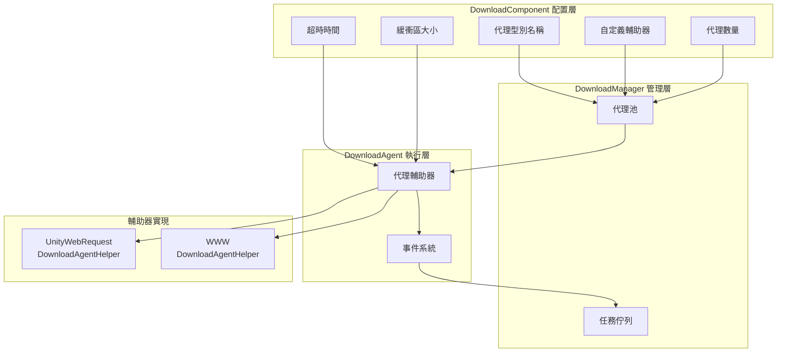

# 下載代理配置

下載代理配置用於設定下載系統的核心行為，包括代理型別選擇、併發數量、超時設定等關鍵引數。

## 概述

下載代理（Download Agent）是下載系統的核心執行單元，負責實際的網路請求和資料寫入操作。每個下載代理透過一個下載代理輔助器（DownloadAgentHelper）來實現具體的下載功能。系統支援配置多個並行工作的下載代理，以提升多檔案下載的效率。

下載代理配置主要透過 `DownloadComponent` 組件在 Unity 編輯器中進行設定，也可以透過程式碼動態調整。

## 配置項詳解

### 代理輔助器型別配置

代理輔助器型別決定了實際執行下載操作的具體實現類。

| 配置項 | 型別 | 預設值 | 說明 |
|--------|------|--------|------|
| 輔助器型別名稱 | string | "GameFrameX.Download.Runtime.UnityWebRequestDownloadAgentHelper" | 輔助器類的完整型別名 |
| 自定義輔助器例項 | DownloadAgentHelperBase | null | 直接引用的自定義輔助器物件 |

```csharp
// DownloadComponent.cs 中的配置定義
[SerializeField] private string m_DownloadAgentHelperTypeName = "GameFrameX.Download.Runtime.UnityWebRequestDownloadAgentHelper";

[SerializeField] private DownloadAgentHelperBase m_CustomDownloadAgentHelper = null;
```
> Source: [DownloadComponent.cs](https://github.com/GameFrameX/com.gameframex.unity.download/blob/main/Runtime/Download/DownloadComponent.cs#L33-L35)

**使用說明：**
- 透過型別名稱建立：系統會根據字串型別名反射建立輔助器例項
- 直接引用自定義例項：可以預先建立自定義輔助器並賦值給 `m_CustomDownloadAgentHelper`

### 代理數量配置

```csharp
// 預設建立3個並行下載代理
[SerializeField] private int m_DownloadAgentHelperCount = 3;
```
> Source: [DownloadComponent.cs](https://github.com/GameFrameX/com.gameframex.unity.download/blob/main/Runtime/Download/DownloadComponent.cs#L37)

```csharp
// 啟動時建立所有下載代理
for (int i = 0; i < m_DownloadAgentHelperCount; i++)
{
    AddDownloadAgentHelper(i);
}
```
> Source: [DownloadComponent.cs](https://github.com/GameFrameX/com.gameframex.unity.download/blob/main/Runtime/Download/DownloadComponent.cs#L178-L181)

| 配置項 | 型別 | 預設值 | 取值範圍 | 說明 |
|--------|------|--------|----------|------|
| 代理數量 | int | 3 | 1-16 | 同時工作的下載代理數量 |

**效能建議：**
- 數量越多，並行下載能力越強，但網路頻寬消耗越大
- 建議根據實際網路條件和伺服器限制設定
- 移動端建議 2-4 個，PC端可設定 4-8 個

### 超時配置

```csharp
// 下載超時時間（秒）
[SerializeField] private float m_Timeout = 30f;
```
> Source: [DownloadComponent.cs](https://github.com/GameFrameX/com.gameframex.unity.download/blob/main/Runtime/Download/DownloadComponent.cs#L39)

| 配置項 | 型別 | 預設值 | 取值範圍 | 說明 |
|--------|------|--------|----------|------|
| 超時時間 | float | 30秒 | 0-120秒 | 單次下載請求的最大等待時間 |

**超時判斷邏輯：**
```csharp
// DownloadAgent.cs 中，超時判斷
m_WaitTime += realElapseSeconds;
if (m_WaitTime >= m_Task.Timeout)
{
    // 觸發超時錯誤
    DownloadAgentHelperErrorEventArgs.Create(false, "Timeout");
}
```
> Source: [DownloadManager.DownloadAgent.cs](https://github.com/GameFrameX/com.gameframex.unity.download/blob/main/Runtime/Download/Download/DownloadManager.DownloadAgent.cs#L127-L138)

### 緩衝區配置

```csharp
// 緩衝區大小（位元組），預設 1MB
private const int OneMegaBytes = 1024 * 1024;
[SerializeField] private int m_FlushSize = OneMegaBytes;
```
> Source: [DownloadComponent.cs](https://github.com/GameFrameX/com.gameframex.unity.download/blob/main/Runtime/Download/DownloadComponent.cs#L25-L41)

| 配置項 | 型別 | 預設值 | 說明 |
|--------|------|--------|------|
| 緩衝區大小 | int | 1048576 (1MB) | 觸發磁碟寫入的緩衝區臨界值 |

**斷點續傳原理：**
```csharp
// 資料寫入時累積緩衝區，達到閾值後重新整理到磁碟
m_FileStream.Write(e.GetBytes(), e.Offset, e.Length);
m_WaitFlushSize += e.Length;
if (m_WaitFlushSize >= m_Task.FlushSize)
{
    m_FileStream.Flush();  // 重新整理到磁碟
    m_WaitFlushSize = 0;
}
```
> Source: [DownloadManager.DownloadAgent.cs](https://github.com/GameFrameX/com.gameframex.unity.download/blob/main/Runtime/Download/Download/DownloadManager.DownloadAgent.cs#L270-L291)

## 內建代理輔助器

### UnityWebRequestDownloadAgentHelper

這是系統預設的下載代理輔助器，基於 Unity 的 `UnityWebRequest` 實現。

**特性：**
- 支援斷點續傳（Range 請求）
- 支援 HTTPS/SSL
- 自動處理證書（預設接受所有證書）
- 相容 Unity 2017.2+

**關鍵實現：**
```csharp
public partial class UnityWebRequestDownloadAgentHelper : DownloadAgentHelperBase, IDisposable
{
    // 支援三種下載模式：
    // 1. 完整下載
    public override void Download(string downloadUri, object userData);
    
    // 2. 從指定位置開始斷點續傳
    public override void Download(string downloadUri, long fromPosition, object userData);
    
    // 3. 指定範圍下載
    public override void Download(string downloadUri, long fromPosition, long toPosition, object userData);
}
```
> Source: [UnityWebRequestDownloadAgentHelper.cs](https://github.com/GameFrameX/com.gameframex.unity.download/blob/main/Runtime/Download/UnityWebRequestDownloadAgentHelper.cs#L26-L147)

**證書處理：**
```csharp
// 預設接受所有 SSL 證書（開發環境使用）
public sealed class DownloadCertificateHandler : CertificateHandler
{
    protected override bool ValidateCertificate(byte[] certificateData)
    {
        return true; // 接受所有證書
    }
}
```
> Source: [UnityWebRequestDownloadAgentHelper.cs](https://github.com/GameFrameX/com.gameframex.unity.download/blob/main/Runtime/Download/UnityWebRequestDownloadAgentHelper.cs#L14-L21)

### WWWDownloadAgentHelper

傳統下載輔助器，基於 `WWW` 類實現，僅在 Unity 2018.3 之前的版本可用。

```csharp
#if !UNITY_2018_3_OR_NEWER
public class WWWDownloadAgentHelper : DownloadAgentHelperBase, IDisposable
{
    // 與 UnityWebRequestDownloadAgentHelper 相同的介面
}
#endif
```
> Source: [WWWDownloadAgentHelper.cs](https://github.com/GameFrameX/com.gameframex.unity.download/blob/main/Runtime/Download/WWWDownloadAgentHelper.cs#L8-L22)

**注意：** 建議使用 `UnityWebRequestDownloadAgentHelper`，`WWW` 類已在 Unity 2018.3 中廢棄。

## 架構圖



## 代理輔助器介面

所有下載代理輔助器必須實現 `IDownloadAgentHelper` 介面：

```csharp
public interface IDownloadAgentHelper
{
    /// 下載代理輔助器更新資料流事件
    event EventHandler<DownloadAgentHelperUpdateBytesEventArgs> DownloadAgentHelperUpdateBytes;

    /// 下載代理輔助器更新資料大小事件
    event EventHandler<DownloadAgentHelperUpdateLengthEventArgs> DownloadAgentHelperUpdateLength;

    /// 下載代理輔助器完成事件
    event EventHandler<DownloadAgentHelperCompleteEventArgs> DownloadAgentHelperComplete;

    /// 下載代理輔助器錯誤事件
    event EventHandler<DownloadAgentHelperErrorEventArgs> DownloadAgentHelperError;

    /// 透過下載代理輔助器下載指定地址的資料
    void Download(string downloadUri, object userData);
    void Download(string downloadUri, long fromPosition, object userData);
    void Download(string downloadUri, long fromPosition, long toPosition, object userData);

    /// 重置下載代理輔助器
    void Reset();
}
```
> Source: [IDownloadAgentHelper.cs](https://github.com/GameFrameX/com.gameframex.unity.download/blob/main/Runtime/Download/Download/IDownloadAgentHelper.cs#L15-L65)

## 自定義代理輔助器

可以透過繼承 `DownloadAgentHelperBase` 建立自定義下載代理輔助器：

```csharp
public abstract class DownloadAgentHelperBase : MonoBehaviour, IDownloadAgentHelper
{
    /// 範圍不適用錯誤碼
    protected const int RangeNotSatisfiableErrorCode = 416;

    /// 必須實現的四個事件
    public abstract event EventHandler<DownloadAgentHelperUpdateBytesEventArgs> DownloadAgentHelperUpdateBytes;
    public abstract event EventHandler<DownloadAgentHelperUpdateLengthEventArgs> DownloadAgentHelperUpdateLength;
    public abstract event EventHandler<DownloadAgentHelperCompleteEventArgs> DownloadAgentHelperComplete;
    public abstract event EventHandler<DownloadAgentHelperErrorEventArgs> DownloadAgentHelperError;

    /// 必須實現的三個下載方法（支援斷點續傳）
    public abstract void Download(string downloadUri, object userData);
    public abstract void Download(string downloadUri, long fromPosition, object userData);
    public abstract void Download(string downloadUri, long fromPosition, long toPosition, object userData);

    /// 重置輔助器狀態
    public abstract void Reset();
}
```
> Source: [DownloadAgentHelperBase.cs](https://github.com/GameFrameX/com.gameframex.unity.download/blob/main/Runtime/Download/DownloadAgentHelperBase.cs#L17-L72)

## 編輯器配置

在 Unity 編輯器中，可以透過 `DownloadComponent` 組件的面板進行視覺化配置：

```csharp
// Inspector 中的配置項
EditorGUILayout.PropertyField(m_InstanceRoot);  // 例項根節點
m_DownloadAgentHelperInfo.Draw();               // 代理輔助器型別選擇
m_DownloadAgentHelperCount.intValue = EditorGUILayout.IntSlider("Download Agent Helper Count", ...); // 代理數量
EditorGUILayout.Slider("Timeout", ...);        // 超時時間
EditorGUILayout.DelayedIntField("Flush Size", ...); // 緩衝區大小
```
> Source: [DownloadComponentInspector.cs](https://github.com/GameFrameX/com.gameframex.unity.download/blob/main/Editor/Inspector/DownloadComponentInspector.cs#L38-L69)

## 事件系統

下載代理輔助器透過事件向上層報告下載狀態：

| 事件 | 引數型別 | 觸發時機 |
|------|----------|----------|
| DownloadAgentHelperUpdateBytes | DownloadAgentHelperUpdateBytesEventArgs | 收到下載資料時 |
| DownloadAgentHelperUpdateLength | DownloadAgentHelperUpdateLengthEventArgs | 資料大小更新時 |
| DownloadAgentHelperComplete | DownloadAgentHelperCompleteEventArgs | 下載完成時 |
| DownloadAgentHelperError | DownloadAgentHelperErrorEventArgs | 下載出錯時 |

這些事件被 `DownloadAgent` 接收並處理，最終觸發更上層的下載事件。

## 相關連結

- [編輯器配置](./7-configuration.editor-configuration) - 編輯器相關配置說明
- [核心概念 - 下載代理](./4-core-concepts.download-agent) - 下載代理核心概念詳解
- [API 參考 - 屬性](./5-api-reference.properties) - DownloadComponent 屬性API
- [API 參考 - 方法](./5-api-reference.methods) - DownloadComponent 方法API
- [下載事件](./6-events.download-events) - 下載相關事件說明
- [代理事件](./6-events.agent-events) - 代理相關事件說明
