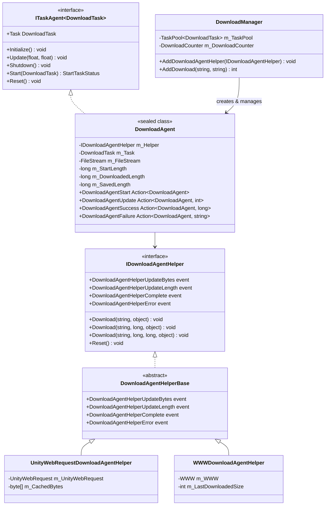
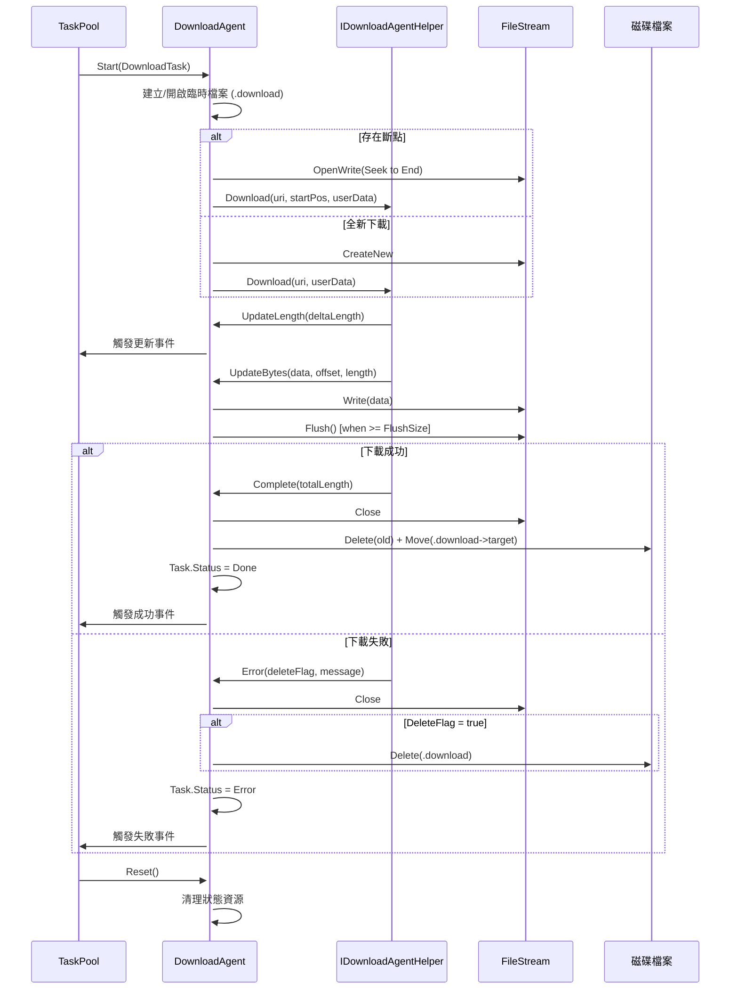

# 下載代理

下載代理（Download Agent）是 GameFrameX 下載系統的核心執行單元，負責實際執行下載任務。每個下載代理例項對應一個具體的下載操作，透過與下載代理輔助器（Download Agent Helper）互動完成網路請求和資料儲存。

## 概述

下載代理是 `DownloadManager` 內部的任務執行器，實現了 `ITaskAgent<DownloadTask>` 介面。它管理單個下載任務的完整生命週期，包括：

- **任務啟動**：初始化檔案流、檢查斷點續傳、啟動下載
- **進度監控**：實時追蹤下載進度、處理超時、計算下載速度
- **資料寫入**：將下載的資料塊寫入臨時檔案（.download 字尾）
- **任務完成**：將臨時檔案重新命名為目標檔案
- **錯誤處理**：處理網路錯誤、超時錯誤、IO 錯誤

下載代理採用策略模式設計，透過依賴注入不同的下載代理輔助器（`IDownloadAgentHelper`）來支援不同的下載實現。框架提供了兩個內建實現：
- `UnityWebRequestDownloadAgentHelper`：基於 Unity 的 `UnityWebRequest` API（推薦，相容 Unity 2017.2+）
- `WWWDownloadAgentHelper`：基於傳統的 `WWW` 類（僅支援 Unity 2018.3 以下版本）

## 架構

下載代理系統採用分層架構設計，核心組件包括：



**架構設計要點：**

1. **任務代理模式**：`DownloadAgent` 實現 `ITaskAgent<DownloadTask>` 介面，融入 `TaskPool` 任務池系統，實現任務的統一排程和管理。

2. **依賴注入**：`DownloadAgent` 透過建構函式接收 `IDownloadAgentHelper` 例項，將底層下載實現抽象化，便於擴充套件和測試。

3. **事件驅動**：`DownloadAgent` 透過訂閱 `IDownloadAgentHelper` 的事件來感知下載進度和狀態變化，保持與具體下載實現解耦。

4. **生命週期管理**：`DownloadAgent` 實現 `IDisposable` 介面，確保資源（特別是檔案流和網路請求）正確釋放。

## 核心流程

下載代理處理單個下載任務的完整流程如下：



**關鍵設計決策：**

1. **臨時檔案機制**：下載資料先寫入 `.download` 字尾的臨時檔案，完成後才重新命名為目標檔案。這確保了：
   - 下載中斷時不會損壞原有的目標檔案
   - 支援斷點續傳（透過檢查臨時檔案大小）

2. **緩衝區寫入**：`DownloadAgent` 維護一個內部緩衝區，達到 `FlushSize`（預設 1MB）時才執行物理寫入，減少 IO 操作次數。

3. **超時檢測**：每次收到資料或進度更新時重置等待計時器，如果超過 `Timeout`（預設 30 秒）未收到任何資料，判定為超時錯誤。

## 核心屬性

`DownloadAgent` 提供了以下公開屬性供外部查詢：

| 屬性 | 型別 | 描述 |
|------|------|------|
| `Task` | `DownloadTask` | 當前正在處理的下載任務 |
| `WaitTime` | `float` | 距離上次收到資料的時間（秒） |
| `StartLength` | `long` | 開始下載時檔案已存在的大小（斷點續傳用） |
| `DownloadedLength` | `long` | 本次下載已獲取的資料大小 |
| `CurrentLength` | `long` | 當前總大小（StartLength + DownloadedLength） |
| `SavedLength` | `long` | 已持久化到磁碟的資料大小 |

```csharp
// 使用示例：查詢下載進度
DownloadAgent agent = /* 從事件或池中獲取 */;
long totalSize = agent.CurrentLength;
long downloaded = agent.DownloadedLength;
float progress = (float)downloaded / totalSize * 100f;
Debug.Log($"下載進度: {progress:F1}% ({downloaded}/{totalSize} bytes)");
```

## 事件系統

下載代理透過以下回呼事件與外部通訊：

```csharp
// 下載開始事件
public Action<DownloadAgent> DownloadAgentStart;

// 下載進度更新事件（每次收到新資料塊）
public Action<DownloadAgent, int> DownloadAgentUpdate;

// 下載成功完成事件
public Action<DownloadAgent, long> DownloadAgentSuccess;

// 下載失敗事件
public Action<DownloadAgent, string> DownloadAgentFailure;
```

這些事件在 `DownloadManager.AddDownloadAgentHelper()` 時被繫結到管理器的事件系統，形成統一的事件流。

## 下載代理輔助器

### IDownloadAgentHelper 介面

`IDownloadAgentHelper` 定義了下載代理輔助器的核心契約：

> Source: [IDownloadAgentHelper.cs](https://github.com/GameFrameX/com.gameframex.unity.download/blob/main/Runtime/Download/Download/IDownloadAgentHelper.cs#L15-L65)

```csharp
public interface IDownloadAgentHelper
{
    // 事件：下載資料流更新
    event EventHandler<DownloadAgentHelperUpdateBytesEventArgs> DownloadAgentHelperUpdateBytes;
    
    // 事件：下載長度更新（增量）
    event EventHandler<DownloadAgentHelperUpdateLengthEventArgs> DownloadAgentHelperUpdateLength;
    
    // 事件：下載完成
    event EventHandler<DownloadAgentHelperCompleteEventArgs> DownloadAgentHelperComplete;
    
    // 事件：下載錯誤
    event EventHandler<DownloadAgentHelperErrorEventArgs> DownloadAgentHelperError;

    // 方法：從頭開始下載
    void Download(string downloadUri, object userData);
    
    // 方法：從指定位置繼續下載（斷點續傳）
    void Download(string downloadUri, long fromPosition, object userData);
    
    // 方法：下載指定範圍的資料
    void Download(string downloadUri, long fromPosition, long toPosition, object userData);
    
    // 方法：重置輔助器狀態
    void Reset();
}
```

### UnityWebRequestDownloadAgentHelper

基於 UnityWebRequest 的實現，支援現代 Unity 版本（2017.2+）：

> Source: [UnityWebRequestDownloadAgentHelper.cs](https://github.com/GameFrameX/com.gameframex.unity.download/blob/main/Runtime/Download/UnityWebRequestDownloadAgentHelper.cs#L26-L229)

**特性：**
- 使用 `DownloadHandlerScript` 子類實現增量資料回呼
- 內建 SSL 證書驗證處理器（預設接受所有證書）
- 支援 HTTP Range 頭部實現斷點續傳
- 相容 Unity 2017.2 至最新版本

**使用方式：**

```csharp
// 建立 UnityWebRequest 輔助器例項
var helper = gameObject.AddComponent<UnityWebRequestDownloadAgentHelper>();

// 新增到下載管理器
var downloadManager = GameEntry.GetComponent<DownloadManager>();
downloadManager.AddDownloadAgentHelper(helper);
```

### WWWDownloadAgentHelper

基於傳統 WWW 的實現，僅適用於 Unity 2018.3 以下版本（已標記為過時）：

> Source: [WWWDownloadAgentHelper.cs](https://github.com/GameFrameX/com.gameframex.unity.download/blob/main/Runtime/Download/WWWDownloadAgentHelper.cs#L21-L244)

**注意：** 此實現被 `#if !UNITY_2018_3_OR_NEWER` 條件編譯保護，在 Unity 2018.3 及以上版本中不可用。

## 自定義下載代理輔助器

開發者可以透過繼承 `DownloadAgentHelperBase` 來實現自定義下載邏輯：

```csharp
using UnityEngine;
using GameFrameX.Download.Runtime;

public class CustomDownloadAgentHelper : DownloadAgentHelperBase
{
    // 實現繼承的事件和抽象方法...
    
    public override void Download(string downloadUri, object userData)
    {
        // 實現自定義下載邏輯
        // 重要：在適當的時候觸發事件
    }
    
    public override void Reset()
    {
        // 清理資源
    }
}
```

## 事件引數

### DownloadAgentHelperUpdateBytesEventArgs

下載資料流更新事件引數：

> Source: [DownloadAgentHelperUpdateBytesEventArgs.cs](https://github.com/GameFrameX/com.gameframex.unity.download/blob/main/Runtime/EventArgs/DownloadAgentHelperUpdateBytesEventArgs.cs#L16-L62)

| 屬性 | 型別 | 描述 |
|------|------|------|
| `Bytes` | `byte[]` | 下載的資料塊 |
| `Offset` | `int` | 資料起始偏移 |
| `Length` | `int` | 資料長度 |

### DownloadAgentHelperUpdateLengthEventArgs

下載增量大小事件引數：

> Source: [DownloadAgentHelperUpdateLengthEventArgs.cs](https://github.com/GameFrameX/com.gameframex.unity.download/blob/main/Runtime/EventArgs/DownloadAgentHelperUpdateLengthEventArgs.cs#L16-L47)

| 屬性 | 型別 | 描述 |
|------|------|------|
| `DeltaLength` | `int` | 本次新增的下載資料大小 |

### DownloadAgentHelperCompleteEventArgs

下載完成事件引數：

> Source: [DownloadAgentHelperCompleteEventArgs.cs](https://github.com/GameFrameX/com.gameframex.unity.download/blob/main/Runtime/EventArgs/DownloadAgentHelperCompleteEventArgs.cs#L16-L62)

| 屬性 | 型別 | 描述 |
|------|------|------|
| `Length` | `long` | 下載的總資料大小 |

### DownloadAgentHelperErrorEventArgs

下載錯誤事件引數：

> Source: [DownloadAgentHelperErrorEventArgs.cs](https://github.com/GameFrameX/com.gameframex.unity.download/blob/main/Runtime/EventArgs/DownloadAgentHelperErrorEventArgs.cs#L16-L66)

| 屬性 | 型別 | 描述 |
|------|------|------|
| `DeleteDownloading` | `bool` | 是否需要刪除正在下載的臨時檔案 |
| `ErrorMessage` | `string` | 錯誤描述資訊 |

## 常見問題

### 斷點續傳不工作

**症狀**：重新啟動遊戲後，下載任務從頭開始而非從上次中斷處繼續。

**可能原因**：
1. 伺服器不支援 HTTP Range 頭部
2. 臨時檔案（.download）被意外刪除
3. 下載路徑不一致

**排查方法**：
```csharp
// 檢查下載代理的 StartLength 屬性
DownloadAgent agent = /* 獲取代理 */;
Debug.Log($"StartLength: {agent.StartLength}");
// 如果為 0，說明未檢測到斷點
```

### 下載超時

**症狀**：下載長時間無響應，最終報錯 "Timeout"。

**解決方案**：
```csharp
// 調整下載超時設定
var downloadManager = GameEntry.GetComponent<DownloadManager>();
downloadManager.Timeout = 120f; // 調整為 120 秒
```

### 記憶體佔用過高

**症狀**：大檔案下載時記憶體使用量激增。

**原因分析**：
`UnityWebRequestDownloadAgentHelper` 使用 4KB 的固定緩衝區，如果下載速度極快且未及時處理，可能導致資料積壓。

**最佳化建議**：
- 降低 `FlushSize` 以增加磁碟寫入頻率
- 監控 `WorkingAgentCount`，限制併發下載數量

## 相關連結

- [下載組件](./4-core-concepts.download-component) - 下載組件的使用
- [架構概述](./4-core-concepts.architecture) - 整體系統架構
- [下載事件](./6-events.download-events) - 下載相關事件詳解
- [代理事件](./6-events.agent-events) - 代理相關事件詳解
- [API 參考](./5-api-reference.properties) - 屬性和方法的完整定義
