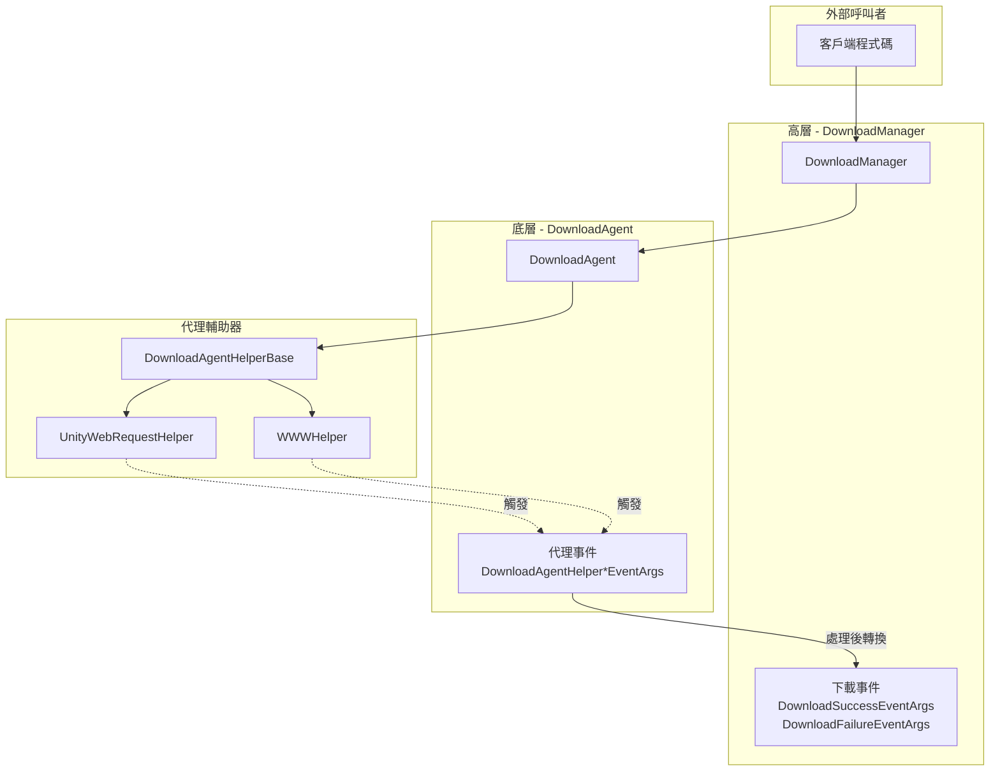
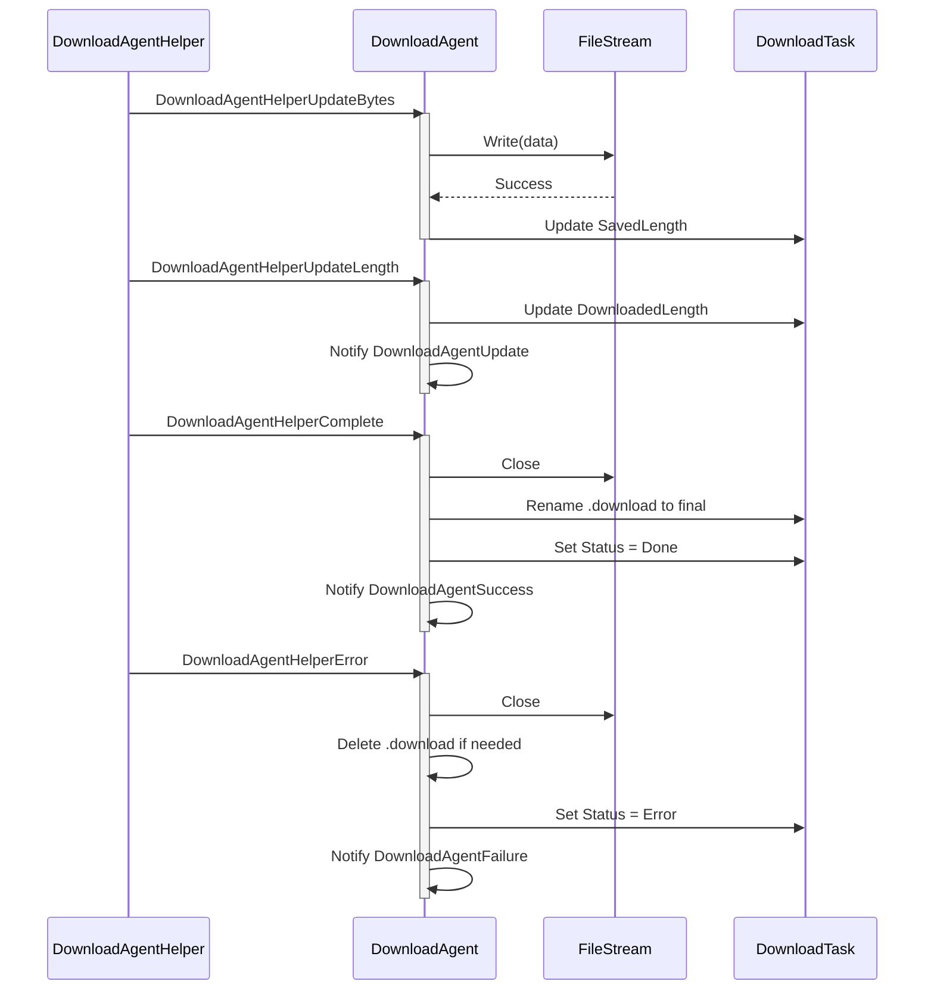
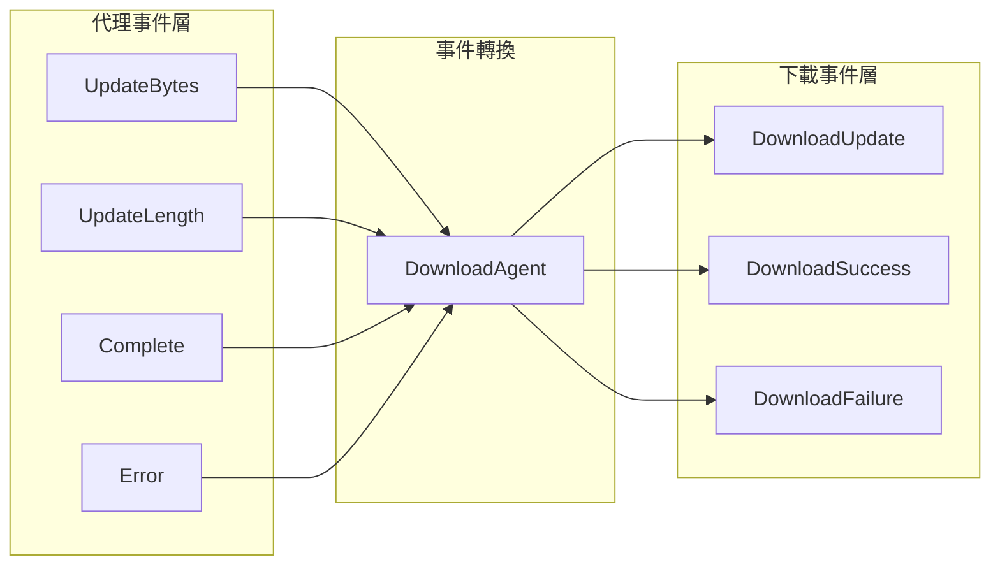

# 代理事件

代理事件是下載代理輔助器（Download Agent Helper）在執行下載操作時觸發的底層事件。這些事件提供了對下載過程中各個階段的細粒度控制，使開發者能夠監控和處理下載資料的流動狀態。

## 概述

代理事件是下載系統中的**底層事件**，與 DownloadManager 發出的高層下載事件（下載成功、下載失敗等）不同。代理事件直接在下載代理輔助器層面工作，提供了對下載資料流的精細控制能力。

**代理事件與下載事件的區別：**

| 特性 | 代理事件 | 下載事件 |
|------|----------|----------|
| 觸發層級 | 下載代理輔助器層（底層） | DownloadManager 層（高層） |
| 事件粒度 | 細粒度（位元組流、更新進度） | 粗粒度（任務完成/失敗） |
| 使用場景 | 需要處理下載資料的場景 | 需要感知任務整體狀態的場景 |

**四種代理事件：**
1. `DownloadAgentHelperUpdateBytesEventArgs` - 下載資料流更新事件
2. `DownloadAgentHelperUpdateLengthEventArgs` - 下載資料大小更新事件
3. `DownloadAgentHelperCompleteEventArgs` - 下載完成事件
4. `DownloadAgentHelperErrorEventArgs` - 下載錯誤事件

## 事件體系架構



### 事件流說明

1. **客戶端**透過 `DownloadManager` 新增下載任務
2. **DownloadManager** 將任務分配給 **DownloadAgent** 處理
3. **DownloadAgent** 呼叫 **DownloadAgentHelper** 執行實際下載
4. **DownloadAgentHelper**（如 UnityWebRequestHelper）在下載過程中觸發 **代理事件**
5. **DownloadAgent** 接收並處理這些事件，更新任務狀態
6. 任務完成後，**DownloadManager** 發出高層 **下載事件**

## 核心事件詳解

### DownloadAgentHelperUpdateBytesEventArgs

下載資料流更新事件，在下載過程中當有新的資料塊到達時觸發。

```csharp
// Source: Runtime/EventArgs/DownloadAgentHelperUpdateBytesEventArgs.cs#L16-L103
public sealed class DownloadAgentHelperUpdateBytesEventArgs : GameEventArgs
{
    public static readonly string EventId = typeof(DownloadAgentHelperUpdateBytesEventArgs).FullName;

    private byte[] m_Bytes;

    /// <summary>
    /// 獲取資料流的偏移。
    /// </summary>
    public int Offset { get; private set; }

    /// <summary>
    /// 獲取資料流的長度。
    /// </summary>
    public int Length { get; private set; }

    /// <summary>
    /// 獲取下載的資料流。
    /// </summary>
    public byte[] GetBytes()
    {
        return m_Bytes;
    }
}
```

**使用場景：**
- 實時處理下載的資料流
- 對下載資料進行加密/解密處理
- 邊下載邊寫入儲存

### DownloadAgentHelperUpdateLengthEventArgs

下載資料大小更新事件，報告下載資料的增量變化。

```csharp
// Source: Runtime/EventArgs/DownloadAgentHelperUpdateLengthEventArgs.cs#L16-L63
public sealed class DownloadAgentHelperUpdateLengthEventArgs : GameEventArgs
{
    public static readonly string EventId = typeof(DownloadAgentHelperUpdateLengthEventArgs).FullName;

    /// <summary>
    /// 獲取下載的增量資料大小。
    /// </summary>
    public int DeltaLength { get; private set; }
}
```

**使用場景：**
- 實時更新下載進度
- 計算下載速度
- 顯示下載百分比

### DownloadAgentHelperCompleteEventArgs

下載完成事件，當下載代理輔助器完成下載時觸發。

```csharp
// Source: Runtime/EventArgs/DownloadAgentHelperCompleteEventArgs.cs#L16-L63
public sealed class DownloadAgentHelperCompleteEventArgs : GameEventArgs
{
    public static readonly string EventId = typeof(DownloadAgentHelperCompleteEventArgs).FullName;

    /// <summary>
    /// 獲取下載的資料大小。
    /// </summary>
    public long Length { get; private set; }
}
```

**使用場景：**
- 下載完成後的資料驗證
- 觸發後續處理流程

### DownloadAgentHelperErrorEventArgs

下載錯誤事件，當下載過程中發生錯誤時觸發。

```csharp
// Source: Runtime/EventArgs/DownloadAgentHelperErrorEventArgs.cs#L16-L67
public sealed class DownloadAgentHelperErrorEventArgs : GameEventArgs
{
    public static readonly string EventId = typeof(DownloadAgentHelperErrorEventArgs).FullName;

    /// <summary>
    /// 獲取是否需要刪除正在下載的檔案。
    /// </summary>
    public bool DeleteDownloading { get; private set; }

    /// <summary>
    /// 獲取錯誤資訊。
    /// </summary>
    public string ErrorMessage { get; private set; }
}
```

**使用場景：**
- 錯誤日誌記錄
- 重試機制觸發
- 清理不完整的下載檔案

## 事件訂閱與處理

### 在 DownloadAgent 中處理代理事件

```csharp
// Source: Runtime/Download/Download/DownloadManager.DownloadAgent.cs#L114-L120
/// <summary>
/// 初始化下載代理。
/// </summary>
public void Initialize()
{
    m_Helper.DownloadAgentHelperUpdateBytes += OnDownloadAgentHelperUpdateBytes;
    m_Helper.DownloadAgentHelperUpdateLength += OnDownloadAgentHelperUpdateLength;
    m_Helper.DownloadAgentHelperComplete += OnDownloadAgentHelperComplete;
    m_Helper.DownloadAgentHelperError += OnDownloadAgentHelperError;
}
```

### 事件處理流程



## 代理事件與下載事件的關係



代理事件經過 DownloadAgent 處理後會轉換為高層下載事件：

| 代理事件 | 轉換結果 |
|----------|----------|
| UpdateBytes | 寫入檔案，更新 SavedLength |
| UpdateLength | 觸發 DownloadAgentUpdate 回呼 |
| Complete | 觸發 DownloadAgentSuccess → DownloadSuccessEventArgs |
| Error | 觸發 DownloadAgentFailure → DownloadFailureEventArgs |

## 事件引數參考

### DownloadAgentHelperUpdateBytesEventArgs

| 屬性 | 型別 | 描述 |
|------|------|------|
| Offset | int | 資料流的偏移量 |
| Length | int | 資料流的長度 |
| GetBytes() | byte[] | 獲取完整的位元組陣列 |

### DownloadAgentHelperUpdateLengthEventArgs

| 屬性 | 型別 | 描述 |
|------|------|------|
| DeltaLength | int | 本次下載的增量資料大小 |

### DownloadAgentHelperCompleteEventArgs

| 屬性 | 型別 | 描述 |
|------|------|------|
| Length | long | 下載的總資料大小 |

### DownloadAgentHelperErrorEventArgs

| 屬性 | 型別 | 描述 |
|------|------|------|
| DeleteDownloading | bool | 是否需要刪除正在下載的檔案 |
| ErrorMessage | string | 錯誤資訊 |

## 何時使用代理事件

代理事件適用於以下場景：

1. **需要處理下載資料流**：如實時解密、邊下載邊處理
2. **需要精細進度控制**：獲取每個資料塊的更新
3. **自定義儲存策略**：完全控制檔案的寫入方式
4. **實現斷點續傳**：監聽資料大小變化

對於大多數場景，建議使用高層**下載事件**，因為它們提供了更簡潔的 API 和完整的任務資訊。只有在需要上述特殊功能時才需要使用代理事件。

## 相關連結

- [下載事件](./6-events.download-events) - 高層下載事件
- [下載代理](./4-core-concepts.download-agent) - 下載代理概念
- [DownloadAgentHelper](./4-core-concepts.download-agent) - 代理輔助器
- [IDownloadAgentHelper](./5-api-reference.methods) - 代理輔助器介面
- [DownloadComponent](./7-configuration.download-component) - 下載組件配置
