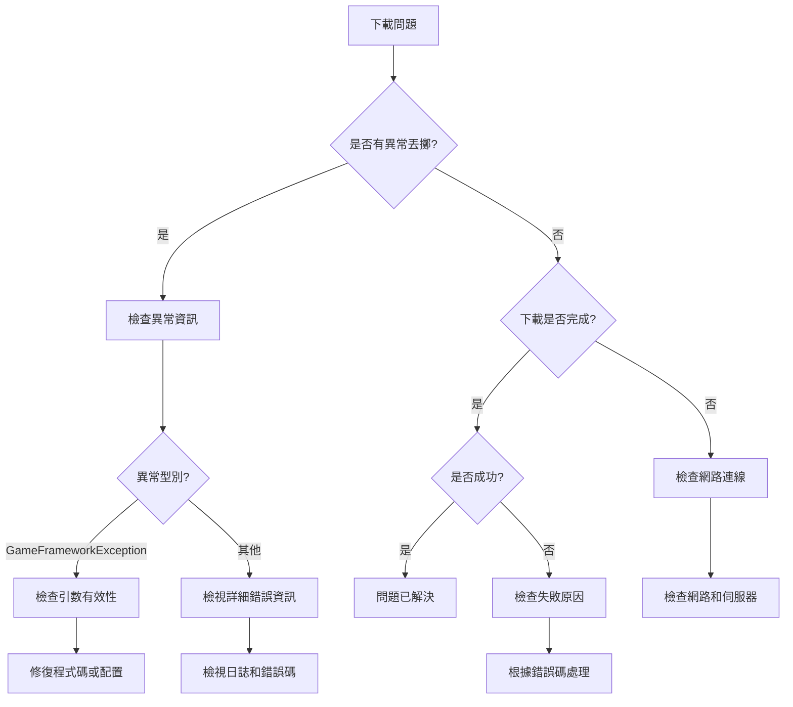

# 常見問題

本文件收集了使用 GameFrameX Download 下載組件過程中可能遇到的常見問題及其解決方案。

## 概述

Download 組件是 GameFrameX 框架中負責處理下載任務的核心組件。在實際使用過程中，可能因為配置不當、依賴缺失或網路環境等因素遇到各種問題。本文件旨在幫助開發者快速定位和解決這些問題。

## 初始化問題

### 問題：遊戲啟動時提示 "Download manager is invalid"

**錯誤資訊：**
```
Log.Fatal("Download manager is invalid.");
```

**原因分析：**
DownloadComponent 依賴 IDownloadManager 模組，但該模組未能正確註冊到 GameFramework 系統中。

**解決方案：**
1. 確保 DownloadManager 模組已正確註冊。檢查是否在啟動時呼叫了相關的模組註冊程式碼。
2. 確認 GameFrameworkEntry 能夠正確解析 IDownloadManager 介面。

---

### 問題：遊戲啟動時提示 "Event component is invalid"

**錯誤資訊：**
```
Log.Fatal("Event component is invalid.");
```

**原因分析：**
DownloadComponent 依賴 EventComponent 進行事件分發，但 EventComponent 未正確初始化。

**解決方案：**
1. 確保場景中存在 EventComponent。
2. EventComponent 必須在 DownloadComponent 之前初始化。
3. 有關 EventComponent 的詳細資訊，請參閱 [Event 組件文件](https://github.com/GameFrameX/com.gameframex.unity.event)。

---

### 問題：提示 "Can not create download agent helper"

**錯誤資訊：**
```
Log.Error("Can not create download agent helper.");
```

**原因分析：**
無法根據配置的型別名稱建立下載代理輔助器例項。

**解決方案：**
1. 檢查 DownloadComponent 的 `DownloadAgentHelperTypeName` 欄位配置是否正確。
2. 預設值應為 `UnityGameFramework.Runtime.UnityWebRequestDownloadAgentHelper`。
3. 如果使用自定義下載代理輔助器，確保型別名稱與程式集中的完全限定名一致。

---

## API 使用問題

### 問題：呼叫 AddDownload 時丟擲異常 "Download path is invalid"

**錯誤資訊：**
```
GameFrameworkException: Download path is invalid.
```

**原因分析：**
傳遞給 AddDownload 方法的 downloadPath 引數為空或 null。

**解決方案：**
確保 downloadPath 引數有效：
```csharp
// 錯誤示例
int id = downloadComponent.AddDownload("", "http://example.com/file.zip");

// 正確示例
int id = downloadComponent.AddDownload(Application.persistentDataPath + "/file.zip", "http://example.com/file.zip");
```

> Source: [DownloadManager.cs](https://github.com/GameFrameX/com.gameframex.unity.download/blob/main/Runtime/Download/Download/DownloadManager.cs#L338-L341)

---

### 問題：呼叫 AddDownload 時丟擲異常 "Download uri is invalid"

**錯誤資訊：**
```
GameFrameworkException: Download uri is invalid.
```

**原因分析：**
傳遞給 AddDownload 方法的 downloadUri 引數為空或 null。

**解決方案：**
確保 downloadUri 引數有效：
```csharp
// 錯誤示例
int id = downloadComponent.AddDownload(Application.persistentDataPath + "/file.zip", "");

// 正確示例
int id = downloadComponent.AddDownload(Application.persistentDataPath + "/file.zip", "http://example.com/file.zip");
```

> Source: [DownloadManager.cs](https://github.com/GameFrameX/com.gameframex.unity.download/blob/main/Runtime/Download/Download/DownloadManager.cs#L343-L346)

---

### 問題：呼叫 AddDownload 時丟擲異常 "You must add download agent first"

**錯誤資訊：**
```
GameFrameworkException: You must add download agent first.
```

**原因分析：**
在新增任何下載任務之前，必須先新增至少一個下載代理輔助器。

**解決方案：**
1. DownloadComponent 會在 Start 方法中自動建立指定數量的代理輔助器。
2. 確保 DownloadComponent 已正確新增到場景中。
3. 檢查 `DownloadAgentHelperCount` 屬性是否大於 0（預設為 3）。

```csharp
// 在 DownloadComponent Inspector 中設定
[SerializeField] private int m_DownloadAgentHelperCount = 3;
```

> Source: [DownloadManager.cs](https://github.com/GameFrameX/com.gameframex.unity.download/blob/main/Runtime/Download/Download/DownloadManager.cs#L348-L351)

---

## 網路與下載問題

### 問題：下載失敗，提示 "Timeout"

**錯誤資訊：**
```
Download failure, download serial id '0', download path '...', download uri '...', error message 'Timeout'.
```

**原因分析：**
下載請求在指定超時時間內未完成。預設超時時間為 30 秒。

**解決方案：**
1. 增加超時時間設定：
```csharp
// 設定超時時間為 120 秒
downloadComponent.Timeout = 120f;
```

2. 檢查網路連線是否穩定。

3. 確認伺服器響應時間是否正常，可以嘗試使用瀏覽器或其他工具訪問下載連結。

4. 如果是大型檔案下載，考慮調整超時時間或實現斷點續傳。

---

### 問題：下載時出現網路錯誤

**錯誤資訊：**
```
error: "Network error"
```

**原因分析：**
UnityWebRequest 檢測到網路層面的錯誤，可能是以下原因：
- 網路連線中斷
- DNS 解析失敗
- 無法建立連線

**解決方案：**
1. 檢查裝置網路連線狀態。
2. 確認下載 URL 是否可訪問。
3. 如果在移動裝置上測試，確保已新增網路許可權（Android: INTERNET, ACCESS_NETWORK_STATE; iOS: NSAppTransportSecurity）。
4. 檢視裝置日誌獲取更詳細的錯誤資訊。

---

### 問題：下載時出現 HTTP 錯誤

**錯誤資訊：**
```
error: "HTTP Error 404"
error: "HTTP Error 500"
```

**原因分析：**
伺服器返回了錯誤狀態碼，常見狀態碼包括：
- 404: 檔案不存在
- 500: 伺服器內部錯誤
- 502: 閘道器錯誤
- 503: 服務不可用

**解決方案：**
1. 確認下載連結是否正確。
2. 檢查伺服器端的檔案是否存在。
3. 如果是 API 請求，檢查 API 介面是否正確。
4. 檢視伺服器日誌以獲取更多錯誤詳情。

---

### 問題：斷點續傳不生效

**原因分析：**
斷點續傳功能依賴於伺服器支援 HTTP Range 頭。

**解決方案：**
1. 確認伺服器是否支援斷點續傳（HTTP 206 狀態碼）。
2. 檢查 FlushSize 配置，確保檔案寫入邏輯正常：
```csharp
// 設定寫入磁碟的臨界大小（預設為 1MB）
downloadComponent.FlushSize = 1024 * 1024;
```

3. 確保下載目錄有足夠的磁碟空間。

---

## 檔案系統問題

### 問題：下載檔案寫入失敗

**原因分析：**
- 磁碟空間不足
- 寫入路徑無許可權
- 目錄不存在

**解決方案：**
1. 確保目標目錄存在：
```csharp
string directory = Path.GetDirectoryName(downloadPath);
if (!Directory.Exists(directory))
{
    Directory.CreateDirectory(directory);
}
```

2. 檢查磁碟剩餘空間。

3. 檢查應用程式的寫入許可權。

4. 在 Android 上，注意使用 Application.persistentDataPath 而非 Application.dataPath。

---

## 事件訂閱問題

### 問題：無法接收下載事件

**原因分析：**
未正確訂閱 DownloadComponent 或 DownloadManager 的事件。

**解決方案：**
正確訂閱事件的方式：
```csharp
// 透過 EventComponent 訂閱
var eventComponent = GameEntry.GetComponent<EventComponent>();
eventComponent.Subscribe(DownloadSuccessEventArgs.EventId, OnDownloadSuccess);
eventComponent.Subscribe(DownloadFailureEventArgs.EventId, OnDownloadFailure);

// 回呼處理
private void OnDownloadSuccess(object sender, GameEventArgs e)
{
    var ne = (DownloadSuccessEventArgs)e;
    Debug.Log($"Download success: {ne.DownloadPath}");
}

private void OnDownloadFailure(object sender, GameEventArgs e)
{
    var ne = (DownloadFailureEventArgs)e;
    Debug.Log($"Download failed: {ne.ErrorMessage}");
}
```

> Source: [README.md](https://github.com/GameFrameX/com.gameframex.unity.download/blob/main/README.md#L94-L106)

---

### 問題：Task 返回 null

**原因資訊：**
Download 方法返回 null 而不是 Task 物件。

**原因分析：**
在 Download 方法中，如果 serialId 不在 m_Downloads 字典中，會返回 null。

**解決方案：**
確保使用正確的序列 ID：
```csharp
// 使用 AddDownload 返回的 serialId
int serialId = downloadComponent.AddDownload(downloadPath, downloadUri);

// 等待下載完成
var task = downloadComponent.Download(downloadPath, downloadUri);
if (task != null)
{
    bool success = await task;
}
```

> Source: [DownloadComponent.cs](https://github.com/GameFrameX/com.gameframex.unity.download/blob/main/Runtime/Download/DownloadComponent.cs#L273-L282)

---

## 配置問題

### 問題：下載速度過慢

**可能原因：**
- 代理數量不足
- 超時時間設定過短
- 網路頻寬限制

**解決方案：**
1. 增加下載代理數量：
```csharp
// 在 Inspector 中設定更高的 DownloadAgentHelperCount
// 建議值：3-5 個代理
```

2. 調整超時時間：
```csharp
downloadComponent.Timeout = 60f; // 增加到 60 秒
```

3. 調整 FlushSize：
```csharp
// 增加寫入緩衝區大小可以提升大檔案下載效能
downloadComponent.FlushSize = 2 * 1024 * 1024; // 2MB
```

---

### 問題：無法建立自定義下載代理輔助器

**原因分析：**
自定義下載代理輔助器型別未正確註冊或程式集未包含。

**解決方案：**
1. 確保自定義輔助器繼承自 DownloadAgentHelperBase：
```csharp
public class CustomDownloadAgentHelper : DownloadAgentHelperBase
{
    // 實現必要的方法
}
```

2. 在 DownloadComponent Inspector 中設定正確的型別名稱：
```
DownloadAgentHelperTypeName: "YourNamespace.CustomDownloadAgentHelper"
```

3. 確保程式集已正確新增到 Unity 專案的 Assembly Definition 中。

---

## 除錯技巧

### 啟用詳細日誌

在開發階段，可以啟用詳細的除錯日誌來幫助定位問題：

```csharp
// 訂閱所有下載事件以監控狀態
downloadComponent.DownloadStart += (s, e) => Debug.Log($"Start: {e.DownloadUri}");
downloadComponent.DownloadUpdate += (s, e) => Debug.Log($"Progress: {e.CurrentLength}");
downloadComponent.DownloadSuccess += (s, e) => Debug.Log($"Success: {e.DownloadPath}");
downloadComponent.DownloadFailure += (s, e) => Debug.Log($"Failure: {e.ErrorMessage}");
```

### 檢查下載狀態

使用 DownloadComponent 提供的方法檢查當前下載狀態：

```csharp
// 獲取等待下載任務數量
int waitingCount = downloadComponent.WaitingTaskCount;

// 獲取工作中代理數量
int workingCount = downloadComponent.WorkingAgentCount;

// 獲取可用代理數量
int freeCount = downloadComponent.FreeAgentCount;

// 獲取當前下載速度
float speed = downloadComponent.CurrentSpeed;
```

### 獲取任務資訊

```csharp
// 根據序列編號獲取下載任務資訊
var info = downloadComponent.GetDownloadInfo(serialId);

// 根據標籤獲取下載任務資訊
var infos = downloadComponent.GetDownloadInfos("myTag");

// 獲取所有下載任務資訊
var allInfos = downloadComponent.GetAllDownloadInfos();
```

---

## 診斷流程圖



---

## 相關連結

- [外掛介紹](./1-overview.introduction)
- [功能特性](./1-overview.features)
- [安裝](./2-installation)
- [基礎配置](./3-getting-started.basic-setup)
- [首個示例](./3-getting-started.first-example)
- [架構概述](./4-core-concepts.architecture)
- [DownloadComponent](./4-core-concepts.download-component)
- [下載代理](./4-core-concepts.download-agent)
- [API 參考 - 屬性](./5-api-reference.properties)
- [API 參考 - 方法](./5-api-reference.methods)
- [下載事件](./6-events.download-events)
- [代理事件](./6-events.agent-events)
- [編輯器配置](./7-configuration.editor-configuration)
- [下載代理配置](./7-configuration.agent-configuration)
