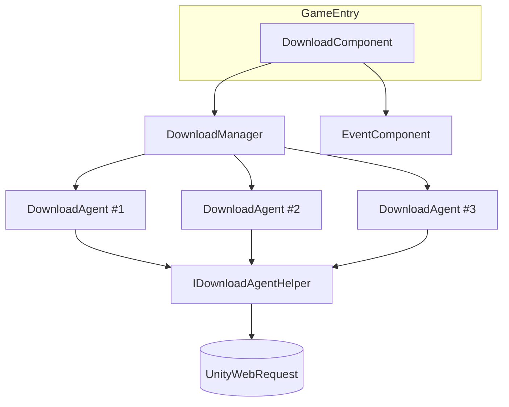

# 下載元件簡介

GameFrameX 下載元件是 Unity 下的多代理下載管理器，負責並行檔案下載、優先順序佇列排程、暫停/恢復、即時速度回報與事件回呼。它以 `DownloadComponent`（掛載在 `GameEntry` 上）作為對外入口，內部封裝 `DownloadManager` 與可插拔的下載代理助理（`IDownloadAgentHelper`），適合用於資源包、熱更新檔案、修補檔等需要寫入本機磁碟的下載場景。

## 快速開始

1. **安裝元件**：在 `Packages/manifest.json` 中新增 Scoped Registry 與相依套件：

   ```json
   {
     "scopedRegistries": [
       {
         "name": "GameFrameX",
         "url": "https://gameframex.upm.alianblank.uk",
         "scopes": ["com.gameframex"]
       }
     ],
     "dependencies": {
       "com.gameframex.unity.download": "1.1.2"
     }
   }
   ```

   Source: [README.zh-CN.md](https://github.com/GameFrameX/com.gameframex.unity.download/blob/main/README.zh-CN.md#L68-L84)

2. **取得元件實例**：透過框架入口取得 `DownloadComponent`：

   ```csharp
   var downloadComponent = GameEntry.GetComponent<DownloadComponent>();
   ```

   Source: [DownloadComponent.cs](https://github.com/GameFrameX/com.gameframex.unity.download/blob/main/Runtime/Download/DownloadComponent.cs#L46-L60)

3. **新增一個下載任務**（非同步方式）：

   ```csharp
   bool success = await downloadComponent.Download(
       "/本地儲存路徑/file.zip",
       "https://example.com/file.zip"
   );
   ```

   Source: [README.zh-CN.md](https://github.com/GameFrameX/com.gameframex.unity.download/blob/main/README.zh-CN.md#L131-L143)

4. **或使用事件驅動方式**：

   ```csharp
   var eventComponent = GameEntry.GetComponent<EventComponent>();
   eventComponent.Subscribe(DownloadSuccessEventArgs.EventId, OnDownloadSuccess);
   eventComponent.Subscribe(DownloadFailureEventArgs.EventId, OnDownloadFailure);

   int serialId = downloadComponent.AddDownload(
       "/本地儲存路徑/file.zip",
       "https://example.com/file.zip"
   );
   ```

   Source: [README.zh-CN.md](https://github.com/GameFrameX/com.gameframex.unity.download/blob/main/README.zh-CN.md#L96-L127)

5. **依標籤分組與暫停/恢復**：

   ```csharp
   int id = downloadComponent.AddDownload(path, uri, tag: "assets", priority: 10);
   downloadComponent.GetDownloadInfos("assets");
   downloadComponent.RemoveDownloads("assets");

   downloadComponent.Paused = true;   // 暫停全部
   downloadComponent.Paused = false;  // 恢復
   ```

   Source: [README.zh-CN.md](https://github.com/GameFrameX/com.gameframex.unity.download/blob/main/README.zh-CN.md#L145-L167)

## 運作原理速覽

元件對外僅暴露 `DownloadComponent`，內部由三類物件協作：



- `DownloadComponent` 負責參數（代理數、逾時、`FlushSize`、助理類型）並轉發呼叫。
- `DownloadManager` 維護任務佇列與代理池，依優先順序派發任務。
- `IDownloadAgentHelper` 是真正發送網路請求的抽象，預設實作為 `UnityWebRequestDownloadAgentHelper`，可在 Inspector 中替換或自訂。
- 完成/失敗會透過事件匯流排廣播給訂閱者。

Source: [DownloadComponent.cs](https://github.com/GameFrameX/com.gameframex.unity.download/blob/main/Runtime/Download/DownloadComponent.cs#L46-L80)

## 核心特性速覽

| 特性 | 說明 |
|------|------|
| 多代理並行 | 預設 3 個下載代理並行，可透過 Inspector 修改 |
| 優先順序排程 | 數值越大越優先派發 |
| 標籤分組 | 支援依 tag 新增、查詢、移除任務 |
| 暫停與恢復 | `Paused = true/false` 全域生效 |
| 逾時與磁碟寫入 | `Timeout`（預設 30 秒）與 `FlushSize`（預設 1 MB）支援斷點續傳 |
| 即時指標 | `CurrentSpeed`、`TotalAgentCount`、`WaitingTaskCount` |
| 事件驅動 | 透過 `EventComponent` 派發 `DownloadStart` / `DownloadUpdate` / `DownloadSuccess` / `DownloadFailure` |
| 非同步支援 | `Download()` 傳回 `Task<bool>`，可直接 await |
| 可插拔後端 | 內建 `UnityWebRequestDownloadAgentHelper`，也可實作 `IDownloadAgentHelper` |

Source: [README.zh-CN.md](https://github.com/GameFrameX/com.gameframex.unity.download/blob/main/README.zh-CN.md#L28-L38)

## 接下來

- 關於如何新增下載任務並處理結果，見《如何發起一次下載》。
- 關於依標籤管理任務，見《如何使用標籤分組管理下載》。
- 關於暫停/恢復、修改逾時與磁碟寫入臨界值，見《如何設定下載元件》。
- 關於事件訂閱與非同步介面選擇，見《如何訂閱下載事件》。
- 關於更換或自訂下載後端，見《如何替換下載代理助理》。
- 關於下載失敗的疑難排解，見《下載失敗怎麼辦》。