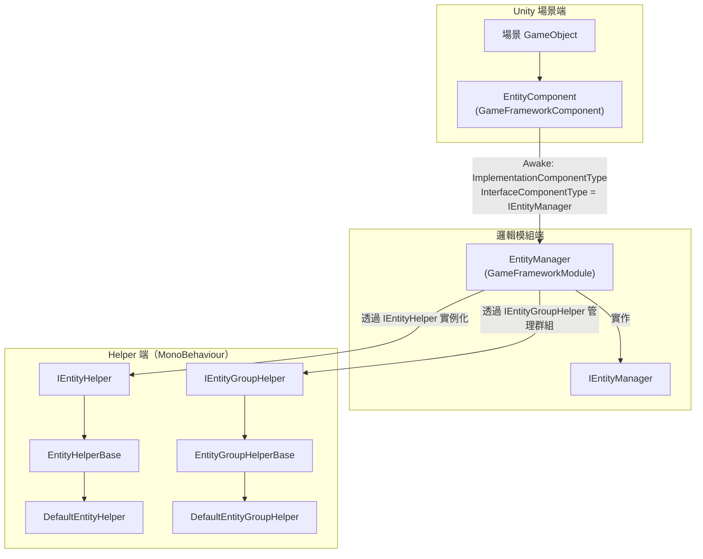

# 運作原理：Manager-Component-Helper 架構與實體生命週期

Entity 模組採用 GameFrameX 框架通用的 **Manager + Component + Helper** 三層架構：在 Unity 端，`EntityComponent` 是面向場景的入口點，持有邏輯端的 `EntityManager`，統一調度所有實體的生命週期（`Init → Show → Hide → Recycle`），並透過 `IEntityHelper` / `IEntityGroupHelper` 兩個 Helper 介面，將「如何建立 / 如何分組」的具體行為委派給可由使用者替換的實作。

## 三層概覽

| 層級 | 類型 | 命名空間 | 職責 |
|----|------|--------------|------|
| Component | `EntityComponent : GameFrameworkComponent` | `GameFrameX.Entity.Runtime` | 掛載到場景 GameObject 上作為框架模組入口點；在 `Awake` 中將 `IEntityManager` 實作類別綁定到框架；提供實體群組的註冊與取得 |
| Manager | `EntityManager : GameFrameworkModule, IEntityManager` | `GameFrameX.Entity.Runtime` | 屬部分類別（partial class）且為純邏輯模組。負責實體 / 實體群組字典、狀態機推進，以及 `ShowEntity` / `HideEntity` / `RecycleEntity` 等主要流程 |
| Helper | `IEntityHelper` / `IEntityGroupHelper` 及其對應的 `*Base`、`Default*` 實作 | `GameFrameX.Entity.Runtime` | 由使用者提供或框架預設提供的 `MonoBehaviour`：Helper 決定「如何實例化實體 / 實體要附加到哪個群組」 |

## 快速開始（讓模組運行起來）

1. 在場景中建立一個空的 GameObject 並掛上 `EntityComponent`（可在 Inspector 中透過 Add Component → GameFrameX/Entity 找到）。
2. 讓某個 `MonoBehaviour` 繼承 `EntityHelperBase` 作為實體 Helper，或直接使用內建的 `DefaultEntityHelper`。
3. 讓某個 `MonoBehaviour` 繼承 `EntityGroupHelperBase` 作為實體群組 Helper，或直接使用內建的 `DefaultEntityGroupHelper`。
4. 遊戲啟動時，透過 `GameEntry.GetComponent<EntityComponent>()` 取得該元件，呼叫 `AddEntityGroup(...)` 註冊若干群組，再呼叫 `ShowEntity` 建立實例。

原始碼入口：[EntityComponent.cs](https://github.com/GameFrameX/com.gameframex.unity.entity/blob/main/Runtime/Entity/EntityComponent.cs#L100-L120)

## Manager-Component-Helper 之間的關係



- 啟動時：`EntityComponent.Awake()` 在原始碼檔案中設定 `InterfaceComponentType = typeof(IEntityManager)` 與 `ImplementationComponentType = Utility.Assembly.GetType(componentType)`，框架會將其組裝為 `IEntityManager` 以供全域存取。

原始碼：[EntityComponent.cs](https://github.com/GameFrameX/com.gameframex.unity.entity/blob/main/Runtime/Entity/EntityComponent.cs)

## 實體生命週期

實體從建立到銷毀的整個過程，由 `EntityStatus` 狀態機驅動推進；該列舉定義於 `Entity/EntityManager.EntityStatus.cs`：

| 狀態 | 含義 | 觸發的動作 |
|------|------|----------|
| `Unknown` | 預設佔位 | — |
| `WillInit` | 即將初始化 | Manager 準備資源並呼叫 Helper |
| `Inited` | 已初始化 | 資源就緒，觸發 `OnInit` 回呼 |
| `WillShow` | 即將顯示 | 呼叫 Helper 的 `CreateEntity` |
| `Showed` | 已顯示，在場景中作用 | 觸發 `OnShow` 回呼 |
| `WillHide` | 即將隱藏 | 準備回收顯示 |
| `Hidden` | 已隱藏，保留實例 | 觸發 `OnHide` 回呼 |
| `WillRecycle` | 即將回收 | 參考計數降至零 |
| `Recycled` | 已回收，可重複使用或可銷毀 | 觸發 `OnRecycle` 回呼 |

原始碼：[EntityManager.EntityStatus.cs](https://github.com/GameFrameX/com.gameframex.unity.entity/blob/main/Runtime/Entity/Entity/EntityManager.EntityStatus.cs#L38-L52)

### 狀態推進的四個步驟

Manager 透過 `ShowEntity` / `HideEntity` 主要入口按順序推進上述狀態，並將每一步委派給 Helper：

1. **Init**：`InstantiateEntity(entityAsset)` — `IEntityHelper` 在對應的群組容器中實例化實體。
2. **Show**：`CreateEntity(entityInstance, entityGroup, userData)` — Helper 建構 `IEntity`，設定 Transform 與父節點。
3. **Hide**：`EntityManager.Hide*` 流程讓實體經歷 `Showed → WillHide → Hidden`，實例保留在群組中等待重複使用。
4. **Recycle**：`ReleaseEntity(entityAsset, entityInstance)` — Helper 將其銷毀或歸還至物件池。

`IEntityHelper` 的介面定義：

```csharp
public interface IEntityHelper
{
    object InstantiateEntity(object entityAsset);
    IEntity CreateEntity(object entityInstance, IEntityGroup entityGroup, object userData);
    void ReleaseEntity(object entityAsset, object entityInstance);
}
```

原始碼：[IEntityHelper.cs](https://github.com/GameFrameX/com.gameframex.unity.entity/blob/main/Runtime/Entity/Entity/IEntityHelper.cs#L37-L61)

## Helper 替換要點

| 介面 | 預設實作 | 需替換為自訂 Helper 的情境 |
|------|----------|--------------------------|
| `IEntityHelper` | `DefaultEntityHelper : EntityHelperBase` | 當你想使用 Addressables、物件池或自訂預載入策略時，繼承 `EntityHelperBase` |
| `IEntityGroupHelper` | `DefaultEntityGroupHelper : EntityGroupHelperBase` | 當你想將實體附加到不同父節點，或以分層 LOD / 分割畫面方式顯示時，繼承 `EntityGroupHelperBase` |

兩個 Helper 抽象類別皆繼承自 `MonoBehaviour`，因此你可以將它們綁定到 Inspector 中的任意 GameObject；Manager 呼叫它們時，會透過介面取得其實例。

原始碼：[EntityHelperBase.cs](https://github.com/GameFrameX/com.gameframex.unity.entity/blob/main/Runtime/Entity/EntityHelperBase.cs#L38-L40), [EntityGroupHelperBase.cs](https://github.com/GameFrameX/com.gameframex.unity.entity/blob/main/Runtime/Entity/EntityGroupHelperBase.cs#L38-L40)

## 下一步

- 若要新增實體群組並顯示實體，請參閱「How To：註冊實體群組與 ShowEntity」。
- 如果 `ShowEntity` 擲出 `Entity ... is not inited` 或類似錯誤，請參閱「實體生命週期例外怎麼辦」。
- 如需公開 API 的方法簽章與預設值，請參閱「實體模組 API 快速參考」。