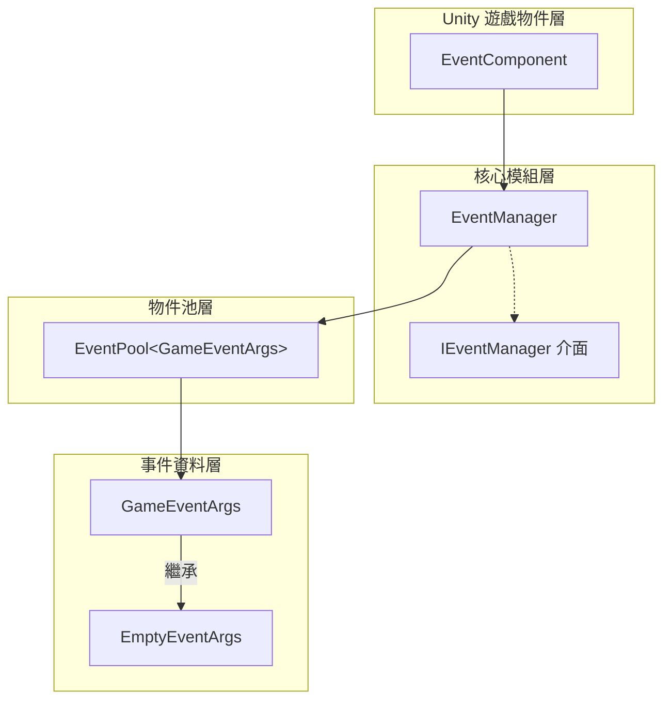
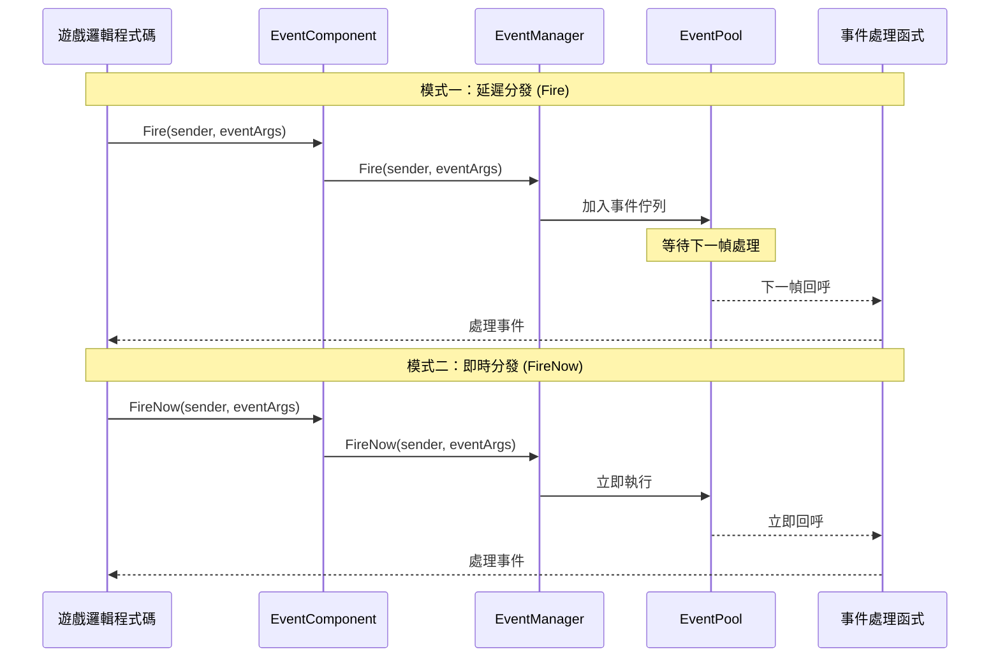
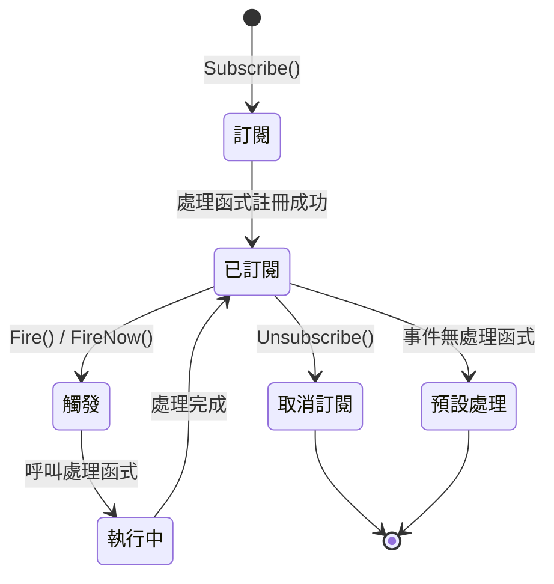

# 外掛介紹

GameFrameX Event 外掛是 GameFrameX 遊戲框架的核心組件之一，提供了一套完整的遊戲事件系統解決方案。該外掛實現了觀察者模式（Observer Pattern），允許遊戲物件之間進行松耦合的通訊，是構建事件驅動型遊戲架構的理想選擇。

## 概述

GameFrameX Event 事件系統組件是一個輕量級、高效能的 Unity 事件管理框架，專為遊戲開發設計。它解決了傳統 Unity 事件系統（如 UnityEvent、SendMessage）的諸多侷限性，提供了更加強大和靈活的事件處理能力。

該事件系統的核心設計理念是將事件的**傳送者**與**接收者**解耦，使得遊戲各個模組之間不需要直接引用彼此，透過事件進行通訊。這種設計模式極大地提高了程式碼的可維護性和可擴充套件性，特別適合大型遊戲專案的開發。

### 核心特性

| 特性 | 說明 |
|------|------|
| **執行緒安全** | 支援在後臺執行緒觸發事件，自動在主執行緒回呼處理函式 |
| **延遲分發** | Fire() 方法將事件分發延遲到下一幀，避免效能抖動 |
| **即時分發** | FireNow() 方法支援立即事件分發，適用於實時響應場景 |
| **物件池** | 內部使用物件池技術，減少記憶體分配和 GC 壓力 |
| **預設處理器** | 支援設定預設事件處理函式，捕獲未明確訂閱的事件 |
| **多重訂閱** | 允許同一事件 ID 繫結多個處理函式 |

### 事件系統架構

GameFrameX Event 事件系統由多個核心組件構成，每個組件都有明確的職責分工：



**架構說明：**

- **EventComponent**：作為 Unity 組件存在，提供給遊戲指令碼直接呼叫的公共 API，是事件系統與遊戲程式碼的橋樑。它繼承自 `GameFrameworkComponent`，遵循 GameFrameX 框架的組件規範。

- **EventManager**：事件系統的核心模組，繼承自 `GameFrameworkModule`，實現了 `IEventManager` 介面。負責管理所有事件的訂閱、取消訂閱和分發邏輯。

- **EventPool**：內部使用的事件池實現，負責事件物件的獲取和回收，有效減少遊戲執行時的記憶體分配。

- **GameEventArgs**：所有遊戲事件的基類，開發者需要繼承此類來建立自定義事件型別。

- **EmptyEventArgs**：預置的簡單事件類，僅包含事件 ID，適用於不需要攜帶額外資料的場景。

## 事件流轉機制

### 事件分發模式

GameFrameX Event 提供了兩種事件分發模式，以滿足不同場景的需求：



**延遲分發（Fire）特點：**
- 事件被加入佇列，在下一幀統一處理
- 完全執行緒安全，可在任意執行緒呼叫
- 適用於大多數遊戲邏輯事件
- 可避免在某一幀產生效能高峰

**即時分發（FireNow）特點：**
- 事件立即分發，同步執行所有處理函式
- 非執行緒安全，必須在主執行緒呼叫
- 適用於需要立即響應的事件
- 適合處理遊戲中的即時反饋

### 事件生命週期



## 快速使用示例

### 基本訂閱與觸發

```csharp
// 1. 定義自定義事件類
public class PlayerDeadEventArgs : GameEventArgs
{
    public int PlayerId { get; set; }
    public string Reason { get; set; }
}

// 2. 獲取 EventComponent 組件引用
var eventComponent = UnityEngine.GameObject.Find("GameRoot").GetComponent<EventComponent>();

// 3. 訂閱事件
eventComponent.CheckSubscribe("player_dead", OnPlayerDead);

// 4. 定義事件處理函式
private void OnPlayerDead(object sender, GameEventArgs e)
{
    var args = (PlayerDeadEventArgs)e;
    UnityEngine.Debug.Log($"玩家 {args.PlayerId} 死亡，原因：{args.Reason}");
}

// 5. 觸發事件
eventComponent.Fire(this, new PlayerDeadEventArgs 
{ 
    PlayerId = 1001, 
    Reason = "被怪物擊殺" 
});
```

> Source: [Runtime/EventComponent.cs](https://github.com/GameFrameX/com.gameframex.unity.event/blob/main/Runtime/EventComponent.cs#L90-L99)

### 使用空事件

```csharp
// 觸發一個不帶資料的簡單事件
eventComponent.Fire(this, "game_start");
```

> Source: [Runtime/EventComponent.cs](https://github.com/GameFrameX/com.gameframex.unity.event/blob/main/Runtime/EventComponent.cs#L140-L144)

### 檢查與取消訂閱

```csharp
// 檢查事件處理函式是否存在
bool exists = eventComponent.Check("player_dead", OnPlayerDead);

// 取消訂閱
eventComponent.Unsubscribe("player_dead", OnPlayerDead);
```

> Source: [Runtime/EventComponent.cs](https://github.com/GameFrameX/com.gameframex.unity.event/blob/main/Runtime/EventComponent.cs#L72-L75)

## 事件系統設計優勢

### 相比 Unity 原生事件系統的優勢

| 特性 | UnityEvent / SendMessage | GameFrameX Event |
|------|-------------------------|------------------|
| 效能 | 較差，有反射開銷 | 高效能，無反射 |
| 型別安全 | 弱型別 | 強型別 |
| 執行緒安全 | 不支援 | 支援 |
| 物件池 | 不支援 | 支援 |
| 泛型支援 | 不支援 | 支援 |

### 典型應用場景

1. **UI 與遊戲邏輯解耦**：遊戲資料變化時，透過事件通知 UI 層更新，無需 UI 直接引用遊戲邏輯程式碼

2. **模組間通訊**：不同遊戲模組（如揹包系統、任務系統、成就係統）之間透過事件進行通訊，降低模組間耦合度

3. **外掛系統**：遊戲外掛或擴充套件模組可以透過訂閱事件來響應遊戲事件，無需修改核心程式碼

4. **除錯與日誌**：透過訂閱全域性事件，可以實現遊戲行為的監控和日誌記錄

## 技術實現細節

### 核心類說明

**EventComponent 類**

EventComponent 是事件系統在 Unity 中的入口點，它繼承自 `GameFrameworkComponent`，在 `Awake()` 方法中初始化 EventManager 模組：

```csharp
protected override void Awake()
{
    ImplementationComponentType = Utility.Assembly.GetType(componentType);
    InterfaceComponentType = typeof(IEventManager);
    base.Awake();
    m_EventManager = GameFrameworkEntry.GetModule<IEventManager>();
}
```

> Source: [Runtime/EventComponent.cs](https://github.com/GameFrameX/com.gameframex.unity.event/blob/main/Runtime/EventComponent.cs#L43-L54)

**EventManager 類**

EventManager 實現了 `IEventManager` 介面，內部使用 `EventPool<GameEventArgs>` 進行事件管理：

```csharp
public EventManager()
{
    m_EventPool = new EventPool<GameEventArgs>(EventPoolMode.AllowNoHandler | EventPoolMode.AllowMultiHandler);
}
```

> Source: [Runtime/Event/EventManager.cs](https://github.com/GameFrameX/com.gameframex.unity.event/blob/main/Runtime/Event/EventManager.cs#L24-L27)

**CheckSubscribe 方法**

該方法實現了「檢查訂閱」模式，如果事件處理函式不存在則自動訂閱：

```csharp
public void CheckSubscribe(string id, EventHandler<GameEventArgs> handler)
{
    if (!Check(id, handler))
    {
        m_EventManager.Subscribe(id, handler);
    }
}
```

> Source: [Runtime/EventComponent.cs](https://github.com/GameFrameX/com.gameframex.unity.event/blob/main/Runtime/EventComponent.cs#L82-L88)

這種設計避免了重複訂閱導致的重複呼叫問題，簡化了開發者的使用邏輯。

## 相關連結

- [安裝方式](./02.installation.md) - 瞭解如何安裝和配置外掛
- [快速入門](./03.getting-started.md) - 快速開始使用事件系統
- [事件系統架構](./04.features.md) - 深入瞭解事件系統架構設計
- [EventComponent API 參考](./05.event-component.md) - 完整的 API 文件
- [EventManager API 參考](./06.event-manager.md) - 事件管理器 API 文件
- [GameEventArgs API 參考](./07.game-event-args.md) - 事件引數類 API 文件
