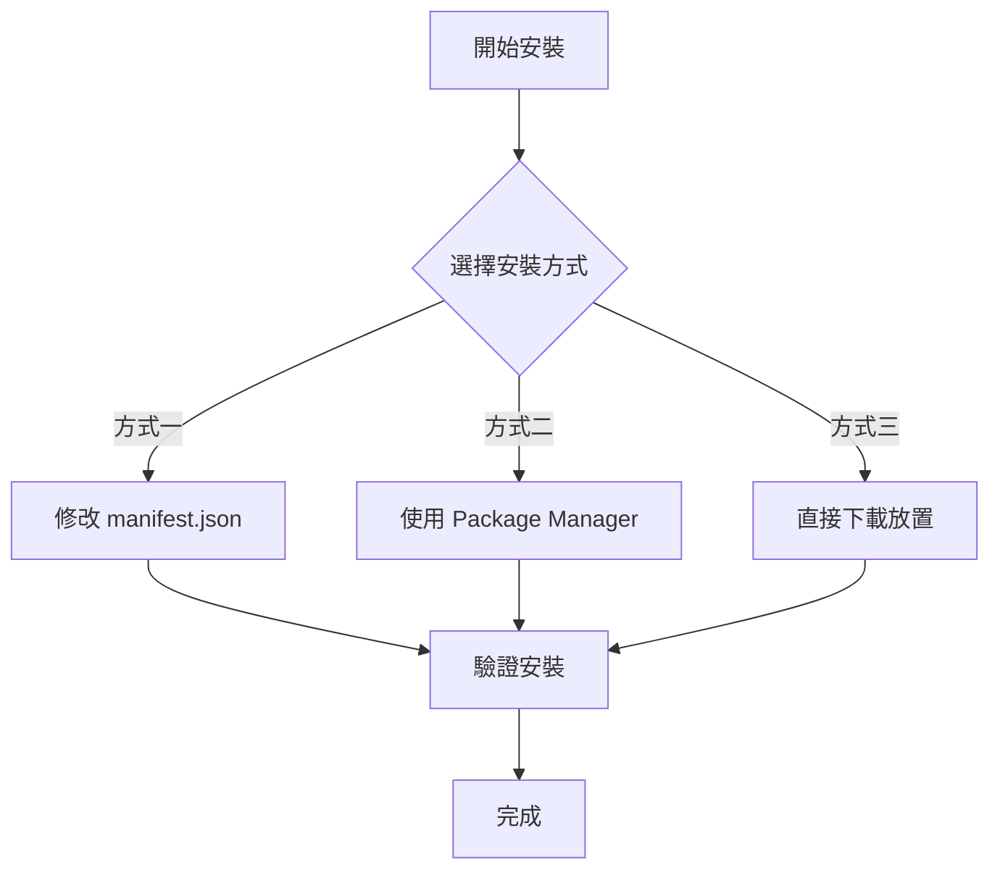
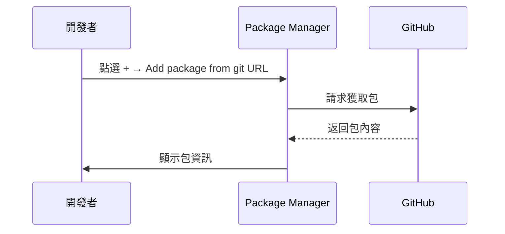

# 安裝方式

本文件介紹如何將 Game Frame X Event 事件系統組件安裝到您的 Unity 專案中。

## 概述

Game Frame X Event 是 Game Frame X 遊戲框架的事件系統組件，提供遊戲內事件的訂閱、派發和管理功能。該組件支援執行緒安全的非同步事件派發，適用於各種遊戲開發場景。

**包資訊：**
| 屬性 | 值 |
|------|-----|
| 包名 | com.gameframex.unity.event |
| 版本 | 1.1.0 |
| Unity 版本 | 2017.1+ |

## 安裝前準備

在開始安裝之前，請確保您的開發環境滿足以下要求：

- Unity 2017.1 或更高版本
- 已安裝 Git 工具（用於透過 Git URL 安裝）

## 安裝方式

Game Frame X Event 提供三種安裝方式，您可以根據專案需求選擇其中一種。



### 方式一：透過 manifest.json 安裝

這種方式適合需要將包作為專案依賴進行版本管理的場景。

1. 開啟 Unity 專案中的 `Packages` 資料夾
2. 找到並編輯 `manifest.json` 檔案
3. 在 `dependencies` 節點下新增以下內容：

```json
{
  "dependencies": {
    "com.gameframex.unity.event": "https://github.com/GameFrameX/com.gameframex.unity.event.git"
  }
}
```

4. 儲存檔案並等待 Unity 自動下載和匯入包

> **注意：** 這種方式會自動從 Git 倉庫獲取最新版本。如果需要指定版本，可以使用 Git 的版本標籤。

### 方式二：透過 Unity Package Manager 安裝

這是最常用的安裝方式，適合大多數專案。

1. 開啟 Unity 編輯器
2. 選擇選單 **Window → Package Manager**
3. 在 Package Manager 視窗中，點選左上角的 **+** 按鈕
4. 選擇 **Add package from git URL...**
5. 在輸入框中貼上以下地址：

```
https://github.com/GameFrameX/com.gameframex.unity.event.git
```

6. 點選 **Add** 按鈕開始安裝
7. 等待下載和匯入完成



### 方式三：直接下載放置

這種方式適合離線環境或需要自定義修改的場景。

1. 訪問 GitHub 倉庫：
   > https://github.com/GameFrameX/com.gameframex.unity.event.git

2. 點選 **Code** 按鈕，選擇 **Download ZIP** 下載原始碼
3. 解壓下載的 ZIP 檔案
4. 將解壓後的資料夾重新命名為 `com.gameframex.unity.event`
5. 將資料夾複製到 Unity 專案的 `Packages` 目錄中
6. Unity 會自動識別並載入該包

> **提示：** 放置後包資料夾中需要包含 `package.json` 檔案，Unity 才能正確識別。

## 安裝驗證

安裝完成後，可以透過以下方式驗證是否安裝成功：

### 方法一：檢查 Package Manager

開啟 **Window → Package Manager**，在列表中查詢 **Game Frame X Event**，確認其狀態為已安裝。

### 方法二：檢查指令碼引用

在專案中建立一個測試指令碼，嘗試引用 EventComponent：

```csharp
using GameFrameX.Event.Runtime;

// 確保 EventComponent 可以正常使用
public class TestScript : MonoBehaviour
{
    private EventComponent _eventComponent;
    
    void Start()
    {
        _eventComponent = GetComponent<EventComponent>();
        Debug.Log("Event 組件已成功安裝！");
    }
}
```

### 方法三：檢查程式集

確認專案中已載入以下程式集：
- `GameFrameX.Event.Runtime`
- `GameFrameX.Event.Editor`（如果在編輯器中使用）

## 依賴項說明

Game Frame X Event 組件依賴以下核心模組：

| 依賴模組 | 說明 |
|---------|------|
| GameFrameX.Runtime | 遊戲框架執行時核心 |

> **注意：** 如果您的專案中沒有安裝 GameFrameX.Runtime，需要先安裝該依賴項。EventComponent 繼承自 `GameFrameworkComponent`，需要框架核心支援。

## 常見問題

### Q1: 安裝後出現找不到 GameFrameworkComponent 的錯誤

這是因為缺少 GameFrameX.Runtime 核心模組。請先安裝遊戲框架的核心執行時組件，然後再安裝 Event 模組。

### Q2: 如何更新到最新版本

- **方式一/二**：刪除 manifest.json 中的對應條目後重新新增，或在 Package Manager 中點選更新按鈕
- **方式三**：重新下載最新版本並替換

### Q3: 支援哪些 Unity 版本

該組件支援 Unity 2017.1 及以上版本。建議使用較新的 LTS 版本以獲得最佳相容性。

## 相關連結

- [外掛介紹](./01.overview.md)
- [快速入門](./03.getting-started.md)
- [核心概念](./04.features.md)
- [GitHub 倉庫](https://github.com/GameFrameX/com.gameframex.unity.event.git)
- [官方網站](https://gameframex.doc.alianblank.com)
