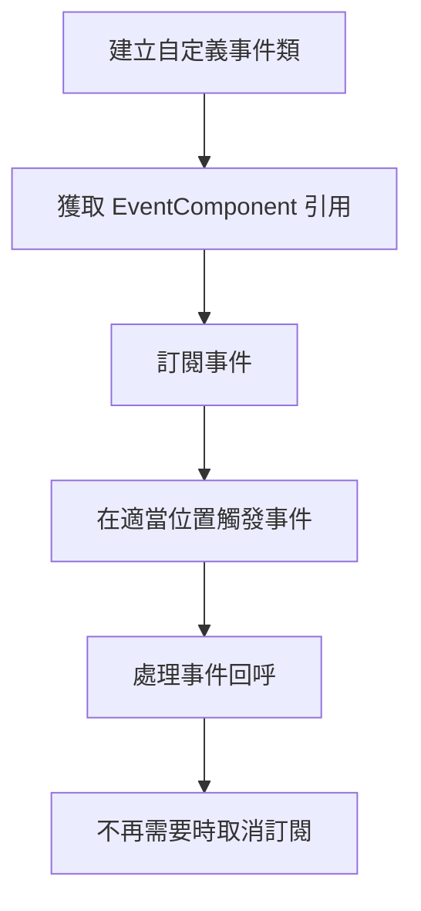

# 快速入門

本文件將幫助你快速上手 GameFrameX 事件系統。透過閱讀本指南，你將瞭解如何在 Unity 專案中配置和使用事件組件來實現遊戲中的事件驅動程式設計。

## 概述

GameFrameX 事件系統是一個輕量級的事件管理框架，採用觀察者模式實現，允許遊戲中的不同模組透過事件進行松耦合通訊。你可以使用字串作為事件識別符號來訂閱和處理事件。

## 前置條件

在使用事件系統之前，請確保：

1. Unity 2017.1 或更高版本
2. 已正確安裝 GameFrameX 核心框架
3. 已在專案中新增 Event 組件包

> **提示:** 有關安裝說明，請參閱 [安裝方式](./02.installation.md)。

## 基本使用流程

事件系統的典型使用流程如下：



## 第一步：建立自定義事件類

首先，需要定義一個繼承自 `GameEventArgs` 的事件引數類：

```csharp
using GameFrameX.Event.Runtime;

/// <summary>
/// 遊戲開始事件引數
/// </summary>
public class GameStartEventArgs : GameEventArgs
{
    /// <summary>
    /// 事件 ID 標識
    /// </summary>
    public override string Id => "game_start";

    /// <summary>
    /// 當前遊戲關卡
    /// </summary>
    public int CurrentLevel { get; set; }

    /// <summary>
    /// 玩家名稱
    /// </summary>
    public string PlayerName { get; set; }

    /// <summary>
    /// 清理事件資料
    /// </summary>
    public override void Clear()
    {
        CurrentLevel = 0;
        PlayerName = null;
    }
}
```

> Source: [GameEventArgs.cs](https://github.com/GameFrameX/com.gameframex.unity.event/blob/main/Runtime/EventArgs/GameEventArgs.cs#L12-L18)

## 第二步：在場景中新增 EventComponent

在 Unity 編輯器中，按照以下步驟新增事件組件：

1. 在場景中建立一個空遊戲物件（或選擇已有遊戲物件）
2. 點選 **Add Component** 按鈕
3. 搜尋 **Event** 組件
4. 選擇 **Game Framework → Event**

組件新增後，EventComponent 會自動初始化事件管理器。

## 第三步：訂閱事件

在需要監聽事件的指令碼中，訂閱相應的事件：

```csharp
using UnityEngine;
using GameFrameX.Event.Runtime;

/// <summary>
/// 遊戲管理器 - 負責遊戲生命週期管理
/// </summary>
public class GameManager : MonoBehaviour
{
    private EventComponent _eventComponent;

    private void Awake()
    {
        // 獲取事件組件引用
        _eventComponent = UnityEngine.GameObject.FindObjectOfType<EventComponent>();
    }

    private void OnEnable()
    {
        // 訂閱遊戲開始事件
        // CheckSubscribe 會在不存在時自動訂閱，避免重複訂閱
        _eventComponent.CheckSubscribe("game_start", OnGameStart);
    }

    private void OnDisable()
    {
        // 取消訂閱遊戲開始事件
        _eventComponent.Unsubscribe("game_start", OnGameStart);
    }

    /// <summary>
    /// 遊戲開始事件處理函式
    /// </summary>
    private void OnGameStart(object sender, GameEventArgs e)
    {
        if (e is GameStartEventArgs args)
        {
            Debug.Log($"遊戲開始！關卡：{args.CurrentLevel}, 玩家：{args.PlayerName}");
        }
    }
}
```

> Source: [EventComponent.cs](https://github.com/GameFrameX/com.gameframex.unity.event/blob/main/Runtime/EventComponent.cs#L82-L88)

## 第四步：觸發事件

當遊戲狀態發生變化時，觸發相應的事件：

```csharp
// 在遊戲的啟動流程中觸發事件
public class GameStarter : MonoBehaviour
{
    public EventComponent eventComponent;

    private void Start()
    {
        // 建立事件引數
        var eventArgs = new GameStartEventArgs
        {
            CurrentLevel = 1,
            PlayerName = "Player1"
        };

        // 觸發事件 - Fire 是執行緒安全的，會在下一幀分發
        eventComponent.Fire(this, eventArgs);

        // 或者使用 FireNow 立即分發（非執行緒安全）
        // eventComponent.FireNow(this, eventArgs);
    }
}
```

> Source: [EventComponent.cs](https://github.com/GameFrameX/com.gameframex.unity.event/blob/main/Runtime/EventComponent.cs#L130-L144)

## 事件分發模式

事件組件提供兩種事件分發方式：

| 模式 | 方法 | 執行緒安全 | 適用場景 |
|------|------|----------|----------|
| 延遲分發 | `Fire()` | ✅ 安全 | 大多數情況，推薦使用 |
| 立即分發 | `FireNow()` | ❌ 不安全 | 緊急事件或確定性要求高的情況 |

```csharp
// 延遲分發 - 事件會在下一幀處理
eventComponent.Fire(sender, new GameEventArgs());

// 立即分發 - 事件會立即處理
eventComponent.FireNow(sender, new GameEventArgs());
```

## 簡化事件用法

如果不需要傳遞複雜的事件資料，可以使用簡化的字串事件：

```csharp
// 觸發簡單事件
eventComponent.Fire(this, "player_dead");

// 在事件處理函式中接收
private void OnPlayerDead(object sender, GameEventArgs e)
{
    // e.Id 將包含 "player_dead"
    Debug.Log("玩家死亡！");
}
```

> Source: [EmptyEventArgs.cs](https://github.com/GameFrameX/com.gameframex.unity.event/blob/main/Runtime/EventArgs/EmptyEventArgs.cs#L32-L37)

## 完整示例：玩家死亡事件

以下是一個完整的示例，展示如何實現玩家死亡事件系統：

```csharp
using UnityEngine;
using GameFrameX.Event.Runtime;

/// <summary>
/// 玩家死亡事件引數
/// </summary>
public class PlayerDeadEventArgs : GameEventArgs
{
    public override string Id => "player_dead";
    public int PlayerId { get; set; }
    public string Reason { get; set; }
    public override void Clear()
    {
        PlayerId = 0;
        Reason = null;
    }
}

/// <summary>
/// 玩家控制器
/// </summary>
public class PlayerController : MonoBehaviour
{
    private EventComponent _eventComponent;
    private int _health = 100;

    private void Awake()
    {
        _eventComponent = FindObjectOfType<EventComponent>();
    }

    private void OnEnable()
    {
        _eventComponent.CheckSubscribe("player_dead", OnPlayerDead);
    }

    private void OnDisable()
    {
        _eventComponent.Unsubscribe("player_dead", OnPlayerDead);
    }

    /// <summary>
    /// 玩家受到傷害
    /// </summary>
    public void TakeDamage(int damage)
    {
        _health -= damage;
        
        if (_health <= 0)
        {
            // 觸發玩家死亡事件
            var args = new PlayerDeadEventArgs
            {
                PlayerId = GetInstanceID(),
                Reason = "生命值耗盡"
            };
            _eventComponent.Fire(this, args);
        }
    }

    private void OnPlayerDead(object sender, GameEventArgs e)
    {
        if (e is PlayerDeadEventArgs args)
        {
            Debug.Log($"玩家 {args.PlayerId} 已死亡，原因：{args.Reason}");
            // 這裡可以新增遊戲結束邏輯
        }
    }
}
```

## 預設事件處理函式

可以為事件組件設定預設處理器，用於捕獲未明確訂閱的事件：

```csharp
private void Start()
{
    var eventComponent = GetComponent<EventComponent>();
    eventComponent.SetDefaultHandler(OnUnhandledEvent);
}

private void OnUnhandledEvent(object sender, GameEventArgs e)
{
    Debug.Log($"未處理的事件：{e.Id}");
}
```

> Source: [EventComponent.cs](https://github.com/GameFrameX/com.gameframex.unity.event/blob/main/Runtime/EventComponent.cs#L120-L123)

## 事件統計

可以隨時獲取當前事件系統的狀態：

```csharp
// 獲取事件處理函式總數
int handlerCount = eventComponent.EventHandlerCount;

// 獲取事件型別總數
int eventCount = eventComponent.EventCount;

// 獲取特定事件的處理函式數量
int specificCount = eventComponent.Count("game_start");
```

> Source: [EventComponent.cs](https://github.com/GameFrameX/com.gameframex.unity.event/blob/main/Runtime/EventComponent.cs#L27-L38)

## 最佳實踐

1. **及時取消訂閱**: 在 `OnDisable` 或 `OnDestroy` 中取消訂閱事件，避免記憶體洩漏
2. **使用 CheckSubscribe**: 使用 `CheckSubscribe` 方法避免重複訂閱
3. **使用 Fire 而非 FireNow**: 除非有特殊需求，否則使用 `Fire` 方法確保執行緒安全
4. **清理事件資料**: 在自定義事件類中正確實現 `Clear()` 方法，便於物件池複用

## 相關連結

- [外掛介紹](./01.overview.md) - 瞭解更多關於事件系統的概述
- [安裝方式](./02.installation.md) - 檢視詳細的安裝說明
- [事件系統架構](./04.features.md) - 深入瞭解內部架構
- [EventComponent API 參考](./05.event-component.md) - 完整的 API 文件
- [EventManager API 參考](./06.event-manager.md) - 事件管理器 API
- [GameEventArgs API 參考](./07.game-event-args.md) - 事件引數基類
- [常見問題解答](./08.troubleshooting.md) - 常見問題與解決方案
