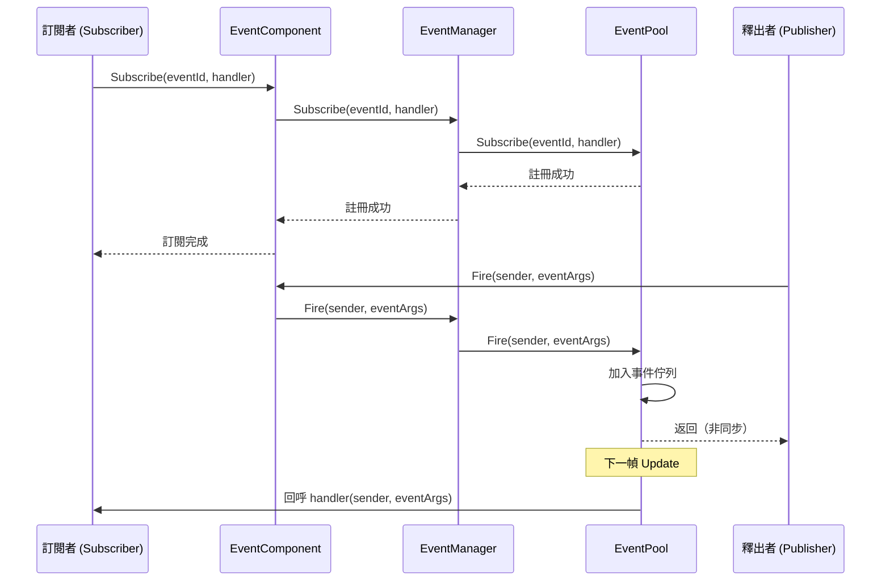
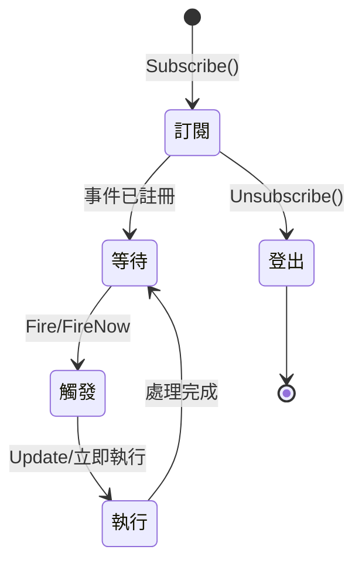
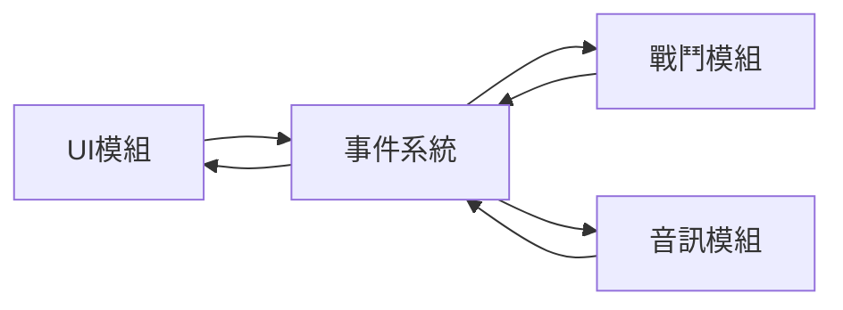
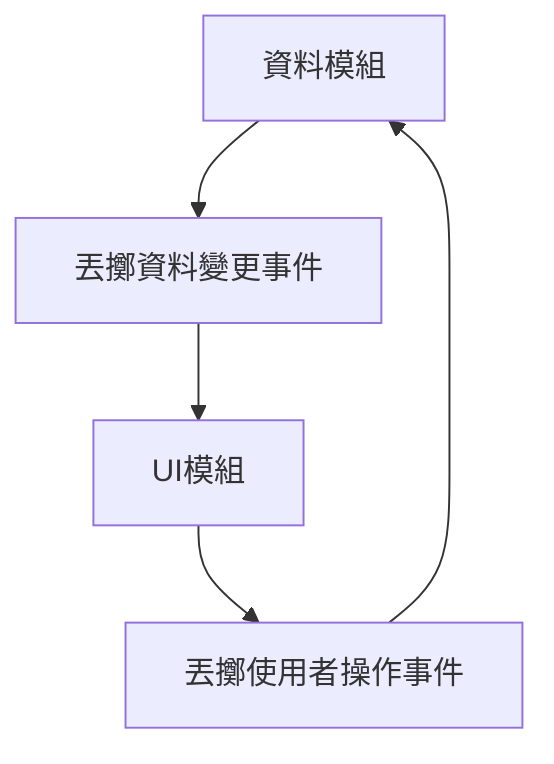

# 事件系統架構

GameFrameX 事件系統是一個基於釋出-訂閱（Pub-Sub）模式的事件驅動框架，提供執行緒安全的非同步事件派發機制。該系統是 GameFrameX 架構的核心組件之一，支援遊戲開發中的解耦和事件通訊。

## 概述

事件系統旨在解決遊戲開發中的組件通訊問題。在遊戲開發中，不同模組（如 UI、戰鬥、系統）之間需要相互通訊，但直接呼叫會造成緊耦合。事件系統透過引入事件通道，使模組之間可以松耦合通訊：

- **釋出者（Publisher）**：負責丟擲事件，不關心誰接收
- **訂閱者（Subscriber）**：負責監聽事件並處理，不關心誰發出
- **事件通道**：負責將事件從釋出者傳遞給訂閱者

### 核心特性

| 特性 | 說明 |
|------|------|
| 執行緒安全 | `Fire` 方法支援跨執行緒呼叫，自動在主執行緒回呼 |
| 延遲派發 | 非同步事件在下一幀分發，避免邏輯同步問題 |
| 立即派發 | `FireNow` 方法立即執行回呼（需注意執行緒安全） |
| 多播支援 | 同一事件可繫結多個處理函式 |
| 預設處理 | 支援設定預設處理器捕獲未訂閱事件 |
| 物件池 | 使用 EventPool 減少記憶體分配 |

## 架構設計

### 組件層次結構

```mermaid
flowchart TB
    subgraph Unity["Unity 引擎層"]
        Mono[MonoBehaviour 指令碼]
    end

    subgraph Component["Component 封裝層"]
        EC[EventComponent]
    end

    subgraph Interface["介面抽象層"]
        IEM[IEventManager]
    end

    subgraph Implementation["實現層"]
        EM[EventManager]
        EP[EventPool]
    end

    subgraph Runtime["執行時依賴"]
        Pool[EventPool 核心]
    end

    Mono --> EC
    EC --> IEM
    IEM <|.. EM
    EM --> EP
    EP --> Pool
```

### 核心組件說明

#### 1. EventComponent

Unity 組件，繼承自 `GameFrameworkComponent`，提供面向 Unity 的事件介面。

```csharp
public sealed class EventComponent : GameFrameworkComponent
{
    private IEventManager m_EventManager = null;

    protected override void Awake()
    {
        ImplementationComponentType = Utility.Assembly.GetType(componentType);
        InterfaceComponentType = typeof(IEventManager);
        base.Awake();
        m_EventManager = GameFrameworkEntry.GetModule<IEventManager>();
    }

    public void Fire(object sender, GameEventArgs e);
    public void FireNow(object sender, GameEventArgs e);
    public void Subscribe(string id, EventHandler<GameEventArgs> handler);
    public void Unsubscribe(string id, EventHandler<GameEventArgs> handler);
}
```
> Source: [EventComponent.cs](https://github.com/GameFrameX/com.gameframex.unity.event/blob/main/Runtime/EventComponent.cs#L1-L155)

#### 2. IEventManager

事件管理器介面，定義了事件系統的核心操作契約：

```csharp
public interface IEventManager
{
    int EventHandlerCount { get; }
    int EventCount { get; }

    void Subscribe(string id, EventHandler<GameEventArgs> handler);
    void Unsubscribe(string id, EventHandler<GameEventArgs> handler);
    void Fire(object sender, GameEventArgs e);
    void FireNow(object sender, GameEventArgs e);
    void SetDefaultHandler(EventHandler<GameEventArgs> handler);
}
```
> Source: [IEventManager.cs](https://github.com/GameFrameX/com.gameframex.unity.event/blob/main/Runtime/Event/IEventManager.cs#L1-L77)

#### 3. EventManager

`IEventManager` 的實現類，內部使用 `EventPool` 管理事件：

```csharp
public sealed class EventManager : GameFrameworkModule, IEventManager
{
    private readonly EventPool<GameEventArgs> m_EventPool;

    public EventManager()
    {
        m_EventPool = new EventPool<GameEventArgs>(
            EventPoolMode.AllowNoHandler | EventPoolMode.AllowMultiHandler);
    }

    public void Fire(object sender, GameEventArgs e)
    {
        m_EventPool.Fire(sender, e);
    }

    public void FireNow(object sender, GameEventArgs e)
    {
        m_EventPool.FireNow(sender, e);
    }
}
```
> Source: [EventManager.cs](https://github.com/GameFrameX/com.gameframex.unity.event/blob/main/Runtime/Event/EventManager.cs#L1-L142)

#### 4. EventPool（依賴 GameFrameX.Runtime）

事件池是底層實現，負責：
- 儲存事件訂閱關係
- 管理事件物件（使用物件池減少 GC）
- 分發事件到處理函式

### 類繼承關係

```mermaid
classDiagram
    class BaseEventArgs {
        <<abstract>>
        +Id: string { get; }
        +Clear() void
    }

    class GameEventArgs {
        <<abstract>>
    }

    class EmptyEventArgs {
        -_eventId: string
        +Create(eventId): EmptyEventArgs
    }

    BaseEventArgs <|-- GameEventArgs
    GameEventArgs <|-- EmptyEventArgs
```

### 事件引數體系

**GameEventArgs** 是所有遊戲事件的基類：

```csharp
public abstract class GameEventArgs : BaseEventArgs
{
}
```
> Source: [GameEventArgs.cs](https://github.com/GameFrameX/com.gameframex.unity.event/blob/main/Runtime/EventArgs/GameEventArgs.cs#L1-L19)

**EmptyEventArgs** 用於不需要攜帶資料的簡單事件：

```csharp
public sealed class EmptyEventArgs : GameEventArgs
{
    public static EmptyEventArgs Create(string eventId)
    {
        var eventArgs = ReferencePool.Acquire<EmptyEventArgs>();
        eventArgs.SetEventId(eventId);
        return eventArgs;
    }
}
```
> Source: [EmptyEventArgs.cs](https://github.com/GameFrameX/com.gameframex.unity.event/blob/main/Runtime/EventArgs/EmptyEventArgs.cs#L1-L47)

## 事件流程

### 訂閱與派發流程



### 兩種派發模式對比

| 模式 | 方法 | 執行緒安全 | 執行時機 | 適用場景 |
|------|------|----------|----------|----------|
| 延遲派發 | `Fire()` | ✅ 安全 | 下一幀 | 非同步邏輯、跨執行緒呼叫 |
| 立即派發 | `FireNow()` | ⚠️ 注意 | 立即 | 同步邏輯、主執行緒確定 |

**設計意圖：**

- **Fire 方法**：採用延遲派發，確保即使在後臺執行緒丟擲事件，回呼也在主執行緒執行。這對於 Unity 開發非常重要，因為 Unity 的 API 只能在主執行緒呼叫。同時，延遲到下一幀可以避免在當前幀觸發意外的計算。

- **FireNow 方法**：立即執行回呼，效能更高，但呼叫者需確保在主執行緒執行，且回呼執行不會導致問題。

### 事件生命週期



## 使用示例

### 基本訂閱與派發

```csharp
public class Player : MonoBehaviour
{
    private EventComponent _eventComponent;

    private void Start()
    {
        // 獲取事件組件
        _eventComponent = UnityEngine.Component.FindObjectOfType<EventComponent>();

        // 訂閱事件
        _eventComponent.CheckSubscribe("OnPlayerDead", OnPlayerDead);
    }

    private void OnPlayerDead(object sender, GameEventArgs e)
    {
        UnityEngine.Debug.Log("玩家死亡！");
    }

    private void OnCollisionEnter(UnityEngine.Collision collision)
    {
        // 丟擲事件
        _eventComponent.Fire(this, EmptyEventArgs.Create("OnPlayerDead"));
    }
}
```
> Source: [EventComponent.cs](https://github.com/GameFrameX/com.gameframex.unity.event/blob/main/Runtime/EventComponent.cs#L80-L114)

### 自定義事件引數

```csharp
// 定義自定義事件引數
public class DamageEventArgs : GameEventArgs
{
    public int Damage { get; set; }
    public UnityEngine.Vector3 Position { get; set; }
}

// 丟擲帶資料的事件
var args = ReferencePool.Acquire<DamageEventArgs>();
args.Damage = 100;
args.Position = transform.position;
eventComponent.Fire(this, args);
```

### 預設處理器

```csharp
// 設定預設處理器捕獲未訂閱的事件
eventComponent.SetDefaultHandler((sender, e) =>
{
    UnityEngine.Debug.Log($"未處理的事件: {e.Id}");
});
```
> Source: [EventManager.cs](https://github.com/GameFrameX/com.gameframex.unity.event/blob/main/Runtime/Event/EventManager.cs#L113-L120)

## 配置與檢查

### 事件統計

```csharp
// 獲取事件處理函式數量
int handlerCount = eventComponent.EventHandlerCount;

// 獲取事件型別數量
int eventCount = eventComponent.EventCount;
```
> Source: [EventComponentInspector.cs](https://github.com/GameFrameX/com.gameframex.unity.event/blob/main/Editor/Inspector/EventComponentInspector.cs#L27-L33)

### 檢查訂閱狀態

```csharp
// 檢查特定事件處理函式是否存在
bool exists = eventComponent.Check("OnPlayerDead", OnPlayerDeadHandler);
```
> Source: [EventComponent.cs](https://github.com/GameFrameX/com.gameframex.unity.event/blob/main/Runtime/EventComponent.cs#L72-L75)

## 常見使用模式

### 模式一：模組間解耦



UI 模組不知道戰鬥模組的存在，只訂閱 "戰鬥開始" 事件；戰鬥模組只負責丟擲事件，不關心誰接收。

### 模式二：資料驅動 UI



資料變化時丟擲事件，UI 自動響應更新；使用者操作透過事件通知資料模組處理。

### 模式三：系統間通訊

遊戲中的各個系統（成就係統、任務系統、日誌系統）可以訂閱同一個事件，實現不同的響應：

```csharp
// 成就係統
achievementComponent.Subscribe("LevelComplete", OnLevelComplete);

// 任務系統
questComponent.Subscribe("LevelComplete", OnLevelComplete);

// 日誌系統
logComponent.Subscribe("LevelComplete", OnLevelComplete);

// 等級完成時，所有系統都會收到通知
levelComponent.Fire(this, new LevelCompleteEventArgs { Level = 5 });
```

## 設計優勢

1. **松耦合**：釋出者和訂閱者不直接依賴
2. **可擴充套件**：新增訂閱者無需修改釋出者程式碼
3. **執行緒安全**：支援跨執行緒事件派發
4. **效能最佳化**：使用物件池減少 GC
5. **靈活控制**：支援延遲派發和立即派發兩種模式

## 注意事項

1. **避免記憶體洩漏**：組件銷燬時務必取消訂閱
2. **Fire vs FireNow**：除非明確在主執行緒，否則使用 `Fire`
3. **事件ID管理**：建議使用常量或列舉管理事件ID，避免字串硬編碼
4. **回呼效能**：避免在回呼中執行耗時操作

## 相關連結

- [EventComponent API 參考](./05.event-component.md)
- [EventManager API 參考](./06.event-manager.md)
- [GameEventArgs API 參考](./07.game-event-args.md)
- [快速入門](./03.getting-started.md)
- [常見問題解答](./08.troubleshooting.md)
