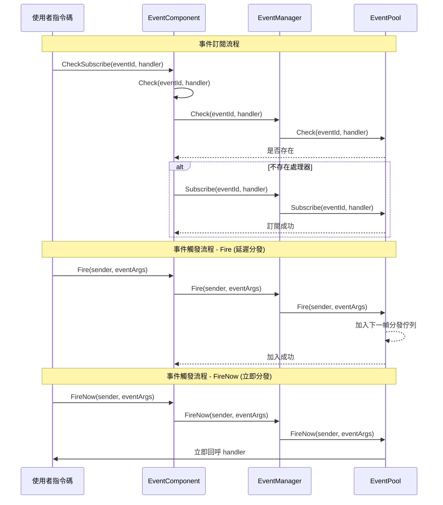

# EventComponent

EventComponent 是 Game Frame X 事件系統的 Unity 組件層，提供基於觀察者模式的事件訂閱與釋出功能。

## Overview

EventComponent 是遊戲框架中的核心事件組件，繼承自 `GameFrameworkComponent`。它作為 Unity 遊戲物件組件，提供了一個可配置的、易於使用的事件系統介面。

### 核心職責

- **事件訂閱**：允許指令碼訂閱特定事件 ID 的處理函式
- **事件取消訂閱**：允許指令碼取消對特定事件的訂閱
- **事件觸發**：支援兩種模式觸發事件（延遲分發和立即分發）
- **執行緒安全**：跨執行緒觸發事件時可保證在主執行緒回呼

### 組件特性

- 繼承自 `GameFrameworkComponent`，遵循框架組件規範
- 使用 `[DisallowMultipleComponent]` 特性防止重複新增
- 使用 `[AddComponentMenu]` 在 Unity 編輯器中新增選單項
- 支援多處理器（MultiHandler）和無處理器（NoHandler）模式

## Architecture

EventComponent 在事件系統中的位置和互動關係：

```mermaid
flowchart TD
    subgraph UnityLayer["Unity 遊戲層"]
        EventComp[EventComponent]
    end

    subgraph FrameworkLayer["Game Framework 核心層"]
        GFComponent[GameFrameworkComponent]
        GFEntry[GameFrameworkEntry]
    end

    subgraph EventLayer["事件系統層"]
        IEventMgr[IEventManager]
        EventMgr[EventManager]
        EventPool[EventPool<GameEventArgs>]
    end

    subgraph UserLayer["使用者指令碼層"]
        ScriptA[使用者指令碼 A]
        ScriptB[使用者指令碼 B]
    end

    EventComp -->|繼承| GFComponent
    EventComp -->|獲取模組| GFEntry
    GFEntry -->|返回| IEventMgr
    IEventMgr <|.實現.| EventMgr
    EventMgr -->|使用| EventPool
    
    ScriptA -->|訂閱事件| EventComp
    ScriptB -->|訂閱事件| EventComp
    EventComp -->|觸發事件| EventPool
    EventPool -.->|回呼| ScriptA
    EventPool -.->|回呼| ScriptB
```

### 事件系統架構說明

| 層級 | 組件 | 職責 |
|------|------|------|
| Unity層 | EventComponent | 提供 Unity 組件介面，封裝底層模組 |
| 框架核心層 | GameFrameworkEntry | 模組初始化和依賴注入 |
| 事件系統層 | IEventManager | 事件管理器介面定義 |
| 事件系統層 | EventManager | 事件管理器實現 |
| 事件系統層 | EventPool | 事件池，負責事件儲存和分發 |

## Core Flow

事件訂閱與觸發的完整流程：



### 事件分發模式對比

| 模式 | 方法 | 執行緒安全 | 分發時機 | 適用場景 |
|------|------|----------|----------|----------|
| 延遲分發 | `Fire()` | ✅ 是 | 下一幀 | 大多數情況，特別是跨執行緒觸發 |
| 立即分發 | `FireNow()` | ❌ 否 | 立即 | 確定性要求高的同步場景 |

## Usage Examples

### 基本用法 - 訂閱和觸發事件

```csharp
using GameFrameX.Event.Runtime;

// 定義事件引數類
public class PlayerDeadEventArgs : GameEventArgs
{
    public int PlayerId { get; set; }
    public string Reason { get; set; }
    
    public override void Clear()
    {
        PlayerId = 0;
        Reason = string.Empty;
    }

    public override string Id => "player.dead";
}

// 在需要監聽事件的指令碼中
public class PlayerController : MonoBehaviour
{
    private EventComponent _eventComponent;

    private void Start()
    {
        // 獲取 EventComponent 組件
        _eventComponent = UnityEngine.GameObject.FindObjectOfType<EventComponent>();
        
        // 訂閱事件 - 使用 CheckSubscribe 自動檢查是否已訂閱
        _eventComponent.CheckSubscribe(PlayerDeadEventArgs args => OnPlayerDead(args));
    }

    private void OnPlayerDead(PlayerDeadEventArgs args)
    {
        UnityEngine.Debug.Log($"玩家 {args.PlayerId} 死亡: {args.Reason}");
    }

    private void OnDestroy()
    {
        // 取消訂閱事件
        if (_eventComponent != null)
        {
            _eventComponent.Unsubscribe("player.dead", OnPlayerDead);
        }
    }
}

// 在觸發事件的指令碼中
public class GameManager : MonoBehaviour
{
    private EventComponent _eventComponent;

    private void Start()
    {
        _eventComponent = UnityEngine.GameObject.FindObjectOfType<EventComponent>();
    }

    public void KillPlayer(int playerId)
    {
        // 建立事件引數
        var eventArgs = ReferencePool.Acquire<PlayerDeadEventArgs>();
        eventArgs.PlayerId = playerId;
        eventArgs.Reason = "被怪物擊殺";

        // 觸發事件
        _eventComponent.Fire(this, eventArgs);
        
        // 事件引數會被自動回收
    }
}
```
> Source: [EventComponent.cs](https://github.com/GameFrameX/com.gameframex.unity.event/blob/main/Runtime/EventComponent.cs#L1-L155)
> Source: [GameEventArgs.cs](https://github.com/GameFrameX/com.gameframex.unity.event/blob/main/Runtime/EventArgs/GameEventArgs.cs#L1-L19)

### 簡化事件 - 使用空事件引數

如果只需要傳遞事件 ID，不需要額外資料：

```csharp
// 觸發一個簡單事件
_eventComponent.Fire(this, "player.respawn");

// 訂閱簡單事件
_eventComponent.CheckSubscribe("player.respawn", args => 
{
    UnityEngine.Debug.Log("玩家重生");
});
```
> Source: [EventComponent.cs](https://github.com/GameFrameX/com.gameframex.unity.event/blob/main/Runtime/EventComponent.cs#L140-L144)

### 使用預設事件處理器

可以為所有未處理的事件設定預設處理器：

```csharp
// 設定預設處理器
_eventComponent.SetDefaultHandler((sender, args) =>
{
    UnityEngine.Debug.Log($"未處理的事件: {args.Id}");
});
```
> Source: [EventComponent.cs](https://github.com/GameFrameX/com.gameframex.unity.event/blob/main/Runtime/EventComponent.cs#L120-L123)

## API Reference

### 屬性

#### `EventHandlerCount`

```csharp
public int EventHandlerCount { get; }
```

獲取已訂閱的事件處理函式總數。

**返回：** 事件處理函式的總數

---

#### `EventCount`

```csharp
public int EventCount { get; }
```

獲取已訂閱的事件型別總數。

**返回：** 事件型別的總數

---

### 方法

#### `Count(id: string): int`

```csharp
public int Count(string id)
```

獲取指定事件 ID 的事件處理函式數量。

**引數：**
- `id` (string): 事件型別編號

**返回：** 該事件 ID 關聯的事件處理函式數量

---

#### `Check(id: string, handler: EventHandler<GameEventArgs>): bool`

```csharp
public bool Check(string id, EventHandler<GameEventArgs> handler)
```

檢查指定事件 ID 是否已存在特定的事件處理函式。

**引數：**
- `id` (string): 事件型別編號
- `handler` (`EventHandler<GameEventArgs>`): 要檢查的事件處理函式

**返回：** 是否存在該事件處理函式

---

#### `CheckSubscribe(id: string, handler: EventHandler<GameEventArgs>): void`

```csharp
public void CheckSubscribe(string id, EventHandler<GameEventArgs> handler)
```

檢查並訂閱事件處理函式。如果處理函式不存在，則自動訂閱。

**設計意圖：** 此方法解決了重複訂閱的問題。在 Unity 開發中，經常會在 `Start()` 或 `OnEnable()` 中訂閱事件，但如果這些方法被多次呼叫，會導致同一處理函式被重複訂閱。此方法會在訂閱前檢查，避免重複訂閱。

**引數：**
- `id` (string): 事件型別編號
- `handler` (`EventHandler<GameEventArgs>`): 要訂閱的事件處理回呼函式

---

#### `Subscribe(id: string, handler: EventHandler<GameEventArgs>): void`

```csharp
[Obsolete("Use CheckSubscribe instead.")]
public void Subscribe(string id, EventHandler<GameEventArgs> handler)
```

> ⚠️ 已廢棄，請使用 `CheckSubscribe` 代替。

訂閱事件處理回呼函式。

**引數：**
- `id` (string): 事件型別編號
- `handler` (`EventHandler<GameEventArgs>`): 要訂閱的事件處理回呼函式

---

#### `Unsubscribe(id: string, handler: EventHandler<GameEventArgs>): void`

```csharp
public void Unsubscribe(string id, EventHandler<GameEventArgs> handler)
```

取消訂閱事件處理回呼函式。

**設計意圖：** 在 Unity 中，當指令碼被銷燬時（如切換場景、物件銷燬），必須取消事件訂閱以避免空引用異常。通常在 `OnDestroy()` 或 `OnDisable()` 中呼叫。

**引數：**
- `id` (string): 事件型別編號
- `handler` (`EventHandler<GameEventArgs>`): 要取消訂閱的事件處理回呼函式

---

#### `SetDefaultHandler(handler: EventHandler<GameEventArgs>): void`

```csharp
public void SetDefaultHandler(EventHandler<GameEventArgs> handler)
```

設定預設事件處理函式。當觸發一個沒有訂閱者的事件時，會呼叫預設處理器。

**引數：**
- `handler` (`EventHandler<GameEventArgs>`): 要設定的預設事件處理函式

---

#### `Fire(sender: object, e: GameEventArgs): void`

```csharp
public void Fire(object sender, GameEventArgs e)
```

丟擲事件（延遲分發模式）。

**設計意圖：** 此方法是執行緒安全的。即使在後臺執行緒中呼叫 `Fire()`，事件回呼也只會在主執行緒的下一幀執行。這是推薦使用的事件觸發方式，特別適用於網路訊息回呼、非同步操作完成通知等場景。

**引數：**
- `sender` (object): 事件傳送者，通常傳遞 `this`
- `e` (GameEventArgs): 事件引數物件

---

#### `Fire(sender: object, eventId: string): void`

```csharp
public void Fire(object sender, string eventId)
```

丟擲事件（使用空事件引數）。

**設計意圖：** 提供一種簡化的無資料事件觸發方式。當只需要傳遞事件 ID 而不需要攜帶額外資料時使用。

**引數：**
- `sender` (object): 事件傳送者
- `eventId` (string): 事件編號

---

#### `FireNow(sender: object, e: GameEventArgs): void`

```csharp
public void FireNow(object sender, GameEventArgs e)
```

丟擲事件（立即分發模式）。

**設計意圖：** 此方法不是執行緒安全的，事件會立刻同步分發。適用於需要確定性執行順序的場景，例如某些幀同步邏輯或除錯時需要立即看到效果的情況。**注意：** 不要在後臺執行緒中呼叫此方法。

**引數：**
- `sender` (object): 事件傳送者
- `e` (GameEventArgs): 事件引數物件

---

## Configuration Options

EventComponent 作為 Unity 組件，無需額外配置。它透過框架的 `GameFrameworkEntry` 自動獲取 `IEventManager` 模組。

| 配置項 | 型別 | 預設值 | 說明 |
|--------|------|--------|------|
| Component Menu | string | "Game Framework/Event" | Unity 編輯器中的組件選單位置 |

---

## Related Links

- [EventManager](./06.event-manager.md) - 事件管理器底層實現
- [GameEventArgs](./07.game-event-args.md) - 事件引數基類
- [核心概念：事件系統架構](../04.features.md) - 瞭解事件系統設計原理
- [快速入門](../03.getting-started.md) - 開始使用事件系統
