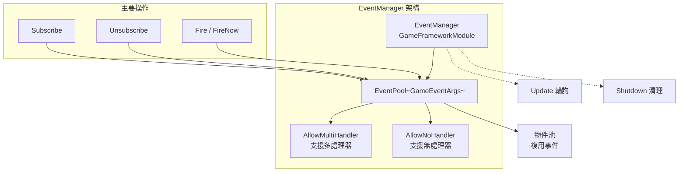
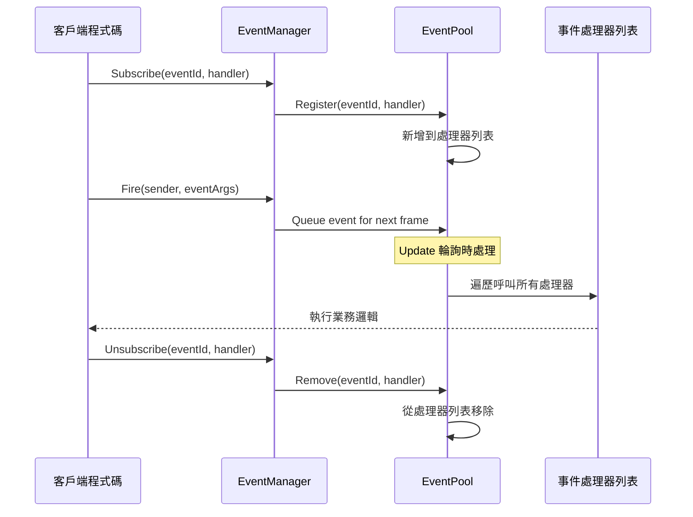
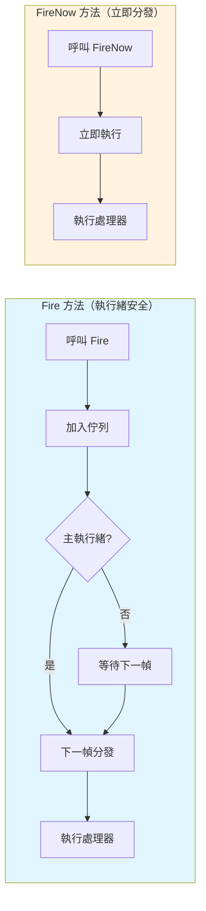

# EventManager

EventManager 是 GameFrameX 事件系統的核心管理器，負責遊戲事件的訂閱、取消訂閱和派發管理。它基於 EventPool 實現，支援執行緒安全的事件分發和多處理器模式。

## 概述

EventManager 是 GameFrameX 事件系統的核心組件，繼承自 `GameFrameworkModule` 並實現了 `IEventManager` 介面。它提供了一個強大的事件系統，允許遊戲中的不同模組透過事件進行松耦合的通訊。

EventManager 的核心功能包括：
- **事件訂閱與取消訂閱**：透過事件 ID 註冊或移除事件處理函式
- **事件派發**：支援執行緒安全的延遲分發（`Fire`）和立即分發（`FireNow`）兩種模式
- **事件統計**：提供當前已訂閱的事件處理函式數量和事件數量查詢
- **預設處理器**：支援設定預設事件處理函式來捕獲未明確訂閱的事件

> **注意**：EventManager 通常透過 EventComponent 在 Unity 場景中使用。EventComponent 是 EventManager 的 Unity 組件封裝，提供了更友好的 Unity 整合介面。
> 
> 有關 EventComponent 的詳細資訊，請參閱 [EventComponent](./05.event-component.md) 文件。
> 
> 有關 GameEventArgs 的詳細資訊，請參閱 [GameEventArgs](./07.game-event-args.md) 文件。

## 架構

EventManager 基於事件池（EventPool）實現，這是一種高效的事件管理模式。EventPool 支援以下特性：



### 設計模式

EventManager 採用以下設計模式：

| 模式 | 應用 | 優勢 |
|------|------|------|
| **物件池模式** | EventPool 複用 GameEventArgs | 減少 GC，最佳化效能 |
| **觀察者模式** | Subscribe/Publish 機制 | 解耦事件釋出者和訂閱者 |
| **延遲執行模式** | Fire 延遲到下一幀分發 | 保證執行緒安全 |

## 核心流程

### 事件訂閱與派發流程



### 事件分發模式對比



## 使用示例

### 基本使用

```csharp
// 定義自定義事件引數
public class PlayerDeathEventArgs : GameEventArgs
{
    public int PlayerId { get; set; }
    public string Reason { get; set; }
    public override void Clear()
    {
        PlayerId = 0;
        Reason = string.Empty;
    }
}

// 訂閱事件
EventComponent eventComponent = UnityEngine.Object.FindObjectOfType<EventComponent>();
eventComponent.CheckSubscribe("player_death", OnPlayerDeath);

// 事件處理函式
private void OnPlayerDeath(object sender, GameEventArgs e)
{
    var args = (PlayerDeathEventArgs)e;
    UnityEngine.Debug.Log($"玩家 {args.PlayerId} 死亡: {args.Reason}");
}

// 丟擲事件
eventComponent.Fire(this, new PlayerDeathEventArgs 
{ 
    PlayerId = 1001, 
    Reason = "被怪物擊殺" 
});

// 取消訂閱
eventComponent.Unsubscribe("player_death", OnPlayerDeath);
```
> Source: [EventManager.cs](https://github.com/GameFrameX/com.gameframex.unity.event/blob/main/Runtime/Event/EventManager.cs#L98-L101)

### 使用空事件（無需資料）

```csharp
// 訂閱簡單事件（無需攜帶資料）
eventComponent.CheckSubscribe("game_start", OnGameStart);

// 丟擲簡單事件
eventComponent.Fire(this, "game_start");

// 事件處理函式
private void OnGameStart(object sender, GameEventArgs e)
{
    UnityEngine.Debug.Log("遊戲開始！");
}
```
> Source: [EventComponent.cs](https://github.com/GameFrameX/com.gameframex.unity.event/blob/main/Runtime/EventComponent.cs#L140-L144)

### 設定預設處理器

```csharp
// 設定預設處理器捕獲所有未明確訂閱的事件
eventComponent.SetDefaultHandler(OnDefaultEvent);

// 預設事件處理函式
private void OnDefaultEvent(object sender, GameEventArgs e)
{
    UnityEngine.Debug.Log($"收到未處理事件: {e.Id}");
}
```
> Source: [EventManager.cs](https://github.com/GameFrameX/com.gameframex.unity.event/blob/main/Runtime/Event/EventManager.cs#L117-L120)

## API 參考

### 屬性

#### `EventHandlerCount`

```csharp
public int EventHandlerCount { get; }
```

獲取已訂閱的事件處理函式的總數量。

**返回值：** 事件處理函式的數量。

---

#### `EventCount`

```csharp
public int EventCount { get; }
```

獲取已訂閱的事件型別數量（不同事件 ID 的數量）。

**返回值：** 事件型別的數量。

---

### 方法

#### `Count`

```csharp
public int Count(string id)
```

獲取指定事件 ID 的事件處理函式數量。

**引數：**
- `id` (string): 事件型別編號

**返回值：** 指定事件 ID 的事件處理函式數量。

> Source: [EventManager.cs#L77-L80](https://github.com/GameFrameX/com.gameframex.unity.event/blob/main/Runtime/Event/EventManager.cs#L77-L80)

---

#### `Check`

```csharp
public bool Check(string id, EventHandler<GameEventArgs> handler)
```

檢查是否存在指定的事件處理函式。

**引數：**
- `id` (string): 事件型別編號
- `handler` (`EventHandler<GameEventArgs>`): 要檢查的事件處理函式

**返回值：** 是否存在指定的事件處理函式。

> Source: [EventManager.cs#L88-L91](https://github.com/GameFrameX/com.gameframex.unity.event/blob/main/Runtime/Event/EventManager.cs#L88-L91)

---

#### `Subscribe`

```csharp
public void Subscribe(string id, EventHandler<GameEventArgs> handler)
```

訂閱指定事件 ID 的事件處理函式。

**引數：**
- `id` (string): 事件型別編號
- `handler` (`EventHandler<GameEventArgs>`): 要訂閱的事件處理函式

**說明：** 
- 同一個事件 ID 可以訂閱多個處理函式
- 事件觸發時，所有訂閱的處理函式都會被呼叫

> Source: [EventManager.cs#L98-L101](https://github.com/GameFrameX/com.gameframex.unity.event/blob/main/Runtime/Event/EventManager.cs#L98-L101)

---

#### `Unsubscribe`

```csharp
public void Unsubscribe(string id, EventHandler<GameEventArgs> handler)
```

取消訂閱指定事件 ID 的事件處理函式。

**引數：**
- `id` (string): 事件型別編號
- `handler` (`EventHandler<GameEventArgs>`): 要取消訂閱的事件處理函式

**說明：** 如果事件處理函式不存在，則不會執行任何操作。

> Source: [EventManager.cs#L108-L111](https://github.com/GameFrameX/com.gameframex.unity.event/blob/main/Runtime/Event/EventManager.cs#L108-L111)

---

#### `SetDefaultHandler`

```csharp
public void SetDefaultHandler(EventHandler<GameEventArgs> handler)
```

設定預設事件處理函式。

**引數：**
- `handler` (`EventHandler<GameEventArgs>`): 要設定的預設事件處理函式

**說明：** 預設事件處理函式會在事件沒有找到對應的訂閱處理器時被呼叫。

> Source: [EventManager.cs#L117-L120](https://github.com/GameFrameX/com.gameframex.unity.event/blob/main/Runtime/Event/EventManager.cs#L117-L120)

---

#### `Fire`

```csharp
public void Fire(object sender, GameEventArgs e)
```

丟擲事件（執行緒安全模式）。

**引數：**
- `sender` (object): 事件傳送者
- `e` (GameEventArgs): 事件引數

**說明：** 
- 此方法是執行緒安全的
- 即使在非主執行緒中呼叫，也會保證在主執行緒中回呼事件處理函式
- 事件會在丟擲後的下一幀分發

> Source: [EventManager.cs#L127-L130](https://github.com/GameFrameX/com.gameframex.unity.event/blob/main/Runtime/Event/EventManager.cs#L127-L130)

---

#### `FireNow`

```csharp
public void FireNow(object sender, GameEventArgs e)
```

丟擲事件（立即模式）。

**引數：**
- `sender` (object): 事件傳送者
- `e` (GameEventArgs): 事件引數

**說明：** 
- 此方法不是執行緒安全的
- 事件會立刻分發，立即呼叫所有訂閱的處理函式
- 僅在確定呼叫執行緒安全的情況下使用

> Source: [EventManager.cs#L137-L140](https://github.com/GameFrameX/com.gameframex.unity.event/blob/main/Runtime/Event/EventManager.cs#L137-L140)

---

## 執行緒安全性

EventManager 提供了兩種事件分發模式以滿足不同的需求：

| 方法 | 執行緒安全 | 分發時機 | 適用場景 |
|------|----------|----------|----------|
| `Fire` | ✅ 安全 | 下一幀 | 跨執行緒事件、後端通知前端 |
| `FireNow` | ❌ 不安全 | 立即 | 同一執行緒內同步邏輯 |

**最佳實踐：**
- 在子執行緒中觸發事件時使用 `Fire`，確保回呼在主執行緒執行
- 在主執行緒中需要立即響應時使用 `FireNow`
- 避免在 `FireNow` 的事件處理函式中進行耗時操作

## 效能最佳化建議

1. **使用物件池**：自定義事件類應繼承 `GameEventArgs` 並實現物件池介面，避免頻繁建立物件
2. **及時取消訂閱**：不再需要的事件應及時取消訂閱，減少遍歷開銷
3. **使用 `CheckSubscribe`**：推薦使用 `CheckSubscribe` 方法自動處理重複訂閱問題
4. **避免頻繁派發**：對於高頻事件（如每幀更新），考慮合併或節流

## 相關連結

- [EventComponent](./05.event-component.md) - Unity 組件封裝
- [GameEventArgs](./07.game-event-args.md) - 事件引數基類
- [核心概念：事件系統架構](../04.features.md) - 瞭解更多設計原理
- [快速入門](../03.getting-started.md) - 開始使用事件系統
