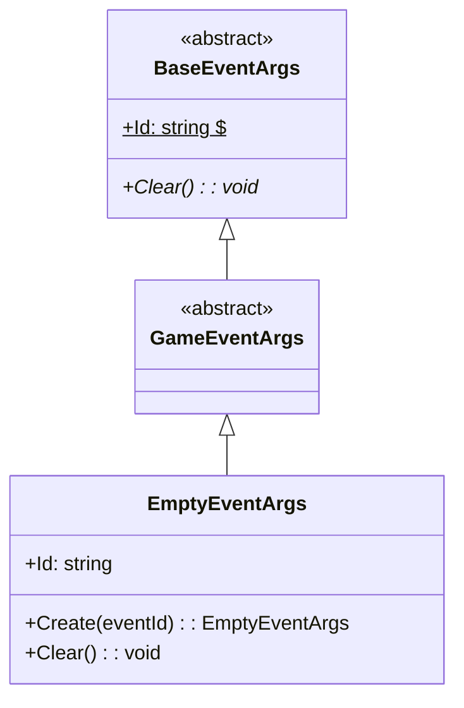
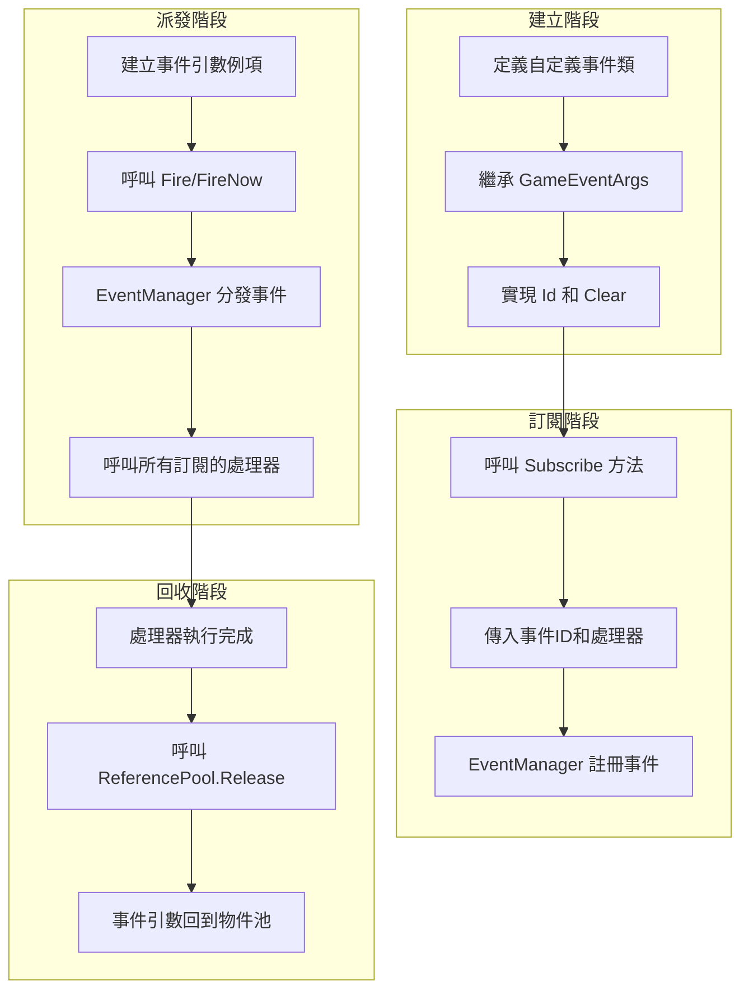

# GameEventArgs

遊戲事件引數基類，用於定義遊戲框架中所有事件的基類。

## 概述

GameEventArgs 是 GameFrameX 事件系統的核心基類，所有自定義遊戲事件都應繼承此類。它繼承自 BaseEventArgs，提供了事件系統的基本結構和介面規範。

**設計意圖**：透過建立統一的事件引數基類，事件系統能夠以型別安全的方式處理各種遊戲事件，同時保持事件訂閱和派發的靈活性。

## 類層次結構



## 核心概念

### 事件 ID

每個事件引數都應該具有唯一的事件識別符號（Event ID），用於事件的訂閱和識別。事件 ID 通常使用字串型別，可以是：

- 預定義的常量字串
- 型別的完整名稱（`typeof(T).FullName`）
- 自定義的業務邏輯標識

### 物件池

GameEventArgs 設計上支援物件池模式以最佳化效能。實際使用中，事件引數通常透過 `ReferencePool` 進行獲取和回收：

```csharp
var eventArgs = ReferencePool.Acquire<EmptyEventArgs>();
// ... 使用事件引數
ReferencePool.Release(eventArgs);
```

> Source: [EmptyEventArgs.cs](https://github.com/GameFrameX/com.gameframex.unity.event/blob/main/Runtime/EventArgs/EmptyEventArgs.cs#L32-L37)

## 建立自定義事件引數

要建立自定義事件引數類，需要繼承 GameEventArgs 並實現必要成員。以下是 EmptyEventArgs 的完整實現示例：

```csharp
using GameFrameX.Runtime;

namespace GameFrameX.Event.Runtime
{
    /// <summary>
    /// 空事件
    /// </summary>
    public sealed class EmptyEventArgs : GameEventArgs
    {
        private string _eventId = typeof(EmptyEventArgs).FullName;

        public override void Clear()
        {
        }

        public override string Id
        {
            get { return _eventId; }
        }

        /// <summary>
        /// 建立空事件
        /// </summary>
        /// <param name="eventId">事件編號</param>
        /// <returns>空事件物件</returns>
        public static EmptyEventArgs Create(string eventId)
        {
            var eventArgs = ReferencePool.Acquire<EmptyEventArgs>();
            eventArgs.SetEventId(eventId);
            return eventArgs;
        }

        /// <summary>
        /// 設定事件編號
        /// </summary>
        /// <param name="eventId"></param>
        private void SetEventId(string eventId)
        {
            _eventId = eventId;
        }
    }
}
```

> Source: [EmptyEventArgs.cs](https://github.com/GameFrameX/com.gameframex.unity.event/blob/main/Runtime/EventArgs/EmptyEventArgs.cs#L1-L48)

### 實現要點

1. **Id 屬性**（必須）：返回事件的唯一識別符號
2. **Clear 方法**（必須）：重置事件引數狀態，用於物件回收時清理資料
3. **Create 靜態方法**（推薦）：提供工廠方法建立事件例項，支援物件池

## 事件引數與事件系統

GameEventArgs 在事件系統中的使用流程如下：



## 完整事件示例

以下是一個帶有資料載荷的自定義事件引數示例：

```csharp
// 假設的自定義事件引數示例（展示模式）
public class PlayerDieEventArgs : GameEventArgs
{
    private int _playerId;
    private string _deathReason;
    private Vector3 _deathPosition;

    public override void Clear()
    {
        _playerId = 0;
        _deathReason = string.Empty;
        _deathPosition = Vector3.zero;
    }

    public override string Id => "PlayerDie";

    public int PlayerId => _playerId;
    public string DeathReason => _deathReason;
    public Vector3 DeathPosition => _deathPosition;

    public static PlayerDieEventArgs Create(int playerId, string reason, Vector3 position)
    {
        var args = ReferencePool.Acquire<PlayerDieEventArgs>();
        args._playerId = playerId;
        args._deathReason = reason;
        args._deathPosition = position;
        return args;
    }
}
```

> 注：以上示例展示建立自定義事件引數的模式，實際程式碼需根據具體需求實現

## 事件派發方式

事件系統提供兩種派發方式：

| 方式 | 方法 | 執行緒安全 | 特點 |
|------|------|----------|------|
| 延遲派發 | `Fire(sender, args)` | ✅ 安全 | 在下一幀分發，適合跨執行緒呼叫 |
| 立即派發 | `FireNow(sender, args)` | ❌ 不安全 | 立即分發，效能更高但非執行緒安全 |

```csharp
// 延遲派發（執行緒安全）
eventComponent.Fire(this, EmptyEventArgs.Create("game_start"));

// 立即派發
eventComponent.FireNow(this, EmptyEventArgs.Create("game_start"));
```

> Source: [EventComponent.cs](https://github.com/GameFrameX/com.gameframex.unity.event/blob/main/Runtime/EventComponent.cs#L130-L154)

## API 參考

### `GameEventArgs`

遊戲邏輯事件基類。

**名稱空間**: `GameFrameX.Event.Runtime`

**繼承**: `BaseEventArgs`

**子類**:

- `EmptyEventArgs`：空事件實現

#### 成員

| 成員 | 型別 | 說明 |
|------|------|------|
| `Id` | `string` | 獲取事件唯一識別符號（抽象屬性） |
| `Clear()` | `void` | 重置事件狀態（抽象方法） |

### `EmptyEventArgs`

空事件實現，用於不需要攜帶資料的事件。

**名稱空間**: `GameFrameX.Event.Runtime`

**繼承**: `GameEventArgs`

#### 方法

| 方法 | 返回型別 | 說明 |
|------|----------|------|
| `Create(eventId)` | `EmptyEventArgs` | 建立空事件例項 |

## 相關連結

- [EventComponent](./05.event-component.md)
- [EventManager](./06.event-manager.md)
- [事件系統架構](./04.features.md)
- [快速入門](./03.getting-started.md)
