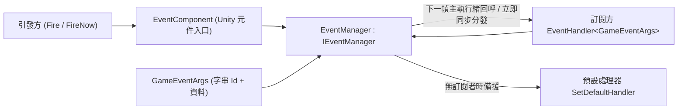

# 套件概覽：GameFrameX Event 是什麼

GameFrameX Event（套件名稱 `com.gameframex.unity.event`）是 GameFrameX 框架中的事件系統元件：一個基於**字串 ID** 的事件匯流排，用於模組間解耦通訊。它支援執行緒安全的延遲分發（`Fire`，下一幀在主執行緒回呼）、立即分發（`FireNow`），並可用預設處理器備援未訂閱的事件；本套件無任何相依套件。

它提供的能力：

- 基於字串 ID 的事件訂閱 / 取消訂閱
- `Fire` — 執行緒安全的延遲分發（下一幀主執行緒回呼）
- `FireNow` — 立即同步分發
- `Fire(sender, eventId)` — 無需自訂事件參數的捷徑
- `Check` / `CheckSubscribe` / `CheckUnsubscribe` — 檢查存在性、不存在時自動訂閱、存在時安全取消訂閱
- `Count` / `EventHandlerCount` / `EventCount` — 處理函式統計
- 預設處理器備援未訂閱事件

## 快速開始

1. 安裝套件（任選其一）：編輯 Unity 專案的 `Packages/manifest.json`，新增 scoped registry 並宣告相依性；或直接在 `dependencies` 節點下新增 Git URL；也可在 Unity `Package Manager` 中用 Git URL 新增，或把儲存庫下載後放進 `Packages` 目錄。

   ```json
   {
     "scopedRegistries": [
       {
         "name": "GameFrameX",
         "url": "https://gameframex.upm.alianblank.uk",
         "scopes": [
           "com.gameframex"
         ]
       }
     ],
     "dependencies": {
       "com.gameframex.unity.event": "1.1.1"
     }
   }
   ```

   Source: [README.zh-CN.md](https://github.com/GameFrameX/com.gameframex.unity.event/blob/main/README.zh-CN.md#L42-L67)

2. 定義自訂事件參數類別，繼承 `GameEventArgs`，用 `Id` 傳回字串事件 ID，並配合參考集區重複使用：

   ```csharp
   public class LevelUpEventArgs : GameEventArgs
   {
       public override string Id => "level_up";
       public int Level { get; private set; }

       public static LevelUpEventArgs Create(int level)
       {
           var args = ReferencePool.Acquire<LevelUpEventArgs>();
           args.Level = level;
           return args;
       }

       public override void Clear()
       {
           base.Clear();
           Level = 0;
       }
   }
   ```

   Source: [README.zh-CN.md](https://github.com/GameFrameX/com.gameframex.unity.event/blob/main/README.zh-CN.md#L75-L94)

3. 透過 `EventComponent`（以下範例中的 `eventComponent` 為該元件的參考）訂閱和取消訂閱：

   ```csharp
   eventComponent.Subscribe("level_up", OnLevelUp);
   eventComponent.Unsubscribe("level_up", OnLevelUp);

   void OnLevelUp(object sender, GameEventArgs e)
   {
       var args = (LevelUpEventArgs)e;
       Debug.Log($"升級到 {args.Level} 級");
   }
   ```

   Source: [README.zh-CN.md](https://github.com/GameFrameX/com.gameframex.unity.event/blob/main/README.zh-CN.md#L99-L107)

4. 引發事件——延遲模式（執行緒安全，下一幀主執行緒回呼）、立即模式（僅限主執行緒）、捷徑（無需自訂參數）三種任選：

   ```csharp
   eventComponent.Fire(this, LevelUpEventArgs.Create(5));      // 延遲模式
   eventComponent.FireNow(this, LevelUpEventArgs.Create(5));   // 立即模式
   eventComponent.Fire(this, "level_up");                      // 捷徑
   ```

   Source: [README.zh-CN.md](https://github.com/GameFrameX/com.gameframex.unity.event/blob/main/README.zh-CN.md#L122-L140)

5. （選用）設定預設處理器，備援未被任何處理器訂閱的事件：

   ```csharp
   eventComponent.SetDefaultHandler(OnDefaultEvent);

   void OnDefaultEvent(object sender, GameEventArgs e)
   {
       Debug.Log($"未處理的事件: {e.Id}");
   }
   ```

   Source: [README.zh-CN.md](https://github.com/GameFrameX/com.gameframex.unity.event/blob/main/README.zh-CN.md#L142-L151)

常用 API（定義在 `IEventManager` 介面上，`EventComponent` 對外暴露同名的呼叫入口）：

| 成員 | 簽章 | 說明 |
|------|------|------|
| `EventHandlerCount` | `int { get; }` | 取得事件處理函式的總數量 |
| `EventCount` | `int { get; }` | 取得事件數量 |
| `Count` | `int Count(string id)` | 取得指定事件的處理函式數量 |
| `Check` | `bool Check(string id, EventHandler<GameEventArgs> handler)` | 檢查是否存在事件處理函式 |
| `Subscribe` | `void Subscribe(string id, EventHandler<GameEventArgs> handler)` | 訂閱事件處理函式 |
| `Unsubscribe` | `void Unsubscribe(string id, EventHandler<GameEventArgs> handler)` | 取消訂閱事件處理函式 |
| `CheckUnsubscribe` | `void CheckUnsubscribe(string id, EventHandler<GameEventArgs> handler)` | 檢查並取消訂閱；handler 不存在時不執行任何操作 |
| `SetDefaultHandler` | `void SetDefaultHandler(EventHandler<GameEventArgs> handler)` | 設定預設事件處理函式 |
| `Fire` | `void Fire(object sender, GameEventArgs e)` | 執行緒安全的延遲引發；即使不在主執行緒引發，也保證在主執行緒回呼，事件在下一幀分發 |
| `FireNow` | `void FireNow(object sender, GameEventArgs e)` | 立即引發並同步分發；非執行緒安全 |

Source: [IEventManager.cs](https://github.com/GameFrameX/com.gameframex.unity.event/blob/main/Runtime/Event/IEventManager.cs#L38-L105)

## 運作原理速覽

事件由 `EventComponent`（Unity 元件入口）轉交給事件管理器 `EventManager`（`IEventManager` 的實作）統一處理：訂閱方依字串 ID 註冊 `EventHandler<GameEventArgs>`，引發方把攜帶資料的 `GameEventArgs` 交給事件匯流排；`Fire` 走執行緒安全的延遲佇列在下一幀主執行緒分發，`FireNow` 立即同步分發，沒有訂閱者的事件交給預設處理器備援。



儲存庫原始碼結構一覽：

| 路徑 | 作用 |
|------|------|
| `Runtime/EventComponent.cs` | Unity 元件入口，對外暴露訂閱 / 引發等呼叫 |
| `Runtime/Event/EventManager.cs` | 事件管理器實作 |
| `Runtime/Event/IEventManager.cs` | 事件管理器介面（API 契約） |
| `Runtime/EventArgs/GameEventArgs.cs` | 事件參數基底類別（字串 `Id`） |
| `Runtime/EventArgs/EmptyEventArgs.cs` | 空事件參數 |
| `Runtime/GameFrameXEventCroppingHelper.cs` | 裁剪（程式碼裁剪）輔助 |
| `Editor/Inspector/EventComponentInspector.cs` | 編輯器下 `EventComponent` 的 Inspector |

Source: [IEventManager.cs](https://github.com/GameFrameX/com.gameframex.unity.event/blob/main/Runtime/Event/IEventManager.cs#L38-L105)

## 常見錯誤

- **在非主執行緒呼叫 `FireNow`**：`FireNow` 非執行緒安全，會立即同步分發。跨執行緒引發事件請改用 `Fire`，它保證在主執行緒回呼（下一幀分發）。
- **子執行緒引發 `Fire` 後同幀讀取副作用**：`Fire` 是延遲分發，事件在引發後的**下一幀**才回呼，不要在引發後立刻假設處理器已執行。
- **重複訂閱 / 取消訂閱不存在的處理器**：用 `Check` 判斷存在性，或直接用 `CheckSubscribe`（不存在時才訂閱）、`CheckUnsubscribe`（存在時才取消，不存在則不操作）避免例外。
- **忘記讓事件參數實作重複使用**：`GameEventArgs` 配合參考集區使用，範例中 `Create` 裡 `ReferencePool.Acquire`、`Clear` 裡重設欄位，引發後由框架回收重複使用。

Source: [README.zh-CN.md](https://github.com/GameFrameX/com.gameframex.unity.event/blob/main/README.zh-CN.md#L109-L159)

## 接下來

- 各 API 的詳細簽章與說明，見 [IEventManager.cs](https://github.com/GameFrameX/com.gameframex.unity.event/blob/main/Runtime/Event/IEventManager.cs#L38-L105) 介面原始碼。
- 完整使用範例（檢查 / 統計 / 預設處理器），見 [README.zh-CN.md](https://github.com/GameFrameX/com.gameframex.unity.event/blob/main/README.zh-CN.md#L71-L159)。
- 官方文件：<https://gameframex.doc.alianblank.com>；更新日誌見 [Releases](https://github.com/gameframex/com.gameframex.unity.event/releases)。