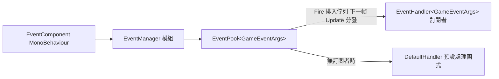

# 工作原理:事件分發與模組生命週期

本頁說明 Event 模組內部如何完成一次事件分發，以及 `EventManager` 作為框架模組的初始化、輪詢與關閉流程。核心結論：`Fire` 排入佇列、下一幀在 `Update` 中分發（執行緒安全）；`FireNow` 立即同步分發（非執行緒安全）；所有轉發都經 `EventComponent` → `EventManager` → `EventPool<GameEventArgs>` 三層完成。

## 事件分發流程

一次 `Fire` 的完整路徑只有四步：

1. 業務程式碼呼叫 `EventComponent.Fire(sender, e)`，元件把請求原樣轉發給內部的 `IEventManager`（透過 `GameFrameworkEntry.GetModule<IEventManager>()` 取得，見 `EventComponent.Awake`）。
2. `EventManager.Fire` 把事件壓入內部的 `EventPool<GameEventArgs>` 佇列，**不立即回呼任何處理函式**。
3. 框架每幀輪詢模組時，`EventManager.Update` 呼叫 `m_EventPool.Update(elapseSeconds, realElapseSeconds)`，把佇列中的事件按排入佇列的順序在**主執行緒**分發給對應 `id` 的訂閱者。
4. 分發完成後事件參數歸還參考池（`GameEventArgs` 衍生自 `BaseEventArgs`，空事件由 `ReferencePool.Acquire<EmptyEventArgs>()` 建立）。



兩層轉發的真實程式碼如下——元件層只做委派，管理器層持有真正的 `EventPool`：

```csharp
public void Fire(object sender, GameEventArgs e)
{
    m_EventManager.Fire(sender, e);
}
```

Source: [EventComponent.cs](https://github.com/GameFrameX/com.gameframex.unity.event/blob/main/Runtime/EventComponent.cs#L147-L150)

```csharp
public sealed class EventManager : GameFrameworkModule, IEventManager
{
    private readonly EventPool<GameEventArgs> m_EventPool;

    public EventManager()
    {
        m_EventPool = new EventPool<GameEventArgs>(EventPoolMode.AllowNoHandler | EventPoolMode.AllowMultiHandler);
    }
```

Source: [EventManager.cs](https://github.com/GameFrameX/com.gameframex.unity.event/blob/main/Runtime/Event/EventManager.cs#L39-L49)

建構時傳入的 `EventPoolMode` 旗標組合決定了本模組的分發行為：`AllowNoHandler` 允許事件沒有任何訂閱者時不報錯，`AllowMultiHandler` 允許同一 `id` 掛多個處理函式。

## 兩種拋出方式的區別

| 方法 | 分發時機 | 執行緒安全 | 適用場景 |
|------|----------|----------|----------|
| `Fire(sender, e)` | 拋出後的下一幀 | 是（子執行緒拋出也保證主執行緒回呼） | 常規遊戲邏輯事件 |
| `FireNow(sender, e)` | 立即同步分發 | 否（僅主執行緒呼叫） | 需要當場拿到回呼結果的場景 |
| `Fire(sender, eventId)` | 同 `Fire` | 是 | 無參數事件，內部自動建構 `EmptyEventArgs` |

`Fire(object sender, string eventId)` 多載會驗證事件編號非空，並從參考池取一個空事件物件：

```csharp
public void Fire(object sender, string eventId)
{
    GameFrameworkGuard.NotNullOrEmpty(eventId, nameof(eventId));
    m_EventManager.Fire(sender, EmptyEventArgs.Create(eventId));
}
```

Source: [EventComponent.cs](https://github.com/GameFrameX/com.gameframex.unity.event/blob/main/Runtime/EventComponent.cs#L157-L161)

`EmptyEventArgs.Create` 的實作證實了參考池路徑：

```csharp
public static EmptyEventArgs Create(string eventId)
{
    var eventArgs = ReferencePool.Acquire<EmptyEventArgs>();
    eventArgs.SetEventId(eventId);
    return eventArgs;
}
```

Source: [EmptyEventArgs.cs](https://github.com/GameFrameX/com.gameframex.unity.event/blob/main/Runtime/EventArgs/EmptyEventArgs.cs#L33-L38)

## 模組生命週期

`EventManager` 繼承自 `GameFrameworkModule`，由 `GameFrameworkEntry` 統一驅動。三個關鍵生命週期節點都只是對 `EventPool` 的透傳：

| 生命週期階段 | 觸發方 | EventManager 中的實作 |
|--------------|--------|----------------------|
| 初始化 | 建構函式 | 建立 `EventPool<GameEventArgs>` 並設定 `EventPoolMode` |
| 每幀輪詢 | 框架主循環 | `Update` 呼叫 `m_EventPool.Update(...)` 分發積壓事件 |
| 關閉 | 框架關閉流程 | `Shutdown` 呼叫 `m_EventPool.Shutdown()` 清空訂閱與佇列 |

```csharp
/// <summary>取得遊戲框架模組優先順序。</summary>
/// <remarks>優先順序較高的模組會優先輪詢，並且關閉操作會後進行。</remarks>
protected override int Priority
{
    get { return 7; }
}

protected override void Update(float elapseSeconds, float realElapseSeconds)
{
    m_EventPool.Update(elapseSeconds, realElapseSeconds);
}

protected override void Shutdown()
{
    m_EventPool.Shutdown();
}
```

Source: [EventManager.cs](https://github.com/GameFrameX/com.gameframex.unity.event/blob/main/Runtime/Event/EventManager.cs#L67-L92)

優先順序為 **7**：數值越大越早輪詢、越晚關閉。同時場景中的 `EventComponent` 帶有 `[GameFrameXAutoComponent(-7000)]` 標記，負責把 Unity 端的 MonoBehaviour 與該模組橋接起來；它在 `Awake` 中透過 `GameFrameworkEntry.GetModule<IEventManager>()` 取得管理器實例，取不到時輸出 `Log.Fatal("Event manager is invalid.")`。

```csharp
protected override void Awake()
{
    ImplementationComponentType = Utility.Assembly.GetType(componentType);
    InterfaceComponentType = typeof(IEventManager);
    base.Awake();
    m_EventManager = GameFrameworkEntry.GetModule<IEventManager>();
    if (m_EventManager == null)
    {
        Log.Fatal("Event manager is invalid.");
        return;
    }
}
```

Source: [EventComponent.cs](https://github.com/GameFrameX/com.gameframex.unity.event/blob/main/Runtime/EventComponent.cs#L66-L77)

因此對使用者而言的完整時序是：場景載入 → `EventComponent.Awake` 拿到模組 → 業務在任意時刻 `Subscribe` / `Fire` → 每幀 `Update` 分發 → 結束時 `Shutdown` 清理。

## 訂閱與退訂的內部行為

訂閱、退訂、檢查均直接操作 `EventPool` 的處理函式表，`EventManager` 本身不持有任何業務狀態：

```csharp
public void Subscribe(string id, EventHandler<GameEventArgs> handler)
{
    m_EventPool.Subscribe(id, handler);
}

public void CheckUnsubscribe(string id, EventHandler<GameEventArgs> handler)
{
    if (m_EventPool.Check(id, handler))
    {
        m_EventPool.Unsubscribe(id, handler);
    }
}
```

Source: [EventManager.cs](https://github.com/GameFrameX/com.gameframex.unity.event/blob/main/Runtime/Event/EventManager.cs#L120-L146)

元件層額外提供了防重複訂閱的 `CheckSubscribe`——先 `Check` 再 `Subscribe`，避免同一委派被登記兩次導致一次 `Fire` 觸發多次回呼：

```csharp
public void CheckSubscribe(string id, EventHandler<GameEventArgs> handler)
{
    if (!Check(id, handler))
    {
        m_EventManager.Subscribe(id, handler);
    }
}
```

Source: [EventComponent.cs](https://github.com/GameFrameX/com.gameframex.unity.event/blob/main/Runtime/EventComponent.cs#L105-L111)

另外可呼叫 `SetDefaultHandler(handler)` 設定預設處理函式：當某個事件 `id` 沒有任何訂閱者時，事件會被交給預設處理函式，常用於除錯時追蹤「發出去沒人接」的事件。`EventManager` 暴露的 `EventHandlerCount` / `EventCount` / `Count(id)` 可在執行階段觀察佇列與訂閱規模。

## 事件參數的繼承鏈

```csharp
public abstract class GameEventArgs : BaseEventArgs
{
}
```

Source: [GameEventArgs.cs](https://github.com/GameFrameX/com.gameframex.unity.event/blob/main/Runtime/EventArgs/GameEventArgs.cs#L38-L40)

所有可分發的事件參數都必須繼承 `GameEventArgs`（其基底類別 `BaseEventArgs` 來自 GameFrameX 執行階段函式庫，不在本儲存庫內，`BaseEventArgs` 與 `EventPool` 的完整實作細節原始碼中未隨本儲存庫提供）。儲存庫內自帶的 `EmptyEventArgs` 用於無參數事件，業務自訂事件同理：繼承 `GameEventArgs`、實作 `Id` 與 `Clear`，拋出後由參考池複用以避免 GC。

## 相關連結

- 關於如何在業務程式碼中訂閱與拋出事件，見《如何訂閱與拋出事件》任務頁（同目錄）。
- 元件掛載與 Inspector 資訊見 [EventComponent.cs](https://github.com/GameFrameX/com.gameframex.unity.event/blob/main/Runtime/EventComponent.cs) 與 [EventComponentInspector.cs](https://github.com/GameFrameX/com.gameframex.unity.event/blob/main/Editor/Inspector/EventComponentInspector.cs)。
- 管理器完整 API 見 [IEventManager.cs](https://github.com/GameFrameX/com.gameframex.unity.event/blob/main/Runtime/Event/IEventManager.cs) 與 [EventManager.cs](https://github.com/GameFrameX/com.gameframex.unity.event/blob/main/Runtime/Event/EventManager.cs)。