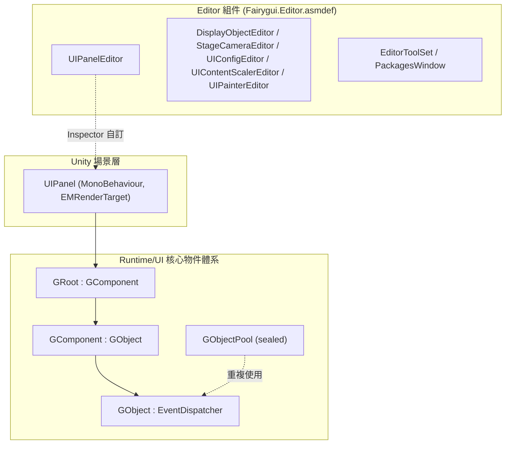

# 運作原理：執行階段結構與模組組成

FairyGUI Unity 執行階段(套件名稱 `com.gameframex.unity.fairygui.unity`,版本 5.3.5,基於 FairyGUI 官方原始碼)由兩個主要部分組成：**Runtime** 目錄負責以純 C# 為基礎的 UI 核心物件體系，**Editor** 目錄負責 Unity 編輯器擴充。UI 物件以 `GObject` 為根，按照 `GComponent → GRoot` 的順序逐級組合，最終掛載到 Unity 場景中的 `UIPanel`(MonoBehaviour)上以進行顯示。

## 套件基本資訊

| 項目 | 值 |
|------|------|
| 套件名稱 | `com.gameframex.unity.fairygui.unity` |
| 顯示名稱 | FairyGUI |
| 版本 | 5.3.5 |
| 最低 Unity 版本 | 2019.4 |
| Samples | 套件內建 Samples 範例(displayName: `Samples`) |

以上資訊取自 [package.json](https://github.com/GameFrameX/com.gameframex.unity.fairygui.unity/blob/main/package.json#L2-L10)。

## 目錄與模組組成

| 目錄/模組 | 內容 | 主要檔案範例 |
|------|------|------|
| `Runtime/UI` | UI 物件體系的核心：基礎物件、元件、根節點、物件池、面板掛載 | [GObject.cs](https://github.com/GameFrameX/com.gameframex.unity.fairygui.unity/blob/main/Runtime/UI/GObject.cs) |
| `Editor` | 編輯器擴充：各元件的 Inspector 自訂與工具視窗 | [UIPanelEditor.cs](https://github.com/GameFrameX/com.gameframex.unity.fairygui.unity/blob/main/Editor/UIPanelEditor.cs) |

在 `Editor` 目錄中確認到的編輯器擴充(皆位於命名空間 `FairyGUI.Editor`,由獨立的 [Fairygui.Editor.asmdef](https://github.com/GameFrameX/com.gameframex.unity.fairygui.unity/blob/main/Editor/Fairygui.Editor.asmdef) 定義組件邊界)：

- `DisplayObjectEditor` — 顯示物件 Inspector 自訂
- `StageCameraEditor` — 舞台攝影機 Inspector 自訂
- `UIConfigEditor` — UI 設定 Inspector 自訂
- `UIContentScalerEditor` — 內容縮放設定 Inspector 自訂
- `UIPainterEditor` — UI Painter Inspector 自訂
- `UIPanelEditor` — `UIPanel` 元件 Inspector 自訂
- `EditorToolSet` / `PackagesWindow` — 編輯器工具集與套件管理視窗

## UI 物件類別階層

執行階段的 UI 物件全部位於 `Runtime/UI`,繼承關係如下(程式碼為原始碼原文)：

```csharp
public class GObject : EventDispatcher
```

出處:[GObject.cs](https://github.com/GameFrameX/com.gameframex.unity.fairygui.unity/blob/main/Runtime/UI/GObject.cs#L7)

```csharp
public class GComponent : GObject
```

出處:[GComponent.cs](https://github.com/GameFrameX/com.gameframex.unity.fairygui.unity/blob/main/Runtime/UI/GComponent.cs#L14)

```csharp
public class GRoot : GComponent
```

出處:[GRoot.cs](https://github.com/GameFrameX/com.gameframex.unity.fairygui.unity/blob/main/Runtime/UI/GRoot.cs#L10)

```csharp
public sealed class GObjectPool
```

出處:[GObjectPool.cs](https://github.com/GameFrameX/com.gameframex.unity.fairygui.unity/blob/main/Runtime/UI/GObjectPool.cs#L10)

階層的意義：

- **`GObject`**:所有 UI 物件的基底類別，繼承事件分發器 `EventDispatcher`,統一事件處理。
- **`GComponent`**:容器元件，可包含並管理子級 `GObject`,構成組合樹的中間階層。
- **`GRoot`**:根容器，繼承自 `GComponent`,是 UI 樹的最上層進入點。
- **`GObjectPool`**(sealed):物件池，用於 UI 物件的重複使用。

## Unity 場景掛載：UIPanel

要將 `Runtime` 的 UI 物件樹顯示於 Unity 場景中，需透過 MonoBehaviour 元件 `UIPanel` 掛載到 GameObject 上：

```csharp
[AddComponentMenu("FairyGUI/UI Panel")]
public class UIPanel : MonoBehaviour, EMRenderTarget
```

出處:[UIPanel.cs](https://github.com/GameFrameX/com.gameframex.unity.fairygui.unity/blob/main/Runtime/UI/UIPanel.cs#L25-L27)

要點：

- `UIPanel` 同時實作 `EMRenderTarget` 介面，可作為渲染目標參與框架的渲染管線。
- 選單路徑為 `FairyGUI/UI Panel`,可從 Unity 元件選單 `Add Component → FairyGUI/UI Panel` 中新增。
- 與之對應的編輯器自訂為 `FairyGUI.UIPanelEditor`(`[CustomEditor(typeof(FairyGUI.UIPanel))]`,詳見 [UIPanelEditor.cs](https://github.com/GameFrameX/com.gameframex.unity.fairygui.unity/blob/main/Editor/UIPanelEditor.cs#L12-L14))。

## 模組結構概覽



## 相關連結

- UI 基底類別實作:[GObject.cs](https://github.com/GameFrameX/com.gameframex.unity.fairygui.unity/blob/main/Runtime/UI/GObject.cs)
- 容器元件:[GComponent.cs](https://github.com/GameFrameX/com.gameframex.unity.fairygui.unity/blob/main/Runtime/UI/GComponent.cs)
- 根容器:[GRoot.cs](https://github.com/GameFrameX/com.gameframex.unity.fairygui.unity/blob/main/Runtime/UI/GRoot.cs)
- Unity 掛載元件:[UIPanel.cs](https://github.com/GameFrameX/com.gameframex.unity.fairygui.unity/blob/main/Runtime/UI/UIPanel.cs)
- 編輯器擴充:[Editor 目錄](https://github.com/GameFrameX/com.gameframex.unity.fairygui.unity/blob/main/Editor)
- 套件說明檔案:[package.json](https://github.com/GameFrameX/com.gameframex.unity.fairygui.unity/blob/main/package.json)