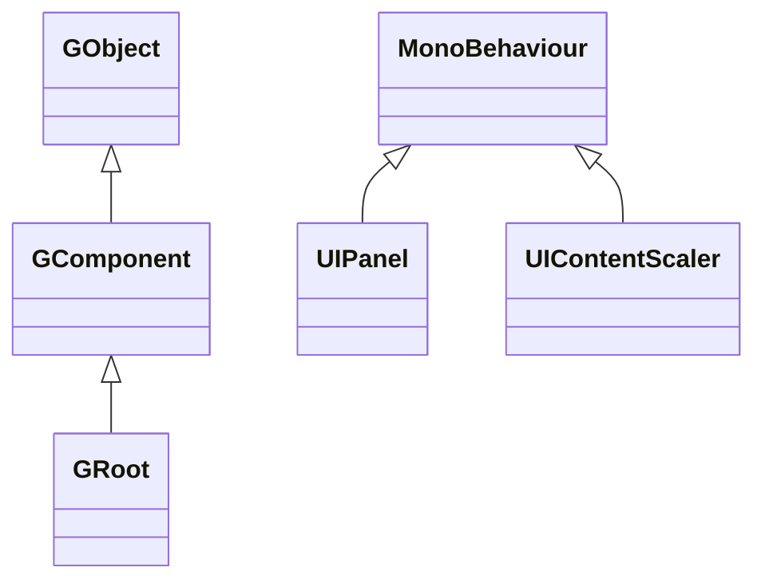

# FairyGUI for Unity 套件介紹

本套件是 [FairyGUI](https://www.fairygui.com/product.html) 的 GameFrameX 版 Unity 封裝版本：FairyGUI 是跨平台 UI 編輯器兼 UI 框架，本套件將其封裝為 Unity Package（UPM），並加入了防裁切、小遊戲鍵盤支援、編輯器捷徑選單等遊戲框架整合所需的變更。安裝本套件後，即可使用 FairyGUI 編輯器匯出的 UI 資源在 Unity 中建構 UI。

## 快速開始

### 1. 安裝套件

在 Unity 專案的 `Packages/manifest.json` 中加入 `scopedRegistries` 與相依套件（四種安裝方式擇一）：

```json
{
  "scopedRegistries": [
    {
      "name": "GameFrameX",
      "url": "https://gameframex.upm.alianblank.uk",
      "scopes": [
        "com.gameframex"
      ]
    }
  ],
  "dependencies": {
    "com.gameframex.unity.fairygui.unity": "5.3.3"
  }
}
```

來源：[README.md](https://github.com/GameFrameX/com.gameframex.unity.fairygui.unity/blob/main/README.md#L88-L104)

`scopes` 決定哪些套件會從此 registry 解析：只有以 `com.gameframex` 開頭的套件才會從這裡取得。

其他三種方式：

- 在 `manifest.json` 的 `dependencies` 中直接填入 Git 位址：`"com.gameframex.unity.fairygui.unity": "https://github.com/gameframex/com.gameframex.unity.fairygui.unity.git"`
- 在 Unity 的 **Package Manager** 中以 **Git URL** 加入：`https://github.com/gameframex/com.gameframex.unity.fairygui.unity.git`
- 將儲存庫複製到 Unity 專案的 `Packages` 目錄即可自動載入

來源：[README.md](https://github.com/GameFrameX/com.gameframex.unity.fairygui.unity/blob/main/README.md#L108-L115)

### 2. 確認安裝

回到 Unity，若選單列出現 `Tools > FairyGUI`，即表示安裝成功。這是本套件新增的編輯器捷徑開關入口（用於切換各編譯巨集）。

### 3. 使用 UI

- 從 [FairyGUI 官方網站](https://www.fairygui.com/product.html) 下載編輯器製作 UI，並將資源匯出至 Unity 專案；
- 在場景中透過 `UIPanel`（FairyGUI/UI Panel 元件）掛載 UI，或以 `GRoot` 作為 UI 根元件在程式碼中動態建立；
- 使用 `UIContentScaler`（FairyGUI/UI Content Scaler 元件）設定解析度適配。

本套件適用於 Unity 2019.4 以上版本，沒有其他相依套件。

## 運作原理摘要

套件內程式碼分為三層（Unity Package 標準目錄）：

| 目錄 | 內容 | 核心型別 |
|------|------|----------|
| `Runtime/UI` | 元件層：GObject 元件體系、UIPackage 資源包、UIPanel/UIContentScaler 的 MonoBehaviour 橋接 | `GObject`, `GComponent`, `GRoot`, `GList`, `GButton`, `GLoader`, `UIPanel`, `UIPackage` |
| `Runtime/Core` | 顯示層：顯示物件、渲染網格、點擊偵測、混合模式 | `DisplayObject`, `Container`, `Image`, `MeshFactory`, `PixelHitTest` |
| `Editor` | 編輯器擴充：Inspector 擴充、巨集開關選單 | `UIPanelEditor`, `UIConfigEditor`, `EditorToolSet` |

元件層繼承關係（可對照原始碼）：



- `GObject` 是所有 UI 元件的基底類別；`GComponent` 是可容納子物件的容器；`GRoot` 是 UI 樹的根節點（[GObject.cs](https://github.com/GameFrameX/com.gameframex.unity.fairygui.unity/blob/main/Runtime/UI/GObject.cs), [GComponent.cs](https://github.com/GameFrameX/com.gameframex.unity.fairygui.unity/blob/main/Runtime/UI/GComponent.cs#L14), [GRoot.cs](https://github.com/GameFrameX/com.gameframex.unity.fairygui.unity/blob/main/Runtime/UI/GRoot.cs#L10)）
- `UIPanel` 與 `UIContentScaler` 是附加至 Unity GameObject 的 `MonoBehaviour`，負責將 FairyGUI 元件樹連接到 Unity 場景與渲染（[UIPanel.cs](https://github.com/GameFrameX/com.gameframex.unity.fairygui.unity/blob/main/Runtime/UI/UIPanel.cs#L26), [UIContentScaler.cs](https://github.com/GameFrameX/com.gameframex.unity.fairygui.unity/blob/main/Runtime/UI/UIContentScaler.cs#L10)）

FairyGUI 內建 `FairyBatching` DrawCall 最佳化技術，並內建文字與圖片混合排版、emoji 輸入、虛擬列表／循環列表、像素級點擊偵測、弧形 UI、手勢、打字機效果等常見 UI 功能；滑鼠、單點觸控、多點觸控、VR 控制器等輸入皆統一封裝於單一互動程式碼體系。

## 相較官方版本的變更

本套件以 FairyGUI 官方 Unity 版本為基礎，進行了以下調整（[README.md](https://github.com/GameFrameX/com.gameframex.unity.fairygui.unity/blob/main/README.md#L28-L38)）：

1. 新增 Unity Package Manager 支援
2. 新增 `FairyGUICroppingHelper` 防裁切腳本
3. 新增 `link.xml` 剝離篩選
4. 修正非同步載入 AssetBundle 時無回呼的錯誤
5. 新增微信小遊戲、抖音小遊戲鍵盤輸入支援
6. 新增 `ENABLE_WECHAT_MINI_GAME` 巨集（用於微信小遊戲鍵盤支援，請勿與抖音同時啟用）
7. 新增 `ENABLE_DOUYIN_MINI_GAME` 巨集（用於抖音小遊戲鍵盤支援，請勿與微信同時啟用）
8. 新增 Unity 編輯器捷徑開關：`Tools > FairyGUI` 對應選單
9. 新增圖片像素化功能

## 相關連結

- [FairyGUI 官方教學](https://www.fairygui.com/docs/guide/index.html)
- [GameFrameX 文件](https://gameframex.doc.alianblank.com)
- [版本發佈記錄 / Changelog](https://github.com/GameFrameX/com.gameframex.unity.fairygui.unity/releases)
- 關於像素化功能的啟用與參數調整，請參考 [README.md](https://github.com/GameFrameX/com.gameframex.unity.fairygui.unity/blob/main/README.md#L40-L70)
- QQ 交流群組：467608841 / 233840761