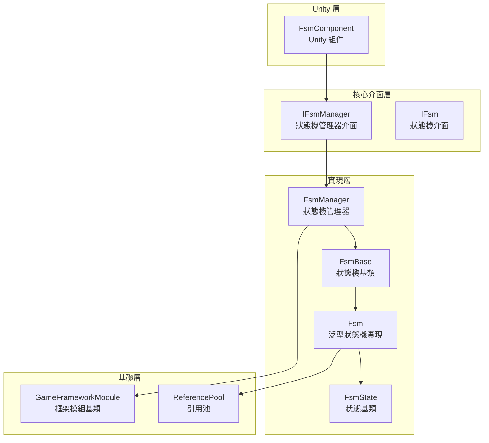
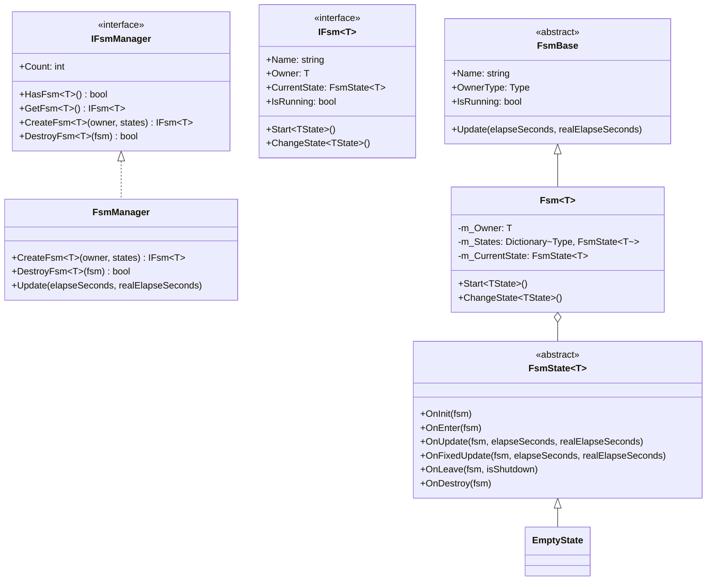
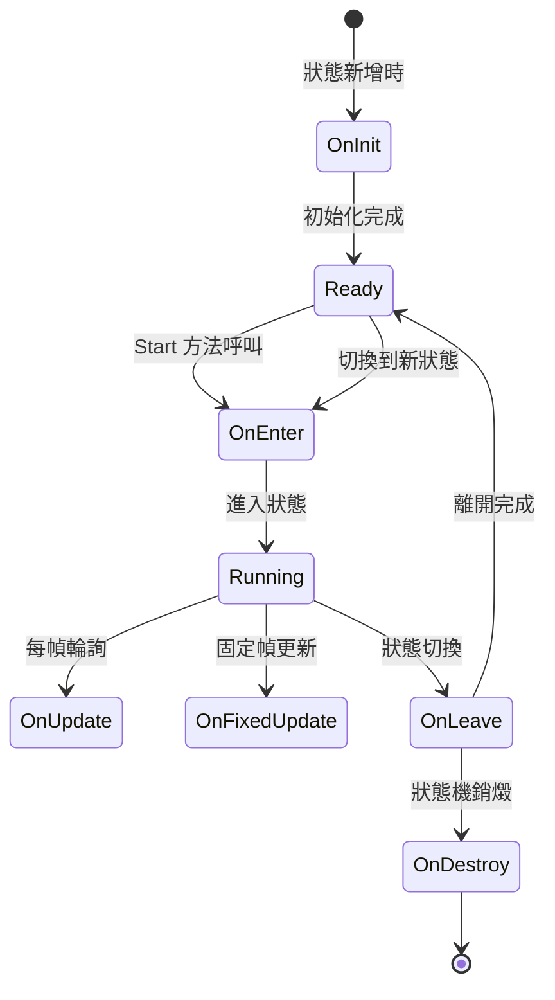
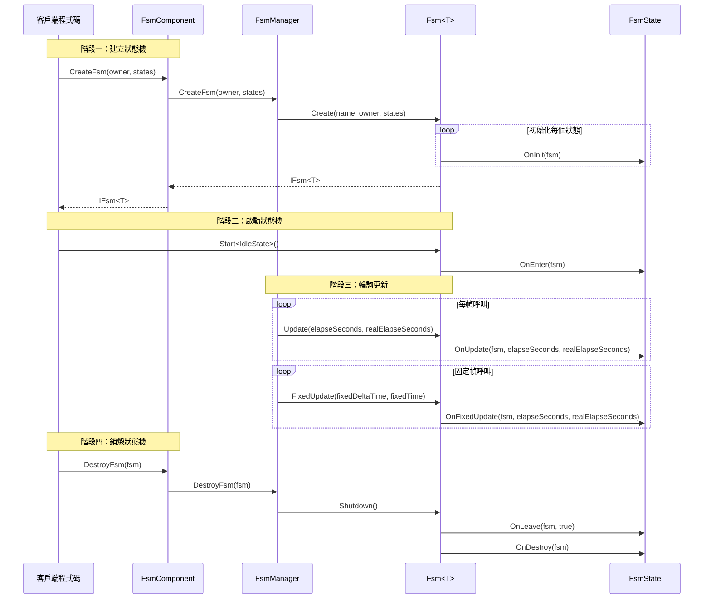

# 概述

GameFrameX 有限狀態機（FSM）組件是 GameFrameX 遊戲框架的核心模組之一，提供了完整的有限狀態機實現，用於管理遊戲物件的行為狀態轉換。該組件基於 Game Framework 開發，支援泛型型別約束，提供了狀態生命週期管理、狀態資料儲存、狀態切換等核心功能。

## 專案簡介

有限狀態機是一種行為設計模式，允許物件在其內部狀態改變時改變其行為。FSM 組件將物件的狀態封裝為獨立的狀態類，使得狀態轉換邏輯清晰可控，非常適合處理遊戲中的角色行為、AI 狀態機 UI 流程控制等場景。

**核心特性：**

- **泛型狀態機**：支援任意引用型別作為狀態機持有者
- **完整生命週期**：提供狀態初始化、進入、更新、固定更新、離開、銷燬等回呼
- **資料儲存**：支援在狀態機中儲存和檢索狀態相關資料
- **狀態切換**：提供型別安全和靈活的狀態切換機制
- **固定幀更新**：支援 FixedUpdate 物理更新
- **物件池整合**：使用引用池技術最佳化記憶體分配

## 系統架構

FSM 組件採用分層架構設計，透過介面抽象實現解耦。



**架構說明：**

| 層級 | 組件 | 職責 |
|------|------|------|
| Unity 層 | FsmComponent | 提供 Unity MonoBehaviour 封裝，整合到 Unity 生命週期 |
| 核心介面層 | IFsmManager, IFsm | 定義狀態機管理和狀態機的抽象介面 |
| 實現層 | FsmManager, Fsm, FsmState | 狀態機管理器、泛型狀態機、狀態基類的具體實現 |
| 基礎層 | GameFrameworkModule, ReferencePool | 框架基礎模組和物件池支援 |

## 核心組件

FSM 組件由以下核心型別組成：



**組件職責：**

| 型別 | 說明 |
|------|------|
| **FsmComponent** | Unity 組件，封裝 FsmManager，提供 Editor 和執行時訪問 |
| **FsmManager** | 狀態機管理器，負責建立、獲取、銷燬狀態機，管理所有狀態機例項 |
| **Fsm** | 泛型狀態機實現類，管理狀態集合、狀態資料、狀態轉換 |
| **FsmState** | 狀態基類，定義狀態的生命週期回呼方法 |
| **FsmBase** | 狀態機抽象基類，定義通用屬性和方法 |

## 狀態生命週期

狀態機中的每個狀態都有完整的生命週期回呼：



**生命週期回呼：**

| 回呼方法 | 呼叫時機 | 用途 |
|----------|----------|------|
| `OnInit` | 狀態被新增到狀態機時 | 初始化狀態資料，配置狀態引數 |
| `OnEnter` | 進入狀態時 | 狀態進入邏輯，如播放動畫、播放音效 |
| `OnUpdate` | 每幀輪詢時 | 狀態行為邏輯，條件判斷，狀態轉換檢查 |
| `OnFixedUpdate` | 固定幀更新時 | 物理相關邏輯 |
| `OnLeave` | 離開狀態時 | 狀態退出清理，資源釋放 |
| `OnDestroy` | 狀態機銷燬時 | 最終清理工作 |

## 快速開始

以下是使用 FSM 組件的基本示例：

### 定義狀態

首先，定義具體的狀態類繼承自 `FsmState<T>`：

```csharp
using GameFrameX.Fsm.Runtime;

// 定義角色類作為狀態機持有者
public class Character
{
    public string Name;
}

// 空閒狀態
public class IdleState : FsmState<Character>
{
    protected internal override void OnEnter(IFsm<Character> fsm)
    {
        base.OnEnter(fsm);
        UnityEngine.Debug.Log("進入空閒狀態");
    }

    protected internal override void OnUpdate(IFsm<Character> fsm, float elapseSeconds, float realElapseSeconds)
    {
        base.OnUpdate(fsm, elapseSeconds, realElapseSeconds);
        // 檢測是否應該進入移動狀態
    }
}

// 移動狀態
public class MoveState : FsmState<Character>
{
    protected internal override void OnEnter(IFsm<Character> fsm)
    {
        base.OnEnter(fsm);
        UnityEngine.Debug.Log("進入移動狀態");
    }

    protected internal override void OnLeave(IFsm<Character> fsm, bool isShutdown)
    {
        base.OnLeave(fsm, isShutdown);
        UnityEngine.Debug.Log("離開移動狀態");
    }
}
```

> Source: [README.md](https://github.com/GameFrameX/com.gameframex.unity.fsm/blob/main/README.md#L43-L78)

### 建立和使用狀態機

```csharp
// 建立角色
var character = new Character { Name = "Hero" };

// 透過 FsmComponent 建立狀態機
var fsm = fsmComponent.CreateFsm(character,
    new IdleState(),
    new MoveState());

// 啟動狀態機，從空閒狀態開始
fsm.Start<IdleState>();

// 在狀態內部切換到另一個狀態
// MoveState newState = fsm.GetState<MoveState>();
// newState.ChangeState<MoveState>(fsm);

// 銷燬狀態機
fsmComponent.DestroyFsm(fsm);
```

> Source: [README.md](https://github.com/GameFrameX/com.gameframex.unity.fsm/blob/main/README.md#L40-L65)

## 核心流程

FSM 組件的工作流程涉及建立、輪詢和銷燬三個主要階段：



## 狀態資料管理

FSM 組件提供了狀態資料儲存功能，可以在狀態機中儲存和檢索資料：

```csharp
// 設定資料
fsm.SetData("Health", new VarInt(100));
fsm.SetData("Speed", new VarFloat(5.0f));

// 獲取資料
VarInt health = fsm.GetData<VarInt>("Health");
int healthValue = health.Value;

// 檢查資料是否存在
if (fsm.HasData("Speed"))
{
    // 資料存在
}

// 移除資料
fsm.RemoveData("Health");
```

> Source: [Fsm.cs](https://github.com/GameFrameX/com.gameframex.unity.fsm/blob/main/Runtime/Fsm/Fsm.cs#L445-L507)

## Unity 整合

FsmComponent 作為 Unity 組件整合到遊戲場景中，自動管理狀態機的生命週期：

```csharp
[DisallowMultipleComponent]
[AddComponentMenu("Game Framework/FSM")]
public sealed class FsmComponent : GameFrameworkComponent
{
    private IFsmManager m_FsmManager = null;

    protected override void Awake()
    {
        base.Awake();
        m_FsmManager = GameFrameworkEntry.GetModule<IFsmManager>();
    }

    private void FixedUpdate()
    {
        m_FsmManager.FixedUpdate(Time.fixedDeltaTime, Time.fixedTime);
    }
}
```

> Source: [FsmComponent.cs](https://github.com/GameFrameX/com.gameframex.unity.fsm/blob/main/Runtime/Fsm/FsmComponent.cs#L22-L53)

## 相關連結

- [安裝指南](./2-installation)
- [快速開始](./3-getting-started)
- [核心概念](./04.features.md)
- [API 參考](./5-api-reference)
- [常見問題](./6-troubleshooting)
- [GitHub 倉庫](https://github.com/GameFrameX/com.gameframex.unity.fsm.git)
- [GameFrameX 官方網站](https://gameframex.doc.alianblank.com)
