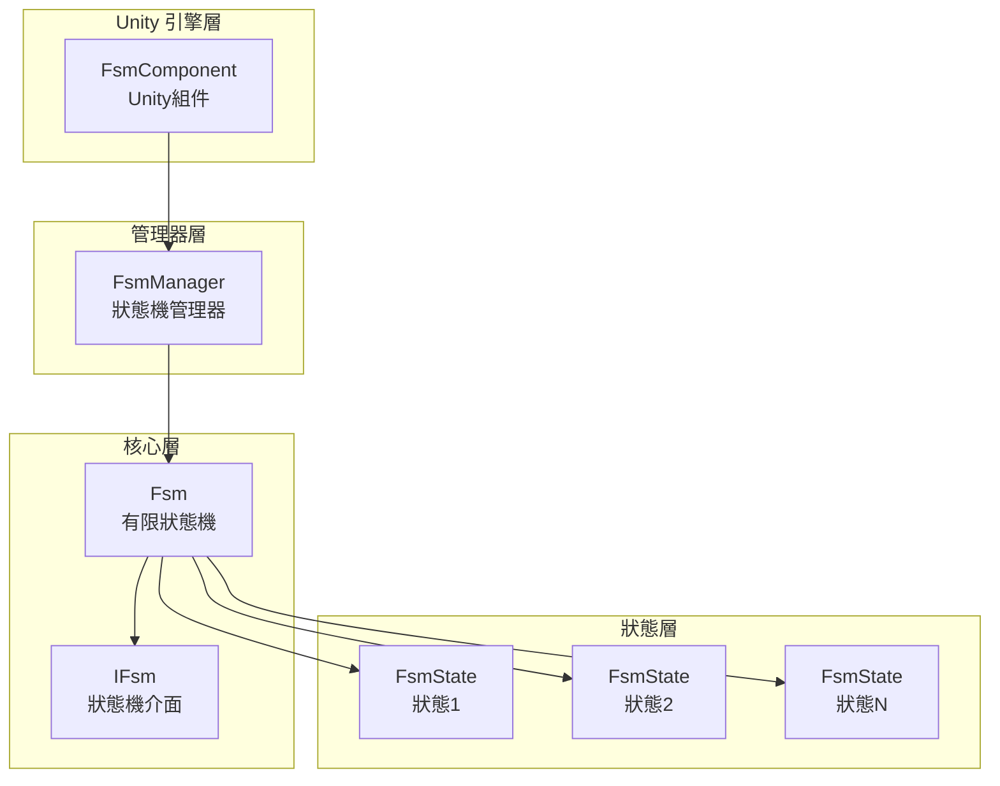
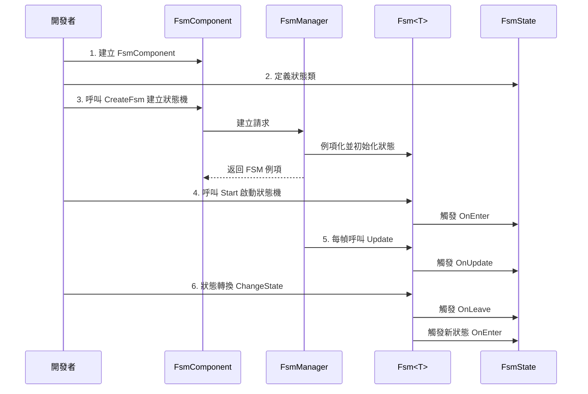

# 快速開始

本指南將幫助您快速上手使用 GameFrameX FSM 有限狀態機組件。透過幾個簡單的步驟，您就可以在 Unity 專案中建立和管理有限狀態機。

## 概述

GameFrameX FSM 是一個輕量級但功能強大的有限狀態機系統，專為 Unity 遊戲開發設計。它提供了一種結構化的方式來管理遊戲物件的狀態轉換，特別適用於：
- 角色行為狀態機（待機、行走、攻擊、死亡等）
- UI 介面狀態管理
- 遊戲流程控制
- AI 行為邏輯

## 核心概念

在開始之前，瞭解以下核心概念會很有幫助：

| 概念 | 說明 |
|------|------|
| **FsmComponent** | Unity 組件，用於在場景中管理狀態機 |
| **FsmManager** | 狀態機管理器，負責建立、銷燬和更新所有狀態機 |
| **`FsmState<T>`** | 狀態基類，定義狀態的生命週期鉤子 |
| **`IFsm<T>`** | 狀態機介面，提供狀態機操作方法 |
| **Owner** | 狀態機持有者，通常是遊戲物件或管理器類 |

## 系統架構



### 組件職責

| 組件 | 職責 |
|------|------|
| **FsmComponent** | 作為 Unity 組件，提供 FsmManager 的初始化和 Update 輪詢 |
| **FsmManager** | 管理所有 FSM 例項，提供建立、獲取、銷燬方法 |
| **`Fsm<T>`** | 具體的狀態機實現，管理狀態集合和狀態轉換 |
| **`FsmState<T>`** | 定義狀態的回呼方法，子類實現具體邏輯 |

## 使用流程



## 快速示例

### 步驟 1：新增 FsmComponent

在 Unity 場景中建立一個空物體，然後新增 `FsmComponent` 組件：

```csharp
// FsmComponent 是 Unity 組件，掛載到 GameObject 上即可使用
// 在 Unity 編輯器中：GameObject -> Add Component -> Game Framework -> FSM
```
> Source: [FsmComponent.cs](https://github.com/GameFrameX/com.gameframex.unity.fsm/blob/main/Runtime/Fsm/FsmComponent.cs#L20-L22)

### 步驟 2：定義狀態類

建立具體的狀態類，繼承 `FsmState<T>`：

```csharp
using GameFrameX.Fsm.Runtime;

// 定義狀態機持有者型別
public class Player
{
    public string Name;
}

// 待機狀態
public class IdleState : FsmState<Player>
{
    protected internal override void OnEnter(IFsm<Player> fsm)
    {
        base.OnEnter(fsm);
        UnityEngine.Debug.Log("玩家進入待機狀態");
    }

    protected internal override void OnUpdate(IFsm<Player> fsm, float elapseSeconds, float realElapseSeconds)
    {
        base.OnUpdate(fsm, elapseSeconds, realElapseSeconds);
        // 在這裡檢測是否需要切換到其他狀態
        // 例如：檢測到移動輸入時切換到行走狀態
    }

    protected internal override void OnLeave(IFsm<Player> fsm, bool isShutdown)
    {
        base.OnLeave(fsm, isShutdown);
        UnityEngine.Debug.Log("玩家離開待機狀態");
    }
}

// 行走狀態
public class RunState : FsmState<Player>
{
    protected internal override void OnEnter(IFsm<Player> fsm)
    {
        base.OnEnter(fsm);
        UnityEngine.Debug.Log("玩家進入行走狀態");
    }

    protected internal override void OnLeave(IFsm<Player> fsm, bool isShutdown)
    {
        base.OnLeave(fsm, isShutdown);
        UnityEngine.Debug.Log("玩家離開行走狀態");
    }
}
```
> Source: [FsmState.cs](https://github.com/GameFrameX/com.gameframex.unity.fsm/blob/main/Runtime/Fsm/FsmState.cs#L17-L77)

### 步驟 3：建立並啟動狀態機

```csharp
using UnityEngine;
using GameFrameX.Fsm.Runtime;

public class PlayerController : MonoBehaviour
{
    private FsmComponent fsmComponent;
    private IFsm<Player> playerFsm;
    private Player player;

    private void Start()
    {
        // 獲取 FsmComponent 組件
        fsmComponent = GetComponent<FsmComponent>();
        
        // 建立玩家物件
        player = new Player { Name = "Hero" };
        
        // 建立狀態機（使用 params 引數）
        playerFsm = fsmComponent.CreateFsm(player, 
            new IdleState(), 
            new RunState());
        
        // 啟動狀態機，進入第一個狀態
        playerFsm.Start<IdleState>();
    }

    private void Update()
    {
        // 狀態機由 FsmComponent 自動更新
        // 這裡可以處理外部輸入，觸發狀態轉換
    }

    // 切換到行走狀態
    public void StartRun()
    {
        ChangeState<RunState>(playerFsm);
    }

    // 切換到待機狀態
    public void StopRun()
    {
        ChangeState<IdleState>(playerFsm);
    }

    private void OnDestroy()
    {
        // 場景銷燬時清理狀態機
        if (fsmComponent != null && playerFsm != null)
        {
            fsmComponent.DestroyFsm(playerFsm);
        }
    }
}
```
> Source: [Fsm.cs](https://github.com/GameFrameX/com.gameframex.unity.fsm/blob/main/Runtime/Fsm/Fsm.cs#L230-L249)

### 步驟 4：在狀態中進行狀態轉換

在狀態類內部切換狀態：

```csharp
public class IdleState : FsmState<Player>
{
    protected internal override void OnUpdate(IFsm<Player> fsm, float elapseSeconds, float realElapseSeconds)
    {
        base.OnUpdate(fsm, elapseSeconds, realElapseSeconds);
        
        // 假設有一個檢測移動輸入的方法
        if (Input.GetKey(KeyCode.W))
        {
            // 切換到行走狀態
            ChangeState<RunState>(fsm);
        }
    }
}
```
> Source: [FsmState.cs](https://github.com/GameFrameX/com.gameframex.unity.fsm/blob/main/Runtime/Fsm/FsmState.cs#L84-L93)

## 高階用法

### 使用資料儲存

FSM 提供了一個鍵值對資料儲存系統，可以在狀態機中儲存和讀取資料：

```csharp
// 設定資料
playerFsm.SetData("LastAttackTime", 0f);
playerFsm.SetData("Health", 100);

// 讀取資料
float lastAttackTime = playerFsm.GetData<float>("LastAttackTime");
int health = playerFsm.GetData<int>("Health");

// 檢查資料是否存在
if (playerFsm.HasData("Health"))
{
    // 資料存在
}
```
> Source: [Fsm.cs](https://github.com/GameFrameX/com.gameframex.unity.fsm/blob/main/Runtime/Fsm/Fsm.cs#L390-L481)

### 獲取當前狀態資訊

```csharp
// 獲取當前狀態名稱
string currentStateName = playerFsm.CurrentStateName;

// 獲取當前狀態持續時間
float stateTime = playerFsm.CurrentStateTime;

// 獲取當前狀態例項
FsmState<Player> currentState = playerFsm.CurrentState;

// 檢查狀態機是否正在執行
bool isRunning = playerFsm.IsRunning;

// 獲取狀態數量
int stateCount = playerFsm.FsmStateCount;
```
> Source: [Fsm.cs](https://github.com/GameFrameX/com.gameframex.unity.fsm/blob/main/Runtime/Fsm/Fsm.cs#L56-L102)

### 狀態機銷燬

```csharp
// 方法1：透過泛型銷燬
fsmComponent.DestroyFsm<Player>();

// 方法2：透過例項銷燬
fsmComponent.DestroyFsm(playerFsm);

// 方法3：透過名稱銷燬
fsmComponent.DestroyFsm<Player>("MyFsm");
```
> Source: [FsmComponent.cs](https://github.com/GameFrameX/com.gameframex.unity.fsm/blob/main/Runtime/Fsm/FsmComponent.cs#L206-L267)

## 常見示例：角色狀態機

以下是一個典型的角色狀態機完整示例：

```csharp
// 角色類
public class Character
{
    public string Name;
    public int Health = 100;
}

// 狀態定義
public class CharacterIdleState : FsmState<Character> { }
public class CharacterWalkState : FsmState<Character> { }
public class CharacterAttackState : FsmState<Character> { }
public class CharacterDeadState : FsmState<Character> { }

// 使用
public class CharacterController : MonoBehaviour
{
    private FsmComponent fsmComponent;
    private IFsm<Character> characterFsm;

    private void Start()
    {
        fsmComponent = GetComponent<FsmComponent>();
        var character = new Character { Name = "Hero" };
        
        // 建立包含所有狀態的狀態機
        characterFsm = fsmComponent.CreateFsm(character,
            new CharacterIdleState(),
            new CharacterWalkState(),
            new CharacterAttackState(),
            new CharacterDeadState());
        
        // 啟動初始狀態
        characterFsm.Start<CharacterIdleState>();
    }

    private void Update()
    {
        // 外部控制狀態轉換
        if (Input.GetKeyDown(KeyCode.W))
            ChangeState<CharacterWalkState>(characterFsm);
        else if (Input.GetKeyDown(KeyCode.J))
            ChangeState<CharacterAttackState>(characterFsm);
        else if (Input.GetKeyDown(KeyCode.K))
            ChangeState<CharacterDeadState>(characterFsm);
    }
}
```
> Source: [FsmComponent.cs](https://github.com/GameFrameX/com.gameframex.unity.fsm/blob/main/Runtime/Fsm/FsmComponent.cs#L156-L204)

## 最佳實踐

### 1. 狀態數量控制

建議每個狀態機的狀態數量控制在 5-10 個以內。如果狀態過多，考慮拆分為多個獨立的狀態機。

### 2. 狀態切換邏輯

- **外部切換**：在 MonoBehaviour 的 Update 中根據輸入切換狀態
- **內部切換**：在 FsmState 的 OnUpdate 中根據條件自動切換

### 3. 資料管理

使用 FSM 的資料儲存功能，避免在 MonoBehaviour 中儲存與狀態相關的資料，這樣可以：
- 保持狀態邏輯的完整性
- 便於狀態切換時資料傳遞
- 更容易除錯和追蹤

### 4. 資源清理

確保在 OnDestroy 或場景切換時銷燬不再使用的狀態機：

```csharp
private void OnDestroy()
{
    if (fsmComponent != null && playerFsm != null)
    {
        fsmComponent.DestroyFsm(playerFsm);
    }
}
```

## 相關連結

- [核心概念](./04.features.md) - 深入瞭解 FSM 的核心設計
- [API 參考](./5-api-reference) - 完整的 API 文件
- [安裝指南](./2-installation) - 安裝和配置
- [概述](./1-overview) - 專案整體介紹
