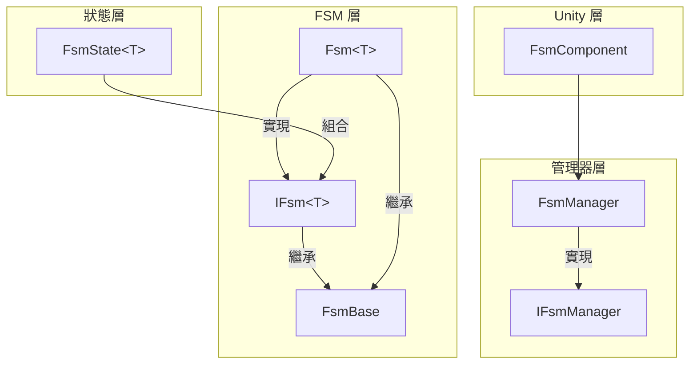
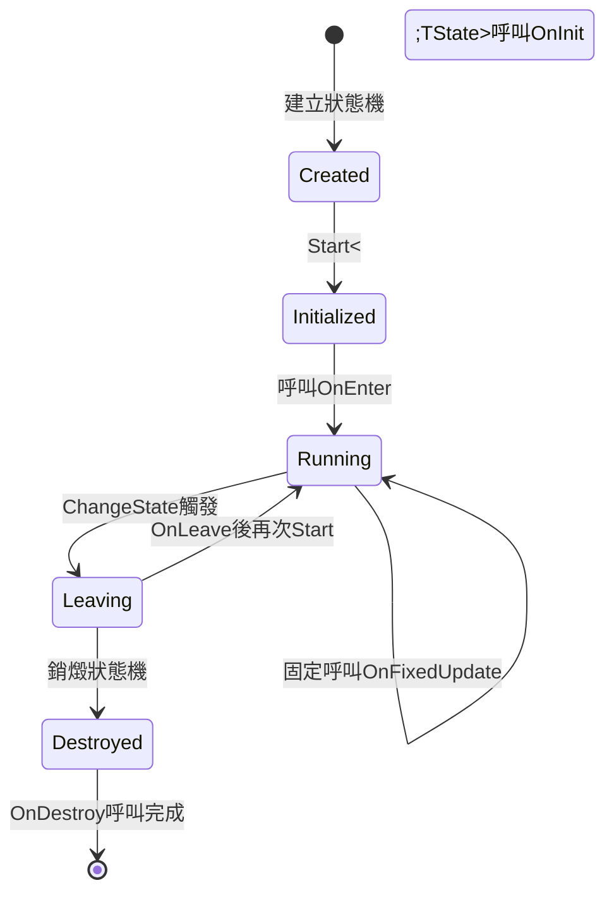
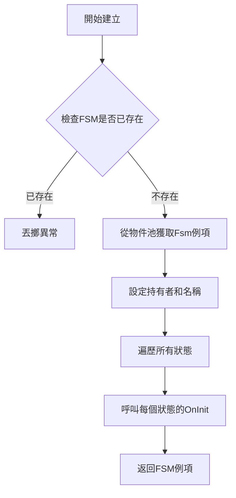

# 核心概念

本文件詳細介紹 GameFrameX 有限狀態機（FSM）組件的核心概念、架構設計和關鍵機制。FSM 組件為 Unity 遊戲開發提供了健壯的狀態管理能力，支援狀態生命週期管理、狀態轉換和資料儲存等功能。

## 概述

有限狀態機（Finite State Machine，簡稱 FSM）是一種行為設計模式，它允許物件在有限個狀態之間進行切換。在遊戲開發中，FSM 廣泛應用於 AI 行為管理、遊戲流程控制、角色狀態切換等場景。

GameFrameX FSM 組件基於 Game Framework 架構設計，提供以下核心能力：

- **泛型狀態機** - 支援強型別的狀態機定義，編譯時型別檢查
- **狀態生命週期管理** - 完整的狀態初始化、進入、更新、離開、銷燬回呼
- **狀態資料儲存** - 內建鍵值對資料儲存機制
- **物件池支援** - 自動記憶體管理和物件複用
- **Unity 組件整合** - 提供 FsmComponent 便於在 Unity 場景中使用

## 系統架構

GameFrameX FSM 採用分層架構設計，從底層到上層依次為：狀態層、FSM 層和管理器層。這種分層設計確保了職責分離和程式碼可維護性。



### 各層職責

**狀態層（FsmState<T>）** 是狀態的具體實現基類。開發者透過繼承該類來定義具體的狀態，每個狀態實現自己的業務邏輯。狀態層定義了狀態的六個生命週期回呼方法，用於響應狀態機的各種事件。

**FSM 層（IFsm<T> 和 Fsm<T>）** 是狀態機的核心實現。IFsm<T> 介面定義了狀態機的所有操作，包括狀態查詢、狀態轉換、資料存取等。Fsm<T> 是該介面的泛型實現，維護狀態集合、當前狀態、狀態持續時間等執行時資料。

**管理器層（IFsmManager 和 FsmManager）** 負責管理整個系統的 FSM 例項。FsmManager 繼承自 GameFrameworkModule，作為遊戲框架的一個模組提供服務。它維護所有 FSM 例項的引用，負責建立、查詢、銷燬和輪詢更新。

## 核心組件

### FsmState<T> 狀態基類

FsmState<T> 是所有具體狀態的抽象基類。它定義了狀態的六個生命週期回呼方法，這些方法由狀態機在適當的時機自動呼叫。開發者只需重寫需要的方法，無需關注呼叫時機。

```csharp
public abstract class FsmState<T> where T : class
{
    // 狀態初始化時呼叫
    protected internal virtual void OnInit(IFsm<T> fsm) { }
    
    // 狀態進入時呼叫
    protected internal virtual void OnEnter(IFsm<T> fsm) { }
    
    // 狀態每幀更新時呼叫
    protected internal virtual void OnUpdate(IFsm<T> fsm, float elapseSeconds, float realElapseSeconds) { }
    
    // 狀態固定更新時呼叫（物理相關）
    protected internal virtual void OnFixedUpdate(IFsm<T> fsm, float elapseSeconds, float realElapseSeconds) { }
    
    // 狀態離開時呼叫
    protected internal virtual void OnLeave(IFsm<T> fsm, bool isShutdown) { }
    
    // 狀態銷燬時呼叫
    protected internal virtual void OnDestroy(IFsm<T> fsm) { }
    
    // 切換到其他狀態
    public void ChangeToState<TState>(IFsm<T> fsm) where TState : FsmState<T>
    protected void ChangeState<TState>(IFsm<T> fsm) where TState : FsmState<T>
}
```

> Source: [FsmState.cs](https://github.com/GameFrameX/com.gameframex.unity.fsm/blob/main/Runtime/Fsm/FsmState.cs#L17-L136)

**設計意圖**：使用模板方法模式定義狀態的標準行為框架。每個狀態只需關注自己的特定邏輯，狀態機負責在正確的時機呼叫正確的方法。這種設計將狀態的通用行為抽象到基類，具體行為留給子類實現。

### IFsm<T> 狀態機介面

IFsm<T> 介面定義了狀態機的完整操作集合。透過泛型引數 T，狀態機可以型別安全地持有任意型別的物件。

```csharp
public interface IFsm<T> where T : class
{
    // 屬性
    string Name { get; }
    string FullName { get; }
    T Owner { get; }
    int FsmStateCount { get; }
    bool IsRunning { get; }
    bool IsDestroyed { get; }
    FsmState<T> CurrentState { get; }
    float CurrentStateTime { get; }
    
    // 方法
    void Start<TState>() where TState : FsmState<T>;
    void Start(Type stateType);
    bool HasState<TState>() where TState : FsmState<T>;
    TState GetState<TState>() where TState : FsmState<T>;
    FsmState<T>[] GetAllStates();
    bool HasData(string name);
    TData GetData<TData>(string name) where TData : Variable;
    void SetData<TData>(string name, TData data) where TData : Variable;
    bool RemoveData(string name);
}
```

> Source: [IFsm.cs](https://github.com/GameFrameX/com.gameframex.unity.fsm/blob/main/Runtime/Fsm/IFsm.cs#L18-L179)

**設計意圖**：介面隔離原則的典型應用。透過 IFsm<T> 介面，狀態可以在執行時獲取狀態機的完整控制權，包括切換狀態、儲存資料等。這種設計使得狀態類可以完全控制狀態機的行為。

### FsmManager 狀態機管理器

FsmManager 是系統的核心管理器，負責所有 FSM 例項的生命週期管理。

```csharp
public sealed class FsmManager : GameFrameworkModule, IFsmManager
{
    // 建立狀態機
    public IFsm<T> CreateFsm<T>(T owner, params FsmState<T>[] states) where T : class;
    public IFsm<T> CreateFsm<T>(string name, T owner, params FsmState<T>[] states) where T : class;
    
    // 獲取狀態機
    public IFsm<T> GetFsm<T>() where T : class;
    public IFsm<T> GetFsm<T>(string name) where T : class;
    
    // 檢查狀態機存在
    public bool HasFsm<T>() where T : class;
    
    // 銷燬狀態機
    public bool DestroyFsm<T>(IFsm<T> fsm) where T : class;
    
    // 輪詢更新
    public void FixedUpdate(float fixedDeltaTime, float fixedTime);
}
```

> Source: [FsmManager.cs](https://github.com/GameFrameX/com.gameframex.unity.fsm/blob/main/Runtime/Fsm/FsmManager.cs#L18-L436)

**設計意圖**：單例管理器模式在遊戲開發中的典型應用。FsmManager 作為遊戲框架的一個模組，自動參與遊戲框架的初始化和關閉流程。透過 GameFrameworkEntry 獲取模組例項，確保模組在系統中全域性唯一。

### FsmComponent Unity 組件

FsmComponent 是面向 Unity 引擎的組件封裝，提供編輯器友好的狀態機管理方式。

```csharp
[DisallowMultipleComponent]
[AddComponentMenu("Game Framework/FSM")]
public sealed class FsmComponent : GameFrameworkComponent
{
    // 所有操作都委託給 m_FsmManager
    private IFsmManager m_FsmManager = null;
    
    protected override void Awake()
    {
        base.Awake();
        m_FsmManager = GameFrameworkEntry.GetModule<IFsmManager>();
    }
    
    private void FixedUpdate()
    {
        m_FsmManager.FixedUpdate(Time.fixedDeltaTime, Time.fixedTime);
    }
}
```

> Source: [FsmComponent.cs](https://github.com/GameFrameX/com.gameframex.unity.fsm/blob/main/Runtime/Fsm/FsmComponent.cs#L22-L53)

**設計意圖**：介面卡模式的體現。FsmComponent 將底層的 FsmManager 功能適配為 Unity 組件形式，開發者可以直接在 Unity 編輯器中新增和管理狀態機組件，無需手動編寫初始化程式碼。

## 狀態生命週期

理解狀態的六個生命週期回呼是正確使用 FSM 的關鍵。每個回呼都有其特定的設計目的和呼叫時機。



### 生命週期詳解

**OnInit - 初始化階段**

當狀態機建立時，所有狀態都會呼叫一次 OnInit 方法。此時狀態機尚未啟動，當前狀態為 null。這個階段適合進行狀態的靜態初始化，例如快取其他狀態的引用。

```csharp
protected internal override void OnInit(IFsm<Character> fsm)
{
    // 快取常駐狀態引用
    var idleState = fsm.GetState<IdleState>();
    var runState = fsm.GetState<RunState>();
    // ...
}
```

**OnEnter - 進入階段**

當狀態被設定為當前狀態時呼叫。在狀態轉換完成後、新狀態開始執行前呼叫。適合執行狀態的進入邏輯，如播放動畫、設定引數等。

```csharp
protected internal override void OnEnter(IFsm<Character> fsm)
{
    // 播放進入動畫
    Owner.PlayAnimation("Idle");
    // 重置狀態資料
    fsm.SetData("AttackCount", 0);
}
```

**OnUpdate - 更新階段**

每幀呼叫一次，接收邏輯流逝時間（elapseSeconds）和真實流逝時間（realElapseSeconds）。適合放置需要每幀執行的邏輯，如輸入檢測、AI 決策等。

```csharp
protected internal override void OnUpdate(IFsm<Character> fsm, float elapseSeconds, float realElapseSeconds)
{
    // 檢測是否需要切換狀態
    if (fsm.GetData<bool>("IsHurt"))
    {
        ChangeState<HurtState>(fsm);
    }
}
```

**OnFixedUpdate - 固定更新階段**

與 OnUpdate 類似，但按照固定時間間隔呼叫，適合物理相關的邏輯。

**OnLeave - 離開階段**

當狀態即將離開時呼叫。引數 isShutdown 表示是正常狀態轉換（false）還是狀態機關閉（true）。適合執行清理工作，如停止動畫、儲存狀態等。

```csharp
protected internal override void OnLeave(IFsm<Character> fsm, bool isShutdown)
{
    // 儲存狀態資料
    var attackCount = fsm.GetData<int>("AttackCount");
    // 停止當前動畫
    Owner.StopAnimation();
}
```

**OnDestroy - 銷燬階段**

當狀態機被銷燬時呼叫。這是狀態的最後一個生命週期回呼，適合執行最終的清理工作，釋放所有資源。

## 狀態轉換機制

狀態轉換是 FSM 的核心功能。FsmState<T> 提供了三種切換狀態的方法，適用於不同的使用場景。

```mermaid
sequenceDiagram
    participant StateA as 當前狀態
    participant FSM as Fsm<T>
    participant StateB as 目標狀態
    
    StateA->>FSM: OnUpdate 檢測轉換條件
    StateA->>FSM: ChangeState&lt;TargetState&gt;(fsm)
    FSM->>StateA: OnLeave(this, false)
    FSM->>FSM: 重置 CurrentStateTime
    FSM->>FSM: 更新 CurrentState
    FSM->>StateB: OnEnter(this)
```

### 狀態轉換方法

**公開方法（公開給外部呼叫者）**

```csharp
// 在 FsmState 內部呼叫
public void ChangeToState<TState>(IFsm<T> fsm) where TState : FsmState<T>
```

> Source: [FsmState.cs](https://github.com/GameFrameX/com.gameframex.unity.fsm/blob/main/Runtime/Fsm/FsmState.cs#L84-L93)

此方法允許從狀態內部觸發狀態轉換。它首先呼叫舊狀態的 OnLeave 方法，然後更新當前狀態引用，最後呼叫新狀態的 OnEnter 方法。

**受保護方法（供子類呼叫）**

```csharp
// 供子類在 OnUpdate 等方法中呼叫
protected void ChangeState<TState>(IFsm<T> fsm) where TState : FsmState<T>
```

這是最常用的狀態切換方式。開發者通常在 OnUpdate 方法中檢測轉換條件，然後呼叫此方法切換到下一個狀態。

**型別引數方法**

```csharp
// 透過 Type 物件切換狀態
protected void ChangeState(IFsm<T> fsm, Type stateType)
```

適用於需要動態決定目標狀態型別的場景，如根據配置表或執行時資料選擇狀態。

## 狀態資料儲存

FSM 提供了內建的鍵值對資料儲存機制，允許在狀態機和狀態之間共享資料。這一設計避免了使用全域性變數或額外的資料傳遞機制。

### 資料儲存介面

```csharp
// 檢查資料是否存在
bool HasData(string name);

// 獲取資料
TData GetData<TData>(string name) where TData : Variable;
Variable GetData(string name);

// 設定資料
void SetData<TData>(string name, TData data) where TData : Variable;
void SetData(string name, Variable data);

// 移除資料
bool RemoveData(string name);
```

> Source: [IFsm.cs](https://github.com/GameFrameX/com.gameframex.unity.fsm/blob/main/Runtime/Fsm/IFsm.cs#L136-L178)

### 使用示例

```csharp
// 儲存資料
fsm.SetData("Score", new Variable<int>(100));
fsm.SetData("PlayerName", new Variable<string>("Hero"));

// 讀取資料
var score = fsm.GetData<Variable<int>>("Score");
var playerName = fsm.GetData<Variable<string>>("PlayerName");

// 檢查存在
if (fsm.HasData("Power"))
{
    var power = fsm.GetData<Variable<int>>("Power");
}
```

**設計意圖**：使用 Variable 包裝原始型別，實現更靈活的資料儲存。透過 ReferencePool，資料物件可以在使用完畢後回收再利用，減少垃圾回收壓力。

## 狀態機建立流程

建立狀態機是使用 FSM 的第一步。理解建立流程有助於正確初始化狀態機。



### 建立程式碼示例

```csharp
// 方式1：不指定名稱
IFsm<Character> fsm = FsmManager.Instance.CreateFsm(character,
    new IdleState(),
    new RunState(),
    new JumpState(),
    new AttackState());

// 方式2：指定名稱（用於同一型別多個FSM）
IFsm<Character> fsm = FsmManager.Instance.CreateFsm("PlayerFSM", character,
    new IdleState(),
    new RunState(),
    new JumpState(),
    new AttackState());

// 方式3：使用List
var states = new List<FsmState<Character>>
{
    new IdleState(),
    new RunState(),
    new JumpState()
};
IFsm<Character> fsm = FsmManager.Instance.CreateFsm(character, states);

// 啟動狀態機
fsm.Start<IdleState>();
```

> Source: [FsmManager.cs](https://github.com/GameFrameX/com.gameframex.unity.fsm/blob/main/Runtime/Fsm/FsmManager.cs#L268-L325)

**重要提示**：建立狀態機時必須至少新增一個狀態，否則會丟擲異常。狀態機建立後需要顯式呼叫 Start 方法才能啟動。

## 記憶體管理

GameFrameX FSM 組件採用物件池技術進行記憶體最佳化，減少遊戲執行時的垃圾回收壓力。

### 物件池機制

FSM 例項和狀態資料都透過 ReferencePool 進行管理：

```csharp
// 建立時從物件池獲取
Fsm<T> fsm = ReferencePool.Acquire<Fsm<T>>();

// 銷燬時返回物件池
internal override void Shutdown()
{
    ReferencePool.Release(this);
}
```

> Source: [Fsm.cs](https://github.com/GameFrameX/com.gameframex.unity.fsm/blob/main/Runtime/Fsm/Fsm.cs#L123-L145)

### 清理流程

```csharp
public void Clear()
{
    // 1. 呼叫當前狀態的 OnLeave（shutdown 為 true）
    if (m_CurrentState != null)
    {
        m_CurrentState.OnLeave(this, true);
    }
    
    // 2. 呼叫所有狀態的 OnDestroy
    foreach (KeyValuePair<Type, FsmState<T>> state in m_States)
    {
        state.Value.OnDestroy(this);
    }
    
    // 3. 清理資料（返回物件池）
    if (m_Datas != null)
    {
        foreach (KeyValuePair<string, Variable> data in m_Datas)
        {
            ReferencePool.Release(data.Value);
        }
    }
    
    // 4. 釋放 FSM 例項到物件池
    ReferencePool.Release(this);
}
```

> Source: [Fsm.cs](https://github.com/GameFrameX/com.gameframex.unity.fsm/blob/main/Runtime/Fsm/Fsm.cs#L193-L227)

**設計意圖**：正確的資源清理對於長時間執行的遊戲至關重要。FSM 在清理時會遍歷呼叫所有狀態的銷燬回呼，確保資源被正確釋放。同時，透過物件池複用物件，避免頻繁的記憶體分配和垃圾回收。

## 使用場景與最佳實踐

### 典型使用場景

**角色 AI 狀態管理**

FSM 最典型的應用場景是角色 AI 行為控制。每個行為狀態（待機、巡邏、追擊、攻擊、撤退等）對應一個 FsmState 子類，狀態機負責管理狀態之間的轉換邏輯。

```csharp
// 角色狀態機示例
public class CharacterAI : MonoBehaviour
{
    private IFsm<Character> _fsm;
    
    void Start()
    {
        _fsm = FsmManager.Instance.CreateFsm(this,
            new IdleState(),
            new PatrolState(),
            new ChaseState(),
            new AttackState());
        _fsm.Start<IdleState>();
    }
    
    void Update()
    {
        // FsmManager 會自動呼叫 Update
    }
}
```

**遊戲流程控制**

FSM 也可用於管理遊戲整體流程，如主選單、開始遊戲、暫停、結算等狀態的切換。

**UI 介面狀態管理**

複雜的 UI 介面可以使用 FSM 管理不同的顯示狀態，確保狀態切換的有序進行。

### 最佳實踐

**1. 狀態數量控制**

建議每個 FSM 管理的狀態數量控制在 10 個以內。如果狀態過多，考慮拆分多個 FSM。

**2. 狀態職責單一**

每個狀態應該只負責一種行為邏輯。複雜邏輯應該分解為多個狀態。

**3. 避免在 OnUpdate 中進行大量計算**

OnUpdate 每幀都會被呼叫，應該保持輕量。複雜的計算應該安排在其他時機。

**4. 正確實現狀態轉換條件**

狀態轉換條件應該清晰明確，避免條件重疊導致的狀態不確定性問題。

**5. 及時銷燬不需要的 FSM**

當不再需要狀態機時，應該呼叫 DestroyFsm 方法釋放資源。

```csharp
// 銷燬狀態機
FsmManager.Instance.DestroyFsm(fsm);
```

## 相關連結

- [快速開始](./3-getting-started) - 快速上手 FSM 組件
- [API 參考](./5-api-reference) - 完整的 API 文件
- [安裝指南](./2-installation) - 安裝和配置 FSM 組件
- [常見問題](./6-troubleshooting) - 常見問題解答
