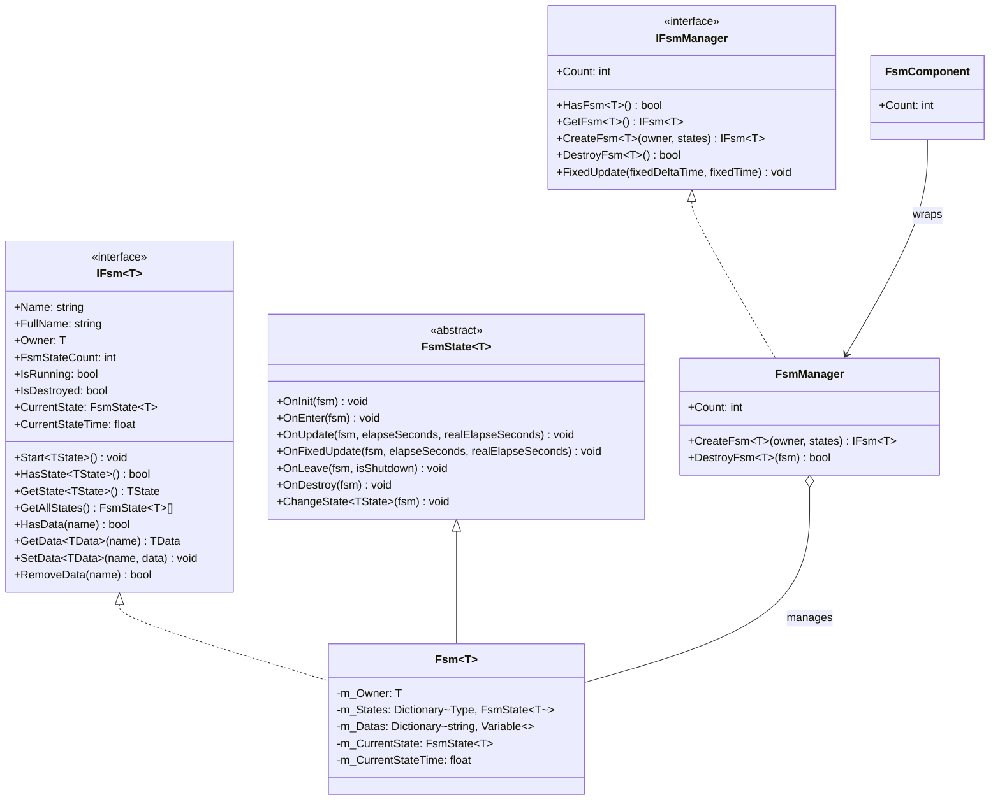

# API 參考

本文件詳細列出了 GameFrameX Unity FSM 有限狀態機系統的完整 API 介面、類和方法。

## 概述

FSM（有限狀態機）模組提供了功能完善的遊戲狀態管理能力，支援：
- 泛型型別安全的有限狀態機實現
- 狀態生命週期管理（初始化、進入、更新、離開、銷燬）
- 狀態間資料共享機制
- Unity 組件整合

## 核心介面

### IFsm<T>

有限狀態機介面，定義狀態機的核心操作。

> Source: [IFsm.cs](https://github.com/GameFrameX/com.gameframex.unity.fsm/blob/main/Runtime/Fsm/IFsm.cs#L18-L179)

#### 屬性

| 屬性 | 型別 | 描述 |
|------|------|------|
| `Name` | `string` | 獲取有限狀態機名稱 |
| `FullName` | `string` | 獲取有限狀態機完整名稱（包含持有者型別和名稱） |
| `Owner` | `T` | 獲取有限狀態機持有者物件 |
| `FsmStateCount` | `int` | 獲取有限狀態機中狀態的數量 |
| `IsRunning` | `bool` | 獲取有限狀態機是否正在執行 |
| `IsDestroyed` | `bool` | 獲取有限狀態機是否已被銷燬 |
| `CurrentState` | `FsmState<T>` | 獲取當前有限狀態機狀態 |
| `CurrentStateTime` | `float` | 獲取當前狀態已持續的時間（秒） |

#### 方法

**Start**

```csharp
void Start<TState>() where TState : FsmState<T>
void Start(Type stateType)
```

開始有限狀態機，進入指定狀態。

**HasState**

```csharp
bool HasState<TState>() where TState : FsmState<T>
bool HasState(Type stateType)
```

檢查指定狀態是否存在。

**GetState**

```csharp
TState GetState<TState>() where TState : FsmState<T>
FsmState<T> GetState(Type stateType)
```

獲取指定型別的狀態例項。

**GetAllStates**

```csharp
FsmState<T>[] GetAllStates()
void GetAllStates(List<FsmState<T>> results)
```

獲取有限狀態機的所有狀態。

**資料操作**

```csharp
bool HasData(string name)
TData GetData<TData>(string name) where TData : Variable
Variable GetData(string name)
void SetData<TData>(string name, TData data) where TData : Variable
void SetData(string name, Variable data)
bool RemoveData(string name)
```

狀態機內部資料存取操作，支援泛型型別的資料儲存。

---

### IFsmManager

有限狀態機管理器介面，負責管理所有有限狀態機例項。

> Source: [IFsmManager.cs](https://github.com/GameFrameX/com.gameframex.unity.fsm/blob/main/Runtime/Fsm/IFsmManager.cs#L16-L184)

#### 屬性

| 屬性 | 型別 | 描述 |
|------|------|------|
| `Count` | `int` | 獲取當前管理的有限狀態機數量 |

#### 方法

**HasFsm**

```csharp
bool HasFsm<T>() where T : class
bool HasFsm(Type ownerType)
bool HasFsm<T>(string name) where T : class
bool HasFsm(Type ownerType, string name)
```

檢查指定有限狀態機是否存在。

**GetFsm**

```csharp
IFsm<T> GetFsm<T>() where T : class
FsmBase GetFsm(Type ownerType)
IFsm<T> GetFsm<T>(string name) where T : class
FsmBase GetFsm(Type ownerType, string name)
```

獲取指定的有限狀態機例項。

**GetAllFsms**

```csharp
FsmBase[] GetAllFsms()
void GetAllFsms(List<FsmBase> results)
```

獲取所有有限狀態機。

**CreateFsm**

```csharp
IFsm<T> CreateFsm<T>(T owner, params FsmState<T>[] states) where T : class
IFsm<T> CreateFsm<T>(string name, T owner, params FsmState<T>[] states) where T : class
IFsm<T> CreateFsm<T>(T owner, List<FsmState<T>> states) where T : class
IFsm<T> CreateFsm<T>(string name, T owner, List<FsmState<T>> states) where T : class
```

建立新的有限狀態機。

**DestroyFsm**

```csharp
bool DestroyFsm<T>() where T : class
bool DestroyFsm(Type ownerType)
bool DestroyFsm<T>(string name) where T : class
bool DestroyFsm(Type ownerType, string name)
bool DestroyFsm<T>(IFsm<T> fsm) where T : class
bool DestroyFsm(FsmBase fsm)
```

銷燬指定的有限狀態機。

**FixedUpdate**

```csharp
void FixedUpdate(float fixedDeltaTime, float fixedTime)
```

輪詢所有有限狀態機的固定更新。

---

## 核心類

### FsmState<T>

有限狀態機狀態基類，繼承此類以建立具體的狀態實現。

> Source: [FsmState.cs](https://github.com/GameFrameX/com.gameframex.unity.fsm/blob/main/Runtime/Fsm/FsmState.cs#L17-L136)

#### 生命週期方法

```csharp
protected internal virtual void OnInit(IFsm<T> fsm)
```

狀態初始化時呼叫，可在此進行狀態相關資料的初始化。

```csharp
protected internal virtual void OnEnter(IFsm<T> fsm)
```

狀態進入時呼叫，可在此執行進入狀態的初始化邏輯。

```csharp
protected internal virtual void OnUpdate(IFsm<T> fsm, float elapseSeconds, float realElapseSeconds)
```

狀態輪詢時呼叫，每幀執行，用於狀態邏輯更新。

- `elapseSeconds`: 邏輯流逝時間
- `realElapseSeconds`: 真實流逝時間

```csharp
protected internal virtual void OnFixedUpdate(IFsm<T> fsm, float elapseSeconds, float realElapseSeconds)
```

狀態固定輪詢時呼叫，使用固定時間步長更新。

```csharp
protected internal virtual void OnLeave(IFsm<T> fsm, bool isShutdown)
```

狀態離開時呼叫。

- `isShutdown`: 是否是關閉整個狀態機時觸發

```csharp
protected internal virtual void OnDestroy(IFsm<T> fsm)
```

狀態銷燬時呼叫，用於清理資源。

#### 狀態切換方法

```csharp
public void ChangeToState<TState>(IFsm<T> fsm) where TState : FsmState<T>
protected void ChangeState<TState>(IFsm<T> fsm) where TState : FsmState<T>
protected void ChangeState(IFsm<T> fsm, Type stateType)
```

切換到指定狀態。

---

### FsmComponent

Unity 組件，整合到 Unity 場景中的狀態機管理器。

> Source: [FsmComponent.cs](https://github.com/GameFrameX/com.gameframex.unity.fsm/blob/main/Runtime/Fsm/FsmComponent.cs#L22-L268)

FsmComponent 是 Unity GameObject 組件，提供與 IFsmManager 相同的 API 介面，可直接在 Unity 編輯器中使用。

#### 屬性

| 屬性 | 型別 | 描述 |
|------|------|------|
| `Count` | `int` | 獲取當前管理的有限狀態機數量 |

#### 方法

FsmComponent 提供了與 IFsmManager 完全一致的方法集合：

- `HasFsm<T>()`, `HasFsm(Type)`, `HasFsm<T>(string)`, `HasFsm(Type, string)`
- `GetFsm<T>()`, `GetFsm(Type)`, `GetFsm<T>(string)`, `GetFsm(Type, string)`
- `GetAllFsmList()`, `GetAllFsmList(List<FsmBase>)`
- `CreateFsm<T>(T, params FsmState<T>[])`, `CreateFsm<T>(string, T, params FsmState<T>[])`
- `CreateFsm<T>(T, List<FsmState<T>>)`, `CreateFsm<T>(string, T, List<FsmState<T>>)`
- `DestroyFsm<T>()`, `DestroyFsm(Type)`, `DestroyFsm<T>(string)`, `DestroyFsm(Type, string)`
- `DestroyFsm<T>(IFsm<T>)`, `DestroyFsm(FsmBase)`

---

## 資料型別

### Variable

有限狀態機中使用的資料基類。

> Source: [IFsm.cs](https://github.com/GameFrameX/com.gameframex.unity.fsm/blob/main/Runtime/Fsm/IFsm.cs#L148-L171)

狀態機支援儲存任意繼承自 `Variable` 的資料型別：

```csharp
void SetData<TData>(string name, TData data) where TData : Variable
TData GetData<TData>(string name) where TData : Variable
```

---

## 架構圖



---

## 使用示例

### 建立狀態機

透過 FsmComponent 建立狀態機：

```csharp
public class Character : MonoBehaviour
{
    private IFsm<Character> _fsm;
    
    private void Start()
    {
        var fsmComponent = GetComponent<FsmComponent>();
        _fsmComponent = fsmComponent.CreateFsm<Character>(this,
            new IdleState(),
            new RunState(),
            new JumpState());
        _fsm.Start<IdleState>();
    }
    
    private void Update()
    {
        // 狀態機在 FsmComponent 中自動更新
    }
}
```

> Source: [FsmComponent.cs](https://github.com/GameFrameX/com.gameframex.unity.fsm/blob/main/Runtime/Fsm/FsmComponent.cs#L163-L166)

### 定義狀態

建立自定義狀態類：

```csharp
public class IdleState : FsmState<Character>
{
    protected internal override void OnEnter(IFsm<Character> fsm)
    {
        // 進入空閒狀態
    }
    
    protected internal override void OnUpdate(IFsm<Character> fsm, float elapseSeconds, float realElapseSeconds)
    {
        // 檢測是否需要切換狀態
        if (Input.GetKeyDown(KeyCode.Space))
        {
            ChangeState<JumpState>(fsm);
        }
    }
    
    protected internal override void OnLeave(IFsm<Character> fsm, bool isShutdown)
    {
        // 離開空閒狀態
    }
}
```

> Source: [FsmState.cs](https://github.com/GameFrameX/com.gameframex.unity.fsm/blob/main/Runtime/Fsm/FsmState.cs#L38-L69)

### 資料共享

在狀態間共享資料：

```csharp
// 在某個狀態中設定資料
fsm.SetData("health", new VarInt(100));
fsm.SetData("score", new VarInt(0));

// 在另一個狀態中讀取資料
VarInt health = fsm.GetData<VarInt>("health");
int currentHealth = health.Value;
```

> Source: [Fsm.cs](https://github.com/GameFrameX/com.gameframex.unity.fsm/blob/main/Runtime/Fsm/Fsm.cs#L452-L481)

---

## 相關連結

- [概述](./1-overview) - 有限狀態機系統概述
- [安裝](./2-installation) - 安裝和配置指南
- [快速開始](./3-getting-started) - 快速上手教程
- [核心概念](./04.features.md) - 核心概念詳解
- [常見問題](./6-troubleshooting) - 常見問題與解答
