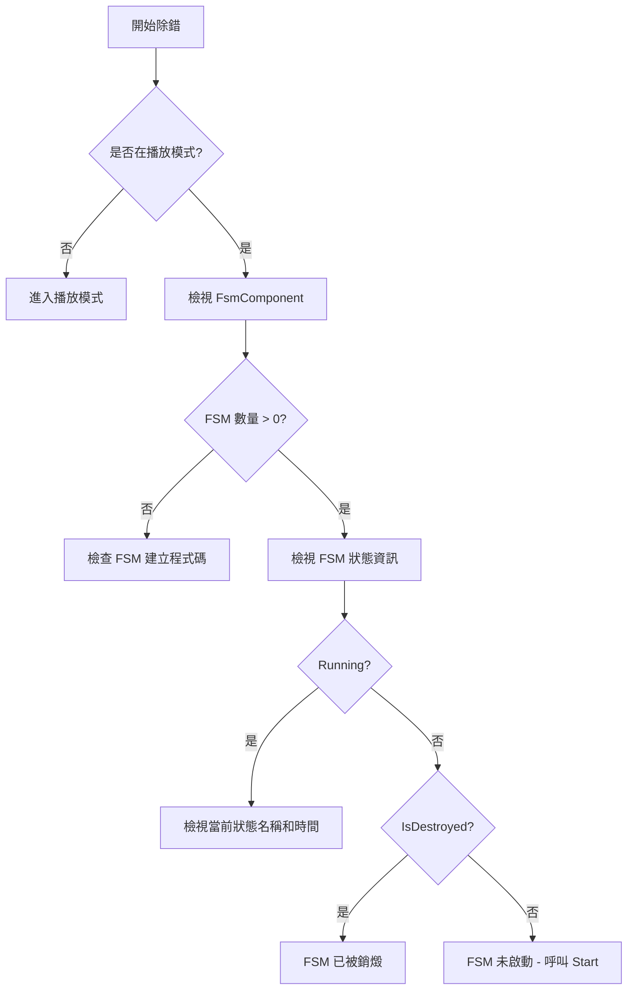

# 常見問題

本文件收集了使用 GameFrameX Unity FSM 有限狀態機組件時常見的錯誤問題及其解決方案。

## 概述

FSM（有限狀態機）組件是 GameFrameX 框架的核心模組之一，用於管理和控制遊戲物件的狀態轉換。在使用過程中，開發者可能會遇到各種錯誤和問題，本文件旨在提供這些常見問題的診斷方法和解決方案。

## 通用錯誤

### 1. FSM 管理器未初始化

**錯誤資訊：**
```
FSM manager is invalid.
```

**原因分析：**
此錯誤表示 `FsmComponent` 無法從 `GameFrameworkEntry` 獲取 `IFsmManager` 模組。這通常是因為 Game Framework 核心組件未正確初始化。

**解決方案：**

1. 確保在場景中新增了 `FsmComponent` 組件：
```csharp
// 在 Unity 編輯器中，透過 Game Framework 選單新增
// Game Framework -> Add Component -> Fsm
```

2. 確保 Game Framework 核心組件已正確初始化。在 `FsmComponent` 的 `Awake` 方法中會自動獲取 FSM 管理器：
```csharp
// 原始碼位置: Runtime/Fsm/FsmComponent.cs
protected override void Awake()
{
    ImplementationComponentType = Utility.Assembly.GetType(componentType);
    InterfaceComponentType = typeof(IFsmManager);
    base.Awake();
    m_FsmManager = GameFrameworkEntry.GetModule<IFsmManager>();
    if (m_FsmManager == null)
    {
        Log.Fatal("FSM manager is invalid.");
        return;
    }
}
```

> Source: [FsmComponent.cs](https://github.com/GameFrameX/com.gameframex.unity.fsm/blob/main/Runtime/Fsm/FsmComponent.cs#L37-L48)

---

### 2. 建立 FSM 時 Owner 為空

**錯誤資訊：**
```
FSM owner is invalid.
```

**原因分析：**
建立有限狀態機時，傳入了 `null` 作為擁有者（owner）引數。FSM 必須有一個有效的擁有者物件。

**解決方案：**

確保建立 FSM 時傳入有效的擁有者物件：

```csharp
// 錯誤示例
IFsm<MyCharacter> fsm = fsmComponent.CreateFsm<MyCharacter>(null, states);

// 正確示例
MyCharacter character = GetComponent<MyCharacter>();
IFsm<MyCharacter> fsm = fsmComponent.CreateFsm(character, states);
```

> Source: [Fsm.cs](https://github.com/GameFrameX/com.gameframex.unity.fsm/blob/main/Runtime/Fsm/Fsm.cs#L113-L116)

---

### 3. 狀態陣列無效

**錯誤資訊：**
```
FSM states is invalid.
```

**原因分析：**
建立 FSM 時，狀態陣列為 `null` 或者長度為 0。FSM 至少需要包含一個狀態。

**解決方案：**

確保建立 FSM 時提供至少一個有效的狀態：

```csharp
// 錯誤示例 - 狀態陣列為空
IFsm<MyCharacter> fsm = fsmComponent.CreateFsm(character);

// 正確示例 - 至少包含一個狀態
IFsm<MyCharacter> fsm = fsmComponent.CreateFsm(character, 
    new IdleState(), 
    new MoveState()
);
```

> Source: [Fsm.cs](https://github.com/GameFrameX/com.gameframex.unity.fsm/blob/main/Runtime/Fsm/Fsm.cs#L118-L121)

---

### 4. 重複的狀態型別

**錯誤資訊：**
```
FSM 'TypeNamePair' state 'StateType' is already exist.
```

**原因分析：**
在建立 FSM 時，嘗試新增兩個相同型別的狀態。每個狀態型別在同一個 FSM 中只能存在一個。

**解決方案：**

確保每個狀態型別只新增一次：

```csharp
// 錯誤示例 - 重複新增相同狀態型別
IFsm<MyCharacter> fsm = fsmComponent.CreateFsm(character,
    new IdleState(),  // 第一次新增
    new IdleState()   // 重複新增 - 錯誤！
);

// 正確示例 - 每個狀態型別只新增一次
IFsm<MyCharacter> fsm = fsmComponent.CreateFsm(character,
    new IdleState(),
    new MoveState(),
    new AttackState()
);
```

> Source: [Fsm.cs](https://github.com/GameFrameX/com.gameframex.unity.fsm/blob/main/Runtime/Fsm/Fsm.cs#L135-L138)

---

## 狀態機執行錯誤

### 5. 重複啟動 FSM

**錯誤資訊：**
```
FSM is running, can not start again.
```

**原因分析：**
嘗試啟動一個已經在執行狀態的 FSM。FSM 在執行期間不允許重複呼叫 `Start` 方法。

**解決方案：**

1. 在啟動前檢查 FSM 是否已經在執行：
```csharp
IFsm<MyCharacter> fsm = fsmComponent.GetFsm<MyCharacter>();
if (fsm != null && !fsm.IsRunning)
{
    fsm.Start<IdleState>();
}
```

2. 如果需要重新開始，先銷燬現有的 FSM：
```csharp
// 銷燬現有 FSM
fsmComponent.DestroyFsm<MyCharacter>();
// 重新建立
IFsm<MyCharacter> fsm = fsmComponent.CreateFsm(character, new IdleState());
fsm.Start<IdleState>();
```

> Source: [Fsm.cs](https://github.com/GameFrameX/com.gameframex.unity.fsm/blob/main/Runtime/Fsm/Fsm.cs#L235-L238)

---

### 6. 狀態不存在

**錯誤資訊：**
```
FSM 'TypeNamePair' can not start state 'StateType' which is not exist.
```

**原因分析：**
嘗試啟動或切換到一個不存在的狀態。該狀態未被新增到 FSM 的狀態列表中。

**解決方案：**

1. 確保要啟動/切換的狀態已在建立 FSM 時新增：
```csharp
// 建立 FSM 時新增所有需要的狀態
IFsm<MyCharacter> fsm = fsmComponent.CreateFsm(character,
    new IdleState(),
    new MoveState(),
    new AttackState()
);

// 啟動已存在的狀態
fsm.Start<IdleState>();

// 切換到已存在的狀態 - 正確
fsm.GetState<AttackState>().ChangeToState<MoveState>(fsm);
```

2. 在切換狀態前檢查狀態是否存在：
```csharp
if (fsm.HasState<MoveState>())
{
    fsm.GetState<AttackState>().ChangeToState<MoveState>(fsm);
}
```

> Source: [Fsm.cs](https://github.com/GameFrameX/com.gameframex.unity.fsm/blob/main/Runtime/Fsm/Fsm.cs#L241-L244)

---

### 7. 無效的狀態型別

**錯誤資訊：**
```
State type 'StateType' is invalid.
```

**原因分析：**
傳入的狀態型別不是有效的 `FsmState<T>` 派生類。

**解決方案：**

確保狀態類繼承自 `FsmState<T>`：

```csharp
// 錯誤示例 - 普通類不能作為狀態
public class MyClass { }

// 正確示例 - 必須繼承 FsmState<T>
public class IdleState : FsmState<MyCharacter>
{
    protected internal override void OnEnter(IFsm<MyCharacter> fsm)
    {
        // 進入狀態邏輯
    }
    
    protected internal override void OnUpdate(IFsm<MyCharacter> fsm, float elapseSeconds, float realElapseSeconds)
    {
        // 狀態更新邏輯
    }
    
    protected internal override void OnLeave(IFsm<MyCharacter> fsm, bool isShutdown)
    {
        // 離開狀態邏輯
    }
}
```

> Source: [Fsm.cs](https://github.com/GameFrameX/com.gameframex.unity.fsm/blob/main/Runtime/Fsm/Fsm.cs#L267-L270)

---

### 8. 當前狀態無效，無法切換

**錯誤資訊：**
```
Current state is invalid.
```

**原因分析：**
嘗試在 FSM 未啟動或已被銷燬時切換狀態。

**解決方案：**

確保 FSM 正在執行後再切換狀態：

```csharp
// 錯誤示例 - FSM 未啟動就嘗試切換
IFsm<MyCharacter> fsm = fsmComponent.CreateFsm(character,
    new IdleState(),
    new MoveState()
);
// 未呼叫 Start 就嘗試切換 - 錯誤！
fsm.GetState<IdleState>().ChangeToState<MoveState>(fsm);

// 正確示例 - 先啟動 FSM
IFsm<MyCharacter> fsm = fsmComponent.CreateFsm(character,
    new IdleState(),
    new MoveState()
);
fsm.Start<IdleState>();  // 先啟動

// 然後在狀態中切換
protected internal override void OnUpdate(IFsm<MyCharacter> fsm, float elapseSeconds, float realElapseSeconds)
{
    if (shouldMove)
    {
        ChangeState<MoveState>(fsm);  // 正確：在狀態內切換
    }
}
```

> Source: [Fsm.cs](https://github.com/GameFrameX/com.gameframex.unity.fsm/blob/main/Runtime/Fsm/Fsm.cs#L558-L567)

---

## 資料管理錯誤

### 9. 重複建立同名 FSM

**錯誤資訊：**
```
Already exist FSM 'TypeNamePair'.
```

**原因分析：**
嘗試建立一個已存在的 FSM（相同擁有者型別和名稱）。

**解決方案：**

1. 在建立前檢查 FSM 是否已存在：
```csharp
if (!fsmComponent.HasFsm<MyCharacter>())
{
    IFsm<MyCharacter> fsm = fsmComponent.CreateFsm(character,
        new IdleState(),
        new MoveState()
    );
}
```

2. 或者先銷燬現有的 FSM：
```csharp
fsmComponent.DestroyFsm<MyCharacter>();
IFsm<MyCharacter> fsm = fsmComponent.CreateFsm(character,
    new IdleState(),
    new MoveState()
);
```

> Source: [FsmManager.cs](https://github.com/GameFrameX/com.gameframex.unity.fsm/blob/main/Runtime/Fsm/FsmManager.cs#L284-L287)

---

### 10. 無效的資料名稱

**錯誤資訊：**
```
Data name is invalid.
```

**原因分析：**
使用 `null` 或空字串作為 FSM 資料的鍵名。

**解決方案：**

始終使用有效的字串作為資料鍵：

```csharp
// 錯誤示例
fsm.SetData<string>(null, "value");
fsm.SetData<string>("", "value");

// 正確示例
fsm.SetData<string>("health", 100);
fsm.SetData<float>("speed", 5.0f);
```

> Source: [Fsm.cs](https://github.com/GameFrameX/com.gameframex.unity.fsm/blob/main/Runtime/Fsm/Fsm.cs#L396-L399)

---

### 11. 無效的結果引數

**錯誤資訊：**
```
Results is invalid.
```

**原因分析：**
傳入 `null` 作為儲存結果的可變列表引數。

**解決方案：**

確保傳入有效的列表物件：

```csharp
// 錯誤示例
List<FsmBase> fsms = null;
fsmComponent.GetAllFsmList(fsms);

// 正確示例
List<FsmBase> fsms = new List<FsmBase>();
fsmComponent.GetAllFsmList(fsms);
```

> Source: [Fsm.cs](https://github.com/GameFrameX/com.gameframex.unity.fsm/blob/main/Runtime/Fsm/Fsm.cs#L377-L380)

---

## Unity 編輯器相關問題

### 12. FsmComponent 在編輯器中不顯示

**問題描述：**
在 Unity 編輯器中新增了 FsmComponent，但在 Inspector 面板中看不到 FSM 資訊。

**原因分析：**
`FsmComponentInspector` 僅在執行時顯示資訊，且需要在遊戲物體層級中。

**解決方案：**

1. 確保在 **Play Mode（播放模式）** 下檢視：
```csharp
// 原始碼位置: Editor/Inspector/FsmComponentInspector.cs
public override void OnInspectorGUI()
{
    if (!EditorApplication.isPlaying)
    {
        EditorGUILayout.HelpBox("Available during runtime only.", MessageType.Info);
        return;
    }
    // ...
}
```

2. 確保 FsmComponent 附加在場景中的遊戲物體上，而不是預製體上：
```csharp
// Inspector 會檢查遊戲物體是否在層級面板中
if (IsPrefabInHierarchy(t.gameObject))
{
    // 顯示 FSM 資訊
}
```

> Source: [FsmComponentInspector.cs](https://github.com/GameFrameX/com.gameframex.unity.fsm/blob/main/Editor/Inspector/FsmComponentInspector.cs#L21-L25)

---

## 除錯技巧

### 使用 FsmComponentInspector 檢視 FSM 狀態

在 Unity 編輯器的播放模式下，可以檢視所有 FSM 的實時狀態：

1. 在場景中新增 `FsmComponent` 組件
2. 進入播放模式
3. 選擇帶有 `FsmComponent` 的遊戲物體
4. 在 Inspector 中檢視 FSM 數量和每個 FSM 的狀態



### 常見 FSM 狀態說明

| 屬性 | 說明 |
|------|------|
| `IsRunning` | FSM 是否正在執行（已呼叫 Start） |
| `IsDestroyed` | FSM 是否已被銷燬 |
| `CurrentStateName` | 當前狀態的完整型別名稱 |
| `CurrentStateTime` | 當前狀態已持續的時間（秒） |

---

## 最佳實踐

### 1. 始終檢查 FSM 是否存在後再操作

```csharp
// 推薦做法
if (fsmComponent.HasFsm<MyCharacter>())
{
    var fsm = fsmComponent.GetFsm<MyCharacter>();
    // 操作 FSM
}
```

### 2. 正確管理 FSM 生命週期

```csharp
// 建立
IFsm<MyCharacter> fsm = fsmComponent.CreateFsm(owner, states);
fsm.Start<IdleState>();

// 使用
// ... 遊戲邏輯 ...

// 銷燬
fsmComponent.DestroyFsm(fsm);
```

### 3. 使用 FsmState 內建方法切換狀態

```csharp
// 推薦：在狀態類中使用受保護的方法
protected internal override void OnUpdate(IFsm<MyCharacter> fsm, float elapseSeconds, float realElapseSeconds)
{
    // 使用受保護的 ChangeState 方法
    if (someCondition)
    {
        ChangeState<NextState>(fsm);
    }
}
```

---

## 相關連結

- [概述](./1-overview) - FSM 組件概述
- [安裝](./2-installation) - 安裝和配置
- [快速開始](./3-getting-started) - 快速上手指南
- [核心概念](./04.features.md) - 核心概念詳解
- [API 參考](./5-api-reference) - 完整 API 文件
