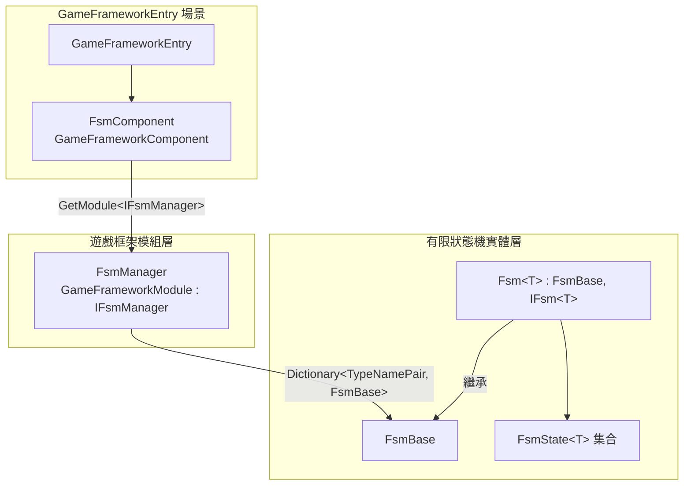

# 運作原理概覽：元件、管理器、FSM 三層結構

GameFrameX FSM 在 Unity 中採三層結構組成。**元件層(FsmComponent)**附加於 GameFramework 進入點，負責對外呼叫；**管理層(FsmManager)**以 `GameFrameworkModule` 的身分統一輪詢所有已註冊的 FSM;而**狀態機層(Fsm<T> / FsmState<T>)**才是真正的持有者，是具備狀態集合與狀態轉換邏輯的實體。理解這三層之後，FSM 的建立、輪詢與銷毀便會成為一條從元件進入點貫穿至具體狀態機的標準路徑。

## 快速開始

1. 在 GameFramework 啟動場景的 `GameFrameworkEntry` 物件上新增 `GameFrameX/FSM` 元件(會透過 `[AddComponentMenu("GameFrameX/FSM")]` 自動註冊至選單)。
2. 使用 `GameEntry.GetComponent<FsmComponent>()` 取得元件後，呼叫 `CreateFsm` 來建立有限狀態機。
3. 使用 `IFsmManager` 介面或 `FsmComponent` 提供的 `HasFsm`、`GetFsm`、`DestroyFsm` 等方法，對 FSM 進行查詢、輪詢與銷毀。

元件會在 `Awake()` 階段透過 `GameFrameworkEntry` 取得 `IFsmManager` 模組，並快取其參考：

```csharp
// Runtime/Fsm/FsmComponent.cs#L63-L74
protected override void Awake()
{
    ImplementationComponentType = Utility.Assembly.GetType(componentType);
    InterfaceComponentType = typeof(IFsmManager);
    base.Awake();
    m_FsmManager = GameFrameworkEntry.GetModule<IFsmManager>();
    if (m_FsmManager == null)
    {
        Log.Fatal("FSM manager is invalid.");
        return;
    }
}
```

出處:[FsmComponent.cs#L63-L74](https://github.com/GameFrameX/com.gameframex.unity.fsm/blob/main/Runtime/Fsm/FsmComponent.cs#L63-L74)

## 運作原理概覽

三層各自的職責如下，資料與呼叫沿著「元件 → 管理器 → FSM 實體」的方向由上而下流動。



| 層級 | 類型 | 核心職責 |
|----|------|----------|
| 元件層 | `FsmComponent : GameFrameworkComponent` | 公開 `CreateFsm` / `GetFsm` / `DestroyFsm` 等高階 API,並在 `FixedUpdate` 中將固定步進傳遞給管理器 |
| 管理層 | `FsmManager : GameFrameworkModule, IFsmManager` | 維護 `Dictionary<TypeNamePair, FsmBase>`,依 `Priority` 進入輪詢，驅動所有 FSM 的 `Update` / `FixedUpdate` |
| 實體層 | `FsmBase` 與其泛型子類別 `Fsm<T> : IFsm<T>` | 持有 owner、狀態字典 `m_States`、資料字典 `m_Datas`、目前狀態 `m_CurrentState` 與停留時間 `m_CurrentStateTime`,並執行狀態轉換 |

- **元件層**：由於具備 `[GameFrameXAutoComponent(-6000)]` 與 `[AddComponentMenu("GameFrameX/FSM")]`,它會被 GameFramework 自動載入並顯示於 Inspector 選單。所有外部進入點都會經過這個元件，並在內部轉發給 `m_FsmManager`。
- **管理層**:`Priority` 會回傳 `1`(數值越大優先順序越高),並在 `Update` / `FixedUpdate` 中遍歷快照(複製到 `m_TempFsms` / `m_TempFixedFsms`)以呼叫各個 FSM,避免遍歷期間集合被修改的問題。
- **實體層**：每個具體的 `Fsm<T>` 都知道自身的 owner 型別 `T` 與 `FsmState<T>` 集合，透過 `ChangeState<TState>()` 在狀態之間轉換，並記錄 `CurrentStateTime`,可用於「在某個狀態停留了多久」這類判斷。

## 下一步

- 建立並啟動第一個狀態機的完整範例，請參閱《如何建立有限狀態機》。
- 關於狀態類別 `FsmState<T>` 的生命週期回呼與變數資料，請參閱《狀態類別與變數使用快速參考》。
- 關於 Inspector 除錯與編輯器擴充，請參閱《FsmComponent Inspector 說明》。

## 相關連結

- [FsmComponent.cs](https://github.com/GameFrameX/com.gameframex.unity.fsm/blob/main/Runtime/Fsm/FsmComponent.cs)
- [FsmManager.cs](https://github.com/GameFrameX/com.gameframex.unity.fsm/blob/main/Runtime/Fsm/FsmManager.cs)
- [Fsm.cs](https://github.com/GameFrameX/com.gameframex.unity.fsm/blob/main/Runtime/Fsm/Fsm.cs)
- [FsmBase.cs](https://github.com/GameFrameX/com.gameframex.unity.fsm/blob/main/Runtime/Fsm/FsmBase.cs)
- [IFsmManager.cs](https://github.com/GameFrameX/com.gameframex.unity.fsm/blob/main/Runtime/Fsm/IFsmManager.cs)
- [IFsm.cs](https://github.com/GameFrameX/com.gameframex.unity.fsm/blob/main/Runtime/Fsm/IFsm.cs)
- [FsmState.cs](https://github.com/GameFrameX/com.gameframex.unity.fsm/blob/main/Runtime/Fsm/FsmState.cs)