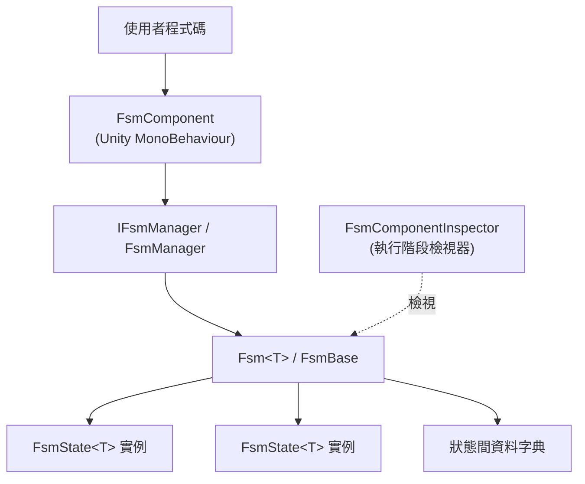

# GameFrameX FSM 是什麼

GameFrameX FSM 是 GameFrameX 框架所提供的通用有限狀態機(Finite State Machine)模組，用來以型別安全的方式管理 Unity 中物件的狀態建立、生命週期及狀態轉換。它是 GameFrameX 框架的子模組，需透過 `FsmComponent` 連結至 GameFrameX 元件系統使用。

## 快速開始

### 1. 安裝套件

在 Unity 專案的 `Packages/manifest.json` 中加入以下 `scopedRegistries` 與相依性：

```json
{
  "scopedRegistries": [
    {
      "name": "GameFrameX",
      "url": "https://gameframex.upm.alianblank.uk",
      "scopes": [
        "com.gameframex"
      ]
    }
  ],
  "dependencies": {
    "com.gameframex.unity.fsm": "1.1.1"
  }
}
```

來源： [README.md](https://github.com/GameFrameX/com.gameframex.unity.fsm/blob/main/README.md#L44-L63)

也可以透過 Git URL(`https://github.com/gameframex/com.gameframex.unity.fsm.git`)直接安裝，或複製(clone)到 `Packages` 目錄中安裝。

### 2. 定義狀態

繼承 `FsmState<T>` 並覆寫生命週期方法。其中 `T` 是狀態機的擁有者型別：

```csharp
using GameFrameX.Fsm;

public class IdleState : FsmState<Player>
{
    protected override void OnEnter(IFsm<Player> fsm)
    {
        // 進入 Idle 時觸發
    }

    protected override void OnUpdate(IFsm<Player> fsm, float elapseSeconds, float realElapseSeconds)
    {
        // 每幀輪詢
        if (Input.GetKeyDown(KeyCode.W))
        {
            ChangeState<MoveState>(fsm);
        }
    }

    protected override void OnLeave(IFsm<Player> fsm, bool isShutdown)
    {
        // 離開 Idle 時觸發
    }
}
```

來源： [README.md](https://github.com/GameFrameX/com.gameframex.unity.fsm/blob/main/README.md#L101-L123), [FsmState.cs](https://github.com/GameFrameX/com.gameframex.unity.fsm/blob/main/Runtime/Fsm/FsmState.cs#L41-L67)

### 3. 建立並啟動 FSM

先以 `GameEntry.GetComponent<FsmComponent>()` 取得元件，再使用 `CreateFsm` 組裝狀態集合，並以 `Start<TState>` 啟動：

```csharp
var fsmComponent = GameEntry.GetComponent<FsmComponent>();
IFsm<Player> fsm = fsmComponent.CreateFsm(player, new IdleState(), new MoveState());
fsm.Start<IdleState>();
```

來源： [README.md](https://github.com/GameFrameX/com.gameframex.unity.fsm/blob/main/README.md#L127-L136), [FsmComponent.cs](https://github.com/GameFrameX/com.gameframex.unity.fsm/blob/main/Runtime/Fsm/FsmComponent.cs#L204-L222)

### 4. 存取狀態間資料(選用)

使用 `SetData` / `GetData<T>` 在狀態之間共享資料。內部使用物件池，因此不會產生 GC:

```csharp
fsm.SetData("Health", 100);
int hp = fsm.GetData<int>("Health");

if (fsm.HasData("Health"))
{
    fsm.RemoveData("Health");
}
```

來源： [README.md](https://github.com/GameFrameX/com.gameframex.unity.fsm/blob/main/README.md#L140-L149)

## 運作原理概述

FSM 模組由三個層級組成。元件層對外公開 API,管理器層持有所有執行中的 FSM 並驅動 `Update` / `FixedUpdate`,而狀態機層則管理具體的狀態集合與狀態間資料。



- `FsmComponent` 繼承自 `GameFrameworkComponent`,掛載於 `GameFramework` 進入點物件上，元件優先順序為 `-6000`([FsmComponent.cs#L46-L47](https://github.com/GameFrameX/com.gameframex.unity.fsm/blob/main/Runtime/Fsm/FsmComponent.cs#L46-L47))。
- `FsmManager` 持有所有 FSM 實例並執行輪詢排程,`Update` / `FixedUpdate` 雙路徑由 `FsmComponent.FixedUpdate` 驅動([FsmComponent.cs#L76-L84](https://github.com/GameFrameX/com.gameframex.unity.fsm/blob/main/Runtime/Fsm/FsmComponent.cs#L76-L84))。
- `FsmState<T>` 公開 6 個生命週期掛鉤:`OnInit`、`OnEnter`、`OnUpdate`、`OnFixedUpdate`、`OnLeave`、`OnDestroy`。
- Editor 目錄中的 `FsmComponentInspector` 提供可在 Play 模式下即時查看目前狀態與執行時間的檢視器。

## 後續步驟

- 如何實作第一個狀態機：請參閱任務頁面《FSM 建立與啟動方法》
- 若狀態間傳遞數值時發生錯誤：請參閱疑難排解頁面的相關條目
- 所有 API 的快速參考：請參閱參考頁面《IFsm / FsmState API 快速參考》