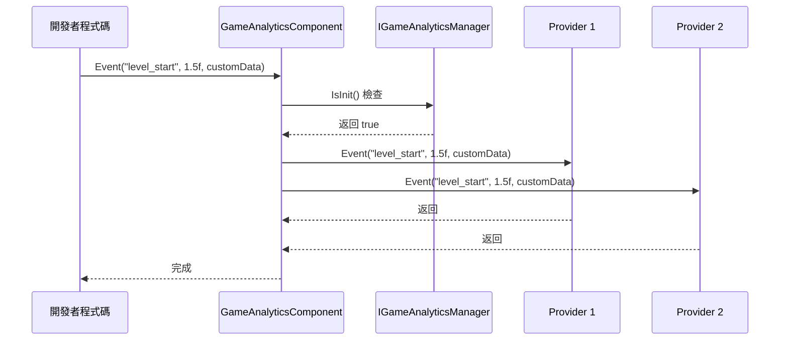
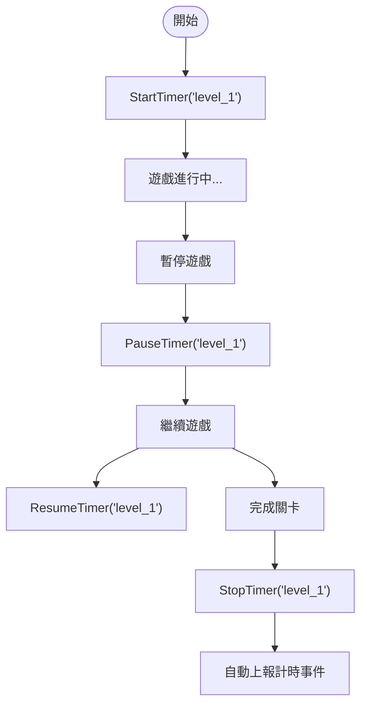

# 外掛介紹

`GameFrameX.GameAnalytics` 是 GameFrameX 遊戲框架中的遊戲資料分析組件，為 Unity 遊戲開發者提供統一的事件上報和計時功能介面。該外掛採用模組化設計，支援靈活擴充套件多種第三方資料分析後端。

## 概述

GameAnalytics 組件是遊戲框架的核心模組之一，專門用於解決遊戲資料分析的整合問題。在遊戲開發中，開發者通常需要整合多個資料分析平臺（如友盟、Firebase、Adjust 等），每個平臺都有各自的 SDK 和 API，這會導致程式碼重複和維護困難。

GameAnalytics 組件透過定義統一的介面（`IGameAnalyticsManager`）和抽象基類（`BaseGameAnalyticsManager`），將各種資料分析平臺的共性功能抽象出來。開發者只需呼叫統一的 API，即可同時向多個資料分析平臺傳送事件，大大簡化了多平臺資料埋點的工作。

### 核心特性

- **統一介面**：提供一套標準的 API，支援事件上報、計時器、公共屬性等功能
- **多後端支援**：透過提供者模式，可同時接入多個資料分析平臺
- **自動初始化**：支援在組件啟用時自動初始化，也支援手動控制初始化時機
- **裝置資訊採集**：自動採集裝置型號、作業系統、螢幕解析度、網路型別等基礎資訊
- **計時功能**：提供完整的事件計時能力，用於分析遊戲內各種操作的耗時

### 版本資訊

- 當前版本：1.2.0
- 首次釋出：2024年4月10日

## 架構設計

GameAnalytics 組件採用經典的分層架構設計，從上到下分為三個層次：組件層、管理器層和實現層。

```mermaid
flowchart TD
    subgraph ComponentLayer["組件層 (Unity Component)"]
        GAC[GameAnalyticsComponent]
    end

    subgraph ManagerLayer["管理器層 (Manager Interface)"]
        IGAM[IGameAnalyticsManager]
        BGAM[BaseGameAnalyticsManager]
    end

    subgraph ImplementationLayer["實現層 (Provider)"]
        Provider1[Analytics Provider 1]
        Provider2[Analytics Provider 2]
        ProviderN[Analytics Provider N]
    end

    subgraph GameFramework["GameFrameX 框架"]
        GFM[GameFrameworkModule]
    end

    GAC --> IGAM
    IGAM <|.. BGAM
    BGAM --> GFM
    BGAM -.-> Provider1
    BGAM -.-> Provider2
    BGAM -.-> ProviderN
```

### 各層職責

**組件層 (GameAnalyticsComponent)**

組件層是 Unity 層面的入口點，繼承自 `GameFrameworkComponent`。該組件掛載到場景中的 GameObject 上即可使用，主要負責：

- 在 `OnEnable` 時自動呼叫初始化方法
- 管理多個 `IGameAnalyticsManager` 例項的集合
- 將 API 呼叫分發到所有已註冊的分析提供者
- 提供引數驗證和初始化狀態檢查

> Source: [GameAnalyticsComponent.cs](https://github.com/GameFrameX/com.gameframex.unity.gameanalytics/blob/main/Runtime/GameAnalytics/GameAnalyticsComponent.cs#L14-L80)

**管理器層 (IGameAnalyticsManager / BaseGameAnalyticsManager)**

介面層定義了所有分析功能的標準規範，包括：

- 初始化方法（自動初始化和手動初始化）
- 事件上報方法（4種過載）
- 計時器方法（開始、暫停、恢復、結束）
- 公共屬性管理（設定、獲取、清除）
- 玩家ID設定

抽象基類 `BaseGameAnalyticsManager` 繼承自 `GameFrameworkModule`，實現了介面中的一些通用功能，如公共屬性管理、裝置資訊自動採集等。

> Source: [IGameAnalyticsManager.cs](https://github.com/GameFrameX/com.gameframex.unity.gameanalytics/blob/main/Runtime/GameAnalytics/IGameAnalyticsManager.cs#L8-L105)

> Source: [BaseGameAnalyticsManager.cs](https://github.com/GameFrameX/com.gameframex.unity.gameanalytics/blob/main/Runtime/GameAnalytics/BaseGameAnalyticsManager.cs#L10-L203)

**實現層 (Analytics Provider)**

實現層是具體的資料分析平臺介面卡，繼承自 `BaseGameAnalyticsManager`。開發者可以實現自己的分析提供者，或整合第三方 SDK 的介面卡。每個提供者獨立運作，組件層會同時向所有已註冊的提供者傳送事件。

### 事件流向



事件從開發者程式碼發出後，首先到達 `GameAnalyticsComponent`，組件檢查初始化狀態後，將事件同時分發給所有已註冊的分析提供者，實現一次上報多端接收的效果。

## 核心功能

### 事件上報

事件上報是資料分析的基礎，GameAnalytics 組件提供了四種事件上報方式，以滿足不同場景的需求：

**簡單事件**：僅包含事件名稱，用於記錄某個動作的發生。

```csharp
gameAnalyticsComponent.Event("game_start");
```

**數值事件**：在事件名稱基礎上新增數值，可用於統計次數、分數等量化指標。

```csharp
gameAnalyticsComponent.Event("level_complete", 5);
```

**自定義欄位事件**：在事件中附加額外的鍵值對資訊，用於更精細的資料分析。

```csharp
var customFields = new Dictionary<string, object>
{
    { "chapter", "chapter_1" },
    { "difficulty", "hard" }
};
gameAnalyticsComponent.Event("battle_end", customFields);
```

**數值+自定義欄位事件**：結合數值和自定義欄位的完整事件格式。

```csharp
gameAnalyticsComponent.Event("purchase", 99.99f, customFields);
```

### 計時器功能

計時器功能用於精確測量遊戲內各種操作的耗時，常見用途包括關卡完成時間、介面載入時間、任務執行時間等。



計時器支援暫停和恢復功能，即使玩家暫時離開，計時也不會丟失。計時結束後，組件會自動將耗時作為事件值上報到資料分析平臺。

### 公共屬性

公共屬性是指每次上報事件時都會自動攜帶的基礎資訊。GameAnalytics 組件會自動採集以下裝置資訊：

| 屬性名稱 | 說明 | 示例值 |
|---------|------|-------|
| device_id | 裝置唯一識別符號 | ABC123... |
| device_model | 裝置型號 | iPhone 14 Pro |
| device_type | 裝置型別 | Handheld |
| os | 作業系統 | iOS 17.0 |
| app_version | 應用版本號 | 1.2.0 |
| unity_version | Unity 引擎版本 | 2022.3.15f1 |
| platform | 執行平臺 | iOS |
| processor_type | 處理器型別 | Apple A16 |
| processor_count | CPU 核心數 | 6 |
| system_memory_size | 系統記憶體大小(MB) | 6144 |
| graphics_device_name | 顯示卡名稱 | Apple GPU |
| screen_width | 螢幕寬度(畫素) | 1179 |
| screen_height | 螢幕高度(畫素) | 2556 |
| screen_dpi | 螢幕DPI | 460 |
| network_type | 網路型別 | WiFi |
| system_language | 系統語言 | Chinese |

> Source: [BaseGameAnalyticsManager.cs](https://github.com/GameFrameX/com.gameframex.unity.gameanalytics/blob/main/Runtime/GameAnalytics/BaseGameAnalyticsManager.cs#L88-L144)

開發者也可以透過 `SetPublicProperties` 方法新增自定義的公共屬性，這些屬性會在每次事件上報時自動附帶。

### 玩家ID管理

透過 `SetPlayerId` 方法可以設定玩家識別符號，用於關聯同一個玩家在遊戲中的所有行為資料。這對於使用者行為分析、留存統計等場景非常重要。

```csharp
// 登入成功後設定玩家ID
gameAnalyticsComponent.SetPlayerId(playerId);
```

## 使用方式

### 安裝

外掛支援多種安裝方式：

1. **透過 manifest.json 新增依賴**：在專案的 `Packages/manifest.json` 檔案中的 `dependencies` 節點下新增：
   ```json
   {"com.gameframex.unity.gameanalytics": "https://github.com/GameFrameX/com.gameframex.unity.gameanalytics.git"}
   ```

2. **透過 Unity Package Manager**：在 Unity 編輯器中選擇 `Window > Package Manager`，點選 `+` 號，選擇 `Add package from git URL`，輸入：`https://github.com/GameFrameX/com.gameframex.unity.gameanalytics.git`

3. **直接放置原始碼**：將倉庫下載後放置到 Unity 專案的 `Packages` 目錄下，系統會自動識別載入。

### 快速配置

1. 在 Unity 場景中建立一個空的 GameObject
2. 在該 GameObject 上新增 `GameAnalyticsComponent` 組件（選單路徑：`Game Framework > GameAnalytics`）
3. 在 Inspector 面板中配置分析提供者列表，新增需要使用的分析平臺
4. 設定各提供者的相關引數

> Source: [GameAnalyticsComponentInspector.cs](https://github.com/GameFrameX/com.gameframex.unity.gameanalytics/blob/main/Editor/Inspector/GameAnalyticsComponentInspector.cs#L18-L68)

### 基本使用示例

```csharp
using GameFrameX.GameAnalytics.Runtime;
using UnityEngine;

public class GameAnalyticsExample : MonoBehaviour
{
    private GameAnalyticsComponent _gameAnalytics;

    private void Awake()
    {
        // 獲取組件（通常透過框架獲取）
        _gameAnalytics = UnityEngine.Object.FindObjectOfType<GameAnalyticsComponent>();
    }

    private void Start()
    {
        // 上報遊戲開始事件
        _gameAnalytics.Event("game_start");
        
        // 開始關卡計時
        _gameAnalytics.StartTimer("level_1");
    }

    private void OnLevelComplete(int levelId)
    {
        // 上報關卡完成事件
        _gameAnalytics.Event($"level_{levelId}_complete", 1.0f);
        
        // 停止關卡計時
        _gameAnalytics.StopTimer($"level_{levelId}");
    }
}
```

## 相關連結

- [安裝指南](./2-installation.index)
- [快速開始](./3-getting-started.index)
- [核心架構](./04.features.md)
- [API 參考](./5-api-reference.index)
- [編輯器配置](./6-configuration.index)
- [故障排除](./7-troubleshooting.index)
- [GitHub 倉庫](https://github.com/GameFrameX/com.gameframex.unity.gameanalytics.git)
- [GameFrameX 官網](https://gameframework.cn/)
