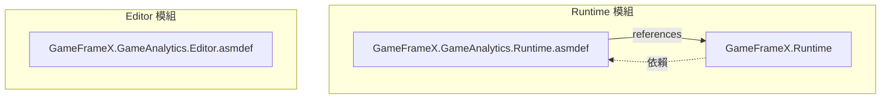
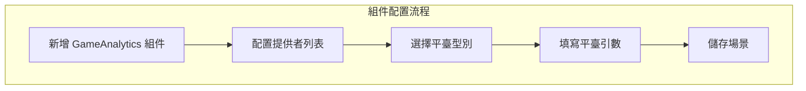

# 安裝指南

本文件詳細介紹如何將 GameFrameX GameAnalytics 遊戲資料分析組件安裝到您的 Unity 專案中。

## 概述

GameFrameX GameAnalytics 組件是 Unity 遊戲框架的核心模組之一，用於整合遊戲資料分析功能。該組件支援多種資料分析平臺的接入，提供統一的事件上報介面和計時功能，方便開發者在不同資料分析平臺之間切換或同時使用多個平臺。

**前置要求：**
- Unity 2017.1 或更高版本
- 已安裝 GameFrameX Runtime 核心庫

## 安裝方式

GameFrameX GameAnalytics 組件支援三種安裝方式，您可以根據專案需求選擇最適合的方法。

### 方式一：透過 manifest.json 安裝

在您的 Unity 專案中，找到 `Packages` 資料夾下的 `manifest.json` 檔案，在 `dependencies` 節點下新增以下內容：

```json
{
  "dependencies": {
    "com.gameframex.unity.gameanalytics": "https://github.com/GameFrameX/com.gameframex.unity.gameanalytics.git"
  }
}
```

> Source: [README.md](https://github.com/GameFrameX/com.gameframex.unity.gameanalytics/blob/main/README.md#L150-L156)

修改完成後，Unity 會自動下載並安裝該包。

### 方式二：透過 Unity Package Manager 安裝

1. 開啟 Unity 編輯器
2. 選擇選單 `Window` → `Package Manager`
3. 點選左上角的 `+` 按鈕
4. 選擇 `Add package from git URL...`
5. 輸入以下 Git URL：
   ```
   https://github.com/GameFrameX/com.gameframex.unity.gameanalytics.git
   ```
6. 點選 `Add` 按鈕等待安裝完成

> Source: [README.md](https://github.com/GameFrameX/com.gameframex.unity.gameanalytics/blob/main/README.md#L156)

### 方式三：直接下載安裝

1. 從 GitHub 倉庫下載最新的 Release 版本或克隆整個倉庫
2. 將下載的資料夾複製到 Unity 專案的 `Packages` 目錄下
3. Unity 會自動識別並載入該包

## 安裝驗證

安裝完成後，您可以透過以下方式驗證是否安裝成功：

### 檢查 Package Manager

在 Unity Package Manager 視窗中，確認 `Game Frame X Game Analytics` 已出現在包列表中，並且顯示正確的版本號。

```json
{
  "name": "com.gameframex.unity.gameanalytics",
  "version": "1.2.0"
}
```

> Source: [package.json](https://github.com/GameFrameX/com.gameframex.unity.gameanalytics/blob/main/package.json#L1-L6)

### 檢查程式集定義

確認以下程式集定義檔案已正確載入：



> Source: [GameFrameX.GameAnalytics.Runtime.asmdef](https://github.com/GameFrameX/com.gameframex.unity.gameanalytics/blob/main/Runtime/GameFrameX.GameAnalytics.Runtime.asmdef#L3-L5)

## 組件配置

安裝完成後，需要在 Unity 場景中新增 GameAnalytics 組件進行配置。

### 新增組件

1. 在 Unity 編輯器中，建立或開啟一個場景
2. 在 Hierarchy 面板中，選擇一個 GameObject（或建立新物件）
3. 在 Inspector 面板中，點選 `Add Component` 按鈕
4. 搜尋並選擇 `GameAnalytics` 組件
5. 組件將自動新增到選定的 GameObject 上

> Source: [GameAnalyticsComponent.cs](https://github.com/GameFrameX/com.gameframex.unity.gameanalytics/blob/main/Runtime/GameAnalytics/GameAnalyticsComponent.cs#L13-L14)

### 配置分析提供者

GameAnalytics 組件支援配置多個資料分析提供者。在 Inspector 面板中：

```csharp
[DisallowMultipleComponent]
[AddComponentMenu("Game Framework/GameAnalytics")]
public sealed class GameAnalyticsComponent : GameFrameworkComponent
```

> Source: [GameAnalyticsComponent.cs](https://github.com/GameFrameX/com.gameframex.unity.gameanalytics/blob/main/Runtime/GameAnalytics/GameAnalyticsComponent.cs#L12-L14)

1. 找到 **遊戲資料分析組件列表** 屬性
2. 點選 `+` 按鈕新增新的提供者
3. 從下拉選單中選擇要使用的資料分析平臺型別
4. 根據所選平臺填寫相應的配置引數



## 依賴項說明

GameFrameX GameAnalytics 組件依賴於以下模組：

| 依賴項 | 說明 | 必需 |
|--------|------|------|
| GameFrameX.Runtime | 核心執行時庫 | 是 |

> Source: [GameFrameX.GameAnalytics.Runtime.asmdef](https://github.com/GameFrameX/com.gameframex.unity.gameanalytics/blob/main/Runtime/GameFrameX.GameAnalytics.Runtime.asmdef)

**重要提示：** 確保您已安裝 GameFrameX Runtime 核心庫，否則組件將無法正常工作。

## 快速驗證

安裝和配置完成後，可以透過以下程式碼驗證組件是否正常工作：

```csharp
using GameFrameX.GameAnalytics.Runtime;

// 獲取組件例項
var gameAnalytics = UnityEngine.GameObject.FindObjectOfType<GameAnalyticsComponent>();

// 檢查是否初始化成功
if (gameAnalytics != null)
{
    // 上報測試事件
    gameAnalytics.Event("test_event");
    UnityEngine.Debug.Log("GameAnalytics 組件安裝成功！");
}
```

> Source: [GameAnalyticsComponent.cs](https://github.com/GameFrameX/com.gameframex.unity.gameanalytics/blob/main/Runtime/GameAnalytics/GameAnalyticsComponent.cs#L246-L265)

## 常見問題

### 安裝後編譯報錯

如果遇到編譯錯誤，請檢查：
1. 是否已正確安裝 GameFrameX Runtime
2. Unity 版本是否符合要求（2017.1+）
3. manifest.json 語法是否正確

### 組件無法新增到場景

確保：
1. 已正確匯入包
2. 在 Runtime 資料夾下有正確的程式集定義
3. Unity 專案已重新整理（有時需要重啟編輯器）

### Inspector 面板配置不顯示

如果 Inspector 中看不到 GameAnalytics 組件的配置面板，可能需要：
1. 重新匯入包
2. 檢查 Editor 程式集是否正確載入
3. 確認 Unity Editor 版本相容性

## 相關連結

- [外掛介紹](../1-overview/index) - 瞭解更多關於 GameAnalytics 組件的功能特性
- [快速開始](../3-getting-started/index) - 開始使用 GameAnalytics 進行資料上報
- [核心架構](./04.features.md) - 瞭解組件的內部架構設計
- [編輯器配置](../6-configuration/index) - 詳細瞭解編輯器配置選項
- [故障排除](../7-troubleshooting/index) - 常見問題與解決方案
