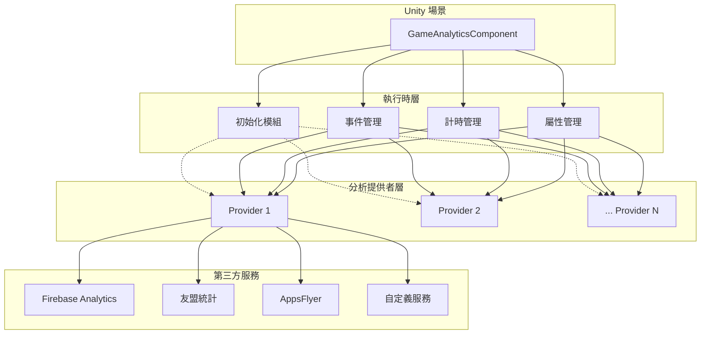
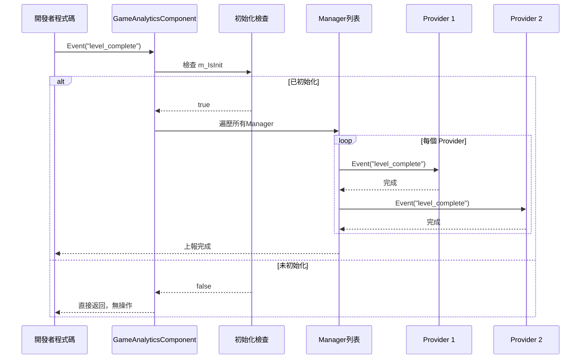

# 快速開始

本指南將幫助您快速整合並使用 GameAnalytics 組件進行遊戲資料分析。透過本章節，您將瞭解如何在 Unity 專案中新增組件、配置分析提供者，以及使用核心功能進行事件上報和計時。

## 概述

GameAnalytics 組件是 GameFrameX 框架的一部分，專門用於遊戲資料分析。它提供了統一的事件上報介面，支援多個第三方分析服務（如 Firebase、UMeng、AppsFlyer 等）的整合。

該組件設計遵循以下核心原則：
- **多提供者支援**：透過列表配置多個分析服務，資料會按順序上報到所有已配置的服務
- **自動初始化**：組件掛載到場景後自動初始化，無需手動呼叫
- **靈活的事件上報**：支援簡單事件、帶數值事件、帶自定義欄位事件等多種形式

## 架構概覽



如上圖所示，GameAnalyticsComponent 是位於 Unity 場景中的核心組件，它管理四個主要模組：初始化、事件管理、計時管理和屬性管理。這些模組透過統一的介面與多個分析提供者進行互動，最終將資料上報到不同的第三方分析服務。

## 核心流程

### 事件上報流程

當您呼叫 Event 方法上報事件時，資料會經過以下流程：



此流程確保了只有在組件正確初始化後才會執行事件上報，避免了因過早呼叫導致的資料丟失。

## 使用指南

### 第一步：新增組件到場景

在 Unity 編輯器中，按照以下步驟新增 GameAnalytics 組件：

1. 在場景中建立一個空 GameObject，或者選擇現有的 GameObject
2. 在 Inspector 面板中，點選 **Add Component** 按鈕
3. 在搜尋框中輸入 "GameAnalytics" 或 "遊戲資料分析"
4. 選擇 **Game Framework > GameAnalytics** 組件

> Source: [GameAnalyticsComponent.cs](https://github.com/GameFrameX/com.gameframex.unity.gameanalytics/blob/main/Runtime/GameAnalytics/GameAnalyticsComponent.cs#L14-L15)

組件新增後，會自動繼承 `GameFrameworkComponent` 基類，這是 GameFrameX 框架的標準組件基類。

### 第二步：配置分析提供者

新增組件後，需要在 Inspector 面板中配置分析提供者：

1. 選中場景中的 GameAnalytics GameObject
2. 在 Inspector 中找到 **遊戲資料分析組件列表** 屬性
3. 點選列表左下角的 **+** 按鈕新增新的提供者
4. 從 **ComponentType** 下拉選單中選擇具體的分析服務實現類
5. 根據選擇的分析服務，配置相應的引數（如 App ID、App Key 等）

```csharp
// 組件配置的資料結構定義
[Serializable]
public class GameAnalyticsComponentProvider
{
    /// <summary>
    /// 實現組件型別
    /// </summary>
    public string ComponentType;

    /// <summary>
    /// 這個是給編輯器用的
    /// </summary>
    public int ComponentTypeNameIndex = 0;

    /// <summary>
    /// 引數
    /// </summary>
    public List<GameAnalyticsComponentParamKV> Setting = new List<GameAnalyticsComponentParamKV>();
}
```

> Source: [GameAnalyticsComponent.cs](https://github.com/GameFrameX/com.gameframex.unity.gameanalytics/blob/main/Runtime/GameAnalytics/GameAnalyticsComponent.cs#L361-L378)

### 第三步：在程式碼中使用

以下是在遊戲程式碼中使用 GameAnalytics 組件的各種方式：

#### 獲取組件例項

```csharp
using GameFrameX.GameAnalytics.Runtime;

// 獲取 GameAnalyticsComponent 例項
var gameAnalytics = UnityEngine.GameObject.FindObjectOfType<GameAnalyticsComponent>();
```

> Source: [GameAnalyticsComponent.cs](https://github.com/GameFrameX/com.gameframex.unity.gameanalytics/blob/main/Runtime/GameAnalytics/GameAnalyticsComponent.cs#L14-L25)

#### 初始化狀態檢查

組件在 `OnEnable()` 時會自動初始化。初始化完成後，`m_IsInit` 標誌會被設定為 `true`。所有事件上報方法都會檢查此標誌：

```csharp
public void Event(string eventName)
{
    GameFrameworkGuard.NotNullOrEmpty(eventName, nameof(eventName));
    if (!m_IsInit)
    {
        return;  // 未初始化時直接返回，不執行任何操作
    }
    // ... 事件上報邏輯
}
```

> Source: [GameAnalyticsComponent.cs](https://github.com/GameFrameX/com.gameframex.unity.gameanalytics/blob/main/Runtime/GameAnalytics/GameAnalyticsComponent.cs#L246-L265)

這種設計確保了組件在未正確初始化時不會執行任何操作，避免了潛在的空引用異常。

## 功能詳解

### 事件上報

GameAnalytics 組件提供了四種事件上報方法，滿足不同場景的需求：

#### 1. 簡單事件上報

用於上報不包含任何附加資料的簡單事件，例如使用者點選按鈕、進入某個頁面等：

```csharp
/// <summary>
/// 上報事件
/// </summary>
/// <param name="eventName">事件名稱</param>
public void Event(string eventName)
```

**使用示例：**

```csharp
// 上報玩家完成關卡的事件
gameAnalytics.Event("level_complete");

// 上報玩家進入商店的事件
gameAnalytics.Event("enter_shop");
```

> Source: [GameAnalyticsComponent.cs](https://github.com/GameFrameX/com.gameframex.unity.gameanalytics/blob/main/Runtime/GameAnalytics/GameAnalyticsComponent.cs#L242-L265)

#### 2. 帶數值的事件上報

用於上報需要記錄數值的事件，例如得分、等級、金幣數量等：

```csharp
/// <summary>
/// 上報帶有數值的事件
/// </summary>
/// <param name="eventName">事件名稱</param>
/// <param name="eventValue">事件數值</param>
public void Event(string eventName, float eventValue)
```

**使用示例：**

```csharp
// 上報玩家得分
gameAnalytics.Event("score", 1500.5f);

// 上報玩家等級
gameAnalytics.Event("player_level", 10f);
```

> Source: [GameAnalyticsComponent.cs](https://github.com/GameFrameX/com.gameframex.unity.gameanalytics/blob/main/Runtime/GameAnalytics/GameAnalyticsComponent.cs#L267-L291)

#### 3. 帶自定義欄位的事件上報

用於上報需要攜帶自定義維度的事件，便於後續進行更精細的資料分析：

```csharp
/// <summary>
/// 上報自定義欄位的事件
/// </summary>
/// <param name="eventName">事件名稱</param>
/// <param name="customF">自定義欄位</param>
public void Event(string eventName, Dictionary<string, object> customF)
```

**使用示例：**

```csharp
// 上報關卡完成事件，帶自定義欄位
var customFields = new Dictionary<string, object>
{
    { "level_id", "level_05" },
    { "difficulty", "hard" },
    { "stars", 3 }
};
gameAnalytics.Event("level_complete", customFields);
```

> Source: [GameAnalyticsComponent.cs](https://github.com/GameFrameX/com.gameframex.unity.gameanalytics/blob/main/Runtime/GameAnalytics/GameAnalyticsComponent.cs#L293-L324)

#### 4. 帶數值和自定義欄位的事件上報

這是功能最全的事件上報方法，同時包含數值和自定義維度：

```csharp
/// <summary>
/// 上報帶有數值和自定義欄位的事件
/// </summary>
/// <param name="eventName">事件名稱</param>
/// <param name="eventValue">事件數值</param>
/// <param name="customF">自定義欄位</param>
public void Event(string eventName, float eventValue, Dictionary<string, object> customF)
```

**使用示例：**

```csharp
// 上報購買事件，包含消費金額和商品資訊
var purchaseInfo = new Dictionary<string, object>
{
    { "item_id", "gem_pack_100" },
    { "currency", "USD" }
};
gameAnalytics.Event("purchase", 0.99f, purchaseInfo);
```

> Source: [GameAnalyticsComponent.cs](https://github.com/GameFrameX/com.gameframex.unity.gameanalytics/blob/main/Runtime/GameAnalytics/GameAnalyticsComponent.cs#L326-L358)

### 計時功能

遊戲分析中，計時功能用於測量玩家完成特定任務或關卡所花費的時間。這對於分析遊戲難度和玩家行為非常重要。

#### 開始計時

```csharp
/// <summary>
/// 開始計時
/// </summary>
/// <param name="eventName">事件名稱</param>
public void StartTimer(string eventName)
```

**使用示例：**

```csharp
// 玩家開始挑戰關卡時開始計時
gameAnalytics.StartTimer("level_05");
```

> Source: [GameAnalyticsComponent.cs](https://github.com/GameFrameX/com.gameframex.unity.gameanalytics/blob/main/Runtime/GameAnalytics/GameAnalyticsComponent.cs#L156-L179)

#### 暫停計時

```csharp
/// <summary>
/// 暫停計時
/// </summary>
/// <param name="eventName">事件名稱</param>
public void PauseTimer(string eventName)
```

當玩家暫停遊戲或離開當前場景時使用：

```csharp
// 玩家暫停遊戲時暫停計時
gameAnalytics.PauseTimer("level_05");
```

> Source: [GameAnalyticsComponent.cs](https://github.com/GameFrameX/com.gameframex.unity.gameanalytics/blob/main/Runtime/GameAnalytics/GameAnalyticsComponent.cs#L181-L197)

#### 恢復計時

```csharp
/// <summary>
/// 恢復計時
/// </summary>
/// <param name="eventName">事件名稱</param>
public void ResumeTimer(string eventName)
```

玩家恢復遊戲後繼續計時：

```csharp
// 玩家恢復遊戲時恢復計時
gameAnalytics.ResumeTimer("level_05");
```

> Source: [GameAnalyticsComponent.cs](https://github.com/GameFrameX/com.gameframex.unity.gameanalytics/blob/main/Runtime/GameAnalytics/GameAnalyticsComponent.cs#L199-L215)

#### 結束計時並上報

```csharp
/// <summary>
/// 結束計時
/// </summary>
/// <param name="eventName">事件名稱</param>
public void StopTimer(string eventName)
```

玩家完成關卡或放棄時停止計時：

```csharp
// 玩家完成關卡時停止計時
gameAnalytics.StopTimer("level_05");
```

> Source: [GameAnalyticsComponent.cs](https://github.com/GameFrameX/com.gameframex.unity.gameanalytics/blob/main/Runtime/GameAnalytics/GameAnalyticsComponent.cs#L217-L240)

### 玩家管理

#### 設定玩家ID

用於關聯特定玩家的所有事件資料：

```csharp
/// <summary>
/// 設定玩家ID
/// </summary>
/// <param name="playerId">玩家ID</param>
public void SetPlayerId(string playerId)
```

**使用示例：**

```csharp
// 玩家登入後設定玩家ID
gameAnalytics.SetPlayerId("player_12345");
```

> Source: [GameAnalyticsComponent.cs](https://github.com/GameFrameX/com.gameframex.unity.gameanalytics/blob/main/Runtime/GameAnalytics/GameAnalyticsComponent.cs#L32-L42)

### 公共屬性

公共屬性會自動附加到所有上報的事件中，便於進行多維度分析。

#### 設定公共屬性

```csharp
/// <summary>
/// 設定公共屬性
/// </summary>
/// <param name="key">Key</param>
/// <param name="value">值</param>
public void SetPublicProperties(string key, object value)
```

**使用示例：**

```csharp
// 設定玩家的VIP等級
gameAnalytics.SetPublicProperties("vip_level", 5);

// 設定玩家所在的伺服器
gameAnalytics.SetPublicProperties("server", "us_west");
```

> Source: [GameAnalyticsComponent.cs](https://github.com/GameFrameX/com.gameframex.unity.gameanalytics/blob/main/Runtime/GameAnalytics/GameAnalyticsComponent.cs#L102-L119)

#### 獲取公共屬性

```csharp
/// <summary>
/// 獲取公共屬性
/// </summary>
/// <returns></returns>
public Dictionary<string, object> GetPublicProperties()
```

#### 清除公共屬性

```csharp
/// <summary>
/// 清除公共屬性
/// </summary>
public void ClearPublicProperties()
```

> Source: [GameAnalyticsComponent.cs](https://github.com/GameFrameX/com.gameframex.unity.gameanalytics/blob/main/Runtime/GameAnalytics/GameAnalyticsComponent.cs#L120-L154)

### 自動裝置資訊收集

組件會自動收集以下裝置資訊並新增到公共屬性中：

| 屬性名稱 | 說明 | 資料來源 |
|---------|------|---------|
| device_id | 裝置唯一識別符號 | SystemInfo.deviceUniqueIdentifier |
| device_model | 裝置型號 | SystemInfo.deviceModel |
| device_type | 裝置型別 | SystemInfo.deviceType |
| os | 作業系統 | SystemInfo.operatingSystem |
| app_version | 應用版本 | Application.version |
| unity_version | Unity版本 | Application.unityVersion |
| platform | 平臺 | Application.platform |
| processor_type | 處理器型別 | SystemInfo.processorType |
| processor_count | 處理器核心數 | SystemInfo.processorCount |
| system_memory_size | 系統記憶體大小 | SystemInfo.systemMemorySize |
| graphics_device_name | 顯示卡名稱 | SystemInfo.graphicsDeviceName |
| screen_width | 螢幕寬度 | Screen.width |
| screen_height | 螢幕高度 | Screen.height |
| screen_dpi | 螢幕DPI | Screen.dpi |
| network_type | 網路型別 | Application.internetReachability |
| system_language | 系統語言 | Application.systemLanguage |

> Source: [BaseGameAnalyticsManager.cs](https://github.com/GameFrameX/com.gameframex.unity.gameanalytics/blob/main/Runtime/GameAnalytics/BaseGameAnalyticsManager.cs#L85-L144)

## 完整使用示例

以下是一個完整的遊戲指令碼示例，展示瞭如何在實際專案中使用 GameAnalytics 組件：

```csharp
using System.Collections.Generic;
using UnityEngine;
using GameFrameX.GameAnalytics.Runtime;

public class GameAnalyticsExample : MonoBehaviour
{
    private GameAnalyticsComponent _gameAnalytics;

    private void Awake()
    {
        // 獲取 GameAnalytics 組件例項
        _gameAnalytics = GetComponent<GameAnalyticsComponent>();
        
        if (_gameAnalytics == null)
        {
            Debug.LogError("GameAnalyticsComponent not found!");
            return;
        }
        
        // 設定玩家ID
        _gameAnalytics.SetPlayerId("player_10001");
        
        // 設定公共屬性
        _gameAnalytics.SetPublicProperties("vip_level", 3);
        _gameAnalytics.SetPublicProperties("server", "asia_east");
    }

    private void Start()
    {
        // 上報玩家進入遊戲
        _gameAnalytics.Event("game_start");
    }

    public void OnLevelStart(string levelId)
    {
        // 開始關卡計時
        _gameAnalytics.StartTimer($"level_{levelId}");
        
        // 上報關卡開始事件
        var customFields = new Dictionary<string, object>
        {
            { "level_id", levelId },
            { "difficulty", "normal" }
        };
        _gameAnalytics.Event("level_start", customFields);
    }

    public void OnLevelComplete(string levelId, int score, int stars)
    {
        // 停止關卡計時
        _gameAnalytics.StopTimer($"level_{levelId}");
        
        // 上報關卡完成事件（帶數值和自定義欄位）
        var customFields = new Dictionary<string, object>
        {
            { "level_id", levelId },
            { "stars", stars }
        };
        _gameAnalytics.Event("level_complete", score, customFields);
    }

    public void OnPurchase(string itemId, float price, string currency)
    {
        // 上報購買事件
        var customFields = new Dictionary<string, object>
        {
            { "item_id", itemId },
            { "currency", currency }
        };
        _gameAnalytics.Event("purchase", price, customFields);
    }

    public void OnPlayerLevelUp(int newLevel)
    {
        // 更新VIP等級公共屬性
        _gameAnalytics.SetPublicProperties("player_level", newLevel);
        
        // 上報升級事件
        _gameAnalytics.Event("level_up", newLevel);
    }
}
```

這個示例展示了組件的典型使用模式：
1. 在 `Awake` 中獲取組件引用並設定玩家ID和公共屬性
2. 在遊戲流程關鍵點（開始、完成、購買等）上報事件
3. 使用計時功能測量關卡完成時間

## 初始化選項

### 自動初始化

預設情況下，組件在 `OnEnable()` 時自動初始化。這是推薦的初始化方式：

```csharp
private void OnEnable()
{
    Init();
}
```

> Source: [GameAnalyticsComponent.cs](https://github.com/GameFrameX/com.gameframex.unity.gameanalytics/blob/main/Runtime/GameAnalytics/GameAnalyticsComponent.cs#L27-L30)

### 手動初始化

如果您需要在特定時機初始化，可以使用手動初始化：

```csharp
/// <summary>
/// 手動初始化
/// </summary>
/// <param name="extraArgs">額外的初始化引數</param>
public void ManualInit(Dictionary<string, string> extraArgs)
```

**使用示例：**

```csharp
// 在玩家登入完成後手動初始化
var extraArgs = new Dictionary<string, string>
{
    { "user_token", userToken },
    { "init_time", System.DateTime.Now.ToString() }
};
gameAnalytics.ManualInit(extraArgs);
```

> Source: [GameAnalyticsComponent.cs](https://github.com/GameFrameX/com.gameframex.unity.gameanalytics/blob/main/Runtime/GameAnalytics/GameAnalyticsComponent.cs#L82-L100)

## 最佳實踐

### 1. 事件命名規範

建議使用統一的命名規範來命名事件，以確保資料分析的準確性：

- 使用小寫字母和下劃線：`level_complete`, `purchase_success`
- 保持簡潔但具有描述性：`game_start`, `tutorial_finish`
- 避免特殊字元和中文

### 2. 公共屬性的合理使用

公共屬性適合儲存在遊戲會話期間不會變化的資訊：
- 玩家ID
- VIP等級
- 伺服器區域
- 渠道資訊

### 3. 計時器使用場景

計時器特別適用於以下場景：
- 關卡完成時間
- 教程完成時間
- 特定操作耗時
- 頁面停留時間

### 4. 初始化檢查

所有事件上報方法都會檢查 `m_IsInit` 狀態。如果組件未正確初始化，方法將直接返回而不執行任何操作。這確保了即使在初始化前呼叫也不會丟擲異常。

## 相關連結

- [外掛介紹](./1-overview) - 瞭解 GameAnalytics 外掛的完整介紹
- [安裝指南](./2-installation) - 檢視詳細的安裝步驟
- [核心架構](./04.features.md) - 深入瞭解框架的核心架構設計
- [API 介面](./5-api-reference) - 完整的 API 參考文件
- [編輯器配置](./6-configuration) - 編輯器配置說明
- [故障排除](./7-troubleshooting) - 常見問題與解決方案
