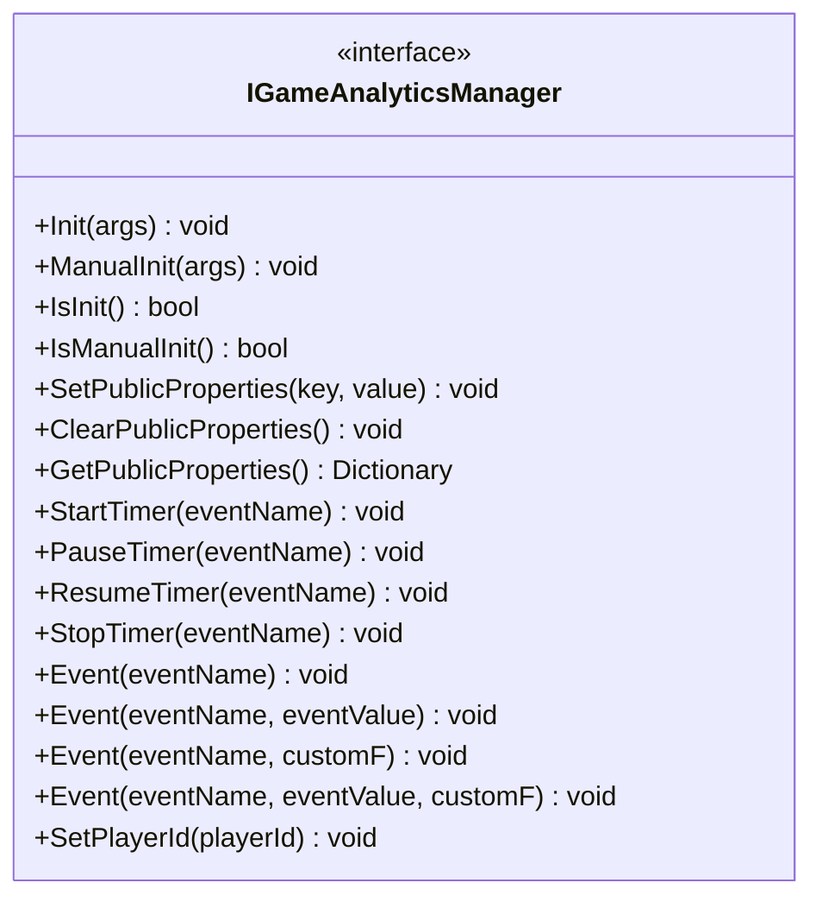
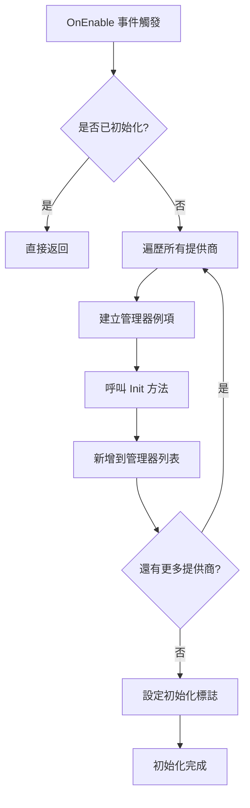
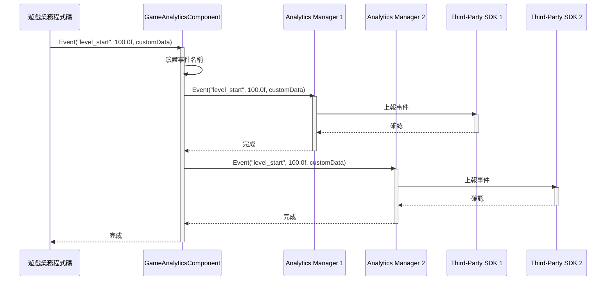
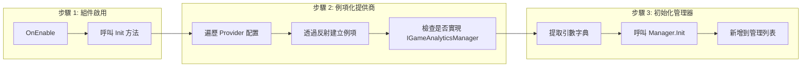

# 核心架構

本文件詳細介紹 GameFrameX 遊戲資料分析外掛的核心架構設計，包括主要組件、資料流和設計模式。

## 概述

GameFrameX 遊戲資料分析外掛（GameAnalytics）是 GameFrameX 框架的核心模組之一，負責為 Unity 遊戲提供統一的事件上報、計時器和玩家資料分析功能。該外掛採用模組化設計，支援多種第三方分析服務整合，同時提供公共屬性管理機制，確保資料分析的一致性和可擴充套件性。

## 架構設計

### 整體架構圖

```mermaid
flowchart TD
    subgraph UnityLayer["Unity 引擎層"]
        GameObject[GameObject]
    end

    subgraph GameAnalyticsComponentLayer["組件層 (GameAnalyticsComponent)"]
        GAComponent[GameAnalyticsComponent]
        Providers[GameAnalyticsComponentProvider]
    end

    subgraph ManagerLayer["管理器層"]
        IManager[IGameAnalyticsManager]
        BaseManager[BaseGameAnalyticsManager]
    end

    subgraph ImplementationLayer["實現層"]
        ImplA[Analytics Provider A]
        ImplB[Analytics Provider B]
        ImplC[Analytics Provider N]
    end

    GameObject --> GAComponent
    GAComponent --> Providers
    Providers -.->|配置| IManager
    IManager <|..| BaseManager
    BaseManager -->|繼承| ImplA
    BaseManager -->|繼承| ImplB
    BaseManager -->|繼承| ImplC
```

### 架構分層說明

| 層級 | 組件 | 職責 |
|------|------|------|
| **Unity 引擎層** | GameObject | Unity 場景中的遊戲物件宿主 |
| **組件層** | GameAnalyticsComponent | 提供 Unity 組件介面，管理工作管理器生命週期 |
| **管理器層** | IGameAnalyticsManager / BaseGameAnalyticsManager | 定義統一 API，實現通用功能 |
| **實現層** | 具體分析服務實現 | 整合第三方分析 SDK（GameAnalytics、Firebase 等） |

## 核心組件

### 1. IGameAnalyticsManager 介面

`IGameAnalyticsManager` 是外掛的核心介面，定義了所有分析功能的標準契約。該介面採用面向抽象設計，使得上層程式碼無需關心具體實現細節。

> Source: [IGameAnalyticsManager.cs](https://github.com/GameFrameX/com.gameframex.unity.gameanalytics/blob/main/Runtime/GameAnalytics/IGameAnalyticsManager.cs#L1-L106)

**介面方法分類：**



### 2. BaseGameAnalyticsManager 抽象基類

`BaseGameAnalyticsManager` 繼承自 `GameFrameworkModule`，是所有分析管理器實現的基礎類。它封裝了通用功能，包括：

- **初始化狀態管理** - 跟蹤管理器是否已初始化
- **公共屬性管理** - 提供公共屬性的設定、獲取和清除功能
- **裝置資訊採集** - 自動收集裝置相關的公共屬性

```csharp
public abstract class BaseGameAnalyticsManager : GameFrameworkModule, IGameAnalyticsManager
{
    protected bool m_IsInit = false;
    protected readonly Dictionary<string, object> m_PublicProperties = new Dictionary<string, object>();
    
    protected virtual void AddDeviceInfoToPublicProperties()
    {
        // 裝置基本資訊
        m_PublicProperties["device_id"] = SystemInfo.deviceUniqueIdentifier;
        m_PublicProperties["device_model"] = SystemInfo.deviceModel;
        // ... 更多裝置資訊
    }
}
```

> Source: [BaseGameAnalyticsManager.cs](https://github.com/GameFrameX/com.gameframex.unity.gameanalytics/blob/main/Runtime/GameAnalytics/BaseGameAnalyticsManager.cs#L10-L203)

**設計意圖：** 抽象基類模式允許不同分析服務提供商繼承該類並實現特定邏輯，同時複用公共屬性管理和裝置資訊採集等通用功能。

### 3. GameAnalyticsComponent Unity 組件

`GameAnalyticsComponent` 是 Unity 引擎的組件類，負責在遊戲場景中提供資料分析功能。它繼承自 `GameFrameworkComponent`，是開發者主要互動的入口點。

```csharp
[DisallowMultipleComponent]
[AddComponentMenu("Game Framework/GameAnalytics")]
public sealed class GameAnalyticsComponent : GameFrameworkComponent
{
    [SerializeField] private List<GameAnalyticsComponentProvider> m_gameAnalyticsComponentProviders = new List<GameAnalyticsComponentProvider>();
    private List<IGameAnalyticsManager> m_GameAnalyticsManager;
}
```

> Source: [GameAnalyticsComponent.cs](https://github.com/GameFrameX/com.gameframex.unity.gameanalytics/blob/main/Runtime/GameAnalytics/GameAnalyticsComponent.cs#L1-L386)

**核心職責：**

1. **多提供商支援** - 支援同時配置多個分析服務提供商
2. **自動初始化** - 在 `OnEnable` 時自動初始化所有提供商
3. **手動初始化** - 支援延遲手動初始化以滿足特殊需求
4. **事件廣播** - 將事件同時傳送給所有已配置的提供商



### 4. 配置模型

外掛使用兩個配置類來管理分析服務提供商的設定：

- **GameAnalyticsComponentProvider** - 提供商配置，包含組件型別和引數設定
- **GameAnalyticsComponentParamKV** - 鍵值對配置，用於儲存具體引數

```csharp
[Serializable]
public class GameAnalyticsComponentProvider
{
    public string ComponentType;
    public int ComponentTypeNameIndex;
    public List<GameAnalyticsComponentParamKV> Setting = new List<GameAnalyticsComponentParamKV>();
}

[Serializable]
public class GameAnalyticsComponentParamKV
{
    public string Key;
    public string Value;
}
```

> Source: [GameAnalyticsComponent.cs](https://github.com/GameFrameX/com.gameframex.unity.gameanalytics/blob/main/Runtime/GameAnalytics/GameAnalyticsComponent.cs#L361-L385)

## 資料流

### 事件上報流程

當遊戲程式碼呼叫 `GameAnalyticsComponent.Event()` 方法時，事件資料透過以下流程傳播：



### 初始化流程



## 公共屬性機制

### 概述

公共屬性（Public Properties）是自動附加到所有事件的上下文資料，用於提供玩家會話的詳細資訊。這些屬性在 `BaseGameAnalyticsManager` 中自動採集，包括裝置資訊、作業系統資訊、應用程式資訊等。

### 自動採集的屬性

| 分類 | 屬性鍵名 | 描述 |
|------|----------|------|
| 裝置資訊 | `device_id` | 裝置唯一識別符號 |
| 裝置資訊 | `device_model` | 裝置型號 |
| 裝置資訊 | `device_type` | 裝置型別 |
| 作業系統 | `os` | 作業系統版本 |
| 應用程式 | `app_version` | 應用版本號 |
| 應用程式 | `unity_version` | Unity 引擎版本 |
| 應用程式 | `platform` | 執行平臺 |
| 硬體資訊 | `processor_type` | 處理器型別 |
| 硬體資訊 | `processor_count` | 處理器核心數 |
| 硬體資訊 | `system_memory_size` | 系統記憶體大小 |
| 圖形資訊 | `graphics_device_name` | 顯示卡名稱 |
| 圖形資訊 | `graphics_memory_size` | 視訊記憶體大小 |
| 螢幕資訊 | `screen_width` | 螢幕寬度 |
| 螢幕資訊 | `screen_height` | 螢幕高度 |
| 螢幕資訊 | `screen_dpi` | 螢幕 DPI |
| 網路資訊 | `network_type` | 網路型別 (WiFi/Mobile Data) |

> Source: [BaseGameAnalyticsManager.cs](https://github.com/GameFrameX/com.gameframex.unity.gameanalytics/blob/main/Runtime/GameAnalytics/BaseGameAnalyticsManager.cs#L88-L144)

### 自定義公共屬性

開發者可以透過 `SetPublicProperties` 方法新增自定義公共屬性，這些屬性會自動附加到後續所有事件中：

```csharp
// 設定自定義公共屬性
gameAnalyticsComponent.SetPublicProperties("player_level", 10);
gameAnalyticsComponent.SetPublicProperties("player_name", "Hero");
```

### 屬性優先順序

公共屬性的優先順序順序為：
1. **系統自動採集** - 裝置資訊、作業系統等（最先新增）
2. **開發者自定義** - 透過 `SetPublicProperties` 設定（覆蓋同名鍵）
3. **手動清除後重置** - 呼叫 `ClearPublicProperties` 後重新採集系統屬性

## 設計模式詳解

### 1. 介面抽象模式

**應用場景：** `IGameAnalyticsManager` 介面定義

**優勢：**
- 解耦上層程式碼與具體實現
- 支援多提供商並行執行
- 便於單元測試（可使用 Mock）

### 2. 模板方法模式

**應用場景：** `BaseGameAnalyticsManager` 基類

**優勢：**
- 複用通用邏輯（初始化、公共屬性管理）
- 子類只需關注特定實現
- 統一程式碼結構

### 3. 提供商模式

**應用場景：** `GameAnalyticsComponent` 管理多個 `IGameAnalyticsManager`

**優勢：**
- 支援多分析服務同時使用
- 靈活的配置機制
- 便於擴充套件新服務商

### 4. 反射例項化

**應用場景：** Editor 中動態載入分析管理器型別

```csharp
var gameAnalyticsComponentType = Utility.Assembly.GetType(gameAnalyticsComponentProvider.ComponentType);
if (Activator.CreateInstance(gameAnalyticsComponentType) is IGameAnalyticsManager gameAnalyticsManager)
{
    gameAnalyticsManager.Init(args);
    m_GameAnalyticsManager.Add(gameAnalyticsManager);
}
```

**優勢：**
- 執行時動態載入，無需編譯時引用
- 外掛化架構，易於擴充套件

## 相關連結

- [外掛介紹](./1-overview.index) - 外掛概述和功能簡介
- [快速開始](./3-getting-started.index) - 快速上手指南
- [API 介面](./5-api-reference.index) - 完整 API 參考文件
- [編輯器配置](./6-configuration.index) - 編輯器配置說明
- [故障排除](./7-troubleshooting.index) - 常見問題與解決方案
