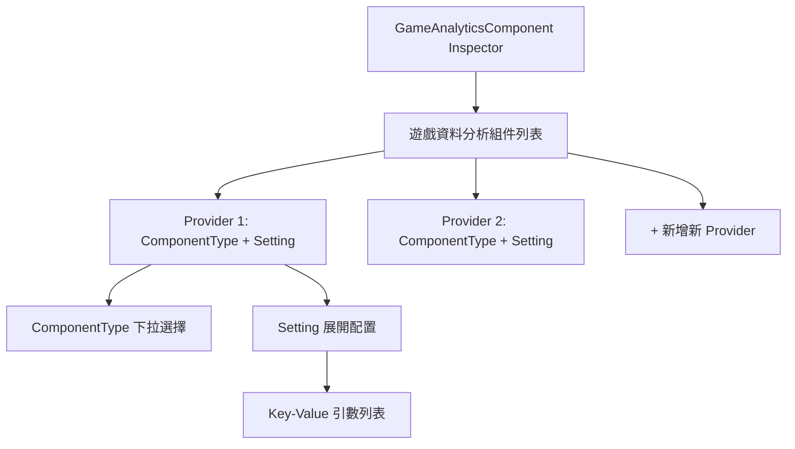
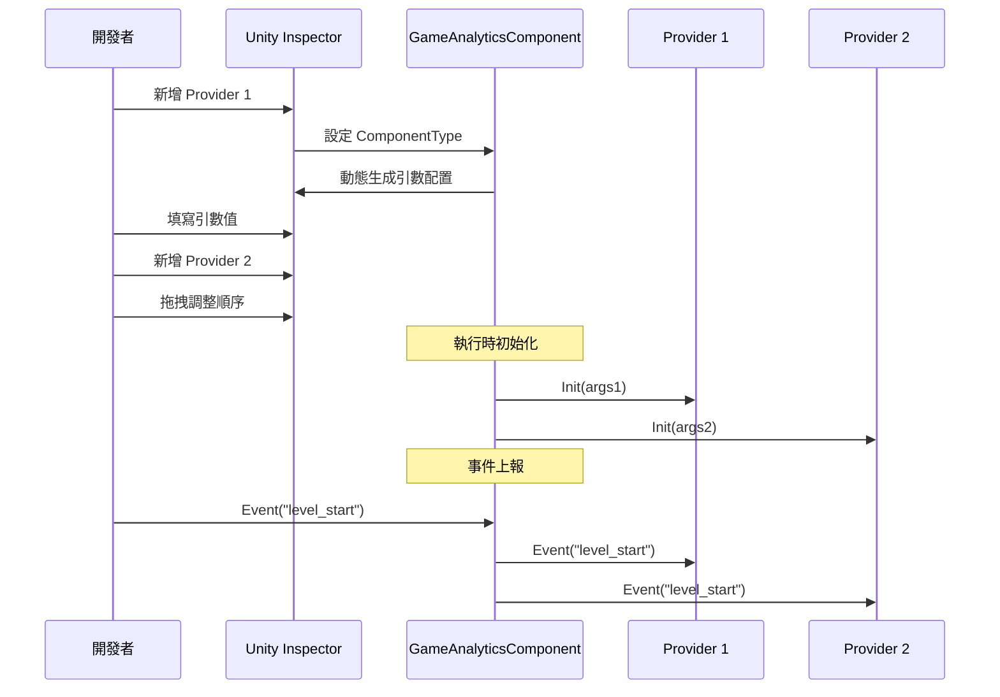

# 編輯器配置

本文件詳細介紹如何在 Unity 編輯器中配置 GameAnalytics 外掛，包括組件新增、 Provider 配置和引數設定。

## 概述

GameAnalytics 外掛採用基於 Provider 的可擴充套件架構，允許在同一個專案中配置多個資料分析服務提供商。編輯器配置主要透過 Unity Inspector 面板完成，核心組件為 `GameAnalyticsComponent`。透過自定義 Inspector 介面，開發者可以視覺化地新增、排序和配置多個分析服務提供商。

> 詳細的核心架構設計請參考 [核心架構](./04.features.md) 文件。

## 配置流程

### 新增組件

在 Unity 場景中建立或選擇需要新增資料分析的 GameObject，然後透過以下方式新增 `GameAnalyticsComponent`：

1. 在 Inspector 面板中點選 **Add Component** 按鈕
2. 搜尋 "GameAnalytics" 或 "遊戲資料分析"
3. 選擇 **Game Framework/GameAnalytics** 組件

```csharp
// 組件定義 - GameAnalyticsComponent.cs
[DisallowMultipleComponent]
[AddComponentMenu("Game Framework/GameAnalytics")]
public sealed class GameAnalyticsComponent : GameFrameworkComponent
{
    [SerializeField] private List<GameAnalyticsComponentProvider> m_gameAnalyticsComponentProviders = new List<GameAnalyticsComponentProvider>();
    // ... 事件上報方法
}
```
> Source: [GameAnalyticsComponent.cs](https://github.com/GameFrameX/com.gameframex.unity.gameanalytics/blob/main/Runtime/GameAnalytics/GameAnalyticsComponent.cs#L12-L17)

### Inspector 介面說明

新增組件後，Inspector 面板將顯示自定義的配置介面，主要包含以下區域：



**主要 UI 元素：**

| 元素 | 說明 |
|------|------|
| 組件列表 | 顯示已配置的所有資料分析 Provider |
| 新增按鈕 | 在列表末尾新增新的 Provider |
| 刪除按鈕 | 移除指定位置的 Provider |
| 拖拽手柄 | 調整 Provider 的上報順序 |
| ComponentType | 選擇具體的資料分析服務實現類 |
| Setting | 展開配置該服務所需的引數 |

## Provider 配置詳解

### 組件型別選擇

每個 Provider 需要選擇實現 `IGameAnalyticsManager` 介面的具體型別。Inspector 會自動掃描所有可用的分析服務實現類並顯示在下拉選單中：

```csharp
// Inspector 程式碼 - 型別重新整理邏輯
protected override void RefreshTypeNames()
{
    List<string> managerTypeNameList = new List<string> { NoneOptionName };
    managerTypeNameList.AddRange(Type.GetRuntimeTypeNames(typeof(IGameAnalyticsManager)));
    m_ManagerTypeNames = managerTypeNameList.ToArray();
}
```
> Source: [GameAnalyticsComponentInspector.cs](https://github.com/GameFrameX/com.gameframex.unity.gameanalytics/blob/main/Editor/Inspector/GameAnalyticsComponentInspector.cs#L42-L50)

**選擇邏輯說明：**
- 預設選項為 "None"（無）
- 下拉選單自動列出所有繼承自 `IGameAnalyticsManager` 的型別
- 選擇型別後，Inspector 會動態生成對應的引數配置介面

### 引數配置

當選擇具體的 ComponentType 後，Inspector 會自動讀取該實現類的欄位定義，並生成對應的引數配置項：

```csharp
// Provider 資料結構
[Serializable]
public class GameAnalyticsComponentProvider
{
    /// <summary>
    /// 實現組件型別
    /// </summary>
    public string ComponentType;

    /// <summary>
    /// 這個是給編輯器用的
    /// </summary>
    public int ComponentTypeNameIndex = 0;

    /// <summary>
    /// 引數
    /// </summary>
    public List<GameAnalyticsComponentParamKV> Setting = new List<GameAnalyticsComponentParamKV>();
}

[Serializable]
public class GameAnalyticsComponentParamKV
{
    public string Key;
    public string Value;
}
```
> Source: [GameAnalyticsComponent.cs](https://github.com/GameFrameX/com.gameframex.unity.gameanalytics/blob/main/Runtime/GameAnalytics/GameAnalyticsComponent.cs#L361-L385)

### Provider 上報順序

多個 Provider 存在時，事件會按列表順序依次上報。可以透過拖拽調整順序，確保資料按預期優先順序傳送。

## 配置示例

### 基礎配置步驟

1. **建立遊戲物件**：在場景中建立空物件或選擇現有物件
2. **新增組件**：Add Component → Game Framework/GameAnalytics
3. **配置 Provider**：
   - 點選列表下方的 "+" 按鈕新增 Provider
   - 在 ComponentType 下拉框中選擇分析服務實現類
   - 展開 Setting 填寫所需的引數（如 AppId、AppKey 等）

```csharp
// 初始化時的引數傳遞
public void Init()
{
    foreach (var gameAnalyticsComponentProvider in m_gameAnalyticsComponentProviders)
    {
        if (gameAnalyticsComponentProvider.ComponentType.IsNotNullOrWhiteSpace())
        {
            var gameAnalyticsComponentType = Utility.Assembly.GetType(gameAnalyticsComponentProvider.ComponentType);
            if (Activator.CreateInstance(gameAnalyticsComponentType) is IGameAnalyticsManager gameAnalyticsManager)
            {
                Dictionary<string, string> args = new Dictionary<string, string>();
                foreach (var param in gameAnalyticsComponentProvider.Setting)
                {
                    args[param.Key] = param.Value;
                }
                gameAnalyticsManager.Init(args);
                m_GameAnalyticsManager.Add(gameAnalyticsManager);
            }
        }
    }
}
```
> Source: [GameAnalyticsComponent.cs](https://github.com/GameFrameX/com.gameframex.unity.gameanalytics/blob/main/Runtime/GameAnalytics/GameAnalyticsComponent.cs#L47-L80)

### 多 Provider 配置

支援同時配置多個分析服務，事件會依次傳送到所有已配置的 Provider：



## 常見配置問題

### Provider 未顯示在列表中

如果下拉選單中沒有顯示所需的分析服務實現類，請檢查：

1. **程式集定義**：確保實現類所在的程式集已正確引用
2. **介面繼承**：確認實現類正確繼承自 `BaseGameAnalyticsManager` 並實現了 `IGameAnalyticsManager`
3. **程式集掃描**：Editor 程式集可能需要重新整理才能檢測到新的型別

### 引數配置無效

如果配置引數後執行時未生效：

1. **確認欄位名稱**：引數 Key 必須與實現類中的欄位名稱完全匹配
2. **檢查初始化**：確認 `Init()` 方法被正確呼叫
3. **檢視日誌**：檢查 Unity Console 中是否有錯誤資訊

### 重複組件警告

新增組件時出現重複警告：

```csharp
[DisallowMultipleComponent]  // 此屬性防止在同一 GameObject 上新增多個例項
public sealed class GameAnalyticsComponent : GameFrameworkComponent
```

> 這是預期行為，確保每個場景中只有一個 GameAnalyticsComponent 例項。

## 相關連結

- [快速開始](./3-getting-started.index) - 瞭解如何快速整合
- [核心架構](./04.features.md) - 深入瞭解系統設計
- [API 介面](./5-api-reference.index) - 完整的 API 參考文件
- [故障排除](./7-troubleshooting.index) - 常見問題與解決方案
