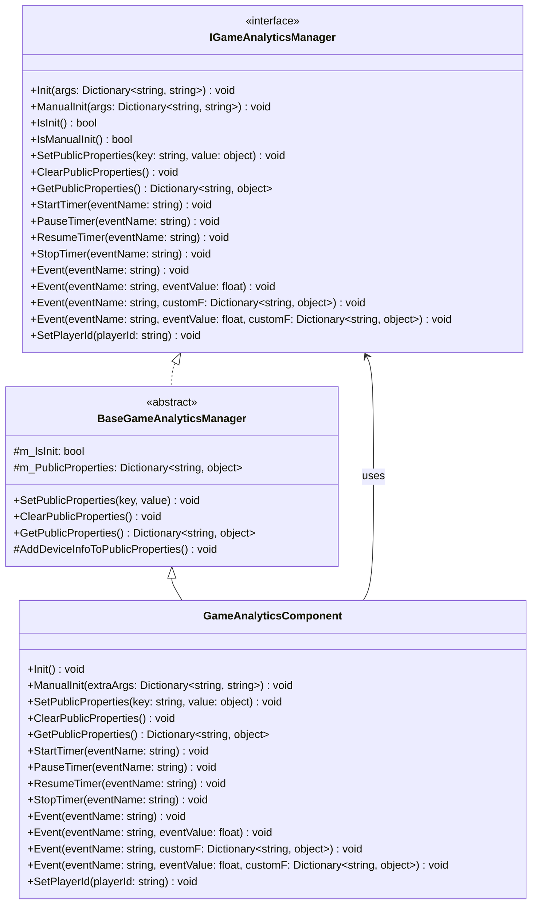
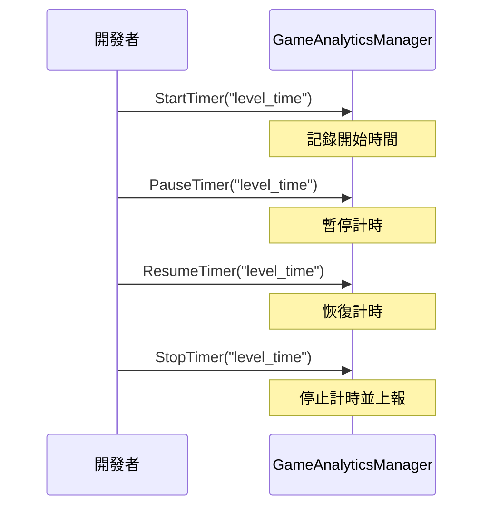

# API 介面

本文件詳細介紹 GameAnalytics 外掛提供的所有程式設計介面，包括介面定義、引數說明和使用方式。

## 概述

GameAnalytics 外掛提供了完整的遊戲資料分析功能介面，透過 `IGameAnalyticsManager` 介面定義標準化的分析方法。外掛採用模組化設計，支援多provider擴充套件，開發者可以透過 `GameAnalyticsComponent` 組件或直接呼叫 `IGameAnalyticsManager` 介面來使用功能。

> 名稱空間：`GameFrameX.GameAnalytics.Runtime`

## 架構



### 組件層級說明

| 層級 | 組件 | 說明 |
|------|------|------|
| 介面層 | `IGameAnalyticsManager` | 定義所有資料分析功能的抽象介面 |
| 基類層 | `BaseGameAnalyticsManager` | 實現公共邏輯和裝置資訊收集 |
| 組件層 | `GameAnalyticsComponent` | Unity組件，暴露給開發者使用的入口 |

## 初始化介面

### `Init(args: Dictionary<string, string>): void`

自動初始化方法，在組件啟用時自動呼叫，用於配置遊戲資料分析服務。

**引數：**
- `args` (Dictionary<string, string>): 初始化引數鍵值對，包含服務配置資訊

**示例：**
```csharp
var args = new Dictionary<string, string>
{
    { "AppId", "your_app_id" },
    { "ChannelId", "your_channel_id" }
};
gameAnalyticsManager.Init(args);
```
> Source: [IGameAnalyticsManager.cs](https://github.com/GameFrameX/com.gameframex.unity.gameanalytics/blob/main/Runtime/GameAnalytics/IGameAnalyticsManager.cs#L10-L13)

---

### `ManualInit(args: Dictionary<string, string>): void`

手動初始化方法，允許開發者在特定時機手動觸發初始化過程。

**引數：**
- `args` (Dictionary<string, string>): 初始化引數鍵值對

**設計意圖：**
此方法適用於需要延遲初始化或根據特定條件觸發的場景，提供更靈活的控制方式。

> Source: [IGameAnalyticsManager.cs](https://github.com/GameFrameX/com.gameframex.unity.gameanalytics/blob/main/Runtime/GameAnalytics/IGameAnalyticsManager.cs#L15-L18)

---

### `IsInit(): bool`

檢查組件是否已完成初始化。

**返回：**
- `bool`: 返回 true 表示已初始化，false 表示未初始化

**示例：**
```csharp
if (gameAnalyticsManager.IsInit())
{
    gameAnalyticsManager.Event("level_complete");
}
```
> Source: [IGameAnalyticsManager.cs](https://github.com/GameFrameX/com.gameframex.unity.gameanalytics/blob/main/Runtime/GameAnalytics/IGameAnalyticsManager.cs#L20-L23)

---

### `IsManualInit(): bool`

檢查組件是否配置為手動初始化模式。

**返回：**
- `bool`: 返回 true 表示使用手動初始化，false 表示自動初始化

> Source: [IGameAnalyticsManager.cs](https://github.com/GameFrameX/com.gameframex.unity.gameanalytics/blob/main/Runtime/GameAnalytics/IGameAnalyticsManager.cs#L25-L28)

## 公共屬性介面

公共屬性用於設定跟隨所有事件一起上報的通用資料，減少重複資料的傳送。

### `SetPublicProperties(key: string, value: object): void`

設定公共屬性，該屬性會自動附加到所有後續上報的事件中。

**引數：**
- `key` (string): 屬性鍵名，不能為空
- `value` (object): 屬性值

**示例：**
```csharp
gameAnalyticsManager.SetPublicProperties("player_level", 10);
gameAnalyticsManager.SetPlayerId("player_123");
```
> Source: [IGameAnalyticsManager.cs](https://github.com/GameFrameX/com.gameframex.unity.gameanalytics/blob/main/Runtime/GameAnalytics/IGameAnalyticsManager.cs#L30-L35)

---

### `ClearPublicProperties(): void`

清除所有公共屬性。清除後會自動重新新增裝置資訊。

> Source: [IGameAnalyticsManager.cs](https://github.com/GameFrameX/com.gameframex.unity.gameanalytics/blob/main/Runtime/GameAnalytics/IGameAnalyticsManager.cs#L37-L40)

---

### `GetPublicProperties(): Dictionary<string, object>`

獲取當前所有公共屬性的副本。

**返回：**
- `Dictionary<string, object>`: 包含所有公共屬性的字典

**示例：**
```csharp
var properties = gameAnalyticsManager.GetPublicProperties();
foreach (var prop in properties)
{
    Debug.Log($"{prop.Key}: {prop.Value}");
}
```
> Source: [IGameAnalyticsManager.cs](https://github.com/GameFrameX/com.gameframex.unity.gameanalytics/blob/main/Runtime/GameAnalytics/IGameAnalyticsManager.cs#L42-L46)

### 裝置資訊自動收集

`BaseGameAnalyticsManager` 會自動收集以下裝置資訊作為公共屬性：

| 屬性鍵 | 說明 | 資料來源 |
|--------|------|----------|
| device_id | 裝置唯一識別符號 | SystemInfo.deviceUniqueIdentifier |
| device_model | 裝置型號 | SystemInfo.deviceModel |
| device_type | 裝置型別 | SystemInfo.deviceType |
| os | 作業系統 | SystemInfo.operatingSystem |
| app_version | 應用版本 | Application.version |
| unity_version | Unity版本 | Application.unityVersion |
| platform | 執行平臺 | Application.platform |
| processor_type | 處理器型別 | SystemInfo.processorType |
| processor_count | 處理器核心數 | SystemInfo.processorCount |
| system_memory_size | 系統記憶體大小 | SystemInfo.systemMemorySize |
| graphics_device_name | 圖形裝置名稱 | SystemInfo.graphicsDeviceName |
| graphics_memory_size | 視訊記憶體大小 | SystemInfo.graphicsMemorySize |
| screen_width | 螢幕寬度 | Screen.width |
| screen_height | 螢幕高度 | Screen.height |
| screen_dpi | 螢幕DPI | Screen.dpi |
| network_type | 網路型別 | Application.internetReachability |
| system_language | 系統語言 | Application.systemLanguage |
> Source: [BaseGameAnalyticsManager.cs](https://github.com/GameFrameX/com.gameframex.unity.gameanalytics/blob/main/Runtime/GameAnalytics/BaseGameAnalyticsManager.cs#L85-L143)

## 計時器介面

計時器功能用於測量遊戲內特定操作所花費的時間，適用於關卡通關時間、載入時間等場景。

### `StartTimer(eventName: string): void`

開始計時，為指定事件啟動計時器。

**引數：**
- `eventName` (string): 事件名稱，用於標識計時器，不能為空

**示例：**
```csharp
// 玩家開始進入新關卡時開始計時
gameAnalyticsManager.StartTimer("level_loading_time");
```
> Source: [IGameAnalyticsManager.cs](https://github.com/GameFrameX/com.gameframex.unity.gameanalytics/blob/main/Runtime/GameAnalytics/IGameAnalyticsManager.cs#L48-L52)

---

### `PauseTimer(eventName: string): void`

暫停指定事件的計時器。

**引數：**
- `eventName` (string): 要暫停的計時器事件名稱

> Source: [IGameAnalyticsManager.cs](https://github.com/GameFrameX/com.gameframex.unity.gameanalytics/blob/main/Runtime/GameAnalytics/IGameAnalyticsManager.cs#L54-L58)

---

### `ResumeTimer(eventName: string): void`

恢復指定事件的計時器。

**引數：**
- `eventName` (string): 要恢復的計時器事件名稱

> Source: [IGameAnalyticsManager.cs](https://github.com/GameFrameX/com.gameframex.unity.gameanalytics/blob/main/Runtime/GameAnalytics/IGameAnalyticsManager.cs#L60-L64)

---

### `StopTimer(eventName: string): void`

停止指定事件的計時器並上報計時結果。

**引數：**
- `eventName` (string): 要停止的計時器事件名稱

**示例：**
```csharp
// 關卡載入完成後停止計時並上報
gameAnalyticsManager.StopTimer("level_loading_time");
```
> Source: [IGameAnalyticsManager.cs](https://github.com/GameFrameX/com.gameframex.unity.gameanalytics/blob/main/Runtime/GameAnalytics/IGameAnalyticsManager.cs#L66-L70)

### 計時器使用流程



## 事件上報介面

事件上報是遊戲資料分析的核心功能，用於收集玩家行為資料。

### `Event(eventName: string): void`

上報簡單事件，僅包含事件名稱，不攜帶任何資料。

**引數：**
- `eventName` (string): 事件名稱，不能為空

**示例：**
```csharp
// 玩家完成新手引導
gameAnalyticsManager.Event("tutorial_complete");

// 玩家開啟設定介面
gameAnalyticsManager.Event("open_settings");
```
> Source: [IGameAnalyticsManager.cs](https://github.com/GameFrameX/com.gameframex.unity.gameanalytics/blob/main/Runtime/GameAnalytics/IGameAnalyticsManager.cs#L72-L76)

---

### `Event(eventName: string, eventValue: float): void`

上報帶有數值的事件，用於統計數值的場景。

**引數：**
- `eventName` (string): 事件名稱
- `eventValue` (float): 事件數值

**示例：**
```csharp
// 上報得分
gameAnalyticsManager.Event("score", 1500.5f);

// 上報金幣數量
gameAnalyticsManager.Event("coins_earned", 100f);
```
> Source: [IGameAnalyticsManager.cs](https://github.com/GameFrameX/com.gameframex.unity.gameanalytics/blob/main/Runtime/GameAnalytics/IGameAnalyticsManager.cs#L78-L83)

---

### `Event(eventName: string, customF: Dictionary<string, object>): void`

上報帶有自定義欄位的事件，用於記錄豐富的上下文資訊。

**引數：**
- `eventName` (string): 事件名稱
- `customF` (Dictionary<string, object>): 自定義欄位字典

**示例：**
```csharp
// 上報關卡完成事件，包含額外資訊
var customFields = new Dictionary<string, object>
{
    { "level_id", 5 },
    { "difficulty", "hard" },
    { "stars_earned", 3 },
    { "time_taken", 120.5 }
};
gameAnalyticsManager.Event("level_complete", customFields);
```
> Source: [IGameAnalyticsManager.cs](https://github.com/GameFrameX/com.gameframex.unity.gameanalytics/blob/main/Runtime/GameAnalytics/IGameAnalyticsManager.cs#L85-L90)

---

### `Event(eventName: string, eventValue: float, customF: Dictionary<string, object>): void`

上報同時帶有數值和自定義欄位的事件，適用於需要同時記錄數值和上下文的場景。

**引數：**
- `eventName` (string): 事件名稱
- `eventValue` (float): 事件數值
- `customF` (Dictionary<string, object>): 自定義欄位字典

**示例：**
```csharp
// 上報付費購買事件
var purchaseData = new Dictionary<string, object>
{
    { "item_id", "gem_pack_100" },
    { "payment_method", "alipay" },
    { "region", "CN" }
};
gameAnalyticsManager.Event("purchase", 9.99f, purchaseData);
```
> Source: [IGameAnalyticsManager.cs](https://github.com/GameFrameX/com.gameframex.unity.gameanalytics/blob/main/Runtime/GameAnalytics/IGameAnalyticsManager.cs#L92-L98)

### 事件上報型別選擇

```mermaid
flowchart TD
    A[需要上報事件?] --> B{需要附帶資料?}
    B -->|否| C[Event(eventName)]
    B -->|是| D{資料型別?}
    D -->|僅數值| E[Event(eventName, eventValue)]
    D -->|僅自定義欄位| F[Event(eventName, customF)]
    D -->|數值+自定義欄位| G[Event(eventName, eventValue, customF)]
    
    C --> H[上報完成]
    E --> H
    F --> H
    G --> H
```

## 玩家標識介面

### `SetPlayerId(playerId: string): void`

設定當前玩家的唯一識別符號，用於關聯玩家行為資料。

**引數：**
- `playerId` (string): 玩家唯一識別符號

**示例：**
```csharp
// 玩家登入後設定玩家ID
gameAnalyticsManager.SetPlayerId("player_882347");
```
> Source: [IGameAnalyticsManager.cs](https://github.com/GameFrameX/com.gameframex.unity.gameanalytics/blob/main/Runtime/GameAnalytics/IGameAnalyticsManager.cs#L100-L104)

## 完整使用示例

以下示例展示了一個典型的遊戲分析整合流程：

```csharp
using GameFrameX.GameAnalytics.Runtime;
using UnityEngine;

public class GameAnalyticsExample : MonoBehaviour
{
    private IGameAnalyticsManager _gameAnalyticsManager;

    private void Start()
    {
        // 透過Unity組件獲取管理器
        var component = GetComponent<GameAnalyticsComponent>();
        
        // 設定玩家ID
        component.SetPlayerId("player_882347");
        
        // 設定公共屬性
        component.SetPublicProperties("server_id", "server_01");
        component.SetPublicProperties("game_mode", " PvP");
    }

    private void OnLevelStart(int levelId)
    {
        // 開始關卡計時
        GetComponent<GameAnalyticsComponent>().StartTimer($"level_{levelId}");
        
        // 上報關卡開始事件
        GetComponent<GameAnalyticsComponent>().Event("level_start", new Dictionary<string, object>
        {
            { "level_id", levelId },
            { "difficulty", "normal" }
        });
    }

    private void OnLevelComplete(int levelId, float timeTaken, int stars)
    {
        // 停止關卡計時
        GetComponent<GameAnalyticsComponent>().StopTimer($"level_{levelId}");
        
        // 上報關卡完成事件
        GetComponent<GameAnalyticsComponent>().Event("level_complete", timeTaken, new Dictionary<string, object>
        {
            { "level_id", levelId },
            { "stars", stars },
            { "time_taken", timeTaken }
        });
    }

    private void OnPurchase(string itemId, float price)
    {
        // 上報付費事件
        GetComponent<GameAnalyticsComponent>().Event("purchase", price, new Dictionary<string, object>
        {
            { "item_id", itemId },
            { "currency", "USD" }
        });
    }
}
```
> Source: [GameAnalyticsComponent.cs](https://github.com/GameFrameX/com.gameframex.unity.gameanalytics/blob/main/Runtime/GameAnalytics/GameAnalyticsComponent.cs#L36-L42)

## Unity組件介面

`GameAnalyticsComponent` 是 Unity 組件，提供了與 `IGameAnalyticsManager` 介面相同的方法，可直接在 Unity 場景中使用。

### 組件方法列表

| 方法 | 說明 |
|------|------|
| `Init()` | 初始化組件 |
| `ManualInit(extraArgs)` | 手動初始化 |
| `SetPlayerId(playerId)` | 設定玩家ID |
| `SetPublicProperties(key, value)` | 設定公共屬性 |
| `ClearPublicProperties()` | 清除公共屬性 |
| `GetPublicProperties()` | 獲取公共屬性 |
| `StartTimer(eventName)` | 開始計時 |
| `PauseTimer(eventName)` | 暫停計時 |
| `ResumeTimer(eventName)` | 恢復計時 |
| `StopTimer(eventName)` | 停止計時 |
| `Event(eventName)` | 上報簡單事件 |
| `Event(eventName, eventValue)` | 上報數值事件 |
| `Event(eventName, customF)` | 上報自定義欄位事件 |
| `Event(eventName, eventValue, customF)` | 上報完整事件 |

> Source: [GameAnalyticsComponent.cs](https://github.com/GameFrameX/com.gameframex.unity.gameanalytics/blob/main/Runtime/GameAnalytics/GameAnalyticsComponent.cs#L27-L358)

## 相關連結

- [核心架構](./04.features.md) - 瞭解外掛的整體架構設計
- [快速開始](./3-getting-started.index) - 快速整合外掛
- [編輯器配置](./6-configuration.index) - 配置 GameAnalytics 組件
- [故障排除](./7-troubleshooting.index) - 常見問題與解決方案
