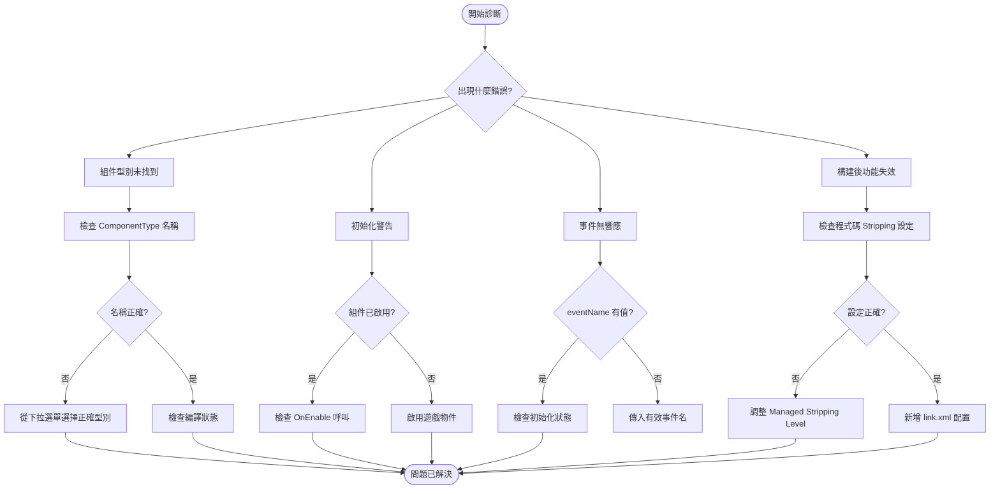

# 故障排除

本文件提供 GameFrameX GameAnalytics 外掛的常見問題排查指南，幫助開發者快速定位和解決整合過程中遇到的問題。

## 概述

GameAnalytics 組件在 Unity 專案中可能會遇到多種配置和執行時問題。本文件涵蓋從安裝配置到執行時錯誤的各類常見問題，並提供詳細的診斷步驟和解決方案。

## 常見問題與解決方案

### 1. 組件型別未找到

**錯誤資訊：**
```
Can not find component type 'XXX'.
```

**問題原因：**
- 在 Inspector 面板中配置的組件型別名稱拼寫錯誤
- 指定的分析服務實現類不存在或未正確引用
- 名稱空間不匹配

**解決方案：**

1. 開啟 Unity 編輯器
2. 在場景中選擇掛載了 `GameAnalyticsComponent` 的遊戲物件
3. 在 Inspector 面板中檢查 **ComponentType** 下拉選單
4. 從下拉選單中選擇正確的分析服務實現型別（不要手動輸入）
5. 確保分析服務實現類已正確編譯且無語法錯誤

> Source: [GameAnalyticsComponent.cs](https://github.com/GameFrameX/com.gameframex.unity.gameanalytics/blob/main/Runtime/GameAnalytics/GameAnalyticsComponent.cs#L58-L63)

### 2. 初始化相關警告

**警告資訊：**
```
GameAnalyticsManager is not init.
```

**問題原因：**
- 在分析管理器初始化完成之前呼叫了事件上報或計時方法
- `GameAnalyticsComponent` 的 `Init()` 方法尚未執行

**解決方案：**

GameAnalyticsComponent 會在 `OnEnable()` 時自動初始化。如果您看到此警告，請檢查：

1. 確保 `GameAnalyticsComponent` 已正確新增到場景中的遊戲物件上
2. 遊戲物件的 `OnEnable()` 已被 Unity 引擎呼叫（遊戲物件可能處於禁用狀態）
3. 如果需要手動初始化，呼叫 `ManualInit()` 方法之前確保已完成自動初始化

```csharp
// 正確的方式：確保組件已啟用
var analytics = gameObject.GetComponent<GameAnalyticsComponent>();
// Component 會在 OnEnable 時自動初始化
```

> Source: [GameAnalyticsComponent.cs](https://github.com/GameFrameX/com.gameframex.unity.gameanalytics/blob/main/Runtime/GameAnalytics/GameAnalyticsComponent.cs#L170-L177)

### 3. 重複組件警告

**問題描述：**
Unity 提示不能新增多個 GameAnalyticsComponent

**問題原因：**
- 場景中已存在 `GameAnalyticsComponent`，再次新增時會觸發 `[DisallowMultipleComponent]` 特性

**解決方案：**

1. 檢查場景中是否已存在 GameAnalytics 組件
2. 如需多個配置方案，使用組件列表功能（Inspector 面板中的 `遊戲資料分析組件列表`）
3. 刪除重複的組件例項

```csharp
// 檢查是否已存在組件
var existing = FindObjectsOfType<GameAnalyticsComponent>();
if (existing.Length > 0)
{
    // 使用現有組件，不要再次新增
}
```

> Source: [GameAnalyticsComponent.cs](https://github.com/GameFrameX/com.gameframex.unity.gameanalytics/blob/main/Runtime/GameAnalytics/GameAnalyticsComponent.cs#L12)

### 4. 程式碼被 Strip 導致的問題

**問題描述：**
- 在構建 IL2CPP 專案後，分析服務功能失效
- 執行時報錯找不到特定型別

**問題原因：**
Unity 的程式碼 stripping 機制可能會移除未直接引用的類

**解決方案：**

外掛已包含 `GameFrameXGameAnalyticsCroppingHelper` 用於防止程式碼被裁剪。如果仍有問題：

1. 開啟 `Project Settings > Player > Other Settings`
2. 設定 **Managed Stripping Level** 為 **Minimal**
3. 或在 `link.xml` 檔案中新增如下配置：

```xml
<linker>
    <assembly fullname="GameFrameX.GameAnalytics.Runtime" preserve="all"/>
</assembly>
```

> Source: [GameFrameXGameAnalyticsCroppingHelper.cs](https://github.com/GameFrameX/com.gameframex.unity.gameanalytics/blob/main/Runtime/GameFrameXGameAnalyticsCroppingHelper.cs#L1-L17)

### 5. 引數驗證錯誤

**錯誤資訊：**
- 傳入空的事件名稱時方法無響應

**問題原因：**
- 事件名稱引數不能為空字串或 null

**解決方案：**

所有事件方法和計時方法都使用 `GameFrameworkGuard.NotNullOrEmpty` 進行引數驗證。請確保傳入有效的事件名稱：

```csharp
// ❌ 錯誤示例
analytics.Event("");
analytics.StartTimer(null);

// ✅ 正確示例
analytics.Event("player_login");
analytics.StartTimer("level_loading");
```

> Source: [GameAnalyticsComponent.cs](https://github.com/GameFrameX/com.gameframex.unity.gameanalytics/blob/main/Runtime/GameAnalytics/GameAnalyticsComponent.cs#L160-L166)

### 6. 編輯器配置問題

**問題描述：**
- Inspector 面板中無法選擇組件型別
- 配置引數不顯示

**解決方案：**

1. 確保 Unity 已編譯完成所有指令碼（無編譯錯誤）
2. 檢查 Editor 資料夾中的 Inspector 程式碼是否正常工作
3. 重新整理型別列表：關閉並重新開啟 Inspector 面板
4. 確保 `GameAnalyticsComponentProvider` 類正確序列化

> Source: [GameAnalyticsComponentInspector.cs](https://github.com/GameFrameX/com.gameframex.unity.gameanalytics/blob/main/Editor/Inspector/GameAnalyticsComponentInspector.cs#L42-L50)

## 診斷流程



## 除錯技巧

### 啟用除錯日誌

在 Unity 控制檯中檢視以下日誌分類：

- **Error**: 組件型別未找到等嚴重錯誤
- **Warning**: 初始化未完成等警告資訊

### 檢查初始化狀態

```csharp
var analytics = gameObject.GetComponent<GameAnalyticsComponent>();
// 檢查初始化狀態
if (analytics.GetType().GetProperty("IsInit")?.GetValue(analytics) is bool isInit)
{
    Debug.Log($"Analytics initialized: {isInit}");
}
```

### 驗證公共屬性

組件會自動收集裝置資訊。可以在執行時檢查這些屬性是否正確設定：

```csharp
// 獲取公共屬性
var properties = analytics.GetPublicProperties();
foreach (var prop in properties)
{
    Debug.Log($"{prop.Key}: {prop.Value}");
}
```

> Source: [BaseGameAnalyticsManager.cs](https://github.com/GameFrameX/com.gameframex.unity.gameanalytics/blob/main/Runtime/GameAnalytics/BaseGameAnalyticsManager.cs#L88-L144)

## 相關連結

- [快速開始](./3-getting-started) - 瞭解如何快速整合
- [核心架構](./04.features.md) - 深入瞭解組件架構
- [API 介面](./5-api-reference) - 完整的 API 參考文件
- [編輯器配置](./6-configuration) - 瞭解如何在編輯器中配置組件
- [外掛介紹](./1-overview) - 外掛概述與功能介紹
