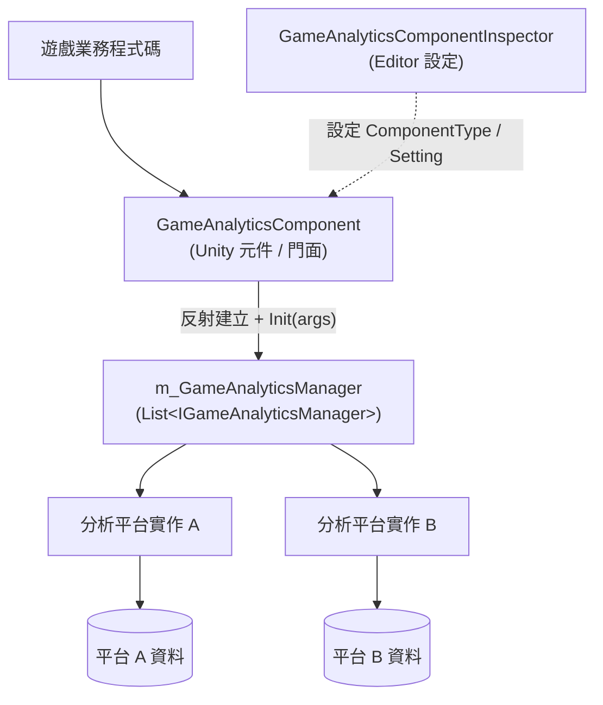

# 遊戲資料分析元件簡介

GameAnalytics 遊戲資料分析元件為 Unity 專案提供統一的遊戲資料分析回報入口：你只需要在 Inspector 中掛載 `GameAnalyticsComponent` 並設定資料分析 Provider，就可以用同一套 API 回報事件、管理計時器，並把資料同時送往多個第三方分析平台。元件零外部相依性，支援 Unity 2019.4 及以上版本（目前套件版本 1.2.1）。

## 快速開始

### 1. 安裝套件

選擇以下任一方式（任選其一即可）：

**方式一：scopedRegistries（推薦）** —— 編輯 Unity 專案的 `Packages/manifest.json`：

```json
{
  "scopedRegistries": [
    {
      "name": "GameFrameX",
      "url": "https://gameframex.upm.alianblank.uk",
      "scopes": [
        "com.gameframex"
      ]
    }
  ],
  "dependencies": {
    "com.gameframex.unity.gameanalytics": "1.2.0"
  }
}
```

`scopes` 控制哪些套件會透過此註冊表解析，只有以 `com.gameframex` 開頭的套件才會從這個註冊表取得。

Source: [README.zh-CN.md](https://github.com/GameFrameX/com.gameframex.unity.gameanalytics/blob/main/README.zh-CN.md#L34-L52)

**方式二：Git URL** —— 在 `manifest.json` 的 `dependencies` 節點下新增：

```json
{
   "com.gameframex.unity.gameanalytics": "https://github.com/gameframex/com.gameframex.unity.gameanalytics.git"
}
```

也可以在 Unity 的 `Package Manager` 中以 `Git URL` 方式新增，網址為 `https://github.com/gameframex/com.gameframex.unity.gameanalytics.git`；或直接把儲存庫下載到 Unity 專案的 `Packages` 目錄下自動載入。

Source: [README.zh-CN.md](https://github.com/GameFrameX/com.gameframex.unity.gameanalytics/blob/main/README.zh-CN.md#L54-L61)

### 2. 掛載元件並設定 Provider

在場景中建立 `Game Framework/GameAnalytics` 元件（`GameAnalyticsComponent`）。元件會在 `Awake` 中收集 Provider，並在 `OnEnable` 時自動呼叫 `Init()`：它會依照 Inspector 中設定的 `ComponentType` 反射建立實作了 `IGameAnalyticsManager` 的實例，並把每個 Provider 的 `Setting` 鍵值對作為初始化參數傳入。

```csharp
public void Init()
{
    if (m_IsInit)
    {
        return;
    }

    foreach (var gameAnalyticsComponentProvider in m_gameAnalyticsComponentProviders)
    {
        if (gameAnalyticsComponentProvider.ComponentType.IsNotNullOrWhiteSpace())
        {
            var gameAnalyticsComponentType = Utility.Assembly.GetType(gameAnalyticsComponentProvider.ComponentType);
            if (gameAnalyticsComponentType == null)
            {
                Log.Error($"Can not find component type '{gameAnalyticsComponentProvider.ComponentType}'.");
                continue;
            }

            if (Activator.CreateInstance(gameAnalyticsComponentType) is IGameAnalyticsManager gameAnalyticsManager)
            {
                Dictionary<string, string> args = new Dictionary<string, string>();
                foreach (var param in gameAnalyticsComponentProvider.Setting)
                {
                    args[param.Key] = param.Value;
                }

                gameAnalyticsManager.Init(args);
                m_GameAnalyticsManager.Add(gameAnalyticsManager);
            }
        }
    }

    m_IsInit = true;
}
```

Source: [GameAnalyticsComponent.cs](https://github.com/GameFrameX/com.gameframex.unity.gameanalytics/blob/main/Runtime/GameAnalytics/GameAnalyticsComponent.cs#L47-L80)

### 3. 回報第一個事件

初始化完成後即可呼叫事件回報與計時 API：

```csharp
// 簡單事件回報
public void Event(string eventName)
{
    if (!_isInit) return;
    _gameAnalyticsManager.Event(eventName);
}

// 帶數值的事件回報
public void Event(string eventName, float eventValue)
{
    if (!_isInit) return;
    _gameAnalyticsManager.Event(eventName, eventValue);
}

// 開始計時 / 結束計時
public void StartTimer(string eventName)
{
    if (!_isInit) return;
    _gameAnalyticsManager.StartTimer(eventName);
}

public void StopTimer(string eventName)
{
    if (!_isInit) return;
    _gameAnalyticsManager.StopTimer(eventName);
}
```

Source: [README.zh-CN.md](https://github.com/GameFrameX/com.gameframex.unity.gameanalytics/blob/main/README.zh-CN.md#L76-L118)

注意：請確保在使用元件的任何方法之前，元件已正確初始化；回報的事件名稱應具有代表性和唯一性，以保證資料分析的準確性。

## 運作原理速覽

元件採用「門面 + 多 Provider」結構：`GameAnalyticsComponent` 是對外的唯一入口（繼承自 `GameFrameworkComponent`），它持有零個或多個實作了 `IGameAnalyticsManager` 的管理器實例，所有公開方法都會遍歷清單並廣播給每一個已設定的分析平台，因此一次呼叫可以同時回報到多個平台。



各類型職責如下：

| 類型 | 說明 |
|------|------|
| `GameAnalyticsComponent` | Unity 元件門面，`Awake` 收集 Provider、`OnEnable` 自動 `Init()`，所有方法廣播到全部 Manager |
| `IGameAnalyticsManager` | 資料分析管理器介面，定義初始化、公用屬性、計時器、事件回報、玩家 ID 等 API |
| `BaseGameAnalyticsManager` | 管理器基底類別，供具體平台實作繼承並重複使用 |
| `GameAnalyticsComponentInspector` | Editor 擴充，用於在 Inspector 中以視覺化方式設定 Provider 與 Setting |
| `GameFrameXGameAnalyticsCroppingHelper` | 裁剪（移除模組）輔助類別 |

`IGameAnalyticsManager` 提供的核心 API 一覽（完整簽名請見介面檔案）：

| 方法 | 簽名 | 說明 |
|------|------|------|
| 自動初始化 | `void Init(Dictionary<string, string> args)` | 元件啟用時自動呼叫 |
| 手動初始化 | `void ManualInit(Dictionary<string, string> args)` | 僅 `IsManualInit()` 為真時由元件轉發 |
| 設定公用屬性 | `void SetPublicProperties(string key, object value)` | 所有事件附帶的公用欄位 |
| 清除/取得公用屬性 | `void ClearPublicProperties()` / `Dictionary<string, object> GetPublicProperties()` | 清空或讀取公用屬性 |
| 計時器 | `StartTimer` / `PauseTimer` / `ResumeTimer` / `StopTimer(string eventName)` | 事件耗時的開始/暫停/恢復/結束 |
| 事件回報 | `Event(string eventName)` 及帶 `float` / `Dictionary<string, object>` 的多載 | 共 4 個多載 |
| 設定玩家 ID | `void SetPlayerId(string playerId)` | 識別目前玩家 |

Source: [IGameAnalyticsManager.cs](https://github.com/GameFrameX/com.gameframex.unity.gameanalytics/blob/main/Runtime/GameAnalytics/IGameAnalyticsManager.cs#L8-L105)

## 接下來

- 回報事件與計時器的具體用法，請見《事件回報與計時功能》任務頁
- 在 Inspector 中設定資料分析 Provider 與 Setting，請見《設定資料分析 Provider》任務頁
- 排解初始化失敗、`Can not find component type` 報錯等問題，請見《初始化與回報失敗疑難排解》疑難排解頁
- 版本演進記錄請見儲存庫 [CHANGELOG.md](https://github.com/GameFrameX/com.gameframex.unity.gameanalytics/blob/main/CHANGELOG.md)