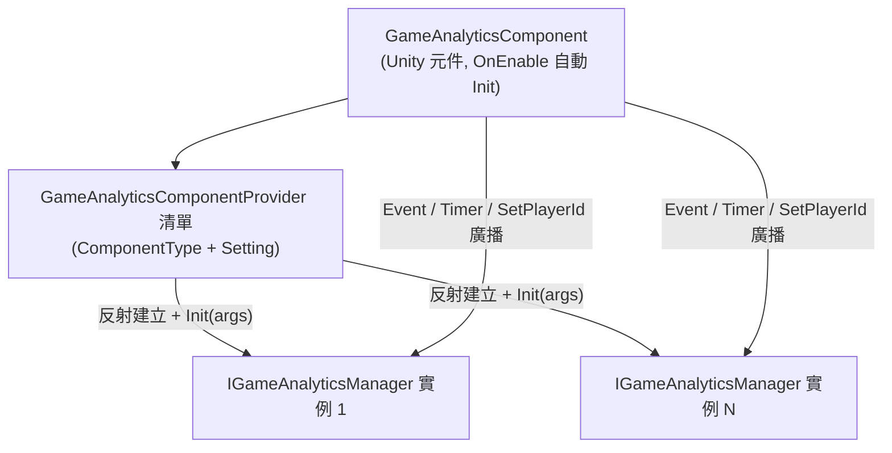

# 安裝與快速上手

GameAnalytics 遊戲資料分析元件為 Unity 專案提供事件回報與計時器功能的統一介面:裝好套件、在場景掛上 `GameAnalyticsComponent` 並設定 Provider 後,一行 `Event(...)` 即可回報資料到任意資料分析 SDK。本頁帶你從安裝走到第一次回報。

## 前置條件

- Unity `2019.4` 或更高版本(見 [package.json](https://github.com/GameFrameX/com.gameframex.unity.gameanalytics/blob/main/package.json#L7) 中 `"unity": "2019.4"`)。
- 專案中已有 GameFrameX 框架基礎元件:`GameAnalyticsComponent` 繼承自 `GameFrameworkComponent`,並使用 `GameFrameX.Runtime` 命名空間下的 `Utility.Assembly`、`Log` 等基礎設施(見 [GameAnalyticsComponent.cs](https://github.com/GameFrameX/com.gameframex.unity.gameanalytics/blob/main/Runtime/GameAnalytics/GameAnalyticsComponent.cs#L1-L14))。
- 本套件本身在 `package.json` 中宣告 `"dependencies": {}`,無額外的第三方相依性。

## 快速開始

### 第 1 步：安裝套件

任選以下一種方式(目前儲存庫版本為 `1.2.1`,README 範例中寫的 `1.2.0` 為歷史版本號)：

1. 編輯 Unity 專案的 `Packages/manifest.json`,新增 `scopedRegistries` 區段：

```json
{
  "scopedRegistries": [
    {
      "name": "GameFrameX",
      "url": "https://gameframex.upm.alianblank.uk",
      "scopes": [
        "com.gameframex"
      ]
    }
  ],
  "dependencies": {
    "com.gameframex.unity.gameanalytics": "1.2.0"
  }
}
```

`scopes` 控制哪些套件會透過此登錄解析，只有以 `com.gameframex` 開頭的套件才會從這個登錄取得。

Source: [README.zh-CN.md](https://github.com/GameFrameX/com.gameframex.unity.gameanalytics/blob/main/README.zh-CN.md#L34-L52)

2. 直接在 `manifest.json` 的 `dependencies` 節點下新增 Git 位址：

```json
{
   "com.gameframex.unity.gameanalytics": "https://github.com/gameframex/com.gameframex.unity.gameanalytics.git"
}
```

Source: [README.zh-CN.md](https://github.com/GameFrameX/com.gameframex.unity.gameanalytics/blob/main/README.zh-CN.md#L54-L59)

3. 在 Unity 的 `Package Manager` 中選擇 `Add package from git URL`,填入 `https://github.com/gameframex/com.gameframex.unity.gameanalytics.git`。
4. 直接下載儲存庫放置到 Unity 專案的 `Packages` 目錄下，Unity 會自動載入識別。

### 第 2 步：掛載元件

在 Unity 選單中選擇 `Component → Game Framework → GameAnalytics`,向場景中的 GameFrameX 元件載體 GameObject 新增 `GameAnalyticsComponent`。元件標註了 `[DisallowMultipleComponent]`,同一 GameObject 只能掛一個。

```csharp
[DisallowMultipleComponent]
[AddComponentMenu("Game Framework/GameAnalytics")]
public sealed class GameAnalyticsComponent : GameFrameworkComponent
```

Source: [GameAnalyticsComponent.cs](https://github.com/GameFrameX/com.gameframex.unity.gameanalytics/blob/main/Runtime/GameAnalytics/GameAnalyticsComponent.cs#L12-L14)

### 第 3 步：設定資料分析 Provider

在 Inspector(自訂編輯器見 [GameAnalyticsComponentInspector.cs](https://github.com/GameFrameX/com.gameframex.unity.gameanalytics/blob/main/Editor/Inspector/GameAnalyticsComponentInspector.cs))中為元件新增 Provider 項目，填寫：

| 欄位 | 說明 |
|------|------|
| `ComponentType` | 實作 `IGameAnalyticsManager` 的類型完整名稱(字串) |
| `Setting` | 傳遞給該 SDK 的鍵值對設定(如 AppKey、SecretKey 等) |

元件啟用時會在 `OnEnable()` 中自動執行 `Init()`:按 `ComponentType` 透過反射建立實例，把 `Setting` 彙總成 `Dictionary<string, string>` 後呼叫 `gameAnalyticsManager.Init(args)`,並把實例加入管理清單——之後所有回報呼叫會廣播到每一個已註冊的 Provider。

```csharp
public void Init()
{
    if (m_IsInit)
    {
        return;
    }

    foreach (var gameAnalyticsComponentProvider in m_gameAnalyticsComponentProviders)
    {
        if (gameAnalyticsComponentProvider.ComponentType.IsNotNullOrWhiteSpace())
        {
            var gameAnalyticsComponentType = Utility.Assembly.GetType(gameAnalyticsComponentProvider.ComponentType);
            if (gameAnalyticsComponentType == null)
            {
                Log.Error($"Can not find component type '{gameAnalyticsComponentProvider.ComponentType}'.");
                continue;
            }

            if (Activator.CreateInstance(gameAnalyticsComponentType) is IGameAnalyticsManager gameAnalyticsManager)
            {
                Dictionary<string, string> args = new Dictionary<string, string>();
                foreach (var param in gameAnalyticsComponentProvider.Setting)
                {
                    args[param.Key] = param.Value;
                }

                gameAnalyticsManager.Init(args);
                m_GameAnalyticsManager.Add(gameAnalyticsManager);
            }
        }
    }

    m_IsInit = true;
}
```

Source: [GameAnalyticsComponent.cs](https://github.com/GameFrameX/com.gameframex.unity.gameanalytics/blob/main/Runtime/GameAnalytics/GameAnalyticsComponent.cs#L47-L80)

### 第 4 步：回報第一個事件與計時器

初始化由元件自動完成，業務程式碼中直接呼叫即可(命名空間 `GameFrameX.GameAnalytics.Runtime`):

```csharp
// 開始/結束計時
GameEntry.GameAnalytics.StartTimer("level_1");
GameEntry.GameAnalytics.StopTimer("level_1");

// 簡單事件回報
GameEntry.GameAnalytics.Event("level_complete");

// 帶數值的事件回報
GameEntry.GameAnalytics.Event("coin_gain", 100f);

// 帶自訂欄位的事件回報
GameEntry.GameAnalytics.Event("purchase",
    new Dictionary<string, object> { { "sku", "gem_100" }, { "price", "0.99" } });

// 帶數值和自訂欄位的事件回報
GameEntry.GameAnalytics.Event("boss_kill", 1f,
    new Dictionary<string, object> { { "boss_id", "b_003" } });
```

Source: [README.zh-CN.md](https://github.com/GameFrameX/com.gameframex.unity.gameanalytics/blob/main/README.zh-CN.md#L80-L148)

> **注意：** 元件未初始化(`m_IsInit == false`)時，除 `Init()` 外的所有方法都會直接 `return`,不會報錯也不會回報。事件名稱應具有代表性與唯一性，以確保資料分析的準確性。

## 工作原理速覽

元件是一個「多路廣播」外殼，真正的資料分析邏輯由你注入的 `IGameAnalyticsManager` 實作承擔(例如同時串接 GA、Firebase 等多個平台)：



## 常見錯誤

| 症狀 | 原因 | 修復 |
|------|------|------|
| 呼叫 `Event` / `StartTimer` 沒有任何回報，也不報錯 | 元件未初始化，方法開頭 `if (!_isInit) return;` 直接返回 | 確認元件已隨 GameObject 啟用觸發 `OnEnable → Init()`;或先呼叫 `Init()` |
| Console 出現 `Can not find component type '...'.` | Provider 的 `ComponentType` 類型名稱寫錯，或該類型所在組件未被參考 | 核對類型完整名稱；確認實作類別為 `public` 且組件已載入 |
| 同一 GameObject 掛不上第二個元件 | `[DisallowMultipleComponent]` 限制 | 只保留一個 `GameAnalyticsComponent`,多平台用多個 Provider 解決 |
| 需要登入後才能使用的 SDK 拿不到參數 | 該 Provider 標記為手動初始化，自動 `Init` 時未傳遞業務參數 | 登入成功後呼叫 `ManualInit(Dictionary<string, string> extraArgs)`(見 [GameAnalyticsComponent.cs](https://github.com/GameFrameX/com.gameframex.unity.gameanalytics/blob/main/Runtime/GameAnalytics/GameAnalyticsComponent.cs#L86-L100)) |

## 接下來

- 完整介面清單與各方法簽章，見 [IGameAnalyticsManager.cs](https://github.com/GameFrameX/com.gameframex.unity.gameanalytics/blob/main/Runtime/GameAnalytics/IGameAnalyticsManager.cs#L8-L105)(含 `PauseTimer` / `ResumeTimer` / `SetPublicProperties` / `SetPlayerId` 等)。
- 基底類別預設實作參考 [BaseGameAnalyticsManager.cs](https://github.com/GameFrameX/com.gameframex.unity.gameanalytics/blob/main/Runtime/GameAnalytics/BaseGameAnalyticsManager.cs)。
- Inspector 自訂編輯器見 [GameAnalyticsComponentInspector.cs](https://github.com/GameFrameX/com.gameframex.unity.gameanalytics/blob/main/Editor/Inspector/GameAnalyticsComponentInspector.cs)。
- 版本歷史見儲存庫 [CHANGELOG.md](https://github.com/GameFrameX/com.gameframex.unity.gameanalytics/blob/main/CHANGELOG.md)。
- 官方文件站：https://gameframex.doc.alianblank.com ;社群 QQ 群：467608841 / 233840761。

## 背景

元件在 `Awake` 中將 `IsAutoRegister = false` 並建立空的 `IGameAnalyticsManager` 清單，真正的實例化延遲到 `OnEnable` 觸發的 `Init()` 中完成，因此 Provider 類型必須在元件啟用時即可透過 `Utility.Assembly.GetType` 解析到。這種「反射 + 字串設定」的設計讓你無需修改本套件原始碼，就能串接任意實作了 `IGameAnalyticsManager` 的資料分析 SDK。

Source: [GameAnalyticsComponent.cs](https://github.com/GameFrameX/com.gameframex.unity.gameanalytics/blob/main/Runtime/GameAnalytics/GameAnalyticsComponent.cs#L20-L30)