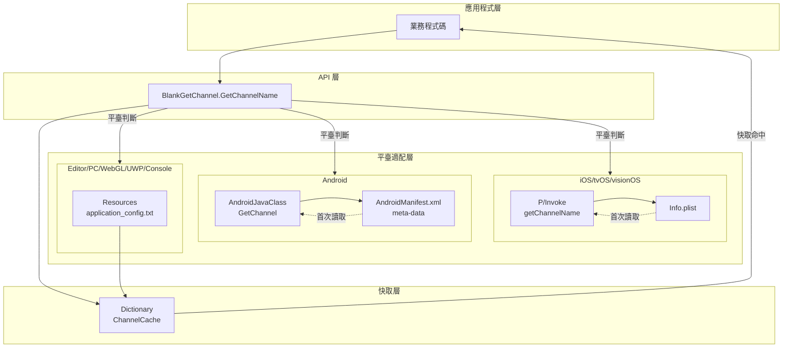
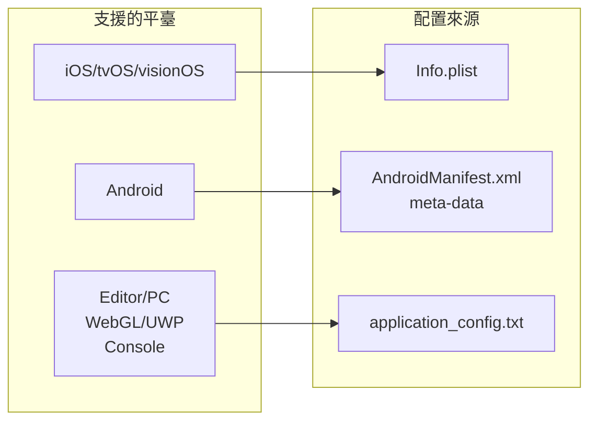
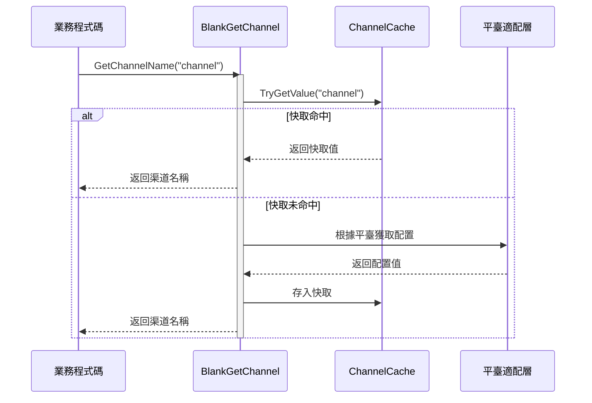

# 概述

Unity Get Channel 是一個用於在 Unity 專案中獲取多平臺分發渠道號的外掛，支援 iOS、tvOS、visionOS、Android、Editor、PC（Windows/Mac/Linux）、WebGL、UWP 以及主流遊戲主機平臺（PS4、PS5、Xbox One、Nintendo Switch）。該外掛是 GameFrameX 專案的重要組成部分，為遊戲開發者提供了統一的渠道資訊獲取解決方案。

## 專案背景

在遊戲分發過程中，開發者通常需要針對不同的發行渠道（如 App Store、Google Play、國內安卓市場等）配置不同的渠道識別符號。傳統做法是為每個平臺編寫獨立的渠道獲取邏輯，導致程式碼重複和維護困難。Unity Get Channel 外掛透過抽象化的設計，將各平臺的渠道獲取邏輯統一封裝，開發者只需呼叫一個簡單的 API 即可獲取當前平臺的渠道資訊，大大簡化了多渠道遊戲配置的工作量。

## 核心功能

本外掛提供以下核心功能：

- **多平臺統一介面**：透過 `BlankGetChannel.GetChannelName()` 方法，在任何支援的平臺上獲取渠道資訊，無需編寫平臺特定程式碼。
- **多渠道支援**：支援獲取主渠道和子渠道資訊，可根據業務需求靈活配置多個渠道鍵。
- **自動配置**：iOS 構建時自動在 Info.plist 中新增預設渠道配置，無需手動操作。
- **快取機制**：內建快取功能，避免重複讀取配置檔案，提高執行時效能。
- **程式碼裁剪保護**：提供 link.xml 檔案，防止關鍵程式碼被 Unity 程式碼裁剪功能移除。

## 架構設計



如上圖所示，該外掛採用分層架構設計。應用程式層透過呼叫 API 層的統一介面獲取渠道資訊，平臺適配層根據當前執行的 Unity 平臺自動選擇合適的配置讀取方式，快取層則負責儲存已讀取的渠道資訊以提高後續訪問的效能。

## 平臺配置方式

不同平臺獲取渠道資訊的配置方式各不相同，以下是各平臺的配置概述：



### iOS/tvOS/visionOS 平臺

在 iOS、tvOS 和 visionOS 平臺上，渠道資訊儲存在應用的 Info.plist 檔案中。外掛透過 P/Invoke 呼叫原生 Objective-C 方法來讀取配置值。構建時，如果檢測到 Info.plist 中尚未配置渠道資訊，系統會自動新增鍵為 "channel"、值為 "default" 的預設條目。

### Android 平臺

在 Android 平臺上，渠道資訊透過 AndroidManifest.xml 檔案中的 `<meta-data>` 標籤定義。外掛使用 Unity 的 AndroidJavaClass 呼叫 Android 原生方法獲取這些配置值。

### Editor/PC/WebGL/UWP/主機平臺

對於 Editor、PC、WebGL、UWP 以及遊戲主機平臺，外掛從 Unity 專案 Resources 資料夾下的 `application_config.txt` 文字檔案中讀取渠道配置。這種設計允許開發者在編輯器環境和其他桌面平臺上進行測試和除錯。

## 工作流程



首次呼叫渠道獲取方法時，外掛會檢查快取是否存在對應鍵名。如果快取命中，直接返回快取值以提高效能；如果快取未命中，則根據當前 Unity 平臺呼叫相應的平臺適配層獲取配置，並將結果存入快取供後續使用。

## 快速使用

在您的 C# 指令碼中，只需一行程式碼即可獲取渠道資訊：

```csharp
using UnityEngine;

public class GameStartup : MonoBehaviour
{
    void Start()
    {
        // 獲取預設渠道（鍵名為 "channel"）
        string channel = BlankGetChannel.GetChannelName();
        Debug.Log("當前渠道: " + channel);

        // 獲取自定義鍵名的渠道
        string customChannel = BlankGetChannel.GetChannelName("channelName");
        Debug.Log("自定義渠道: " + customChannel);

        // 獲取渠道並指定預設值
        string subChannel = BlankGetChannel.GetChannelName("sub_channel", "unknown");
        Debug.Log("子渠道: " + subChannel);
    }
}
```

> Source: [BlankGetChannel.cs](https://github.com/GameFrameX/com.gameframex.unity.getchannel/blob/main/Runtime/BlankGetChannel.cs#L84-L96)

## 專案結構

```
com.gameframex.unity.getchannel/
├── Editor/
│   └── PostProcessBuildHandler.cs    # iOS 構建後處理器
├── Runtime/
│   └── BlankGetChannel.cs            # 核心渠道獲取類
├── Sample~/
│   └── BlankGetChannelExample.cs     # 使用示例
├── README.md                          # 英文文件
├── README.zh-CN.md                    # 簡體中文文件
└── LICENSE.md                        # 許可證
```

核心程式碼位於 `Runtime/BlankGetChannel.cs` 檔案中，包含靜態方法 `GetChannelName()` 的完整實現。`Editor/PostProcessBuildHandler.cs` 負責 iOS 構建時的自動配置，而 `Sample~/BlankGetChannelExample.cs` 提供了簡單的使用示例。

## 相關連結

- [安裝指南](./2-installation) - 瞭解如何將外掛新增到您的 Unity 專案
- [快速開始](./3-getting-started) - 快速上手使用本外掛
- [平臺配置](./4-platform-configuration) - 各平臺的詳細配置方法
- [示例程式碼](./5-samples) - 更多使用示例
- [API 參考](./6-api-reference) - 完整的 API 方法說明
- [常見問題](./7-troubleshooting) - 常見問題解答
- [GitHub 倉庫](https://github.com/GameFrameX/com.gameframex.unity.getchannel) - 檢視最新版本
