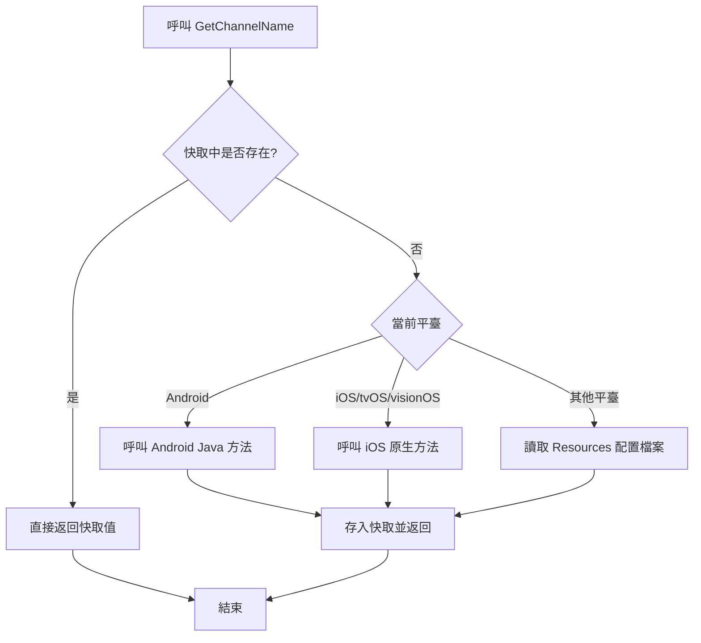

# 快速開始

本節將幫助您快速上手使用 GameFrameX Get Channel 外掛，在 Unity 專案中獲取多平臺渠道號。

## 概述

GameFrameX Get Channel 是一個輕量級的 Unity 外掛，專門用於在遊戲或應用分發時獲取渠道標識資訊。無論您的專案是釋出到 iOS、Android，還是 PC、WebGL 等平臺，都可以使用統一的 API 獲取渠道號，無需編寫平臺特定的程式碼。

**典型使用場景：**
- 統計不同應用商店渠道的使用者數量
- 針對不同渠道配置不同的遊戲資源
- 區分正式服、測試服、內部渠道
- 接入第三方資料分析平臺時傳遞渠道資訊

## 核心功能

該外掛提供以下核心能力：

| 功能 | 說明 |
|------|------|
| 多平臺統一 API | 一次編寫，多平臺執行 |
| 自動快取機制 | 首次讀取後快取結果，避免重複 IO |
| iOS 自動配置 | 構建時自動新增預設渠道（若未配置） |
| 程式碼裁剪保護 | 包含 link.xml，防止 Unity 程式碼裁剪 |

## 基本用法

### 第一步：安裝外掛

將以下依賴新增到您專案的 `Packages/manifest.json` 中：

```json
{
  "dependencies": {
    "com.gameframex.unity.getchannel": "https://github.com/gameframex/com.gameframex.unity.getchannel.git"
  }
}
```

> **提示**：詳細的安裝說明請參閱 [安裝](./2-installation) 文件。

### 第二步：配置渠道資訊

根據您的目標平臺，在對應位置配置渠道資訊：

| 目標平臺 | 配置檔案 | 配置方式 |
|----------|----------|----------|
| iOS / tvOS / visionOS | Info.plist | 新增 `channel` 鍵值對 |
| Android | AndroidManifest.xml | 在 application 標籤新增 meta-data |
| Editor / PC / WebGL / UWP | Resources/application_config.txt | 建立文字檔案，每行 `key=value` |

**詳細配置方法請參閱 [平臺配置](./4-platform-configuration) 文件。**

### 第三步：呼叫 API 獲取渠道號

在任意 C# 指令碼中呼叫 `BlankGetChannel.GetChannelName()` 方法：

```csharp
using UnityEngine;

public class ChannelDemo : MonoBehaviour
{
    void Start()
    {
        // 使用預設引數（key="channel"，預設值="default"）
        string channel = BlankGetChannel.GetChannelName();
        Debug.Log("當前渠道號: " + channel);

        // 自定義鍵名
        string customChannel = BlankGetChannel.GetChannelName("channelName");
        Debug.Log("自定義渠道號: " + customChannel);

        // 指定預設值（當配置不存在時返回）
        string subChannel = BlankGetChannel.GetChannelName("sub_channel", "unknown");
        Debug.Log("子渠道號: " + subChannel);
    }
}
```
> Source: [Runtime/BlankGetChannel.cs](https://github.com/GameFrameX/com.gameframex.unity.getchannel/blob/main/Runtime/BlankGetChannel.cs#L88-L96)

### 第四步：執行並驗證

在 Unity 編輯器中執行遊戲（使用 Editor 平臺），或者構建到目標平臺，檢查日誌輸出是否正確顯示渠道號。

## 工作原理

當您呼叫 `GetChannelName()` 方法時，外掛會按照以下流程獲取渠道資訊：



**關鍵設計說明：**
- **快取機制**：使用 `Dictionary<string, string>` 儲存已讀取的渠道資訊，避免每次呼叫都讀取配置檔案，提高效能
- **平臺判斷**：透過 Unity 前處理器指令（`UNITY_ANDROID`、`UNITY_IOS` 等）判斷當前平臺
- **預設值保護**：當指定的鍵不存在時，返回呼用方指定的預設值，確保程式正常執行

## 完整示例

以下是一個完整的 MonoBehaviour 示例，展示如何在遊戲啟動時獲取並使用渠道資訊：

```csharp
using UnityEngine;

public class GameInitializer : MonoBehaviour
{
    private string channelId;
    private string subChannel;

    void Awake()
    {
        // 獲取主渠道
        channelId = BlankGetChannel.GetChannelName("channel", "default");

        // 獲取子渠道（可選）
        subChannel = BlankGetChannel.GetChannelName("sub_channel", "none");

        Debug.Log($"[GameInitializer] 渠道: {channelId}, 子渠道: {subChannel}");

        // 根據渠道載入不同配置
        InitializeForChannel(channelId);
    }

    void InitializeForChannel(string channel)
    {
        // 這裡可以根據渠道做不同的初始化邏輯
        switch (channel)
        {
            case "ios_cn_taptap":
                Debug.Log("檢測到 TapTap iOS 渠道");
                break;
            case "android_cn_taptap":
                Debug.Log("檢測到 TapTap Android 渠道");
                break;
            default:
                Debug.Log($"檢測到預設/其他渠道: {channel}");
                break;
        }
    }
}
```
> Source: [Sample~/BlankGetChannelExample.cs](https://github.com/GameFrameX/com.gameframex.unity.getchannel/blob/main/Sample~/BlankGetChannelExample.cs#L1-L15)

## 注意事項

1. **鍵名一致性**：確保程式碼中使用的鍵名與平臺配置檔案中的鍵名完全一致
2. **Android 原生程式碼**：Android 平臺需要確保專案中已整合 `com.alianhome.getchannel` 原生模組（外掛包中已包含）
3. **iOS Info.plist**：首次構建 iOS 時，若未手動配置，外掛會自動新增預設渠道 `channel=default`

## 相關連結

- [安裝指南](./2-installation) - 詳細的外掛安裝方法
- [平臺配置](./4-platform-configuration) - 各平臺詳細配置說明
- [示例專案](./5-samples) - 更多使用示例
- [API 參考](./6-api-reference) - 完整的 API 方法說明
- [常見問題](./7-troubleshooting) - 常見問題與解決方案
