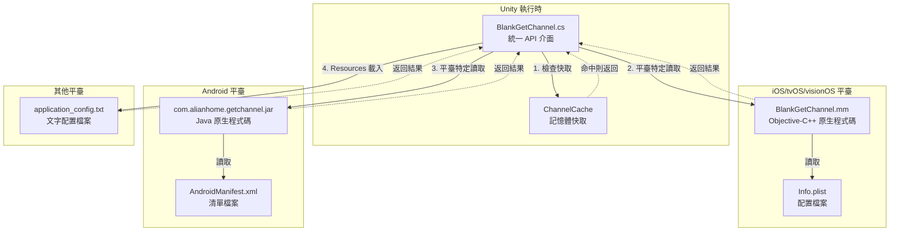
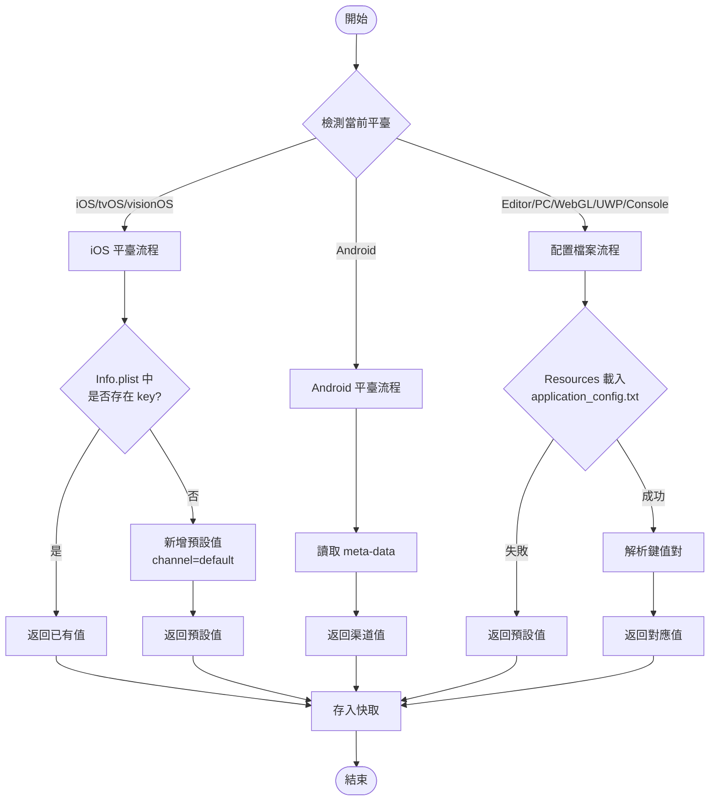
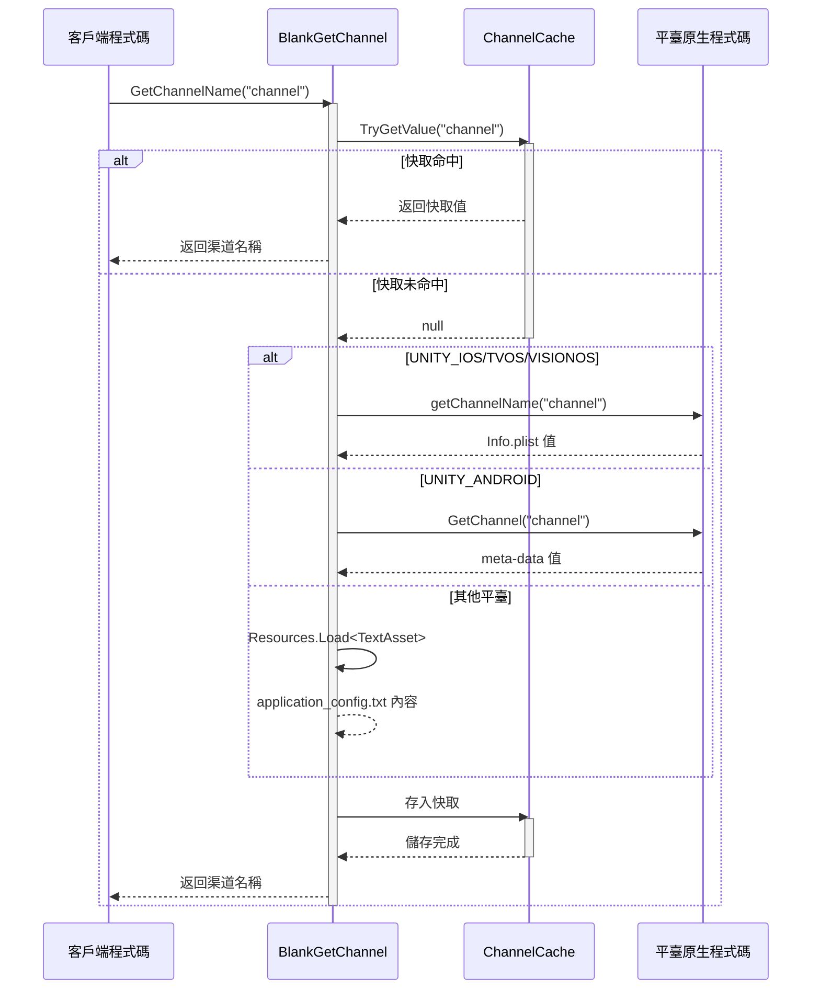

# 平臺配置

本章節詳細介紹 GameFrameX GetChannel 外掛在不同平臺上的配置方法，包括 iOS/tvOS/visionOS、Android、Editor、PC、WebGL、UWP 和主機平臺（PS4、PS5、Xbox One、Nintendo Switch）的配置檔案設定。

## 概述

GameFrameX GetChannel 外掛透過統一的 API 介面獲取各平臺的渠道資訊。為了實現跨平臺支援，每個平臺都有其特定的資料來源和讀取方式：

| 平臺 | 配置源 | 讀取方式 |
|------|--------|----------|
| iOS/tvOS/visionOS | Info.plist | 原生 Objective-C++ 方法呼叫 |
| Android | AndroidManifest.xml | Android Java 反射呼叫 |
| Editor/PC/WebGL/UWP/Console | application_config.txt | Unity Resources 載入 |

## 架構設計



### 組件說明

| 組件 | 位置 | 職責 |
|------|------|------|
| BlankGetChannel | Runtime/BlankGetChannel.cs | 提供統一的 C# API，管理快取和平臺分支 |
| PostProcessBuildHandler | Editor/PostProcessBuildHandler.cs | iOS 構建後自動新增預設渠道配置 |
| BlankGetChannel.mm | Plugins/iOS/BlankGetChannel/ | iOS 平臺原生實現，讀取 Info.plist |
| com.alianhome.getchannel.jar | Plugins/Android/ | Android 平臺原生實現，讀取 meta-data |

## iOS/tvOS/visionOS 平臺配置

### Info.plist 配置

在 Xcode 專案的 `Info.plist` 檔案中新增渠道資訊。使用 **String** 型別鍵值對：

```xml
<!-- 必選：主渠道 -->
<key>channel</key>
<string>ios_cn_taptap</string>

<!-- 可選：子渠道 -->
<key>sub_channel</key>
<string>beta</string>

<!-- 可選：其他自定義鍵 -->
<key>app_id</key>
<string>123456789</string>
```
> Source: [README.md](https://github.com/GameFrameX/com.gameframex.unity.getchannel/blob/main/README.md#L96-L104)

### 自動預設配置

外掛包含構建後處理器 `PostProcessBuildHandler.cs`，會在 iOS 構建時自動執行以下邏輯：

```csharp
// PostProcessBuildHandler.cs 核心邏輯
const string channelKey = "channel";
const string channelValue = "default";

string plistPath = path + "/Info.plist";
PlistDocument plist = new PlistDocument();
plist.ReadFromString(File.ReadAllText(plistPath));
if (!plist.root.values.TryGetValue(channelKey, out var value))
{
    plist.root.SetString(channelKey, channelValue);
    plist.WriteToFile(plistPath);
    Debug.Log("配置渠道成功=>" + channelValue);
}
```
> Source: [PostProcessBuildHandler.cs](https://github.com/GameFrameX/com.gameframex.unity.getchannel/blob/main/Editor/PostProcessBuildHandler.cs#L31-L48)

**自動配置規則：**
- 如果 `Info.plist` 中**不存在** `channel` 鍵 → 自動新增 `channel = "default"`
- 如果 `Info.plist` 中**已存在** `channel` 鍵 → 跳過修改，保留原值

### iOS 原生實現

iOS 平臺透過 Objective-C++ 實現渠道讀取：

```cpp
// Plugins/iOS/BlankGetChannel/BlankGetChannel.mm
char * getChannelName(char * channel_name) {
    NSString* channel_name_String = [NSString stringWithUTF8String:channel_name];
    NSString* File = [[NSBundle mainBundle] pathForResource:@"Info" ofType:@"plist"];
    NSMutableDictionary* dict = [[NSMutableDictionary alloc] initWithContentsOfFile:File];
    NSString * channel_value = [dict objectForKey:channel_name_String];
    if (channel_value != nil) {
        return StringToCharArray(channel_value);
    }
    channel_value = @"unknown";
    return StringToCharArray(channel_value);
}
```
> Source: [BlankGetChannel.mm](https://github.com/GameFrameX/com.gameframex.unity.getchannel/blob/main/Plugins/iOS/BlankGetChannel/BlankGetChannel.mm#L25-L35)

## Android 平臺配置

### AndroidManifest.xml 配置

在 `AndroidManifest.xml` 的 `<application>` 標籤內新增 `<meta-data>` 標籤：

```xml
<application ...>
    <activity ...>
        <!-- 活動配置 -->
    </activity>

    <!-- 必選：主渠道 -->
    <meta-data
        android:name="channel"
        android:value="android_cn_taptap" />

    <!-- 可選：子渠道 -->
    <meta-data
        android:name="sub_channel"
        android:value="beta" />

    <!-- 可選：其他自定義鍵 -->
    <meta-data
        android:name="app_id"
        android:value="123456789" />
</application>
```
> Source: [README.md](https://github.com/GameFrameX/com.gameframex.unity.getchannel/blob/main/README.md#L112-L128)

### Android 原生實現

外掛內建了 Android 原生 JAR 包 (`com.alianhome.getchannel.jar`)，透過 Android Java 反射呼叫：

```csharp
// BlankGetChannel.cs 中的 Android 讀取邏輯
#if UNITY_ANDROID
using (AndroidJavaClass androidJavaClass = new AndroidJavaClass("com.alianhome.getchannel.MainActivity"))
{
    channelName = androidJavaClass.CallStatic<string>("GetChannel", channelKey);
}
#endif
```
> Source: [BlankGetChannel.cs](https://github.com/GameFrameX/com.gameframex.unity.getchannel/blob/main/Runtime/BlankGetChannel.cs#L131-L135)

## Editor/PC/WebGL/UWP/主機平臺配置

### 配置檔案建立

在 Unity 專案的 `Assets/Resources` 資料夾下建立 `application_config.txt` 檔案：

**檔案位置：** `Assets/Resources/application_config.txt`

**檔案格式：**
```
# 每行一個鍵值對，格式為 key=value
# # 開頭為註釋

# 必選：主渠道
channel=editor_cn_test

# 可選：子渠道
sub_channel=beta

# 可選：其他自定義鍵
app_id=123456789
```
> Source: [README.md](https://github.com/GameFrameX/com.gameframex.unity.getchannel/blob/main/README.md#L136-L142)

### 讀取實現

```csharp
// BlankGetChannel.cs 中的文字配置讀取邏輯
var textAsset = Resources.Load<TextAsset>("application_config");
if (textAsset != null)
{
    var lines = textAsset.text.Split(new string[] { "\n", "\r", "\r\n" }, StringSplitOptions.RemoveEmptyEntries);
    foreach (var line in lines)
    {
        var split = line.Split(new string[] { "=" }, StringSplitOptions.RemoveEmptyEntries);
        if (split.Length > 1)
        {
            var key = split[0].Trim();
            var channelValue = split[1].Trim();
            ChannelCache[key] = channelValue;
        }
    }
}
```
> Source: [BlankGetChannel.cs](https://github.com/GameFrameX/com.gameframex.unity.getchannel/blob/main/Runtime/BlankGetChannel.cs#L106-L121)

### 支援的平臺

此配置方式適用於以下平臺：

| 平臺 | 宏定義 |
|------|--------|
| Unity Editor | `UNITY_EDITOR` |
| Windows PC | `UNITY_STANDALONE_WIN` |
| macOS PC | `UNITY_STANDALONE_OSX` |
| Linux PC | `UNITY_STANDALONE_LINUX` |
| WebGL | `UNITY_WEBGL` |
| UWP/WSA | `UNITY_WSA` |
| PlayStation 4 | `UNITY_PS4` |
| PlayStation 5 | `UNITY_PS5` |
| Xbox One | `UNITY_XBOXONE` |
| Nintendo Switch | `UNITY_SWITCH` |

## 配置流程圖



## 渠道獲取流程



## 配置注意事項

### 鍵名一致性

**重要：** 呼叫 `BlankGetChannel.GetChannelName(string key)` 時使用的鍵名必須與對應平臺配置檔案中設定的鍵名完全一致。

| 平臺 | 配置鍵名 | 讀取方式 |
|------|----------|----------|
| iOS/tvOS/visionOS | 區分大小寫 | 直接匹配 |
| Android | 區分大小寫 | 直接匹配 |
| 文字檔案 | 區分大小寫 | 直接匹配 |

### 預設值處理

當指定鍵名不存在時，API 會返回預設值：

```csharp
// 預設引數
BlankGetChannel.GetChannelName();  // key="channel", defaultValue="default"

// 指定預設值
BlankGetChannel.GetChannelName("sub_channel", "unknown");
```
> Source: [BlankGetChannel.cs](https://github.com/GameFrameX/com.gameframex.unity.getchannel/blob/main/Runtime/BlankGetChannel.cs#L98)

### 快取機制

外掛使用記憶體快取避免重複讀取配置檔案：

```csharp
private static readonly Dictionary<string, string> ChannelCache = new Dictionary<string, string>(32);
```
> Source: [BlankGetChannel.cs](https://github.com/GameFrameX/com.gameframex.unity.getchannel/blob/main/Runtime/BlankGetChannel.cs#L57)

**快取特點：**
- 首次呼叫時讀取配置檔案
- 後續呼叫直接從記憶體返回
- 程序結束時快取銷燬
- 不同 key 分別快取

## 平臺配置快速參考表

| 平臺 | 配置檔案 | 鍵型別 | 示例鍵值 |
|------|-----------|--------|----------|
| iOS/tvOS/visionOS | Info.plist | String | `<key>channel</key><string>ios_cn_taptap</string>` |
| Android | AndroidManifest.xml | meta-data | `android:name="channel" android:value="android_cn_taptap"` |
| 其他平臺 | application_config.txt | key=value | `channel=editor_cn_test` |

## 常見問題

### Q1: Android 平臺返回 "default" 而非實際配置值

**原因：** Android 原生 JAR 包的 Java 類路徑可能與實際專案不匹配。

**解決方案：**
- 檢查 AndroidManifest.xml 中的 `<meta-data>` 標籤是否正確配置在 `<application>` 標籤內
- 確保 `android:name` 屬性值與程式碼中傳入的鍵名一致
- 可在 Android Studio 中檢查 Logcat 輸出確認呼叫結果

### Q2: iOS 構建後渠道值為 "unknown"

**原因：** iOS 原生程式碼讀取 Info.plist 失敗或鍵名不匹配。

**解決方案：**
- 確認 Info.plist 中存在對應的鍵名
- 檢查鍵名大小寫是否完全匹配
- 確認 Info.plist 已正確打包到 Xcode 專案中

### Q3: Editor 模式下讀取不到配置

**原因：** application_config.txt 檔案位置或格式不正確。

**解決方案：**
- 確保檔案位於 `Assets/Resources/application_config.txt`
- 確保副檔名為 `.txt` 而非 `.json` 或其他
- 檢查檔案編碼，建議使用 UTF-8 無 BOM 格式
- 檔案格式必須為標準的 `key=value` 格式

### Q4: Unity 程式碼裁剪導致獲取不到渠道

**原因：** Unity 的 IL2CPP 程式碼裁剪可能移除了外掛相關程式碼。

**解決方案：**
- 外掛已包含 `link.xml` 檔案防止程式碼被裁剪
- 如仍有問題，可在專案的 `link.xml` 中新增：
```xml
<linker>
    <assembly fullname="BlankGetChannel.Runtime" preserve="all"/>
</linker>
```

## 相關連結

- [快速開始](./3-getting-started) - 快速整合指南
- [示例](./5-samples) - 程式碼示例
- [API 參考](./6-api-reference) - 完整 API 文件
- [常見問題](./7-troubleshooting) - 故障排除
- [GitHub 倉庫](https://github.com/GameFrameX/com.gameframex.unity.getchannel) - 官方倉庫
