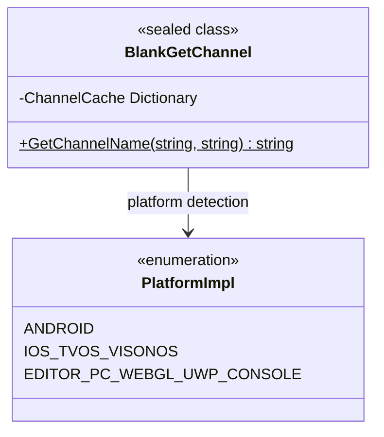

# API 參考

本文件詳細介紹 `BlankGetChannel` 類提供的所有公共 API 方法，包括方法簽名、引數說明、返回值以及平臺行為差異。

## 概述

`BlankGetChannel` 是一個跨平臺的渠道資訊獲取工具類，為 Unity 專案提供統一的介面來獲取不同平臺的渠道識別符號。該類支援 iOS、tvOS、visionOS、Android、Editor、PC、WebGL、UWP 以及多種主機平臺（PS4、PS5、Xbox One、Nintendo Switch）。

**設計意圖**：透過統一的 API 抽象底層平臺差異，開發者只需呼叫同一方法即可獲取渠道資訊，無需關心各平臺的具體實現細節。



## API Reference

### `BlankGetChannel.GetChannelName(string channelKey = "channel", string defaultValue = "default"): string`

獲取指定渠道鍵對應的渠道名稱。

**方法簽名：**
```csharp
[UnityEngine.Scripting.Preserve]
public static string GetChannelName(string channelKey = "channel", string defaultValue = "default")
```
> Source: [Runtime/BlankGetChannel.cs](https://github.com/GameFrameX/com.gameframex.unity.getchannel/blob/main/Runtime/BlankGetChannel.cs#L98-L141)

**功能說明：**
根據當前執行平臺從對應的配置源讀取渠道資訊，並返回指定鍵名對應的值。該方法內部實現了快取機制，首次讀取後會快取結果，後續呼叫直接返回快取值，避免重複讀取配置檔案帶來的效能開銷。

**引數說明：**

| 引數名 | 型別 | 預設值 | 必填 | 說明 |
|--------|------|--------|------|------|
| `channelKey` | `string` | `"channel"` | 否 | 渠道鍵名，用於標識要獲取的渠道配置項。預設值為 `"channel"`，對應各平臺的主渠道配置。 |
| `defaultValue` | `string` | `"default"` | 否 | 當未找到渠道配置時返回的預設值。當平臺配置檔案中不存在指定的鍵時，會返回此預設值。 |

**返回值：**

| 型別 | 說明 |
|------|------|
| `string` | 渠道名稱字串。如果在配置源中找到了 `channelKey` 對應的值，則返回該值；否則返回 `defaultValue`。 |

**平臺行為差異：**

| 平臺 | 配置源 | 讀取方式 |
|------|--------|----------|
| Android | `AndroidManifest.xml` 中的 `<meta-data>` 標籤 | 透過 `AndroidJavaClass` 呼叫 Java 原生方法 `GetChannel()` |
| iOS/tvOS/visionOS | `Info.plist` 中的鍵值對 | 透過 P/Invoke 呼叫原生方法 `getChannelName()` |
| Editor/PC/WebGL/UWP/Console | `Resources/application_config.txt` 檔案 | 透過 `Resources.Load<TextAsset>()` 讀取文字檔案並解析 |

**內部實現細節：**

1. **快取機制**：方法內部使用靜態字典 `ChannelCache` 儲存已讀取的渠道資訊，避免重複讀取配置檔案。

```csharp
private static readonly Dictionary<string, string> ChannelCache = new Dictionary<string, string>(32);
```
> Source: [Runtime/BlankGetChannel.cs](https://github.com/GameFrameX/com.gameframex.unity.getchannel/blob/main/Runtime/BlankGetChannel.cs#L57)

2. **條件編譯**：不同平臺使用 `#if UNITY_ANDROID`、`#if UNITY_IOS || UNITY_TVOS || UNITY_VISIONOS` 等預處理指令進行平臺分支處理。

3. **配置解析**：對於 Editor/PC/WebGL/UWP/Console 平臺，配置檔案解析邏輯如下：

```csharp
var lines = textAsset.text.Split(new string[] { "\n", "\r", "\r\n" }, StringSplitOptions.RemoveEmptyEntries);
foreach (var line in lines)
{
    var split = line.Split(new string[] { "=" }, StringSplitOptions.RemoveEmptyEntries);
    if (split.Length > 1)
    {
        var key = split[0].Trim();
        var channelValue = split[1].Trim();
        ChannelCache[key] = channelValue;
    }
}
```
> Source: [Runtime/BlankGetChannel.cs](https://github.com/GameFrameX/com.gameframex.unity.getchannel/blob/main/Runtime/BlankGetChannel.cs#L110-L120)

**使用示例：**

```csharp
// 使用預設引數獲取主渠道
string channel = BlankGetChannel.GetChannelName();
```
> Source: [Runtime/BlankGetChannel.cs](https://github.com/GameFrameX/com.gameframex.unity.getchannel/blob/main/Runtime/BlankGetChannel.cs#L91)

```csharp
// 獲取指定鍵的渠道，並設定預設值
string subChannel = BlankGetChannel.GetChannelName("sub_channel", "unknown");
```
> Source: [Runtime/BlankGetChannel.cs](https://github.com/GameFrameX/com.gameframex.unity.getchannel/blob/main/Runtime/BlankGetChannel.cs#L94)

```csharp
// 在實際專案中的使用示例
string appChannel = BlankGetChannel.GetChannelName("appchannel");
Debug.Log("Current channel: " + appChannel);
```
> Source: [Sample~/BlankGetChannelExample.cs](https://github.com/GameFrameX/com.gameframex.unity.getchannel/blob/main/Sample~/BlankGetChannelExample.cs#L12)

**異常情況：**

| 場景 | 行為 |
|------|------|
| 配置檔案中未找到指定鍵 | 返回 `defaultValue` 引數值 |
| Android 平臺 Java 類呼叫失敗 | 返回 `defaultValue`（由 Java 層處理） |
| iOS/tvOS/visionOS 平臺原生方法呼叫失敗 | 返回 `defaultValue`（由原生層處理） |
| Resources 檔案不存在 | 返回 `defaultValue`，並將 `defaultValue` 存入快取 |

## 內部方法

### iOS/tvOS/visionOS 原生方法介面

```csharp
#if UNITY_IOS || UNITY_TVOS || UNITY_VISIONOS
[DllImport("__Internal")]
private static extern string getChannelName(string channelKey);
#endif
```
> Source: [Runtime/BlankGetChannel.cs](https://github.com/GameFrameX/com.gameframex.unity.getchannel/blob/main/Runtime/BlankGetChannel.cs#L47-L48)

**說明：** 此方法為私有方法，透過 P/Invoke 呼叫 iOS/tvOS/visionOS 平臺的原生程式碼，從 `Info.plist` 中讀取渠道資訊。開發者無需直接呼叫此方法，應使用 `GetChannelName()` 公有方法。

## 配置要求彙總

| 平臺 | 配置檔案 | 鍵名設定方式 |
|------|----------|--------------|
| Android | `AndroidManifest.xml` | `<meta-data android:name="channel" android:value="xxx" />` |
| iOS/tvOS/visionOS | `Info.plist` | `<key>channel</key><string>xxx</string>` |
| Editor/PC/WebGL/UWP/Console | `Resources/application_config.txt` | `channel=xxx` |

> 詳細配置說明請參閱 [平臺配置](./4-platform-configuration) 文件。

## 相關連結

- [概述](./1-overview) - 專案整體介紹與功能概述
- [安裝](./2-installation) - 包安裝與環境配置
- [快速開始](./3-getting-started) - 快速上手指南
- [平臺配置](./4-platform-configuration) - 各平臺詳細配置說明
- [示例](./5-samples) - 完整程式碼示例
- [常見問題](./7-troubleshooting) - 常見問題與解決方案
