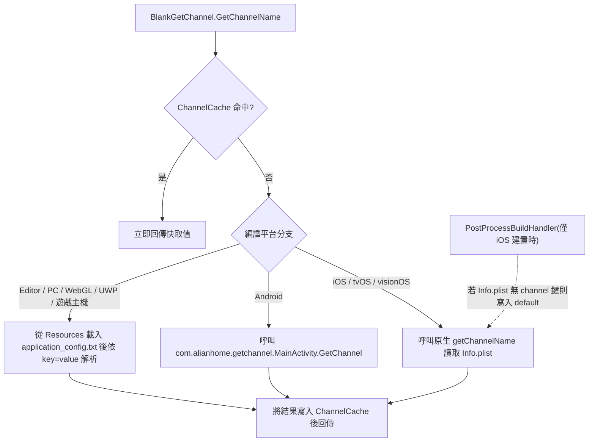

# 運作原理：渠道讀取流程

呼叫 `BlankGetChannel.GetChannelName()` 時,元件會先查詢行程內快取 `ChannelCache`,快取未命中時,則依目前的編譯平台採用三條不同的讀取路徑(Android 原生 jar、iOS 原生 Info.plist,Editor/PC 讀取 `Resources/application_config.txt`)。之後將結果寫入快取並回傳。整個進入點只有一個靜態方法，定義於 [Runtime/BlankGetChannel.cs](https://github.com/GameFrameX/com.gameframex.unity.getchannel/blob/main/Runtime/BlankGetChannel.cs#L98-L141)。

## 讀取流程概覽



## 各平台讀取來源

| 平台(編譯巨集) | 設定來源 | 程式碼進入點 |
|------|------|------|
| `UNITY_ANDROID` | AndroidManifest.xml 主啟動 Activity 的 `meta-data android:name="channel"` | 以 `new AndroidJavaClass("com.alianhome.getchannel.MainActivity")` 呼叫靜態方法 `GetChannel`,原生實作打包於 [Plugins/Android/com.alianhome.getchannel.jar](https://github.com/GameFrameX/com.gameframex.unity.getchannel/blob/main/Plugins/Android/com.alianhome.getchannel.jar) |
| `UNITY_IOS` / `UNITY_TVOS` / `UNITY_VISIONOS` | Info.plist 的 String 鍵 `channel` | `[DllImport("__Internal")] getChannelName(channelKey)`,原生實作請參閱 [Plugins/iOS/BlankGetChannel/BlankGetChannel.mm](https://github.com/GameFrameX/com.gameframex.unity.getchannel/blob/main/Plugins/iOS/BlankGetChannel/BlankGetChannel.mm) |
| `UNITY_STANDALONE` / `UNITY_EDITOR` / `UNITY_WEBGL` / `UNITY_WSA` / `UNITY_PS4` / `UNITY_PS5` / `UNITY_XBOXONE` / `UNITY_SWITCH` | `Resources/application_config.txt`(每行 `key=value`) | `Resources.Load<TextAsset>("application_config")` 逐行解析 |

方法簽章的預設值：第一個參數為 `channelKey = "channel"`,第二個參數為 `defaultValue = "default"`,亦即未設定渠道時會回傳字串 `"default"`。

## 步驟 1:確認快取命中

方法進入點會先查詢靜態字典 `ChannelCache`(初始容量 32),命中時立即回傳，且不會觸發任何平台讀取：

```csharp
private static readonly Dictionary<string, string> ChannelCache = new Dictionary<string, string>(32);

public static string GetChannelName(string channelKey = "channel", string defaultValue = "default")
{
    if (ChannelCache.TryGetValue(channelKey, out var value))
    {
        return value;
    }

    string channelName = defaultValue;
```

Source: [Runtime/BlankGetChannel.cs](https://github.com/GameFrameX/com.gameframex.unity.getchannel/blob/main/Runtime/BlankGetChannel.cs#L57-L105)

請注意：快取沒有到期機制，行程生命週期內會持續使用首次讀取到的值。

## 步驟 2:Editor/PC 路徑 — 解析 application_config.txt

Editor、Standalone、WebGL、UWP 及各遊戲主機平台會走 `Resources.Load` 分支。整個檔案會逐行解析，且**所有鍵值**都會寫入快取(而非僅限目前請求的鍵)。因此之後讀取其他鍵(例如 `sub_channel`)時，也能直接使用快取：

```csharp
var textAsset = Resources.Load<TextAsset>("application_config");
if (textAsset != null)
{
    var lines = textAsset.text.Split(new string[] { "\n", "\r", "\r\n" }, StringSplitOptions.RemoveEmptyEntries);
    foreach (var line in lines)
    {
        var split = line.Split(new string[] { "=" }, StringSplitOptions.RemoveEmptyEntries);
        if (split.Length > 1)
        {
            var key = split[0].Trim();
            var channelValue = split[1].Trim();
            ChannelCache[key] = channelValue;
        }
    }
}
else
{
    ChannelCache[channelKey] = defaultValue;
}
```

Source: [Runtime/BlankGetChannel.cs](https://github.com/GameFrameX/com.gameframex.unity.getchannel/blob/main/Runtime/BlankGetChannel.cs#L106-L125)

若檔案不存在或該鍵未設定，會將 `defaultValue` 寫入快取並回傳。解析以第一個 `=` 為分割基準，等號後的全部內容經 Trim 後即作為值，因此值中可以包含 `=` 以外的一般字元。

## 步驟 3:Android 路徑 — 呼叫原生 jar

```csharp
using (AndroidJavaClass androidJavaClass = new AndroidJavaClass("com.alianhome.getchannel.MainActivity"))
{
    channelName = androidJavaClass.CallStatic<string>("GetChannel", channelKey);
}
```

Source: [Runtime/BlankGetChannel.cs](https://github.com/GameFrameX/com.gameframex.unity.getchannel/blob/main/Runtime/BlankGetChannel.cs#L131-L135)

C# 端只會傳遞 `channelKey`,取得值的邏輯位於 jar 內部(讀取 Manifest 的 meta-data)。

## 步驟 4:iOS/tvOS/visionOS 路徑 — P/Invoke 原生方法

```csharp
[DllImport("__Internal")]
private static extern string getChannelName(string channelKey);
```

Source: [Runtime/BlankGetChannel.cs](https://github.com/GameFrameX/com.gameframex.unity.getchannel/blob/main/Runtime/BlankGetChannel.cs#L47-L48)

## 步驟 5:將結果寫入快取

三個分支的回傳值最後都會執行方法結尾的以下兩行，因此之後即使再次以相同的鍵呼叫，也不會重複觸發平台讀取：

```csharp
ChannelCache[channelKey] = channelName;
return channelName;
```

Source: [Runtime/BlankGetChannel.cs](https://github.com/GameFrameX/com.gameframex.unity.getchannel/blob/main/Runtime/BlankGetChannel.cs#L139-L140)

## 隨附的建置後處理：iOS 備援寫入

iOS 建置完成後，編輯器腳本 `PostProcessBuildHandler`(`[PostProcessBuild(99)]`,僅適用於 `BuildTarget.iOS`)會讀取產生的 Info.plist。若沒有 `channel` 鍵，則寫入 `"default"` 並重新寫回檔案；若該鍵已存在則跳過，並輸出日誌 `已有渠道，跳过设置=>`:

```csharp
string plistPath = path + "/Info.plist";
PlistDocument plist = new PlistDocument();
plist.ReadFromString(File.ReadAllText(plistPath));
if (!plist.root.values.TryGetValue(channelKey, out var value))
{
    plist.root.SetString(channelKey, channelValue);
    plist.WriteToFile(plistPath);
    Debug.Log("配置渠道成功=>" + channelValue);
}
else
{
    Debug.Log("已有渠道,跳过设置=>" + value);
}
```

Source: [Editor/PostProcessBuildHandler.cs](https://github.com/GameFrameX/com.gameframex.unity.getchannel/blob/main/Editor/PostProcessBuildHandler.cs#L31-L49)

也就是說，iOS 實機在執行階段讀取的 `channel` 鍵至少保證存在(以手動設定於 Info.plist 的值為優先)，例外情況已以 `try/catch` 包覆，失敗時僅會呼叫 `Debug.LogException`,不會中斷建置。

## 呼叫範例

範例元件會在點擊按鈕時，以自訂鍵 `appchannel` 讀取渠道：

```csharp
public class BlankGetChannelExample : MonoBehaviour
{
    private string value;
    void OnGUI()
    {
        GUILayout.Label(value);
        if (GUILayout.Button("GET", GUILayout.Width(200), GUILayout.Height(100)))
        {
            value = BlankGetChannel.GetChannelName("appchannel");
        }
    }
}
```

Source: [Sample~/BlankGetChannelExample.cs](https://github.com/GameFrameX/com.gameframex.unity.getchannel/blob/main/Sample~/BlankGetChannelExample.cs#L4-L15)

## 常見錯誤

| 症狀 | 原因 | 避免方法 |
|------|------|------|
| 一律回傳 `"default"` | Editor/PC 的 Resources 目錄中沒有 `application_config.txt`,或檔案內沒有對應的鍵 | 將該檔案放入 `Assets/Resources/` 並撰寫 `channel=xxx`。注意載入時的檔名不含副檔名，實際檔案為 `.txt` |
| Android 上無法取得值 | Manifest 的主啟動 Activity 未設定 `meta-data android:name="channel"` | 在主 Activity 內加入 `<meta-data android:name="channel" android:value="android_cn_taptap" />` |
| iOS 上無法取得值 | 若 Info.plist 沒有 `channel` 鍵，建置後處理會寫入 `"default"`,導致之後執行階段持續讀到 `default` | 建置前在 Xcode 專案的 Info.plist 中設定 String 型別的 `channel` 鍵 |
| 變更設定後執行階段未生效 | `ChannelCache` 在行程內沒有到期機制，首次讀取後會持續重複使用 | 重新啟動應用程式/重新進入 Play Mode |

## 相關連結

- 各平台渠道設定的具體方法：儲存庫內的 [README.zh-CN.md](https://github.com/GameFrameX/com.gameframex.unity.getchannel/blob/main/README.zh-CN.md)
- 版本歷史:[CHANGELOG.md](https://github.com/GameFrameX/com.gameframex.unity.getchannel/blob/main/CHANGELOG.md)