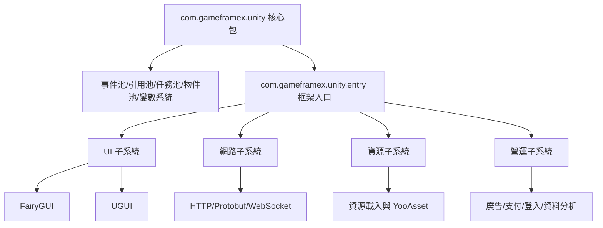

# 專案簡介與特性

GameFrameX Unity 是 GameFrameX 整合解決方案的 Unity 用戶端實作，提供 90+ 個模組化元件，涵蓋從核心框架、資源管理、UI 系統、網路通訊到廣告、支付、登入、資料分析等遊戲開發與營運全流程。本框架相容於 Unity 2019.4 及以上版本，定位為「獨立遊戲前後端一體化解決方案」。

## 核心特性

- **模組化設計** — 每個元件獨立成包，按需引入到 Unity 專案的 `Packages/manifest.json`，互不干擾
- **熱更新支援** — 整合 HybridCLR，支援 C# 熱更新；同時提供 XLua 適配包
- **多 UI 方案** — 同時支援 FairyGUI 與 UGUI，依團隊技術棧自由選擇
- **非同步優先** — 基於 UniTask 的 async/await 非同步程式設計模型
- **全平台涵蓋** — iOS、Android、WebGL、微信/抖音/支付寶小遊戲
- **營運元件豐富** — 廣告（穿山甲、TopOn）、支付（支付寶、Apple、Google）、登入（QQ、微信、Apple、Facebook、Google）、資料分析、物件儲存等開箱即用

## 快速開始

### 1. 設定 Scoped Registry

在 Unity 專案的 `Packages/manifest.json` 中加入 GameFrameX 的 scoped registry：

```json
{
  "scopedRegistries": [
    {
      "name": "GameFrameX",
      "url": "https://gameframex.upm.alianblank.uk",
      "scopes": [
        "com.gameframex"
      ]
    }
  ],
  "dependencies": {
    "com.gameframex.unity": "1.11.0"
  }
}
```

Source: [README.zh-CN.md](https://github.com/GameFrameX/GameFrameX.Unity/blob/main/README.zh-CN.md#L38-L57)

### 2. 新增所需元件

在 `dependencies` 中按需新增元件包，版本號可在 [Releases](https://github.com/GameFrameX/GameFrameX.Unity/releases) 頁面查看。常用組合範例：

```json
{
  "dependencies": {
    "com.gameframex.unity": "1.11.0",
    "com.gameframex.unity.asset": "2.0.0",
    "com.gameframex.unity.ui": "2.1.1",
    "com.gameframex.unity.ui.fairygui": "3.0.0",
    "com.gameframex.unity.procedure": "1.0.4",
    "com.gameframex.unity.event": "1.0.2",
    "com.gameframex.unity.fsm": "1.0.3",
    "com.gameframex.unity.network": "2.5.1",
    "com.gameframex.unity.sound": "1.0.6",
    "com.gameframex.unity.localization": "2.0.0"
  }
}
```

Source: [README.zh-CN.md](https://github.com/GameFrameX/GameFrameX.Unity/blob/main/README.zh-CN.md#L59-L82)

## 運作原理速覽

GameFrameX 的核心包 `com.gameframex.unity` 提供了框架執行階段與編輯器基礎能力，涵蓋事件池、引用池、任務池、物件池和變數系統。其他元件（如 UI、網路、資源管理）均在此基礎上以獨立包的形式存在，透過 Unity Package Manager 的 scoped registry 機制按需分發。



Source: [README.zh-CN.md](https://github.com/GameFrameX/GameFrameX.Unity/blob/main/README.zh-CN.md#L85-L113)

## 元件一覽

版本號透過 [GameFrameX UPM Registry](https://gameframex.upm.alianblank.uk) 自動取得。下表彙整各分組的關鍵元件，完整列表請見 [README.zh-CN.md](https://github.com/GameFrameX/GameFrameX.Unity/blob/main/README.zh-CN.md)。

| 分組 | 代表元件 | 作用 |
|------|---------|------|
| 核心框架 | com.gameframex.unity、entry、event、fsm、procedure | 執行階段骨架、事件系統、狀態機、流程管理 |
| 資源管理 | com.gameframex.unity.asset、download、builder | 資源載入、檔案下載、建置管線 |
| UI 框架 | com.gameframex.unity.ui、ui.fairygui、ui.ugui | UI 基礎與 FairyGUI/UGUI 適配 |
| 網路通訊 | com.gameframex.unity.web、web.protobuff、psygames.unitywebsocket、webview | HTTP、Protobuf、WebSocket、WebView |
| 資料與設定 | com.gameframex.unity.config、localization、focus-creative-games.luban | 設定管理、在地化、Luban 設定產生 |
| 音訊與動畫 | com.gameframex.unity.sound、demigiant.dotween、esotericsoftware.spine | 音訊、DoTween 動畫、Spine 骨骼動畫 |
| 場景與設定 | com.gameframex.unity.scene、setting | 場景切換、玩家設定 |
| 熱更新 | com.gameframex.unity.tencent.xlua、xlua | XLua 熱更方案 |
| 廣告 | advertisement、advertisement.csj、advertisement.topon 及小遊戲廣告 | 穿山甲、TopOn、微信/抖音/支付寶/快手小遊戲廣告 |
| 支付 | com.gameframex.unity.payment、payment.alipay、payment.apple、payment.google | 統一支付介面與第三方實作 |
| 登入 | login.apple、login.facebook、login.google、login.qq、login.wechat | 各平台登入 SDK |
| 資料分析 | gameanalytics、sentry、adjust 等 | 資料統計、錯誤追蹤、歸因分析 |
| 物件儲存 | objectstorage、objectstorage.aliyun、objectstorage.qiniu、objectstorage.tencent | 阿里雲 OSS、七牛、騰訊雲 COS |
| 小遊戲 | minigame.wechat、tuyoogame.yooasset.minigame.* | 微信/YooAsset 小遊戲適配 |
| 平台工具 | getchannel、operationclipboard、systeminfo、sharesdk 等 | 渠道號、剪貼簿、裝置識別、分享 |

Source: [README.zh-CN.md](https://github.com/GameFrameX/GameFrameX.Unity/blob/main/README.zh-CN.md#L85-L239)

## 接下來

- 查看完整元件版本與說明：[README.zh-CN.md](https://github.com/GameFrameX/GameFrameX.Unity/blob/main/README.zh-CN.md)
- 串接流程管理：[流程（Procedure）元件](https://github.com/GameFrameX/GameFrameX.Unity/blob/main/README.zh-CN.md)
- 串接事件系統：[事件（Event）元件](https://github.com/GameFrameX/GameFrameX.Unity/blob/main/README.zh-CN.md)
- 串接網路通訊：[網路（Network/Web）元件](https://github.com/GameFrameX/GameFrameX.Unity/blob/main/README.zh-CN.md)
- 官方文件站：[GameFrameX 文件](https://gameframex.doc.alianblank.com)
- 社群支援：QQ 群 467608841