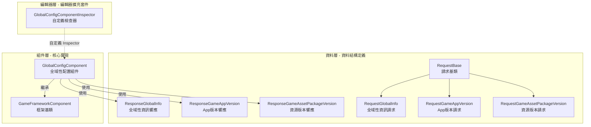

# GlobalConfig 組件簡介

GlobalConfig 組件是 GameFrameX 框架的核心組成部分，提供 Unity 遊戲專案中的全域性配置管理能力。該組件集中管理應用程式版本檢查、資源版本檢查、AOT 程式碼列表等全域性配置資訊，支援透過編輯器視覺化配置和程式碼動態設定兩種方式。

## 概述

GlobalConfig 組件設計用於解決遊戲專案中全域性配置分散、難以管理的問題。在遊戲開發過程中，存在許多需要全域性訪問的配置資料，例如伺服器地址、版本檢查介面、應用商店連結等。傳統的做法是將這些配置硬編碼或分散在多個配置檔案中，導致維護困難且容易出錯。

GlobalConfig 組件透過統一的介面和標準化的資料模型，將所有全域性配置集中管理。該組件繼承自 `GameFrameworkComponent`，可以直接作為 Unity 組件新增到場景中，並透過 GameFrameX 框架的組件管理系統進行全域性訪問。這種設計使得配置資料的設定和獲取變得簡單統一，同時支援編輯器配置和執行時動態設定兩種模式。

組件的核心功能包括四個方面：首先，`CheckAppVersionUrl` 屬性用於儲存應用程式版本檢查的 URL 地址，使遊戲能夠查詢是否有新版本可用；其次，`CheckResourceVersionUrl` 屬性用於儲存資源版本檢查的 URL 地址，支援熱更新功能的資源管理；第三，`AOTCodeList` 和 `AOTCodeLists` 屬性用於配置 AOT 補充後設資料列表，解決 IL2CPP 構建模式下的泛型問題；最後，`Content` 屬性允許儲存任意附加內容，滿足業務擴充套件需求。

## 架構設計

GlobalConfig 組件採用分層架構設計，分為資料層、組件層和編輯器層三個部分。資料層包含請求類和響應類，用於定義與伺服器通訊的資料結構；組件層是核心的 `GlobalConfigComponent` 類，負責配置資料的儲存和訪問；編輯器層提供自定義 Inspector，簡化編輯器中的配置工作。

資料層採用繼承結構組織請求類。`RequestBase` 是所有請求類的基類，定義了通用的屬性包括語言（Language）、程式版本（AppVersion）、執行平臺（Platform）、包名（PackageName）、渠道（Channel）和子渠道（SubChannel）。具體的請求類如 `RequestGlobalInfo`、`RequestGameAppVersion` 和 `RequestGameAssetPackageVersion` 繼承自該基類，可以根據需要擴充套件各自的業務欄位。

響應類同樣採用類似的設計模式。`ResponseGlobalInfo` 包含 CheckAppVersionUrl、CheckResourceVersionUrl、AOTCodeList 和 Content 等配置資訊；`ResponseGameAppVersion` 包含應用版本檢查結果，包括是否強制升級、下載地址、是否需要更新、更新公告和更新標題；`ResponseGameAssetPackageVersion` 包含資源版本資訊，包括語言、版本號、資源包名稱、路徑、平臺、下載根路徑、包名、遊戲版本和渠道名稱。

組件層的 `GlobalConfigComponent` 類繼承自 `GameFrameworkComponent`，使用 `[DisallowMultipleComponent]` 和 `[AddComponentMenu("Game Framework/Global Config")]` 屬性進行標記，確保場景中只有一個例項並方便在編輯器選單中查詢。該類透過序列化欄位儲存配置資料，並提供屬性訪問器支援執行時修改。

編輯器層的 `GlobalConfigComponentInspector` 繼承自 `GameFrameworkInspector`，為組件提供自定義的 Inspector 介面。該檢查器將配置項分類展示，支援在編輯模式下視覺化配置各項屬性，同時在執行時禁止編輯以保證資料一致性。

## 核心功能特性

GlobalConfig 組件提供以下核心功能特性：

**版本檢查介面管理** — 組件提供 `CheckAppVersionUrl` 和 `CheckResourceVersionUrl` 兩個屬性，分別用於配置應用程式版本檢查介面和資源版本檢查介面。這兩個介面是遊戲熱更新系統的關鍵組成部分，遊戲啟動時透過這些介面獲取最新版本資訊，判斷是否需要更新應用程式或下載新的資源包。

**AOT 程式碼列表配置** — 在使用 IL2CPP 進行 Unity 專案構建時，由於 AOT 編譯的限制，某些泛型型別可能無法正常使用。組件提供 `AOTCodeList` 和 `AOTCodeLists` 屬性，允許開發者配置需要補充的 AOT 後設資料列表，確保執行時的泛型例項化正常工作。

**執行時配置更新** — 組件支援透過程式碼動態更新配置資料。透過 `SetOriginalData` 方法可以設定原始資料字串，透過 `SetGlobalConfig` 方法可以設定完整的 `ResponseGlobalInfo` 物件。這使得遊戲可以從伺服器獲取最新的全域性配置，實現配置的動態更新而無需重新發布。

**全域性配置訪問** — 繼承自 GameFrameworkComponent 的組件可以透過框架的組件管理系統在遊戲的任何位置方便地訪問。這確保了配置資料的一致性和可管理性，避免了透過單例或靜態變數訪問帶來的耦合問題。

## 使用場景

GlobalConfig 組件適用於以下典型使用場景：

**遊戲啟動配置** — 遊戲啟動時需要獲取伺服器地址、版本檢查介面等基礎配置資訊。將這些配置儲存在 GlobalConfig 組件中，其他系統（如網路模組、更新模組）可以直接從組件獲取所需資訊。

**熱更新系統整合** — 熱更新系統需要知道資源版本檢查的 URL 地址。透過 GlobalConfig 組件集中管理這些 URL，使得熱更新系統可以靈活地從配置中讀取，而無需硬編碼。

**多渠道打包** — 不同渠道可能需要不同的伺服器地址或配置引數。透過 GlobalConfig 組件可以根據渠道動態設定相應的配置值，實現一套程式碼支援多渠道。

**動態配置更新** — 遊戲上線後可能需要調整某些配置引數。透過 `SetGlobalConfig` 方法從伺服器獲取最新配置，實現配置的動態更新，無需玩家重新下載安裝包。

## 相關連結

- [安裝方式](../2-installation.1-install-methods) - 瞭解如何安裝 GlobalConfig 組件
- [新增到場景](../3-getting-started.1-add-to-scene) - 瞭解如何在 Unity 場景中使用組件
- [配置屬性](../3-getting-started.2-configure-properties) - 詳細瞭解各配置屬性的作用
- [程式碼訪問](../3-getting-started.3-code-access) - 瞭解如何在程式碼中訪問全域性配置
- [GlobalConfigComponent 詳解](../4-core-component.1-global-config-component) - 核心組件完整 API 參考
- [請求類詳解](../5-data-structures.1-request-classes) - 請求資料結構說明
- [響應類詳解](../5-data-structures.2-response-classes) - 響應資料結構說明
- [自定義 Inspector](../6-editor-configuration.1-custom-inspector) - 編輯器配置詳情
- [AOT 程式碼列表配置](../7-aot-configuration.1-aot-code-list) - AOT 配置說明
- [FAQ](../8-troubleshooting.1-faq) - 常見問題解答
