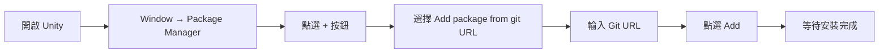
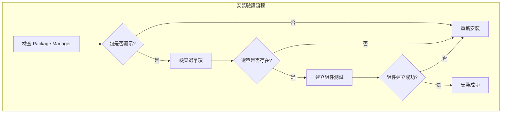

# 安裝方式

本文件介紹如何在 Unity 專案中安裝 GlobalConfig 全域性配置組件。

## 概述

GlobalConfig 是 GameFrameX 框架的核心組件之一，用於管理遊戲的全域性配置資訊，包括應用程式版本檢查地址、資源版本檢查地址、伺服器地址等。該組件採用 Unity Package Manager (UPM) 方式進行管理，支援多種安裝途徑以適應不同的開發工作流。

## 安裝前提條件

在安裝 GlobalConfig 組件之前，請確保您的開發環境滿足以下要求：

| 需求 | 最低版本 | 說明 |
|------|----------|------|
| Unity 編輯器 | 2017.1 | 支援的 Unity 版本 |
| 包管理器 | 內建 | Unity 2017.1+ 內建 |

### 依賴項說明

GlobalConfig 組件依賴於以下 GameFrameX 核心包：

| 依賴包 | 版本要求 | 說明 |
|--------|----------|------|
| com.gameframex.unity | 1.1.1 | GameFrameX 核心框架 |
| com.gameframex.unity.web | 1.1.2 | Web 網路請求組件 |

> **注意**：當使用 UPM 方式安裝時，依賴項會自動解析並安裝。您無需手動處理依賴關係。

## 安裝方式

GlobalConfig 組件提供三種安裝方式，您可以根據專案需求選擇最適合的一種：

### 方式一：透過 manifest.json 安裝（推薦）

這是最推薦的安裝方式，便於版本管理和團隊協作。您需要在專案的 `Packages/manifest.json` 檔案中新增包依賴。

**操作步驟：**

1. 找到您 Unity 專案的 `Packages` 資料夾
2. 使用文字編輯器開啟 `manifest.json` 檔案
3. 在 `dependencies` 節點下新增以下內容：

```json
{
  "dependencies": {
    "com.gameframex.unity.globalconfig": "https://github.com/GameFrameX/com.gameframex.unity.globalconfig.git"
  }
}
```

> **注意**：如果您使用的是舊版本的 Git URL (`https://github.com/GameFrameX/com.gameframex.unity.globalconfig.git`)，仍可繼續使用，但建議更新為新的官方倉庫地址。

**示例完整的 manifest.json：**

```json
{
  "dependencies": {
    "com.gameframex.unity.globalconfig": "https://github.com/GameFrameX/com.gameframex.unity.globalconfig.git",
    "com.unity.collab-proxy": "1.15.18",
    "com.unity.ide.rider": "3.0.15",
    "com.unity.ide.visualstudio": "2.0.16",
    "com.unity.ide.vscode": "1.2.5",
    "com.unity.test-framework": "1.1.31",
    "com.unity.textmeshpro": "3.0.6",
    "com.unity.timeline": "1.6.4",
    "com.unity.ugui": "1.0.0",
    "com.unity.modules.ai": "1.0.0",
    "com.unity.modules.androidjni": "1.0.0",
    "com.unity.modules.animation": "1.0.0",
    "com.unity.modules.assetbundle": "1.0.0",
    "com.unity.modules.audio": "1.0.0",
    "com.unity.modules.cloth": "1.0.0",
    "com.unity.modules.director": "1.0.0",
    "com.unity.modules.imageconversion": "1.0.0",
    "com.unity.modules.imgui": "1.0.0",
    "com.unity.modules.jsonserialize": "1.0.0",
    "com.unity.modules.particlesystem": "1.0.0",
    "com.unity.modules.physics": "1.0.0",
    "com.unity.modules.physics2d": "1.0.0",
    "com.unity.modules.screencapture": "1.0.0",
    "com.unity.modules.terrain": "1.0.0",
    "com.unity.modules.terrainphysics": "1.0.0",
    "com.unity.modules.tilemap": "1.0.0",
    "com.unity.modules.ui": "1.0.0",
    "com.unity.modules.uielements": "1.0.0",
    "com.unity.modules.umbra": "1.0.0",
    "com.unity.modules.unityanalytics": "1.0.0",
    "com.unity.modules.unitywebrequest": "1.0.0",
    "com.unity.modules.unitywebrequestassetbundle": "1.0.0",
    "com.unity.modules.unitywebrequestaudio": "1.0.0",
    "com.unity.modules.unitywebrequesttexture": "1.0.0",
    "com.unity.modules.unitywebrequestwww": "1.0.0",
    "com.unity.modules.vehicles": "1.0.0",
    "com.unity.modules.video": "1.0.0",
    "com.unity.modules.vr": "1.0.0",
    "com.unity.modules.wind": "1.0.0",
    "com.unity.modules.xr": "1.0.0"
  }
}
```

4. 儲存檔案並返回 Unity 編輯器
5. 等待包管理器自動下載並匯入依賴包

### 方式二：透過 Unity Package Manager 安裝

如果您更喜歡使用圖形介面，可以透過 Unity 內建的 Package Manager 安裝。

**操作步驟：**

1. 開啟 Unity 編輯器
2. 導航到選單：**Window** → **Package Manager**
3. 在 Package Manager 視窗中，點選左上角的 **+** 按鈕
4. 選擇 **Add package from git URL...** 選項
5. 在輸入框中貼上以下 Git URL：

```
https://github.com/GameFrameX/com.gameframex.unity.globalconfig.git
```

6. 點選 **Add** 按鈕開始安裝
7. 等待下載和匯入完成



### 方式三：手動安裝（本地開發）

如果您需要使用本地開發版本或無法訪問網路，可以採用手動安裝方式。

**操作步驟：**

1. 訪問 GitHub 倉庫下載原始碼：

   ```
   https://github.com/GameFrameX/com.gameframex.unity.globalconfig.git
   ```

2. 將下載的資料夾內容複製到 Unity 專案的 `Packages` 目錄下
3. Unity 會自動識別並載入符合規範的包
4. 如果需要更新版本，只需替換資料夾內容

**注意事項：**
- 包資料夾需要包含 `package.json` 檔案才能被 Unity 正確識別
- 建議使用有意義的資料夾名稱，例如：`Packages/com.gameframex.unity.globalconfig/`

## 安裝驗證

安裝完成後，可以透過以下方式驗證是否成功：

1. **檢查 Package Manager**：在 Package Manager 視窗中確認 `Game Frame X Global Config` 包已顯示
2. **檢查選單項**：在 Unity 選單欄中確認出現 **Game Framework** → **Global Config** 選單項
3. **建立組件**：在場景中建立空物體，右鍵點選 **Add Component**，搜尋 "Global Config"，確認組件可正常新增



## 常見問題

### Q1: 安裝失敗，提示網路錯誤

**解決方案**：
- 檢查網路連線是否正常
- 嘗試使用代理或 VPN
- 使用方式三進行手動安裝

### Q2: 依賴項版本衝突

**解決方案**：
- 檢查其他包對 `com.gameframex.unity` 的版本要求
- 在 manifest.json 中明確指定相容的版本號

### Q3: 包版本過舊

**解決方案**：
- Git URL 安裝方式預設獲取最新版本
- 如需特定版本，可在 URL 後新增版本標籤，例如：
  ```
  https://github.com/GameFrameX/com.gameframex.unity.globalconfig.git#1.3.0
  ```

## 相關連結

- [GitHub 倉庫](https://github.com/GameFrameX/com.gameframex.unity.globalconfig.git)
- [GameFrameX 官方文件](https://gameframex.doc.alianblank.com)
- [新增到場景](./3-getting-started.1-add-to-scene)
- [配置屬性](./3-getting-started.2-configure-properties)
- [程式碼訪問](./3-getting-started.3-code-access)
