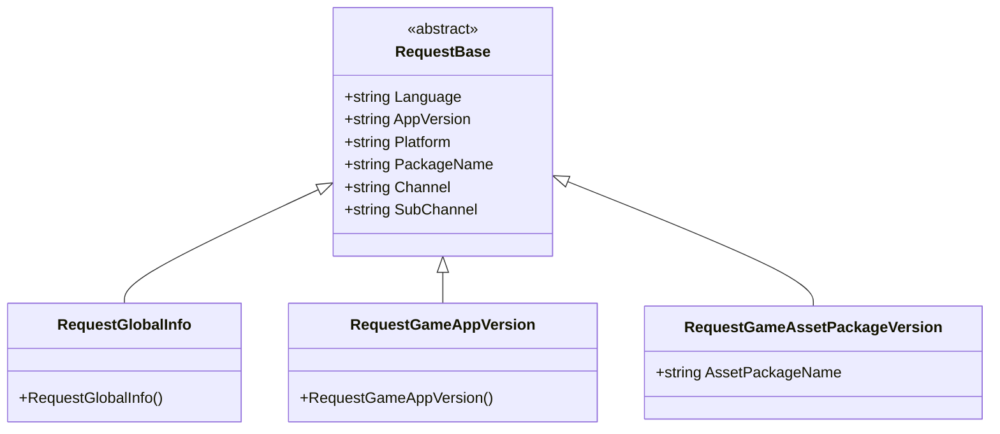
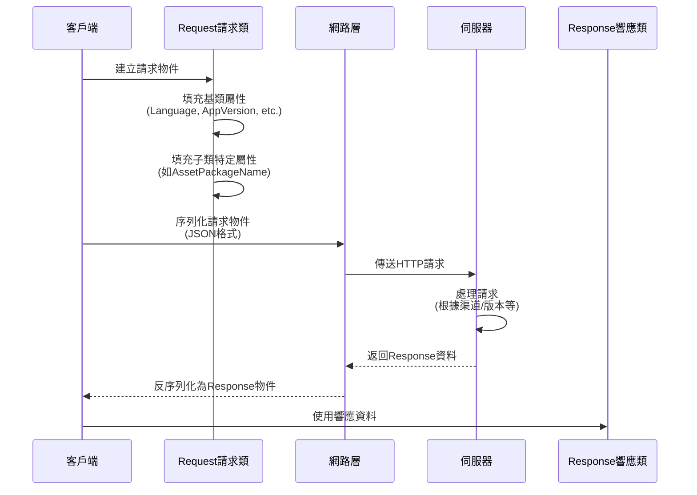

# 請求類

請求類是 GlobalConfig 系統中用於封裝客戶端請求資料的 DTO（Data Transfer Object）類。它們負責攜帶客戶端環境資訊向伺服器請求配置資料。

## 概述

請求類採用物件導向的設計模式，透過繼承 `RequestBase` 基類實現統一的資料結構，同時允許各具體請求型別擴充套件自己的特定欄位。這種設計確保了：

- **程式碼複用**：所有請求共有的屬性（如語言、版本、平臺等）在基類中統一管理
- **型別安全**：每個請求型別有明確的語義，便於區分和管理
- **可擴充套件性**：透過繼承可以輕鬆新增新的請求型別或擴充套件現有請求

### 核心設計意圖

GlobalConfig 系統需要獲取伺服器上的配置資料，客戶端需要告訴伺服器**我是誰**（渠道、包名）、**我在哪裡**（平臺）、**我的版本是什麼**（應用版本）等資訊。請求類正是承擔這一職責——將客戶端上下文資訊序列化後傳送給伺服器。

## 類層次結構



該類圖展示了請求類的完整繼承關係。所有具體請求型別都繼承自抽象基類 `RequestBase`，後者定義了所有請求共有的屬性。

## RequestBase 基類

`RequestBase` 是所有請求類的抽象基類，定義了客戶端請求時需要攜帶的通用資訊。

```csharp
namespace GameFrameX.GlobalConfig.Runtime
{
    /// <summary>
    /// 請求基類
    /// </summary>
    public abstract class RequestBase
    {
        /// <summary>
        /// 語言
        /// </summary>
        public string Language { get; set; }

        /// <summary>
        /// 程式版本
        /// </summary>
        public string AppVersion { get; set; }

        /// <summary>
        /// 執行平臺
        /// </summary>
        public string Platform { get; set; }

        /// <summary>
        /// 包名
        /// </summary>
        public string PackageName { get; set; }

        /// <summary>
        /// 渠道
        /// </summary>
        public string Channel { get; set; }

        /// <summary>
        /// 子渠道
        /// </summary>
        public string SubChannel { get; set; }
    }
}
```

> Source: [RequestBase.cs](https://github.com/GameFrameX/com.gameframex.unity.globalconfig/blob/main/Runtime/GlobalConfig/RequestBase.cs#L1-L38)

### 屬性說明

| 屬性 | 型別 | 說明 |
|------|------|------|
| Language | string | 客戶端當前使用的語言，用於伺服器返回對應語言的配置 |
| AppVersion | string | 應用程式版本號，用於版本校驗和差異化配置 |
| Platform | string | 執行平臺（如 iOS、Android、Windows 等） |
| PackageName | string | 應用包名，用於區分不同應用 |
| Channel | string | 發行渠道標識，用於分渠道配置 |
| SubChannel | string | 子渠道標識，用於更細粒度的渠道區分 |

### 設計意圖

這些通用屬性是遊戲和應用配置系統中常見的分割槽維度。透過在請求中攜帶這些資訊，伺服器可以：
- 根據版本返回不同的配置（熱更新）
- 根據平臺返回不同的資源路徑
- 根據渠道返回不同的活動配置
- 根據語言返回本地化內容

## 具體請求類

### RequestGlobalInfo

全域性資訊請求類，用於獲取遊戲的全域性配置資訊。

```csharp
namespace GameFrameX.GlobalConfig.Runtime
{
    /// <summary>
    /// 全域性資訊請求物件,可以自己繼承實現自己的欄位
    /// </summary>
    public class RequestGlobalInfo : RequestBase
    {
    }
}
```

> Source: [RequestGlobalInfo.cs](https://github.com/GameFrameX/com.gameframex.unity.globalconfig/blob/main/Runtime/GlobalConfig/RequestGlobalInfo.cs#L1-L9)

**設計意圖**：該類繼承自 `RequestBase`，用於請求包含遊戲全域性配置的響應資料（如伺服器地址、版本檢查介面等）。文件註釋表明允許開發者繼承此類新增自定義欄位。

### RequestGameAppVersion

遊戲版本請求類，用於檢查應用程式是否有新版本可用。

```csharp
namespace GameFrameX.GlobalConfig.Runtime
{
    /// <summary>
    /// 遊戲版本請求物件,可以自己繼承實現自己的欄位
    /// </summary>
    public class RequestGameAppVersion : RequestBase
    {
    }
}
```

> Source: [RequestGameAppVersion.cs](https://github.com/GameFrameX/com.gameframex.unity.globalconfig/blob/main/Runtime/GlobalConfig/RequestGameAppVersion.cs#L1-L9)

**設計意圖**：該類用於向伺服器查詢當前應用版本的狀態。伺服器可以返回版本對比結果，提示使用者是否需要更新。

### RequestGameAssetPackageVersion

遊戲資源包版本請求類，用於檢查特定資源包是否需要更新。

```csharp
namespace GameFrameX.GlobalConfig.Runtime
{
    /// <summary>
    /// 遊戲資源版本請求物件,可以自己繼承實現自己的欄位
    /// </summary>
    public class RequestGameAssetPackageVersion : RequestBase
    {
        /// <summary>
        /// 資源包名稱
        /// </summary>
        public string AssetPackageName { get; set; }
    }
}
```

> Source: [RequestGameAssetPackageVersion.cs](https://github.com/GameFrameX/com.gameframex.unity.globalconfig/blob/main/Runtime/GlobalConfig/RequestGameAssetPackageVersion.cs#L1-L13)

**設計意圖**：與 `RequestGameAppVersion` 不同，此類專門用於資源包的版本檢查。透過 `AssetPackageName` 屬性指定要檢查的具體資源包名稱。這支援了遊戲資源熱更新功能，可以只更新變化的部分而非整個應用。

## 請求流程



該流程圖展示了請求物件從建立到伺服器響應的完整生命週期。請求物件攜帶必要的上下文資訊，幫助伺服器做出正確的響應決策。

## 擴充套件請求類

如果內建的請求類無法滿足需求，開發者可以透過繼承來擴充套件：

```csharp
// 自定義請求示例
public class RequestCustomConfig : RequestBase
{
    /// <summary>
    /// 自定義欄位：場景ID
    /// </summary>
    public int SceneId { get; set; }

    /// <summary>
    /// 自定義欄位：玩家ID
    /// </summary>
    public string PlayerId { get; set; }
}
```

**擴充套件步驟**：
1. 繼承自 `RequestBase`
2. 新增業務所需的特定屬性
3. 在傳送請求時建立例項並填充資料

## 相關連結

- [響應類](./5-data-structures.2-response-classes) - 瞭解請求對應的響應資料結構
- [GlobalConfigComponent](./4-core-component.1-global-config-component) - 瞭解如何使用請求獲取配置
- [快速開始 - 程式碼訪問](./3-getting-started.3-code-access) - 瞭解如何在程式碼中使用這些請求類
