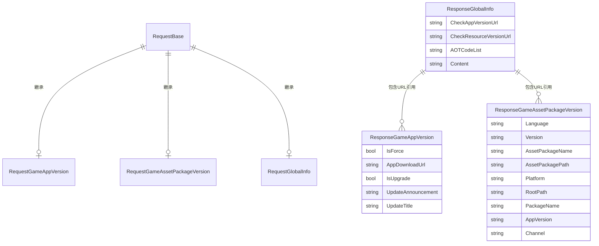

# 響應類

響應類（Response Classes）是 GlobalConfig 系統中用於承載從伺服器返回的配置資料的資料傳輸物件（DTO）。每個響應類對應一種特定型別的配置資訊。

## 概述

在 GlobalConfig 系統中，客戶端向伺服器傳送請求後，伺服器會返回相應的配置資料。這些返回的資料透過響應類進行結構和型別化，使得程式碼可以型別安全地訪問配置資訊。

GlobalConfig 提供了三種主要的響應類：

| 響應類 | 用途 |
|--------|------|
| ResponseGameAppVersion | 遊戲應用程式版本資訊 |
| ResponseGameAssetPackageVersion | 遊戲資源包版本資訊 |
| ResponseGlobalInfo | 全域性配置資訊 |

### 設計意圖

響應類的設計遵循以下原則：

1. **簡潔性**：使用簡單的 POCO 類，不引入額外的依賴
2. **型別安全**：每個配置型別有專門的類，提供強型別訪問
3. **可擴充套件性**：可以透過繼承或組合擴充套件新的響應型別

## 類結構詳解

### ResponseGameAppVersion

遊戲版本資訊響應類，包含應用升級相關的所有資訊。

```csharp
namespace GameFrameX.GlobalConfig.Runtime
{
    /// <summary>
    /// 遊戲版本資訊
    /// </summary>
    public class ResponseGameAppVersion
    {
        /// <summary>
        /// 是否強制升級
        /// </summary>
        public bool IsForce { get; set; }

        /// <summary>
        /// 程式下載地址
        /// </summary>
        public string AppDownloadUrl { get; set; }

        /// <summary>
        /// 是否需要更新
        /// </summary>
        public bool IsUpgrade { get; set; }

        /// <summary>
        /// 更新公告
        /// </summary>
        public string UpdateAnnouncement { get; set; }

        /// <summary>
        /// 更新標題
        /// </summary>
        public string UpdateTitle { get; set; }
    }
}
```

> Source: [ResponseGameAppVersion.cs](https://github.com/GameFrameX/com.gameframex.unity.globalconfig/blob/main/Runtime/GlobalConfig/ResponseGameAppVersion.cs#L1-L33)

**屬性說明：**

| 屬性 | 型別 | 說明 |
|------|------|------|
| IsForce | bool | 是否強制升級，true 表示使用者必須升級才能繼續遊戲 |
| AppDownloadUrl | string | 新版本應用的下載 URL 地址 |
| IsUpgrade | bool | 是否有可用更新，true 表示伺服器上有新版本 |
| UpdateAnnouncement | string | 更新公告內容，通常顯示給使用者 |
| UpdateTitle | string | 更新提示的標題 |

### ResponseGameAssetPackageVersion

遊戲資源包版本資訊響應類，包含資源更新的相關配置。

```csharp
namespace GameFrameX.GlobalConfig.Runtime
{
    /// <summary>
    /// 遊戲資源版本資訊
    /// </summary>
    public class ResponseGameAssetPackageVersion
    {
        /// <summary>
        /// 語言
        /// </summary>
        public string Language { get; set; }

        /// <summary>
        /// 資源版本
        /// </summary>
        public string Version { get; set; }

        /// <summary>
        /// 資源包名稱
        /// </summary>
        public string AssetPackageName { get; set; }

        /// <summary>
        /// 資源包路徑
        /// </summary>
        public string AssetPackagePath { get; set; }

        /// <summary>
        /// 平臺
        /// </summary>
        public string Platform { get; set; }

        /// <summary>
        /// 下載根路徑
        /// </summary>
        public string RootPath { get; set; }

        /// <summary>
        /// 包名
        /// </summary>
        public string PackageName { get; set; }

        /// <summary>
        /// 遊戲版本
        /// </summary>
        public string AppVersion { get; set; }

        /// <summary>
        /// 渠道名稱
        /// </summary>
        public string Channel { get; set; }
    }
}
```

> Source: [ResponseGameAssetPackageVersion.cs](https://github.com/GameFrameX/com.gameframex.unity.globalconfig/blob/main/Runtime/GlobalConfig/ResponseGameAssetPackageVersion.cs#L1-L53)

**屬性說明：**

| 屬性 | 型別 | 說明 |
|------|------|------|
| Language | string | 當前語言設定，如 "zh-CN"、"en-US" |
| Version | string | 資源包版本號，如 "1.0.0" |
| AssetPackageName | string | 資源包名稱 |
| AssetPackagePath | string | 資源包相對路徑 |
| Platform | string | 執行平臺，如 "Android"、"iOS"、"Windows" |
| RootPath | string | 資源下載的根目錄 URL |
| PackageName | string | 應用包名 |
| AppVersion | string | 應用程式版本號 |
| Channel | string | 渠道標識 |

### ResponseGlobalInfo

全域性資訊響應類，包含系統級的配置端點和全域性引數。

```csharp
namespace GameFrameX.GlobalConfig.Runtime
{
    /// <summary>
    /// 全域性資訊響應物件
    /// </summary>
    public class ResponseGlobalInfo
    {
        /// <summary>
        /// 檢測程式版本地址
        /// </summary>
        public string CheckAppVersionUrl { get; set; }

        /// <summary>
        /// 檢測資源版本地址
        /// </summary>
        public string CheckResourceVersionUrl { get; set; }

        /// <summary>
        /// AOT程式碼列表
        /// </summary>
        public string AOTCodeList { get; set; }

        /// <summary>
        /// 擴充套件內容
        /// </summary>
        public string Content { get; set; }
    }
}
```

> Source: [ResponseGlobalInfo.cs](https://github.com/GameFrameX/com.gameframex.unity.globalconfig/blob/main/Runtime/GlobalConfig/ResponseGlobalInfo.cs#L1-L28)

**屬性說明：**

| 屬性 | 型別 | 說明 |
|------|------|------|
| CheckAppVersionUrl | string | 檢查應用程式版本的伺服器介面地址 |
| CheckResourceVersionUrl | string | 檢查資源包版本的伺服器介面地址 |
| AOTCodeList | string | AOT 編譯程式碼列表的 JSON 字串 |
| Content | string | 額外的擴充套件內容，可用於自定義配置 |

## 資料流關係

以下圖表展示了請求類與響應類之間的對應關係：



## 使用示例

### 基本用法

在遊戲啟動時從伺服器獲取全域性配置：

```csharp
using GameFrameX.GlobalConfig.Runtime;
using UnityEngine;

public class ConfigManager : MonoBehaviour
{
    public void LoadGlobalConfig(string jsonData)
    {
        // 解析全域性配置響應
        var globalInfo = new ResponseGlobalInfo
        {
            CheckAppVersionUrl = "https://api.example.com/check-app-version",
            CheckResourceVersionUrl = "https://api.example.com/check-resource-version",
            AOTCodeList = "[\"Method1\", \"Method2\"]",
            Content = "{\"config\": \"value\"}"
        };

        Debug.Log($"App Version URL: {globalInfo.CheckAppVersionUrl}");
        Debug.Log($"Resource Version URL: {globalInfo.CheckResourceVersionUrl}");
    }
}
```

### 處理遊戲版本檢查響應

```csharp
using GameFrameX.GlobalConfig.Runtime;
using UnityEngine;

public class VersionChecker
{
    public void HandleVersionResponse(ResponseGameAppVersion response)
    {
        if (response.IsUpgrade)
        {
            Debug.Log($"發現新版本: {response.UpdateTitle}");
            Debug.Log($"更新公告: {response.UpdateAnnouncement}");
            
            if (response.IsForce)
            {
                Debug.LogWarning("當前版本已過時，需要強制更新！");
                // 顯示強制更新介面
            }
            else
            {
                // 顯示可選更新介面
            }
            
            // 開啟下載頁面
            Application.OpenURL(response.AppDownloadUrl);
        }
        else
        {
            Debug.Log("當前已是最新版本");
        }
    }
}
```

### 處理資源包版本響應

```csharp
using GameFrameX.GlobalConfig.Runtime;
using UnityEngine;

public class AssetUpdater
{
    public void HandleAssetVersionResponse(ResponseGameAssetPackageVersion response)
    {
        Debug.Log($"資源版本: {response.Version}");
        Debug.Log($"資源包: {response.AssetPackageName}");
        Debug.Log($"平臺: {response.Platform}");
        Debug.Log($"渠道: {response.Channel}");
        Debug.Log($"下載根路徑: {response.RootPath}");
        
        // 根據響應構建資源下載路徑
        string fullAssetPath = $"{response.RootPath}/{response.AssetPackagePath}";
        Debug.Log($"完整資源路徑: {fullAssetPath}");
    }
}
```

## 與 GlobalConfigComponent 的整合

ResponseGlobalInfo 在 GlobalConfigComponent 中被使用，用於儲存從伺服器獲取的全域性配置：

```csharp
namespace GameFrameX.GlobalConfig.Runtime
{
    public sealed class GlobalConfigComponent : GameFrameworkComponent
    {
        /// <summary>
        /// 獲取全域性配置資訊
        /// </summary>
        /// <returns>返回全域性配置資訊物件</returns>
        public ResponseGlobalInfo GlobalInfo
        {
            get { return m_responseGlobalInfo; }
        }

        /// <summary>
        /// 全域性配置資訊物件
        /// </summary>
        private ResponseGlobalInfo m_responseGlobalInfo;

        /// <summary>
        /// 設定全域性配置資訊
        /// </summary>
        /// <param name="globalInfo">全域性配置資訊物件</param>
        public void SetGlobalConfig(ResponseGlobalInfo globalInfo)
        {
            m_responseGlobalInfo = globalInfo;
        }
    }
}
```

> Source: [GlobalConfigComponent.cs](https://github.com/GameFrameX/com.gameframex.unity.globalconfig/blob/main/Runtime/GlobalConfig/GlobalConfigComponent.cs#L131-L158)

## 響應類與請求類的對應關係

| 請求類 | 響應類 | 用途說明 |
|--------|--------|----------|
| RequestGameAppVersion | ResponseGameAppVersion | 客戶端傳送應用資訊，伺服器返回版本檢查結果 |
| RequestGameAssetPackageVersion | ResponseGameAssetPackageVersion | 客戶端傳送資源包名稱，伺服器返回資源版本資訊 |
| RequestGlobalInfo | ResponseGlobalInfo | 客戶端請求全域性配置，伺服器返回各服務介面地址 |

## 擴充套件響應類

如果需要擴充套件響應類，可以自定義類來接收額外的伺服器返回資料：

```csharp
using GameFrameX.GlobalConfig.Runtime;

/// <summary>
/// 自定義全域性資訊響應類
/// </summary>
[System.Serializable]
public class CustomResponseGlobalInfo : ResponseGlobalInfo
{
    /// <summary>
    /// 伺服器時間戳
    /// </summary>
    public long ServerTimestamp { get; set; }

    /// <summary>
    /// 伺服器區域
    /// </summary>
    public string ServerRegion { get; set; }

    /// <summary>
    /// 額外配置資料
    /// </summary>
    public Dictionary<string, object> ExtraData { get; set; }
}
```

## Related Links

- [請求類](./5-data-structures.1-request-classes) - 請求類的詳細文件
- [GlobalConfigComponent](./4-core-component.1-global-config-component) - 核心組件文件
- [新增到場景](./3-getting-started.1-add-to-scene) - 如何將組件新增到場景
- [配置屬性](./3-getting-started.2-configure-properties) - 配置屬性說明
- [程式碼訪問](./3-getting-started.3-code-access) - 透過程式碼訪問配置
